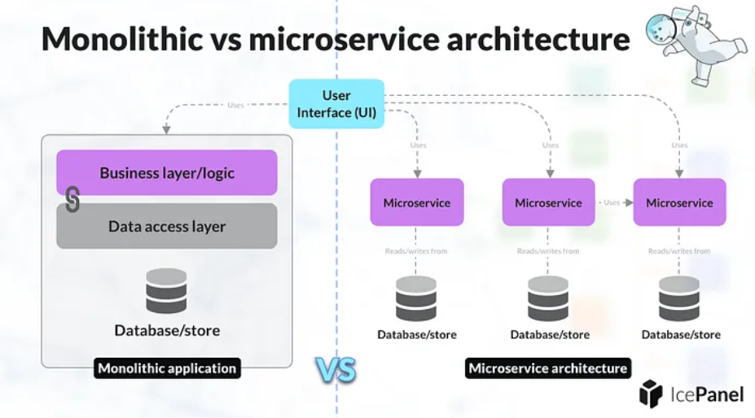

# MODULE 02 - 020: Monolithic VS Microservice Application Architectures

***

If you are interested in modern web development, you have probably 
already heard the monolithic vs microservice debate.  

 It’s difficult to talk about web apps without this discussion arising.   

While you can create beautiful, functional applications with either option, it is 
important to look closely at the two so you can pick the one that is 
right for your needs.

## Monolithic Architecture

Monolithic architecture is the setup used for **traditional server-side systems.*:

> The entire system’s function is based on a single application.

This type of system comes with various advantages.   

1. First, it is faster to develop.   
   You can create an application with basic features and then scale up over time.

2. Monolithic apps are also often faster than microservice apps. 
   They don’t have to communicate with as many services, therefore they don’t 
   have the same lag time you will find with some microservice apps (if 
   they aren’t performing properly).

There are some drawbacks as well, though. 

Maintaining monolithic applications can be challenging if they are not designed well.   This is mainly due to monolithic applications having the reputation for tightly 
coupling processes. This means that making a single change can have a domino effect and cause a number of issues in different parts of the codebase.

## Microservice Applications

While monolithic architecture puts all of the functions into a single
 process, **microservice applications break those processes up**.   

You can build various services inside of the application.     

Each can be tested and developed individually.     

Once the app is up and running, the services will run separate processes inside of it.  

One of the biggest benefits of microservices is their **ability to scale up**.   

<u>You can scale up individual components instead of scaling up 
the app as a whole.</u>   

**It is also more straightforward to test microservices**. 
You can test the various components and isolate the problem quickly and easily.   

That allows you to find a prompt solution.

So that if a component fails, your entire system doesn’t have to fail.   

If you create your system where each component can function without the other components, your system won’t crash just because a single feature 
does.

For example, if you have a microservice architecture that has a reporting feature that resides in its own application, and if the reporting feature crashes, the rest of the application will continue running properly (it simply won’t have access to the reporting system until it’s back up).  

Have you ever had a time where Facebook worked fine but you couldn’t send a message? That’s what happens when there is a glitch with the Facebook message sending microservice. It doesn’t bring the entire system down, it simply limits the features available.

Of course, there are some drawbacks to microservices as well. 

* Building an app with microservices can be a time-consuming process. 

* You have to configure each service, which is anything but quick. 

* You may also face some compatibility issues between your services when you 
  update individual components

## Monolithic vs Microservice Summary

In summary, both architecture types work for Rails development.  

Instead of trying to make a universal decision about what type of use, instead decide which one you should use for the specific application that you’re working on.   

By taking this approach you can use the right system at the right time.
