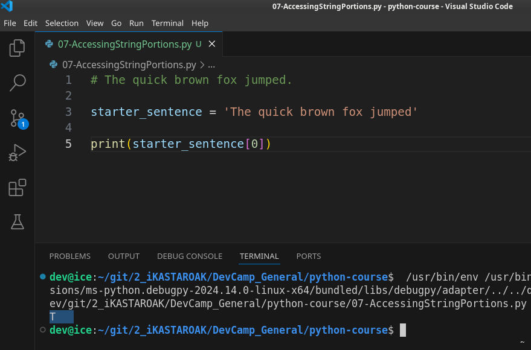
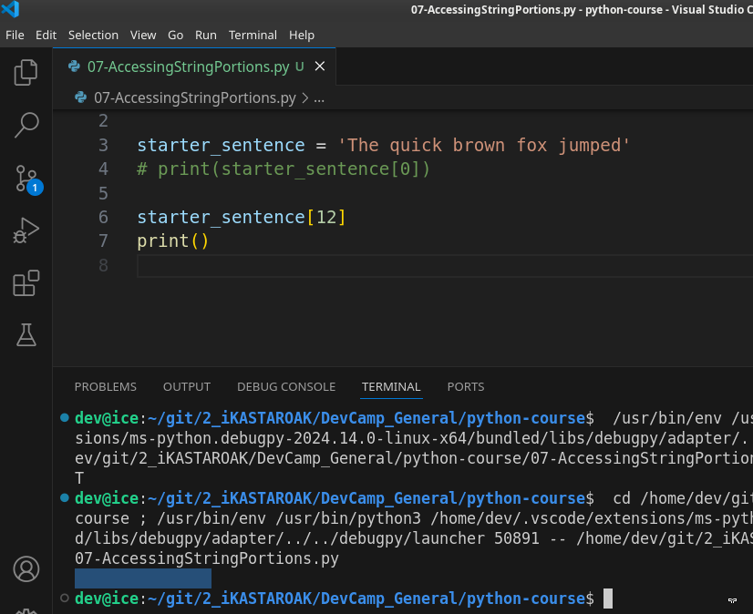
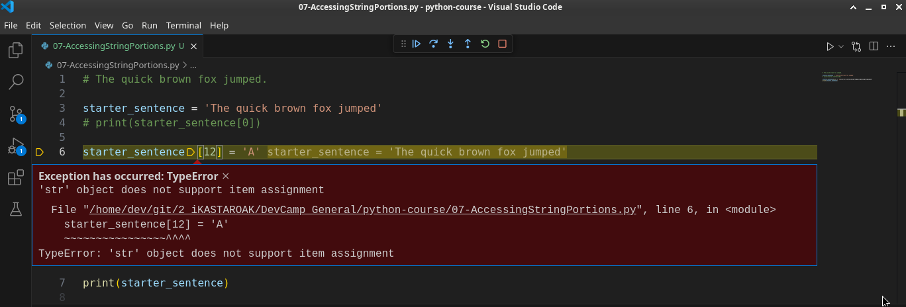
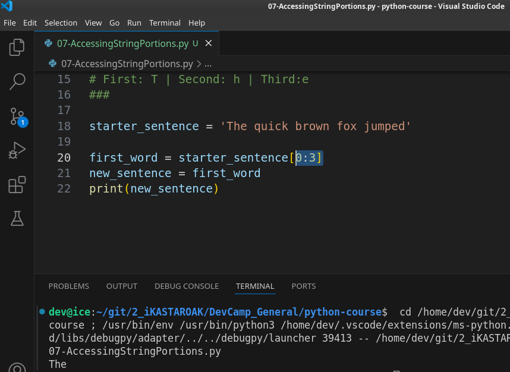

# MODULE 02 - 025: Pyton - Accessing String portions

* So similar as How a string portion is accessed using other languages as JS or Ruby.

* Python Inmutability: Data can't change.

***

In this lesson, we're going to walk through how we can access values inside of strings and we're also going to work with ranges.   

Now don't worry if you do not know what those are you've never worked with them 
before.   

We're going to take a very preliminary view and then we're going to walk through some examples on how you can use ranges and how you can access string values.  

If you are coming from a different programming language then some of this is going to be review, because the way that you can **access the string values is very similar to how you can access these string values in languages such as Ruby and JavaScript** and so it's going to be a little bit of review for you.

But it's also going to reinforce the fact that you're able to perform the same tasks if python is your first programming language or you've come from languages that don't have this kind of construct then this is going to be new but it's going to be very important because a number of **the topics we're going to talk about in this guide are going to be able to be applied across all kinds of different programming techniques** and the very first thing I'm going to talk about is zero-based numbering and it'll make sense in a while why we're going to start off with this but say that we have our sentence right here and I'm going to put the string inside of a comment here at the top.

```python
# The quick brown fox jumped
starter_sentence = 'The quick brown fox jumped'
```

And each one of these elements has an index.   

Now you can't really see it but **Python when it builds a string it creates an index for each one of these items**.   

And so right here with the capital `T` this is the first element in the index.   

`H` is the second and so on and so forth all the way down the line.   

So whenever we're going to access a value or we're going to pull out any of these characters inside of the string we need to be able to supply what that value is.   

And so this numbering system is a little bit tricky if you've never used it before because it is what is called a** zero-based numbering system**.   

And when we get to working with lists and collections you'll see that the same type of numbering system is used across the board in the computer science community and so this is going to come across no matter if you're working **as on Python, Java, Javascript, Ruby**.  

All of these languages **use a zero base numbering system **so it may be intuitive to think that the capital `T` would be mapped to `1` because that is the first element but actually it's mapped to 0.   And so every one of the strings.  

Once we get into arrays and those types of lists, the first element does not have an index of 1.  

 It has an index of zero. So just to do a little bit of a breakdown here the T is going to be 0.   

The index of the H is going to be 1 and then e is going to be 2 and then 
continuing down the line.   

The space. . . I'm just going to do a little space in there and that is going to be three.

```python
# T => 0
# h => 1
# e => 2
# ' ' => 3
```

That is the way a **zero base numbering system** works all the way down to wherever this D is at the end of the sentence and** it's important to think and to include the empty spaces because** if you don't you're going to have some counting issues.  

 And so let's see how this works.   

Now that you have an idea and a mental framework for how the numbering system 
works let's see how we can access these values.  

I'm going to copy `starter_sentence` right here and let's print this out some say print starter_sentence and the way you access it is right after the variable that holds this value.   

I'm going to pass in these brackets and in the bracket I'll pass in whatever index I want to use so if I want to find the first element this capital T I'll just pass in a zero in these brackets.

```python
print(starter_sentence[0])
```

Now if I hit return you can see it prints out only the T.  



This is working properly and I could change it and if I want to change it to say `12`

I'm going to print out just the 0 so it looks like that is most likely either the "br`o`wn" or the "f`o`x" if we count it all the way down then we'd see which one.   

So that is how you can access a value.

## Inmutability

Now there is a little bit of a tricky thing here and it leads us perfectly into understanding the concept of immutability.   

Immutability is a very very long word that simply means that **you can't change an 
element**.   

So** for a string in Python strings are what are called immutable**  which means that **we can't actually alter this string once it has been created.**

So, in other words, **we can't change the characters in the string**.  

A new variables can be created and alter them that way by performing some formatting and some different tasks like that.   



But if   you want to test this out we know that this letter `O` was it this twelfth position.  

 And in many other programming languages you would be able to do something like this where I could a starter_sentence 12 and then set this equal to say a capital A.   

And now if I come to the starter sentence and try to print it out again it's going to return an error.



And it says *"Type Error string objects does not support item 
assignment"* which is just another way of saying** they are not able to 
change the values once you've created a string**.   

You can't alter that string you simply can work with it.   

You can create another variable slice it up which will get into later and then you can save that value inside of the new variable and then you'll have altered it.   

But **it won't have touched the original object** to end once you get into some more advanced Python development you're gonna see **why this is important and you'll see why the language creators decided to do it this way as opposed to allowing you to alter this whenever you want.**  

And **it's actually one of the key reasons why Python is so popular in the machine 
learning community is because immutability** when it comes to strings and values is considered incredibly important because **immutability allows you to be much more confident about the data because you know that the data can't change.**

Some of the things I'm talking about you really won't get into and understand why they're important until later on.   

But it's important to have a foundational knowledge of that right now so that it all makes sense later on.   

So let's talk about how we actually could change a sentence.   

I'm going to get rid of this. And before we can do it we need to figure out and learn about ranges and so ranges are a way of accessing more than one value.   

So say that I wanted the first three letters I could do something like this but it would be very messy where I could say zero and will say this is first and then we can come up with another one that says segment.   

And this is going to be one. And then third and this is going to be two.

```python
first = starter_sentence[0]
second = starter_sentence[1]
third = starter_sentence[2]
print(starter_sentence)
```

Then we could have a new variable created we'll call it `new_sentence`.   

Then this is simply going to be these three added together the first, second, and then third.

Finally, we'll print out our new sentence which should have the first word from what we have in our sense which is the so that works.  


**That is a horrible way of doing **it though and so I **only wanted to show** you that so that if this came up in a programming interview or anything like that you'll understand exactly **why you want to use ranges or how ranges can be utilized to make your code more efficient**.

***

## Ranges [start:end]

So what I'm going to do is I'm a get rid of all of these items here and I'm simply going to say we have `starter_sentence` and now we're going to have a first word.  

 So first word and I can say starter_sentence in the syntax in Python is pretty cool the way that you do this is you say zero, colon. So zero is the first element that you want to try to find. 

So, in this case, it's going to say bring me the key in the **colon means that we're searching for a range** so we could say 0 to whatever else we wanted.   

And it's going to bring all of those back.   

And so if I do 0 3 right here and say first-word I can say new_sentence and just swap the first word in right there.   

And now if I print this out you can see that we have the. And we're able to do that with a single range.



###### ⚠️⚠️⚠️Now a very important but very subtle little issue here is watch what happens if I use two.   ⚠️⚠️⚠️

#### [start:end] - 'End' will never match it own value, the immediate previous instead !

If I run this and do two, it only brings back `t`, `h`, and so it's important to understand **whenever you're working with ranges when that range stops and the way it works is whatever index value you put in here it is.**

 The range is going to stop right before that value.

So, in other words, you can think of this being almost like the end of a bookend or something like that on a shelf where this two is not going to be captured inside the range.  

 It's going to stop right before it gets there.   

So inside of our sentence, it's 0 1 and then 2.  

 But because we said this range needs to end at two.   

It means it's going to end right before it gets to that to index so that can be a little bit of
 a confusing thing if you've never seen that before you've never worked with a range.   

But it is very important because without this if you forget about it what's going to happen is we're going to end up with near-perfect solutions.   

You're going to be missing a word or a letter or something like that.   

And this is a technique that can also be utilized when working with data structures in python.  

 So it's important to get a good understanding of it because we're going to be using ranges quite a bit throughout this course and the further you get into Python development especially if you go into machine learning you are going to be using ranges constantly so it's good to get a grasp on it right now.  

# ## Changing a String

Let's talk about how we could change the sentence.  

 We have a starter sentence but what would we have to do if we wanted to switch the out for `thy` for example.   

Well what we can do is I'm going to get rid of this and I'm just going to have a new sentence here by itself and we'll start with just saying thy and then from there what I want to do is I want to pull in the rest of this sentence so everything from here all the way to the end.

#### [start:] will catch from the start position until the end.


#### [:end] will catch from the real init position (0) until the selected end position (minus one, zero-based).


I'd like for you to pause the video and research how you can work with ranges and how this is possible and then come back and see how to do it.   

It's mainly because I want you to be able to start understanding how you can look for this type of content on the Web and how you can do your own research because as much as I'd love to believe that I can teach you absolutely everything there is.  

 It's simply not the case.   

Languages and frameworks are so massive.   

My goal is to not only teach you the concepts but also teach you how to go and research and learn the concepts so pause the video come back and then we will walk through how my solution works to be able to create our new sentence.

***

Break for research:  

[syntax - python [:] notation and range - Stack Overflow](https://stackoverflow.com/questions/20153572/python-notation-and-range)

[Python String question: What does [::-1] mean? - Sololearn](https://www.sololearn.com/en/discuss/1838639/python-string-question-what-does-1-mean )

***

Welcome back!  

 Hopefully, your research went well and you already have  your own working solution.  

 If not that's perfectly fine. I will show you how I personally would do it right here.   

I'm going to take `starter_sentence` and then I'm going to add the brackets and the tricky part of this is grabbing the last value properly.   

It's pretty easy to count and say OK we want 0,1, 2, ....  

 So we're going to want to start on 3 because we want to have this space. And so we know we want three. What could we do for the range?

Now technically you could simply count each one of these characters and then whenever the index is right after d or something like that then you could call that.   

However, that's really not the most Pythonic way of doing it.   

Instead, we actually have a working solution right here.   

So if you pass in a range where you have one value and then at the end you
 leave it blank right after the colon Python is automatically going to assume that you want to take the range all the way to the end.   

It also works the same if you want it to flip it around.   

So right here if you have a blank or just an empty space and then the colon followed by 
another index then it's going to take everything from the beginning.  

 And so that's just an important thing to know.   

So right here what we're going to be able to do is we're going to generate our new sentence so if I hit enter you can see that we now have our new sentence where it 
says.   

Thy quick brown fox jumped. So we've successfully taken our starters sentence pulled out one word.   

Now technically we didn't kill it we didn't take it out of the sentence.  

We simply grabbed all the other characters except for that and then we replaced it with a different word.   

Very nice job if you went through that!

## Summary

In review, we covered a number of very important topics in this guide.   

* Not only did we discuss how to work with strings and how to access string values but we also discussed some more high-level concepts such as how to work with indexes and what a zero-based index is and how you can access values based off of that.   

* We also talked about immutability and how immutability means that we are not able to change a string after it's been created and immutability can be applied to anything you could have lists that are immutable you could have all kinds of elements that you say are immutable and if it is that means that value cannot be changed.

* And then we talked about ranges and how they can be used to be able to access a set of values inside of a string. So excellent job going through that guide and we're going to continue in the next guide by seeing how we can work with different functions.
