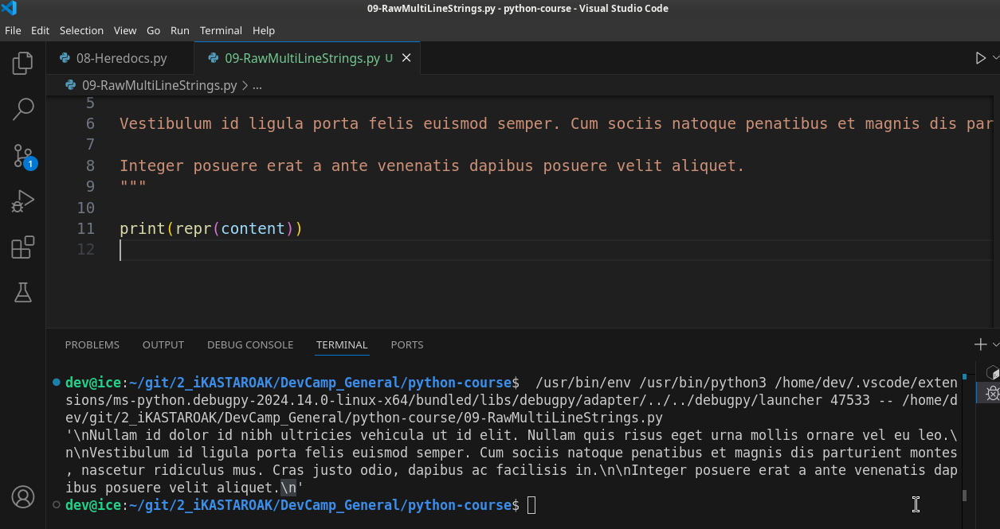
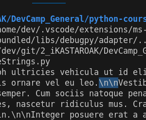
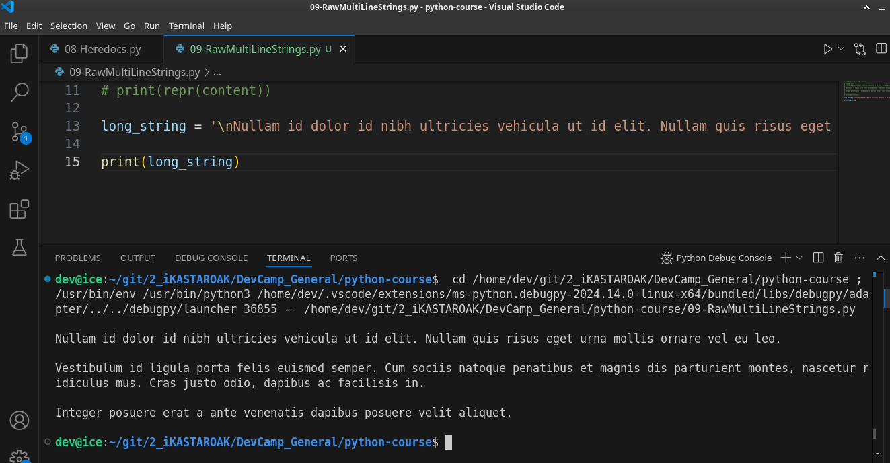

# MODULE 02 - 027: Pyton: Raw Multi-line String - `\n` + repr()

***

Continuing our discussion on how to use multiline strings in Python.  

 One thing that you may have noticed in the last guide is that if we take this strip function away and run the code then it can be kind of hard to see that we have new line characters at the beginning and ending of this multiline String.

That's something that can be hard to see in the console.  

 It can also lead to some confusing bugs and some front end issues when you're 
working with a web or mobile application.  

 And so because of that, I want to show you a function that can be very helpful when working with any type of string but especially a multiline String and that is the `repr` function.   

## repr()

If I come down to content right here and type in repr and then wrap content inside of parens repr right here is a method that takes in a single argument.  

 And if this syntax does not make sense to you or looks confusing.  

 Don't worry we're going to have a very large section dedicated to functions and methods inside of python.  

And so for right now just know that this is a method that takes content in and then
 it puts out a different type of content. (**repr uses `\n`**):

**It performs some tasks and then it returns a different type of process**. 

So if we're to come here now and run this you'll see that we have very different output than before.

What we're doing with repr is it's actually giving us the way the content and the string and it gives it to us in the same way that the computer is processing.   

**So "repr" is short for representation.**  

So what it means is **it's giving us more of the computer-based representation that's what the computer uses to decide when to put a new line character in and different things like that.**   

So right here we can see this `\n` is a new line character.

In programming terms, whenever you want a new line character you can use `\n` and the Python interpreter is going to convert that into a new line.

A part of the reason I wanted to show you this was not only to help give you a function that can be very beneficial when debugging so you can see exactly what the computer's looking at.  

Whenever you might have a new line that is coming seemingly out of nowhere but also so you can see how heredocs are generated.   

So in a sense what we're doing here is we're connecting the dots so Python gives us a really nice interface for being able to perform tasks such as this such as creating a new line or creating multiline strings and we don't have to type in the characters like new line.   

Instead we can simply wrap it up in this heredoc and then Python performs a task of adding those right into the system and then the computer can output it.

And so what we have if you look at it we have a new line right here and then you may notice that we have two new line characters here:  

The reason for that is because we have one new line here and that is when it comes down it's like a carriage return and then we have a second one that is here.  

 That's the reason why we have a line break and then we have a completely empty line.   

And so that is the way the computer's going to look at it.  

 Now I want to show you a way that imagine that for some reason you don't or you can't use a heredoc.   

## Use case

Say that you get a bunch of content in from a web API and you need to be able to pipe it into another process and that process for some reason or another can't take a heredoc and so instead you want to be able to put all of it on a single line.  

  

Well, one of the cool things is if we take this raw content I'm going to copy this and let's comment all of this out right here come down and say long string paste that in and now I'll say print and I'll give us some a little bit space just so you can see that and I'm going to say print long string.   

And so now if I am going to clear it, return, and look at that we have the entire output just like we did with the heredoc.  

So just like we had all of our different spaces on our new line characters and everything like that with our multiline String.  

 We can put that on one line if we use these newline characters and we embed those inside of the content.  

 So there are two ways of being able to have tasks such as creating paragraphs and line breaks and different elements like that.

## A real world comprehesion by starting from this basis

And I want to take a small aside and discuss why we're even doing this because I know when I remember back it may have been a very long time ago but I do remember when I was learning how to code.   

And when I was going through some of the fundamentals I'd get a little bit frustrated because it seemed like a number of the different things that I was learning didn't really take me they weren't taking me closer to learning how to build real-world applications.   

And so because of that, I'd get frustrated I'd want to jump right into something that felt like I was building something practical like a web application.   

They didn't really have mobile applications back then but you know building Web 
sites or software or those kinds of tasks and it didn't feel like learning about newline characters was really getting me there.   

And so I want to take a moment to talk about why that in these type of topics are  important because I feel like a lot of textbooks and a lot of tutorials  simply run through the different functions without talking about why they're important for later on.   

And so to take newline characters for a great example and why learning about these are so important.   

Imagine that you're building some type of web application and you get data in from a social media app. So it might be Twitter or Facebook or Google News or something like that and you just get this raw string of data.

That's the way API's work. They just give you this raw string out, and then you have to adjust and you have to be able to format it and make it look good in your own application.  

If you don't know how to work with elements such as New Line characters and multiline strings and how to perform different tasks on those then you're not going to be able to format the data in a way that's going to look good in your application.  

 And so it's very important to understand the underlying concepts behind what it takes to build these types of features and to get this kind of behavior.   

And, I promise if you learn these kinds of elements right now you're going to be in a really good position so that when you are asked to build much more complex applications you're going to know exactly what is happening.   

So don't get bogged down in the thoughts of "*oh we're just building all these little console apps and getting frustrated because we're not to the point we're building something real yet*. 

I promise that will come.   

And I also promised that by learning these core fundamentals you're going to be able to actually understand what's happening when you're asked to build an application.  

It would be very easy to simply take you through step by step on how to build some type of cool web application and that would be great.   

You'd be able to build one app the one that I would walk you through.   

 
However, if you can understand the core fundamentals that it takes to do that then you're going to be able to build much more than the web application you're going to be able to build any application that you're tasked with.

And that is one of the most important elements in my mind when I'm motivated to build a new course is to build it in a way not just so that you can follow along and be able to just copy and paste what I've built.   

But so that you will learn how to do all of this on your own. 

So, nice job going through this you should now have an even better idea of how heredocs work how multiline strings work in python and also how you can use the raw data to create them yourself.

***

## [Python Documentation](https://docs.python.org/3/library/functions.html)

> [repr(object)](https://docs.python.org/3/library/functions.html#repr)  
> Return a string containing a printable representation of an object. 
> 
> For many types, this ?>function makes an attempt to return a string that 
> would yield an object with the same value >when passed to eval(), 
> otherwise the representation is a string enclosed in angle brackets that contains the name of the type of the object together with additional information often >including the name and address of the object.
>  
> A class can control what this function returns >for its instances by defining a **repr**() method.
