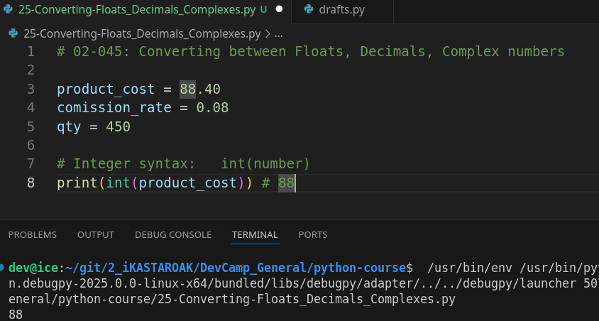
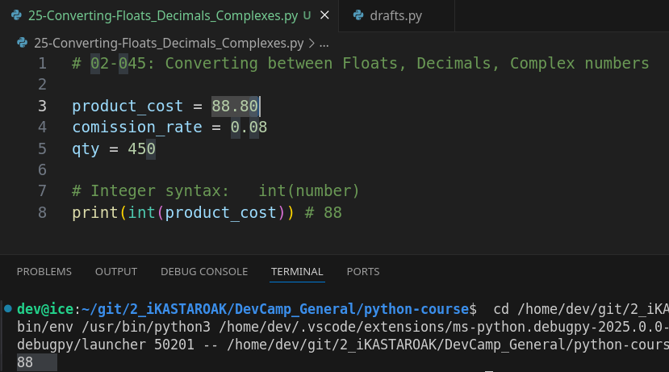
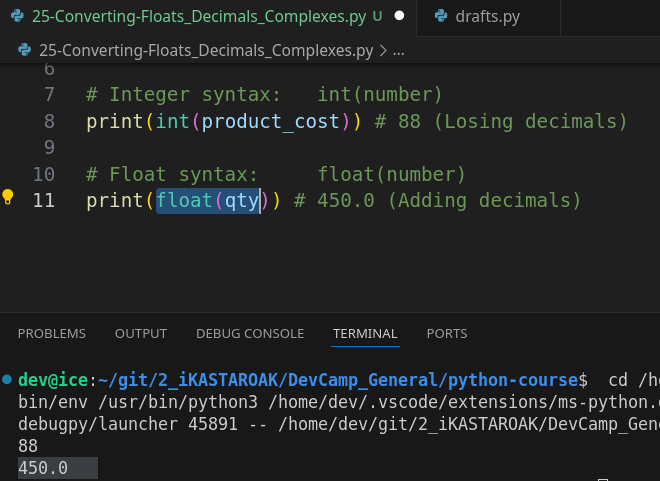
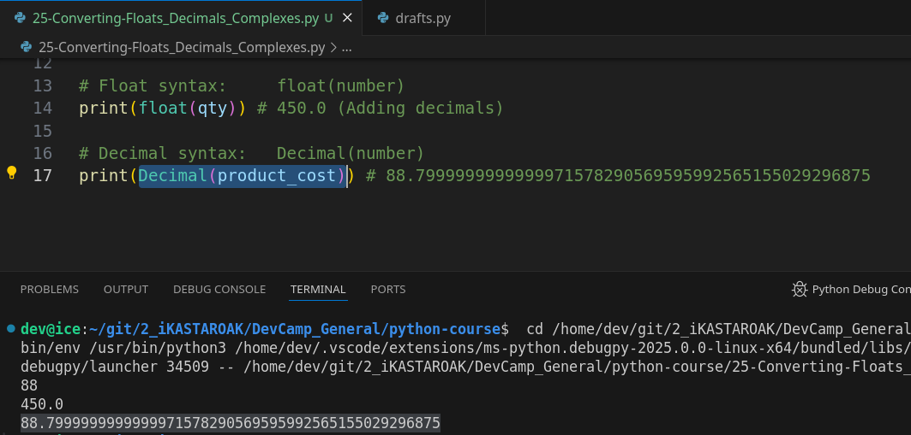
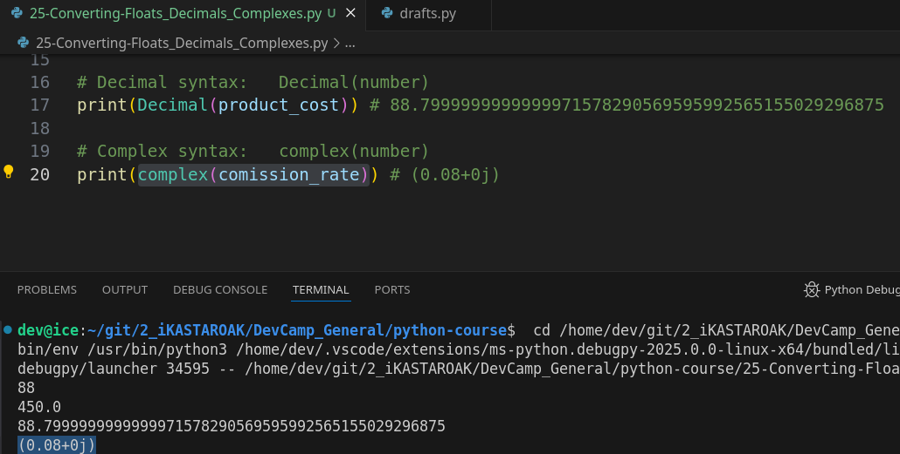

# MODULE 02 - 045: Python - Converting from Floats, Decimals, Complex Numbers.

## **Understanding Number Type Conversions in Python**

Python supports multiple numeric types, including **floats, decimals, and complex numbers**. Understanding how to **convert between them** is crucial for precision and performance in mathematical operations.

✅ **Best Practice:** Use **floats** for general-purpose calculations, **decimals** for high precision (e.g., financial applications), and **complex numbers** for advanced mathematics.

---

## **1️⃣ Converting Floats to Decimals**

Floats are efficient but may suffer from precision issues due to binary representation.

```python
from decimal import Decimal

float_value = 10.75
decimal_value = Decimal(float_value)
print(decimal_value)  # Output: 10.75 (as a Decimal object)
```

🚨 **Warning:** Directly converting a float to a decimal may carry **floating-point inaccuracies**.

🔹 **Solution:** Convert using a string representation for better precision.

```python
decimal_value = Decimal(str(float_value))
print(decimal_value)  # More precise conversion
```

✅ **Use Case:** Financial calculations requiring exact precision.

---

## **2️⃣ Converting Decimals to Floats**

Decimals can be converted back to floats when needed.

```python
float_result = float(decimal_value)
print(float_result)  # Output: 10.75
```

📌 **Use Case:** When performance is more critical than precision.

---

## **3️⃣ Converting Integers to Floats & Decimals**

✅ **Converting to Float:**

```python
int_value = 100
float_value = float(int_value)
print(float_value)  # Output: 100.0
```

✅ **Converting to Decimal:**

```python
decimal_value = Decimal(int_value)
print(decimal_value)  # Output: 100
```

📌 **Use Case:** When handling large numbers or scientific calculations.

---

## **4️⃣ Converting Floats & Decimals to Complex Numbers**

Python's **complex numbers** are represented as `real + imaginary` values.

```python
complex_number = complex(float_value)
print(complex_number)  # Output: (10.75+0j)
```

You can also create a complex number from a decimal:

```python
complex_number = complex(decimal_value)
print(complex_number)  # Output: (10.75+0j)
```

📌 **Use Case:** Used in advanced mathematics, physics, and engineering computations.

---

## **5️⃣ Converting Complex Numbers to Floats & Decimals**

Complex numbers cannot be **directly** converted to floats or decimals unless their imaginary part is **zero**.

```python
complex_value = complex(12.5, 0)
float_value = float(complex_value.real)  # Extracts the real part
print(float_value)  # Output: 12.5
```

🚨 **Warning:** Trying to convert a complex number with a nonzero imaginary part will raise an error.

```python
complex_value = complex(12.5, 3.2)
float_value = float(complex_value)  # TypeError: can't convert complex to float
```

✅ **Best Practice:** Extract the real part if you only need the **numerical** value.

---

## **🔍 Summary: Key Takeaways**

| Conversion Type             | Example                     | Use Case                                       |
| --------------------------- | --------------------------- | ---------------------------------------------- |
| **Float → Decimal**         | `Decimal(float_value)`      | High precision (finance, scientific computing) |
| **Decimal → Float**         | `float(decimal_value)`      | Performance-focused calculations               |
| **Integer → Float**         | `float(int_value)`          | General-purpose calculations                   |
| **Integer → Decimal**       | `Decimal(int_value)`        | High-precision arithmetic                      |
| **Float/Decimal → Complex** | `complex(value)`            | Advanced math (engineering, physics)           |
| **Complex → Float/Decimal** | `float(complex_value.real)` | Extracting real numbers only                   |

---

## **📌 Python Documentation Reference**

🔗 **[Python Numeric Types](https://docs.python.org/3/library/stdtypes.html#numeric-types-int-float-complex)**

> Covers integers, floats, decimals, and complex numbers.

🔗 **[decimal module](https://docs.python.org/3/library/decimal.html)**

> Provides exact precision for decimal arithmetic.

🔗 **[complex numbers in Python](https://docs.python.org/3/library/stdtypes.html#complex-types)**

> Working with complex numbers in Python.

***

## Video lesson Speech

In this section of numbers in Python, we've talked about not only 
numbers from a high-level perspective and some of the functions 
associated with them. Such as how to run calculations and elements like 
that. But we've also talked about the sub data types within numbers such
 as integers and floats and different elements like that and usually, 
Python is going to manage the process of converting those for you 
automatically.

***

We've seen how if you perform some things such  as product cost and I'll put this in a print statement.   

So if I say print product cost and I multiply this by the quantity then what this is
 going to do even though quantity is an integer it is going to run this and it's going to convert the final number into a float.   

So if I hit return you can see that this is a float.


So it performed that conversion for us automatically.

However, if we ever want to do that manually.   

So if we ever wanted to take for example a float and convert it into an integer or vice versa then we can also do that and that's what we're going to do in this guide
 and the syntax for this and we're going to go through three of them is 
to provide the name which is a function and then wrap whatever value we 
want to convert inside of that.   

So the very first thing we're going to do is an integer.   

So I'm going to take a product cost and convert it into an integer even though it's a float right now.   

I want to convert that and the syntax is going to look like this I'm going to say `int(product_cost)` and that we'll convert it for us.

Now I'm going to put this inside of a print statement but you could 
also put this in a variable and use it however you want. I'm going to 
say print product cost it started at 88.40 let's see what happens if we 
run it now. You can see that now it's 88.



Now if I change this to 88.80 and run it again you can see it's still 88.



So it gives us similar behavior to how the floor division computation
 works where even though 88.8 is closer to 89 all that essentially it's 
doing is it's just taking the floating-point variable and just throwing 
it away. And so you have to be cognizant of that if you are converting 
these values it doesn't round it to the Close's hole number. It simply 
takes whatever integer value is there and it just keeps that and ignores
 the rest. So that is something to keep in mind.

Now the next one is. . . let's take our quantity and turn it into a 
float. So in order to do that the keyword is float and I can say 
quantity. And now let's see what it does for us if I hit return. You can
 see 450 gets turned into 450.0 for if you ever need to get that.



Now if you are working with the decimal library which we've worked 
with than that already that decimal function already converted a float 
into a decimal.

Let's see how that looks again. So remember to import decimal we say import the decimal library and then say from decimal

```python
import decimal from Decimal
```

Now what we can do is the same thing except now let's take the 
product cost again. So let's take that and actually if you see I have a 
little invalid syntax sense because I got these switched up it should be
 from decimal import this decimal

```python
from decimal import Decimal
```

and so now it can use this and we're going to take the product cost 
and instead of it being 88.80 we're going to convert it into a full 
proper decimal so let's see what happens when we do that. And you can 
see what this looks like



and from a mathematical perspective, the way that Python looks at 
88.80 is actually with this incredibly complex number of 88.79 and then 
all of these values after it.

And it is a pretty large number so we've already walked through how 
to perform that conversion. However, I wanted to give you a nice full 
list for doing it.

Now, the last one we're going to go through might be a little bit odd
 if you are not someone who performs a lot of scientific calculations 
but what you can do is let's do this for the commission rate. So we 
actually use that value as well. And what we can do is say complex and 
this is going to give us the scientific notation for commission rate. So
 if I hit return here you can see



this gives us 0.08 and then gives the full scientific notation in 
parentheses and this actually because it returns in parens this is 
giving you a complex object that you can work with. Now you don't 
typically have to work with the complex data type unless you're 
performing quite a few scientific type calculations. But I did want to 
show it to you in case you run into it. The ones that I use the most are
 probably decimal and int and decimal in the one I use the most out of 
all of them because it's any time that I want to convert some type of 
number and have a higher level of precision I bring in the decimal 
library and you can perform that conversion just like we did right here.

***

## Code

```python
from decimal import Decimal

product_cost = 88.80
commission_rate = 0.08
qty = 450

print(int(product_cost))
print(float(qty))
print(Decimal(product_cost))
print(complex(commission_rate))
```
