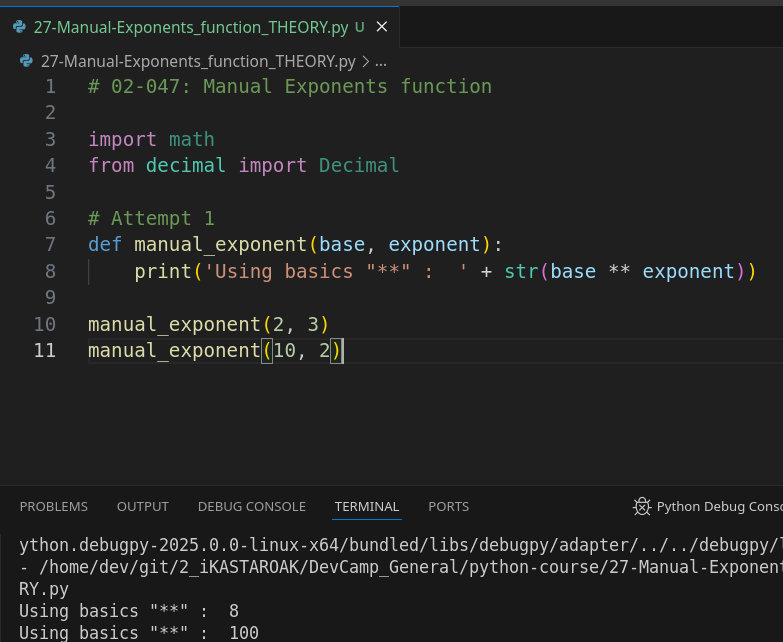
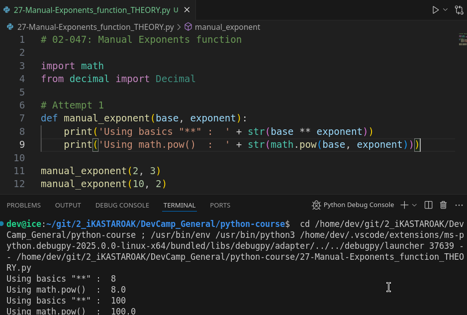
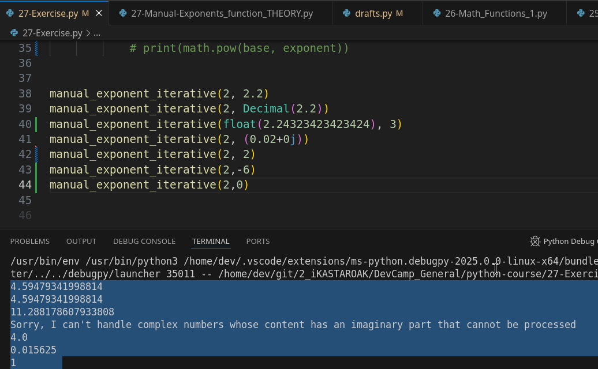
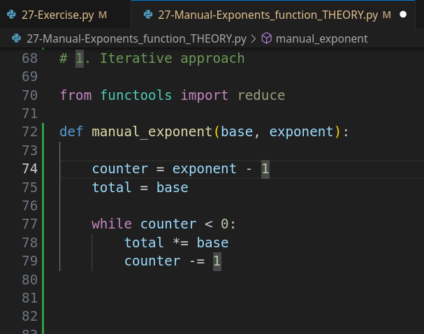
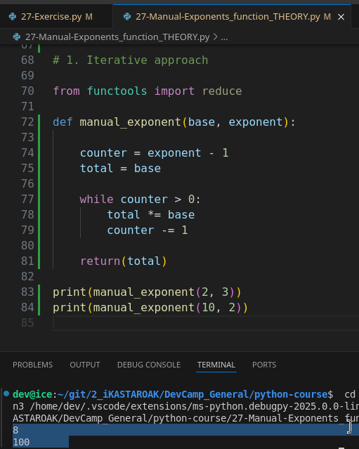
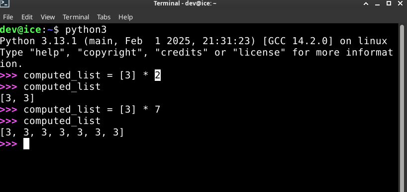
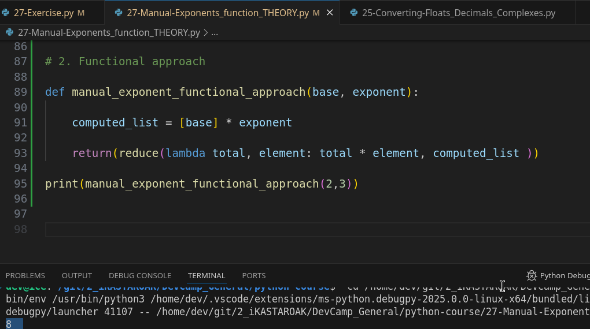
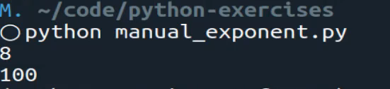

# MODULE 02 - 047: Python - Manual Exponent function

****

### ⚠️ This lesson includes an exercise, and some required attempts.

****

## **📌 Understanding Exponents in Python**

An **exponent** is a mathematical operation where a number (the base) is multiplied by itself a specified number of times.  


For example:

- \( 2^3 = 2 \times 2 \times 2 = 8 \)
- \( 10^2 = 10 \times 10 = 100 \)

Python provides built-in ways to calculate exponents:

1. Using the `**` operator:
   
   ```python
   result = 2 ** 3  # Output: 8
   ```
2. Using `math.pow()`:
   
   ```python
   import math
   result = math.pow(2, 3)  # Output: 8.0
   ```

However, in this guide, **we will build our own exponent function manually** using two different approaches.

---

## **🛠️ Approaches to Implementing Exponents Manually**

### **1️⃣ Iterative Approach (Using Loops)**

This method **iterates** through the exponent value, multiplying the base with itself each time.

### **2️⃣ Functional Approach (Using `reduce()`)**

This method leverages **functional programming**, using Python's `reduce()` function to apply repeated multiplication.

---

# **1️⃣ Iterative Approach - Step-by-Step**

### **How It Works**

- **Initialize `total` to the base number**.
- **Use a loop to multiply `total` by the base** `exponent - 1` times.
- **Return the final total**.

### **Implementation**

```python
def manual_exponent_iterative(base, exponent):
    if exponent < 0:
        return 1 / manual_exponent_iterative(base, -exponent)

    total = base
    for _ in range(exponent - 1):
        total *= base
    return total
```

### **🔎 Explanation**

1. **Handle negative exponents**:
   - If `exponent < 0`, calculate the exponentiation of its positive counterpart and take the reciprocal (`1/x`).
2. **Initialize `total = base`**.
3. **Loop `exponent - 1` times**, multiplying `total` by `base` each iteration.
4. **Return the final result**.

### **Example Usage**

```python
print(manual_exponent_iterative(2, 3))   # Output: 8
print(manual_exponent_iterative(10, 2))  # Output: 100
print(manual_exponent_iterative(2, -3))  # Output: 0.125 (1/8)
```

---

# **2️⃣ Functional Approach - Step-by-Step**

### **How It Works**

- **Create a list** where each element is the base (`num`) repeated `exponent` times.
- **Use `reduce()`** to multiply all elements together.

### **Implementation**

```python
from functools import reduce

def manual_exponent_functional(base, exponent):
    if exponent < 0:
        return 1 / manual_exponent_functional(base, -exponent)

    computed_list = [base] * exponent
    return reduce(lambda total, element: total * element, computed_list)
```

### **🔎 Explanation**

1. **Handle negative exponents**:
   - If `exponent < 0`, compute the positive exponent and take its reciprocal.
2. **Create a list**: `[base] * exponent` → `[2, 2, 2]` for `2^3`.
3. **Use `reduce()`** to multiply all elements:
   
   ```python
   reduce(lambda total, element: total * element, [2, 2, 2])
   ```
   - Step 1: `2 * 2 = 4`
   - Step 2: `4 * 2 = 8`
   - Final result: `8`

### **Example Usage**

```python
print(manual_exponent_functional(2, 3))   # Output: 8
print(manual_exponent_functional(10, 2))  # Output: 100
print(manual_exponent_functional(2, -3))  # Output: 0.125 (1/8)
```

---

## **📌 Key Takeaways**

| Approach       | Method Used | Best For                                                 |
| -------------- | ----------- | -------------------------------------------------------- |
| **Iterative**  | `for` loop  | Simple logic, easy to understand.                        |
| **Functional** | `reduce()`  | More concise, follows functional programming principles. |

Both approaches are **valid**, but the functional approach is **shorter and more "*Pythonic*"**.

---

## **📝 Summary**

- **We built a manual exponent function using two approaches:**
  1. **Iterative** (using loops)
  2. **Functional** (using `reduce()` )
- **We handled negative exponents** by computing the reciprocal.
- **Both implementations return the same results as Python’s built-in exponentiation (`**`).**

---

## **🚀 Practice Challenge**

Modify the function to:
✅ Handle **decimal exponents**  
✅ Handle **complex numbers**  
✅ Improve error handling  

```python
# Attempt 3: Mixing both solution plus 'for ... in' approach.
import math
from decimal import Decimal
from functools import reduce


def super_power_root_function(base, exponent):

    # case 0 static
    if exponent == 0:
        total = 1
        print(total)
    
    # case imposible
    elif isinstance(exponent, complex):
        print('Sorry, I can\'t handle strings nor complex numbers whose content has an imaginary part that cannot be processed')
        
    # case negatives using functional approach with reduce
    elif Decimal(exponent) < 0:
        computed_list = [base] * abs(exponent) # le damos la vuelta al exponente ...

        total = reduce(lambda total, element: total * element, computed_list, 1)

        print(Decimal(1 / total)) # ... y aquí volvemos a recuperar el negativo como fracción.
    
    # case Decimals, using for ... in ... range()    
    elif isinstance(exponent, (float, Decimal)) or (isinstance(exponent, int) and exponent != int(exponent)):
        total = 1
        for i in range(int(exponent)):
            total = (math.pow(base, exponent))
        print('For...in...range used: ' + str(Decimal(total)))      
    
    
    # case positive integers using iteration
    elif exponent > 0:
        
        counter = exponent - 1
        total = base
        while counter > 0:
            total *= base
            counter -= 1
        print('Iteration approach used: ' + str(total))

    # Anything else, error debug, etc.
    else: print('debug error, general')


super_power_root_function(3, 3)
super_power_root_function(3, 3.2)
super_power_root_function(3, Decimal(3.2))
super_power_root_function(3, float(3.2))
super_power_root_function(float(3.24323423421223424), 3) 
super_power_root_function(3,0)
```

*****

## Video lesson Speech

In this python coding exercise, we are going to build out a manual exponent function.  

What I mean by manual exponent is let's write some test cases. 

* It gives the ability to pass in two arguments. 
  So if I say manual exponent and then we pass in 2 and then 3 then the return 
  value of this should be 8.   

* ?hen, if I did the same thing with some other values so if I said "*What is 10 squared?*" than this one should be 100, and so on, and so forth.

```python
manual_exponent(2, 3)
#> 8

manual_exponent(10, 2)
#> 100
```

So, there are a few ways that you can do this and I'll give you a couple of different recommendations before you pause the video and try to build this out yourself. 

***

### Attempt 1:





```python
import math

# Attempt 1
def manual_exponent(base, exponent):
    print('Using basics "**" :  ' + str(base ** exponent))
    print('Using math.pow()  :  ' + str(math.pow(base, exponent)))

manual_exponent(2, 3)
manual_exponent(10, 2)
```

****

## Improving the way

So, I'm going to actually show you **two different solutions** :

1. **One is a manual way of doing it** it is what's called an **iterative approach** where we are going to **simply iterate over the elements and then build up the solution**.  

2. The second one, I'm also going to show you a **functional approach** and a functional approach is **going to leverage, and this is where one of the hints will be, it is going to leverage the reduce function**.

So you will import `from functools import reduce` and if you are interested in using the second solution and building out a functional approach then you can go and read the guides, look at the examples for the reduced function, and then build it out from there.

## 1. Iterative approach explained

So, once again what we're looking to do is build out a function called `manual_exponent` that takes in two arguments and then it uses whatever the first argument is as the base and the next argument is the exponent and it returns whatever the value of that is.  

 So right now you can pause the video and when we come back then you can watch me go through both of the solutions.

***

### Attempt 2: An iterative approach

```python
# Attempt 2: Iterative approach (lol)

import math
from decimal import Decimal


def manual_exponent_iterative(base, exponent):
    """    
    if isinstance(exponent, float):
        print('Sorry but I can\'t manage floating exponents.')
    elif isinstance(exponent, Decimal):
        print('Sorry, I can\'t manage Decimal exponents')
    
    elif exponent <= 1:
        print(math.pow(base, exponent))
    else:
    """
    
    if isinstance(exponent, complex):
        print('Sorry, I can\'t handle complex numbers whose content has an imaginary part that cannot be processed')
    elif exponent < 0:
        result = (math.pow(base, exponent))
        print(result)
    else:
        result = 1
        for iteration in range(int(exponent)):
            result = (math.pow(base, Decimal(exponent)))
        print(result)


        # for exponent in range(1, int(exponent)):
            # exponent = exponent + 1
            # print(math.pow(base, exponent))
    

manual_exponent_iterative(2, 2.2)
manual_exponent_iterative(2, Decimal(2.2))
manual_exponent_iterative(float(2.24323423423424), 3)
manual_exponent_iterative(2, (0.02+0j))
manual_exponent_iterative(2, 2) 
manual_exponent_iterative(2,-6)
manual_exponent_iterative(2,0)


```




****

So I hope you had a good time going through that and building out those solutions.   

The very first way I'm going to build this out is with an iterative approach.  

 So I'm going to create a function here called `manual_exponent` and it's going to take a number and an exponent and arguments.  

 And so the very first thing I'll do is I'm going to create a couple of variables.

Also,  I'm going to **create a counter variable** which is going to have the exponent minus one.

And I'll explain why I'm doing that here shortly and then I'm also going to keep track of the total, and the total is going to by default be set to whatever the value of num is.   

So if we pass in 2 this total is set to 2 to start off if it's 10 it's 10.  

 And then **from there, I'm going to create a while loop** so I'm going to say:

>     While the counter is greater than zero, I want you to take the total and then using our assignment.

I'm going to say **asterisk equals** so this is going to give us a product so the total is going to be equal to num.   

And now this is the same exact thing as saying **total equals total times num**.   

This is just a shorthand syntax for being able to perform that kind of assignment. And
 then from there we also need to take the counter and decrement it.


So I'm going to** decrease it by 1**, once again if that syntax looks a little weird that's exactly the same thing as same counter is equal to counter minus one.   

But I like the syntax it's a little bit shorter and if you are used to using incrementors and decrementers then it makes sense.



Then, when I come down here I'm just going to return the total. 

So, **what exactly is going on here?**

 Well, I'm creating a counter variable and, by default, it's going to be set to whatever the exponent value is minus one.  (**But this WON'T work with negative integers**).

 And the reason for that is because I'm setting total equal to whatever the value of num is.   

So if you look at what an exponent really is so let's just walk through that here.

Remember an exponent is just something like this, if we say 2 to the power of 3 that's really just the same thing as saying two times two times two.  

 And so if we're trying to keep track of this that first 2 here is going to be covered up when we assign total equal to num.   

So if we didn't subtract this then we would be multiplying 1 to many times, 
that's the reason why we subtracted 1 from it.   

Then here in the counter, we check to see if the counter is greater than zero and then it's just going to continue this loop until the counter gets it down to zero.   

And each time it's going to take the total and then it's going to multiply 
that total and keep on exponentially building up whatever the value is and then each time it decrements the counter.

So the first time the counter is going to for this specific example the counter is going to start at 2 then it's going to iterate it's going to multiply two times two which will be four.   

Then it will decrement that counter down to 1 which means it only has one more time of going through it and then it's going to multiply by two one more time and that
 is how you get 8.

So let's run this just to make sure that this version is working and I don't have any typos. So we'll come and grab our examples from up here.
   

And now let's add some print statements so we can actually see this in action.  

 So we are going to add print in front of our statements. 

Let's come and run this, this is the manual_exponent.   

If I run that you can see we get 8 and 100.



So this is working very nicely and this is the solution that you built out that is completely fine. 

**This is what would be called an iterative approach to the solution.**


## 2. Functional approach explained

Now what I want to show you is a** functional solution**.   

Let's come here and I'm going to get rid of it here in the show notes, though you will 
have access to it.  

 So if you want to go see this you can go access it in the show notes and grab that.   

But for right now I don't want you to be confused by seeing both of them right next to each other.  

 So here with the functional approach, it's going to be much faster to write.   

But with that being said it may be considered a little bit harder to read especially if you're not used to using tools such as Reduce.   

But it is important to have an understanding of what's going on here, even if you 
prefer to use an iterative approach.  

The reason why I wanted to include this functional approach is because as you develop as a Python programmer what you're going to find is you're going to run into a lot of documentation and a lot of other developers code that will use this functional kind of approach to building out these kinds of systems and this type of functionality.  

 And, if you're not used to building this out yourself then what's going to 
happen is you're going to go see that code and you're not really going 
to have any idea what's going on, so that is why this is a good idea.

So **the very first thing** I'm going to do is **I'm going to use a computed list**,

So, I'm going to say computed_list and you could call this whatever you want but I like using it because what we're going to be doing here is we're going to be building a list and we're going to be doing it dynamically and I think computed_list is a nice way of 
describing that.   

The syntax that we're going to use is I'm going to say num and then say num times whatever the exponent is.

```python
def manual_exponent(num, exp):
 computed_list = [num] * exp
```

Now if that code looks weird to you. Let's switch over into the REPL (or into a console with Python bin. available) really quick and see exactly what's going on here.   

So let's say that we have some type of number so we'll put in here 3 and then and actually need to store this in a variable so we'll use the same name `computed_list = [3] * 2`.


 What this is going to do if you look at what `computed_list` gives, **it will give you a list with two items both of which are 3**.



So, if you ever need to build out a list and you know all of the elements that you want inside of it, this is a really nice way to be able to build that out.   

So that is all we're doing here is we're just saying that I want **to build a list.   **

I want every one of the list items to be this num value and I want the number of elements to be equal to the exponent.   

And then from there, we can simply return the value of the `.reduce()` function.

So now we can build out the reduce function and I can already tell you I'm gonna run out of room here so I'm going to close this terminal out.  

 And now we can build this so I'd say reduce, `.reduce()` if you looked up the documentation you know that **it takes a lambda function expression**.   

So I'm going to say Lambda total and then element.   

So these are the arguments that we're passing to that lambda function and then 
inside of here we're going to pass an a code block where we say total times element and then, from there, we will say computed list and that is it.

```python
def manual_exponent(num, exp):
 computed_list = [num] * exp
 return (reduce(lambda total, element: total * element, computed_list))
```

So what we're doing here and if you've never used reduce before or any type of functional programming this may look really weird to you and so let's kind of just walk through exactly what's going on.   

Reduce takes a function as an argument and then it takes a list.  

 And then whatever you put inside of that function is whatever process it's going 
to run.   

So **with this LAMDA function here we are passing it arguments of total and element and then we're saying that every time that you call this LAMDA function which it's going to be called on every element in our computed list right here.**



We want you to take that total which keeps track of whatever the total is and that's something specific to the reduced function.   

**So I want you to take the total and multiply it by the element and so that is all that you need to do to get that working**.   ***(But, also, this won't work with negative and/or None values as zero)***.

Now lets, before we do anything, let's actually test this out to make sure we don't have any typos or anything like that. Then we'll walk through some more examples 
of what it's really doing.

Let me start up `pipenv shell` make sure we're working with the right version of Python. Now, let's run this, this is the `manual_exponent.py` and you can see that's working perfectly.



So we're getting the exact same behavior that we got before but now 
we're using a functional approach for what we're building out with the 
solution.

***

So this is something that I highly recommend that if you did not understand this or understand the solution that you take this code and you play with it yourself so you go through the documentation, you look at all the examples, and then you see exactly what each one of these elements represent.  

 Because if you come down here we can walk through exactly what's happening at each stage.

The way a lambda function works is it's really just like a regular function.   

It's like I'm doing something like this and by the way if you also watch some of my other videos where I've talked about the Reduce function I've gone through some of these explanations before so I apologize for the duplication but hopefully this will help reinforce that.

Remember LAMBDA is just a function it's a function without a name it's also called an anonymous function and so it's very similar to if I did something like this where I said some function and then I passed in arguments like total and then element and then inside I said I want you to return the total times the element and then what reduced does is reduce iterates over whatever list that we pass into it.

So reduce is then going to take our computed list and then every single time that iterates. So if we have a list of 1, 2, and 3 what it's going to do is reduce is going to call some function.   

It's going to start with a total and so it's going to start with a total of zero by 
default.   

And then it's going to take the first element which in this case is one and it does do a little bit of magic.

Just so you're aware because it may be a little bit confusing to you that if you technically started with zero and multiplied it then your sum or your product for all the exponents would always be zero.   

They do some error checking to make sure that that doesn't happen.   

So,  it's a little bit more akin to it understands that it needs to skip that first step.   

So it's going to say okay 1 times 1 is 1 then it's going to come down and the next step it's going to say okay we have the total of 1 but the next element here is 2.   

So it's going to say 2 times 1 is 2 and then it's just going to keep on going down the line like that.

In this case what we wanted it to do was to work like an exponent.  

 So it's going to take the total and then it's just going to keep on going down the line if you want to take a look at the exact example that we had this would be the same as saying 2, 2, 2.  

 So the very first time that it goes through it's going to set this value to 2 and then it's 
going to look and say OK, the first element is 2 that's 4 and then it's going to go through it again.   

The total this next time is going to be 4 and then it's going to multiply it by 2 and then you're going to end up returning 8 which is exactly what we got.

So that is the way reduce works it iterates over a list, whatever collection you pass in, in our case we passed in that computed list which would look exactly like this `[2, 2, 2]` and then it iterates over and then it runs whatever process that you tell it to run.

So, in this case, it runs this LAMBDA function where it takes the total and the element and then it just multiplies them together, and then it keeps track of the total.   

So it keeps on adding on to that, it maintains the state of the total.   

So I highly recommend that you become as familiar as possible with functions like reduce, it's one of the core functions and it's part of the reason why keep bringing it up in some of these coding exercises because it's a very popular one to be used in 
coding interview questions.   

And it is also a very powerful tool that allows you to quickly build out this kind of functional feature in your own programs.

****

## Resources

- [Exercise Code](https://github.com/jordanhudgens/python-exercises/blob/master/functional/manual_exponent.py)
