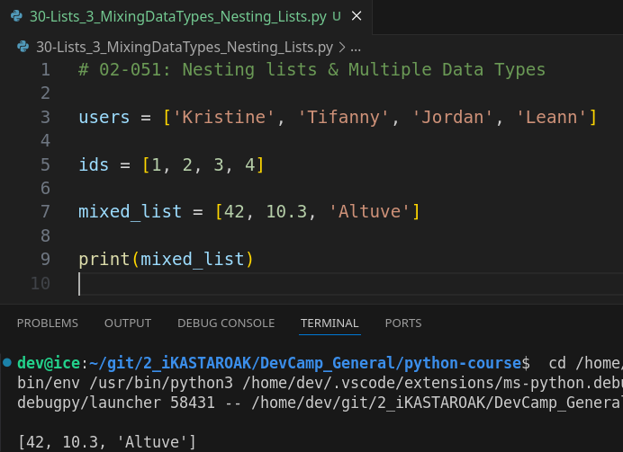
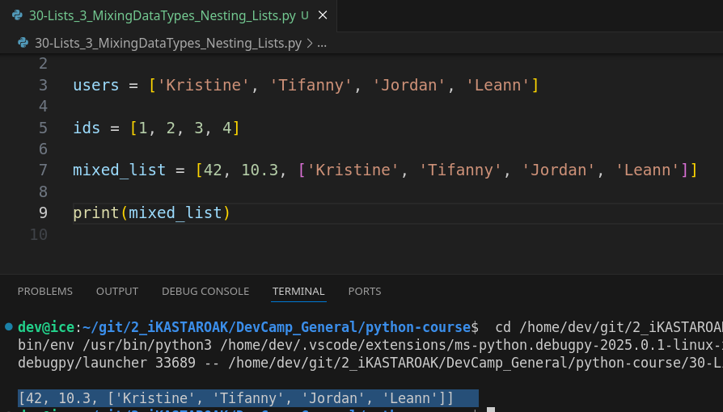
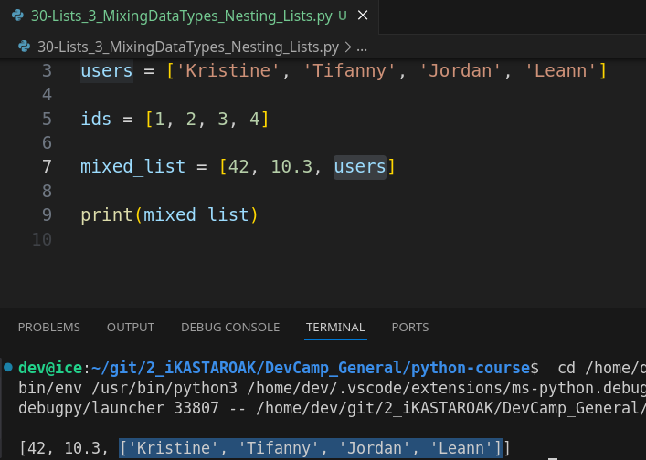
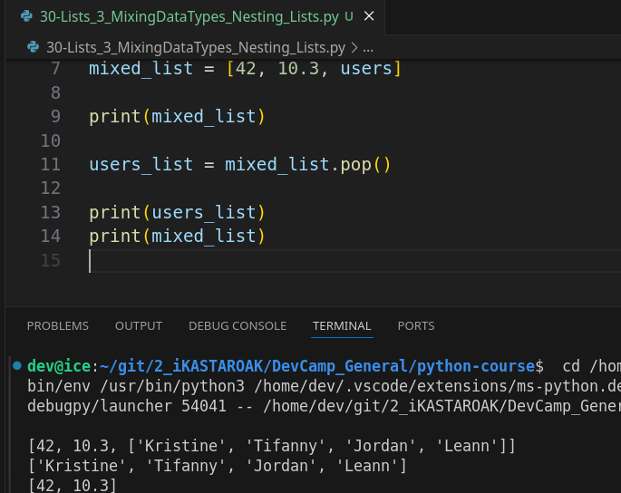
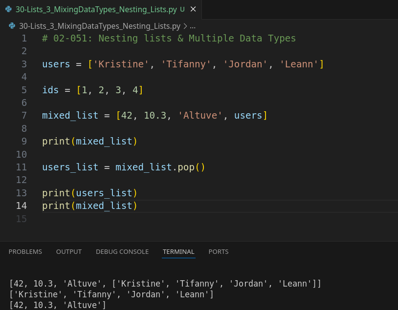
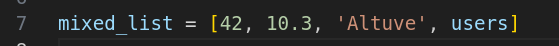

# **MODULE 02 - 051: Python - Nesting Lists / Storing Multiple Data Types**

## **📌 Introduction to Nested Lists**

A **nested list** is a list that contains other lists as its elements. This allows you to store structured data within lists, such as tables, matrices, or grouped collections of data.

### **🔹 Key Features of Nested Lists**

✔ **Heterogeneous Data** – A list can store multiple data types.  
✔ **Lists Inside Lists** – Lists can contain other lists as elements.  
✔ **Dynamic Modifications** – You can modify, append, and remove elements from nested lists.  
✔ **Useful for Structured Data** – Often used to store table-like or multi-dimensional data.

📌 **Python Documentation:** [Lists](https://docs.python.org/3/tutorial/datastructures.html#more-on-lists)

---

## **🛠️ Creating Lists with Multiple Data Types**

Lists in Python can store **mixed data types**.

```python
# A list with mixed data types
mixed_list = [42, 10.3, 'Altuve', ['Kristine', 'Tiffany', 'Jordan', 'Leann']]

print(mixed_list)
```

✔ The list contains an **integer**, **float**, **string**, and another **list**.  
✔ You can access and modify elements dynamically.

📌 **Python Documentation:** [List Literals](https://docs.python.org/3/tutorial/introduction.html#lists)

---

## **📂 Storing a List Inside a List**

Lists can be nested within other lists, allowing for structured data storage.

```python
users = ['Kristine', 'Tiffany', 'Jordan', 'Leann']
nested_list = [42, 10.3, users]
print(nested_list)
```

✔ This structure is useful when grouping related elements together.  
✔ A list within a list remains a valid element and can be accessed like any other item.

📌 **Python Documentation:** [Nested Lists](https://docs.python.org/3/tutorial/datastructures.html#nested-list-comprehensions)

---

## **🎯 Accessing Elements in Nested Lists**

You can access **nested elements** using multiple indices.

```python
# Accessing the first element of the nested list
print(nested_list[2])   # Output: ['Kristine', 'Tiffany', 'Jordan', 'Leann']

# Accessing a specific user inside the nested list
print(nested_list[2][1])  # Output: Tiffany
```

✔ The **first index** accesses the main list.  
✔ The **second index** accesses an element inside the nested list.

📌 **Python Documentation:** [Indexing](https://docs.python.org/3/tutorial/datastructures.html#accessing-elements)

---

## **➕ Adding and Removing Elements**

### **Appending a New List**

```python
nested_list.append(['Mango', 'Banana'])
print(nested_list)
```

✔ Appends a new list to the existing nested list.

📌 **Python Documentation:** [list.append()](https://docs.python.org/3/tutorial/datastructures.html#more-on-lists)

### **Removing a Nested Element with `pop()`**

```python
removed_list = nested_list.pop()
print(removed_list)  # Output: ['Mango', 'Banana']
print(nested_list)
```

✔ `pop()` removes the **last element** and returns it.  
✔ If the last element is a list, the entire list is removed.

📌 **Python Documentation:** [list.pop()](https://docs.python.org/3/tutorial/datastructures.html#more-on-lists)

---

## **⚠️ Best Practices for Nested Lists**

🔹 **Be Cautious with Mixed Data Types** – If iterating over lists, ensure data types are compatible. Performing operations on mixed data types can cause errors.  
🔹 **Use Nested Lists for Structured Data** – Store tabular data, hierarchical structures, or multi-dimensional collections efficiently.  
🔹 **Avoid Excessive Nesting** – Too many nested levels make lists harder to manage and access.

📌 **Python Documentation:** [Best Practices for Data Structures](https://docs.python.org/3/tutorial/datastructures.html)

---

## **🚀 Summary & Key Takeaways**

✔ **Lists can contain multiple data types, including other lists.**  
✔ **Nested lists are useful for structuring data logically.**  
✔ **Use indexing to access elements inside nested lists.**  
✔ **Modifications are dynamic, allowing easy additions and removals.**  
✔ **Maintain consistency in data types to avoid iteration errors.**

  

📌 **Python Documentation:** [Python Lists](https://docs.python.org/3/tutorial/datastructures.html#more-on-lists)

****

# Video lesson Speech

So far in this section, all of our examples of list's have contained a single data type.   

So, right here we have a list of users where each element in the list is a string and another one that you will see quite a bit would be a list of integers.   

You could do IDs like this. And that is very common and there are some very nice reasons for keeping your data types exactly the same and we'll talk about that in a little bit.

****

But I want you to also be aware because you will see this that you can mix and match your data types inside of a single list.   

So, even though one of the most common ways that you'll see a  list created is having all of the elements to have the same data type.   

You can change it up a bit and so let's do that here so I can say mixed list here.   

And the first element can be an integer. The next element could be a float. The next element could be a string and so on and so forth and so let's see if this is actually working.   

If I print out mixed_list you'll see that this worked perfectly we have a regular list object where each element is exactly how we represented it right here.



### Storing a list inside a list

**We can also even put lists inside of lists**. So I could take this user  list here paste it all in and if I run that you can see that we now have a list nested inside of another list,



And, the cleaner way of doing it as opposed to putting all the elements in is actually storing it in the variable like we have right there.   

### Storing variables inside a list

Now, I have users here at the very last element and if I run this you can see that it slides the entire list of users right inside at the very end.



### Running .functions() inside a mixed list

The cool thing is **you still can run all of the standard list functions inside of it**.   

So if I wanted to do something like this where I could say `user_list = mixed_list.pop()` and that's a function.   

So we're going to have our per ends at the very end.

And now I can print out our mixed list and our user list.   

Let's see how this looks. As you can see right here that worked properly.



So we have our regular mixed lists that we printed out here.   

Then we removed.   

So we called Pop on this user list the last element and stored it in the user list variable. And you can see that right here:



A part of the reason I also wanted to show this to you was every other time that I've called `pop` it's been on a single element such as a string and that string is what gets returned.
However, right here, I called `pop` on an element there was actually a list itself, and as you can see, the list got returned.  

Whatever the element is whatever that data type as that's what's going to get returned to you and then you can use it however you need it and like you can see the mix list is back to exactly how we created it before we added the users.

Later, on in this section you're going to see when we get into tuples and dictionaries how **a very common process is going to be to create a list that stores other collections**.

**So**, when you run a database query what you're going to get back is a list of other collections **so**, if you called users and you called this user database, you wouldn't just get a bunch of string names like that.  

We did that in the beginning as an example but a SQL database has much more information

You'd have a name,  you'd have an email address,  you'd have a location and all the kind of different elements like that that you'd want to store in your database that can't be kept in a single string.  

You would actually have another collection that stores all of that.

So, that's what I really wanted this guide to focus on was for you to understand that this is a very basic list here and there will be times where you use these types of elements but a very common process is going to be storing other nested collections other nested data structures inside of a list because that makes it possible to iterate 
over them.

****

I want to point out that this course doesn't just focus on programming, but also on industry best practices. I want to highlight here, on the line that stores the `mixed_list`:



What we're doing here could potentially be quite dangerous.

The reason for this is that, imagine a scenario where you have this list of elements and you believe the list only contains numerical data types—kind of like we have with our IDs. You might start looping over it and, for each element, call a function on that element.

Let’s say you're multiplying it by two, or you're adding them all up to get the sum of the values. That would work just fine as long as all of the data types are numeric.

However, if at some point you update that list and add even just one string, it will break your program. If you try to add the string `"Altuve"` to a sum, you're going to get an error.

So, I want to show this to you with the caveat that you need to understand you must be very careful when working with mixed list data types.

Whenever you have more than one data type inside a list, it means you have to be cautious with how you handle that list. Typically, I try to keep my lists as straightforward as possible by maintaining the same data type throughout.

This means that if I have a list of other lists, I only want to have a collection of lists that look something like this:

This would be, let’s say, **nested lists**. I can have one here, the first element would be this one, the second element would be another list, and so on and so forth. These nested lists can contain anything we want.

For example, we could have a list like this:

```python
mixed_list = [42, 10.3, 'Altuve', users]
```

The nice thing about this is that all of these elements are nested, meaning I can treat them exactly the same way.

**What we have here, on line 5, is a subtle way of introducing bugs into your program.**

That said, there are some rare cases where you'd want to do this. For instance, if you're keeping track of a collection that you don't actually want to iterate over. Maybe you just want to have all the elements nested inside one object so you can pass it around, grab the elements as needed, and not worry too much about their data types since you know exactly what’s inside.

However, when working with large amounts of data, or any kind of database query, you should try to keep each element in your list as uniform as possible. This way, you can treat each one of them the same, which is critical for consistency and reliability.

## Code

```python
users = ['Kristine', 'Tiffany', 'Jordan', 'Leann']
ids = [1, 2, 3, 4]
mixed_list = [42, 10.3, 'Altuve', users]
print(mixed_list)
user_list = mixed_list.pop()
print(user_list)
print(mixed_list)
nested_lists = [[123], [234], [345]]
```
