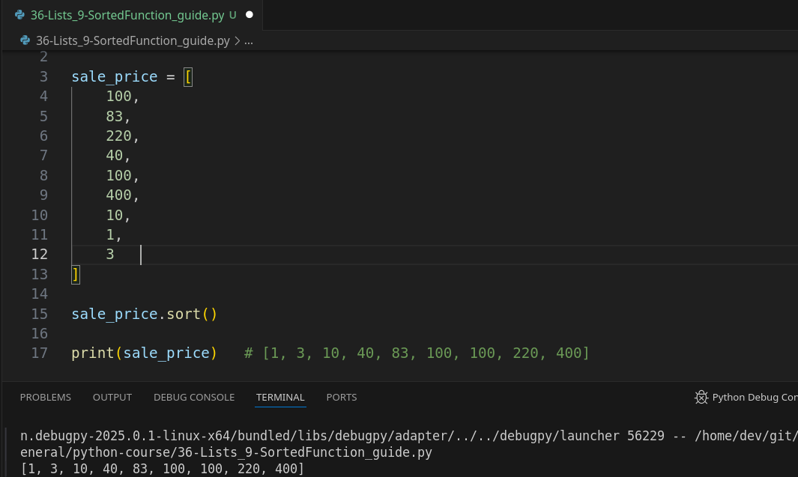
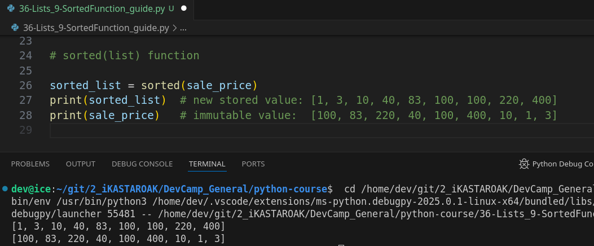
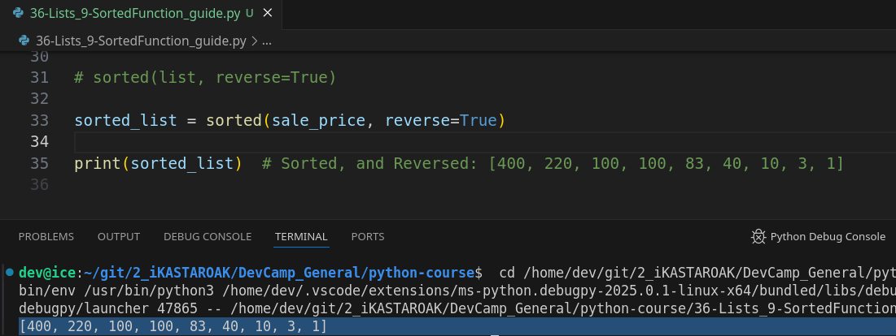

## **MODULE 02 - 057: Python - Sorted Function / `sorted(list)`**

## **📌 Introduction to Sorting in Python**

Sorting is a fundamental operation in programming, often required for organizing data efficiently. Python provides two main methods for sorting lists:

1. **`.sort()` method:** Sorts a list **in-place**, modifying the original list.
2. **`sorted()` function:** Returns a **new sorted list**, keeping the original list unchanged.

Understanding the differences between these two approaches is crucial for ensuring data integrity in your programs.

📌 **Python Documentation:** [Sorting HOWTO](https://docs.python.org/3/howto/sorting.html)

---

## **🔹 Understanding `.sort()` (In-Place Sorting)**

The `.sort()` method sorts the list **in place** and returns `None`. This means that the original list is altered, and the operation does not produce a new list.

```python
sale_prices = [100, 83, 220, 40, 100, 400, 10, 1, 3]

sale_prices.sort()
print(sale_prices)  # Output: [1, 3, 10, 40, 83, 100, 100, 220, 400]
```

✔ **Pros:** Efficient, as it does not require additional memory allocation.
✔ **Cons:** Cannot be undone since it modifies the original list.

📌 **Python Documentation:** [list.sort()](https://docs.python.org/3/library/stdtypes.html#list.sort)

---

## **🔹 `.sort()` Does Not Return a Value**

Since `.sort()` modifies the original list in place, it does not return a new list. Attempting to store its result will lead to an unexpected `None` value:

```python
sorted_list = sale_prices.sort()
print(sorted_list)  # Output: None
```

💡 **Key Takeaway:** `.sort()` is used when modifying the list directly is acceptable. If you need a new sorted list while keeping the original intact, use `sorted()` instead.

---

## **🔹 Using `sorted()` (Immutable Sorting)**

Unlike `.sort()`, the `sorted()` function does **not** modify the original list. Instead, it returns a **new sorted list** while keeping the original intact.

```python
sale_prices = [100, 83, 220, 40, 100, 400, 10, 1, 3]

sorted_list = sorted(sale_prices)
print(sorted_list)  # Output: [1, 3, 10, 40, 83, 100, 100, 220, 400]
print(sale_prices)  # Output: [100, 83, 220, 40, 100, 400, 10, 1, 3]  (Unchanged)
```

✔ **Pros:** Does not alter the original list, making it safer for use in complex applications.
✔ **Cons:** Requires additional memory since a new list is created.

📌 **Python Documentation:** [sorted()](https://docs.python.org/3/library/functions.html#sorted)

---

## **🔹 Sorting in Descending Order**

Both `.sort()` and `sorted()` allow sorting in **descending order** using the `reverse=True` parameter.

```python
sorted_list = sorted(sale_prices, reverse=True)
print(sorted_list)  # Output: [400, 220, 100, 100, 83, 40, 10, 3, 1]
```

📌 **Python Documentation:** [Sorting in Reverse](https://docs.python.org/3/howto/sorting.html#sorting-basics)

---

## **⚠️ When to Use `.sort()` vs. `sorted()`?**

| **Scenario**                      | **Use `.sort()`** | **Use `sorted()`** |
| --------------------------------- | ----------------- | ------------------ |
| Modify the original list?         | ✅ Yes             | ❌ No               |
| Need a new sorted list?           | ❌ No              | ✅ Yes              |
| Memory-efficient?                 | ✅ Yes             | ❌ No               |
| Keep data unaltered for safety?   | ❌ No              | ✅ Yes              |
| Sorting efficiency (Performance)? | ✅ Faster          | ❌ Slightly slower  |

---

## **🚀 Summary & Key Takeaways**

✔ **Use `.sort()` when you want to modify the list directly.**   

✔ **Use `sorted()` when you need a new sorted list without changing the original.** ✔ **Both methods support sorting in reverse order using `reverse=True`.**  

 ✔ **Understanding when to use in-place vs. immutable sorting is crucial for efficient programming.**

****

## Video lesson Speech

We've walked through one of the potential issues with using the sort function inside of Python lists and that is that it sorts all of the elements in place and there may be times where you do want to perform that action.   

However, there may also be times where you simply want to sort a list and not change the original one.

****

Let's walk through a basic example and reiterate what sort is doing.   

If I come here and I say `sale_prices.sort` and then come and print out sale prices this is going to sort that list.  

And, as you can see, it goes from one to 400 with these lists of integers, and that all works.



However, you may notice we're actually calling the original list.   

And so what that means is simply by calling the sort function on `sale_prices` **we have changed the entire structure of these items** and that maybe something that you want to do.

However, there may also be a time where you simply want to pass this to a variable and then have that variable perform that sorting.  

 And as we've already walked through if I create some means such as `sorted_list` I
 create a variable like this and try to print this out.  

 What's going to happen is it's going to print out none and that is because **sort does not return value (Remember the immutability).**

> So, what do you do when you actually want to return that?
> 
> Well, that's what this guide is going to be about. 

## sorted(list) lets storing the value

There is a method called sorted that **we can utilize that has the same type of behavior as sort except it allows you to actually store that value**.   

That new sorted value inside of a different variable.   

So, what this means is sorted does not change the values in place so the list is going to remain completely intact and anyone else any other part of the program that didn't expect a sorted list is going to be able to use it.

Now, this may not seem like a big deal to you if you have not built a ton of different applications than the concept of if a list is sorted or if it isn't may seem pointless.   

However, **there are algorithms that specifically expect a list to be either sorted or unsorted, and if other parts of the program are making decisions based on the expectation that a list is going to be random then that could have negative consequences on the entire system**.   

 So, it's important to keep that kind of in the back of your mind.   

**This may not really play a big part in your development choices until you get into more advanced kinds of development techniques**.   

However, I would be doing you a disservice if I wasn't teaching you all of the different variations that you can utilize, so that when it comes to that point where you need to. 

Just like in this example have a sorted list then you can do that.

So, let's see how we can do that and how we can use the sorted function.   

This is going to be a little bit different we're not going to call it from the back **we're going to call it from the front**.

I'm gonna say sorted and then I can pass this in and I pass sale prices which is this list I can pass it in as an argument.  

 And so now if I run this I don't get none anymore.

Now I actually get the full sorted list and it's working properly now to make sure that we have not to change the values here.  

 Let's actually print out our sale prices. So I'm going to hit return and now you can 
see sale prices now is completely intact:



It is now something where we can trust that we didn't change the order of those values and the rest of **our program still can be more confident that those values have not been altered.**

****

## sorted(list, reverse=True)

Now if you remember one of the very helpful little tools with the sort function is that you can store items in ascending or descending values and sorted you can perform the exact same task.   

So, if I come here and pass in a second optional argument of a reverse equals true then 
this is going to perform the exact same task as with sort.

```python
sorted_list = sorted(sale_prices, reverse=True)
```

And I'm going to delete sale prices since we know that that is intact return and now you can see it is sorting in a *top to bottom* order:



where it's taking the greatest values and it's putting them there first.   

So, now, you should have a good idea on multiple ways that you can store a list in python using the sort function and the sorted function.

 ****

## Code

```python
# 02-057: Lists - Sorted function (advanced)

sale_price = [
    100,
    83,
    220,
    40,
    100,
    400,
    10,
    1,
    3,
]

# Simply sorting

sale_price.sort()
print(sale_price)   # [1, 3, 10, 40, 83, 100, 100, 220, 400]


# .sort() function does not store anything (due to the mentioned immutability)

sorted_list = sale_price.sort()
 print(sorted_list) # None - Anything!


# sorted(list) function

sorted_list = sorted(sale_price)

print(sorted_list)  # new stored value: [1, 3, 10, 40, 83, 100, 100, 220, 400]
print(sale_price)   # immutable value:  [100, 83, 220, 40, 100, 400, 10, 1, 3]


# sorted(list, reverse=True)

sorted_list = sorted(sale_price, reverse=True)

print(sorted_list)  # Sorted, and Reversed: [400, 220, 100, 100, 83, 40, 10, 3, 1]
```
