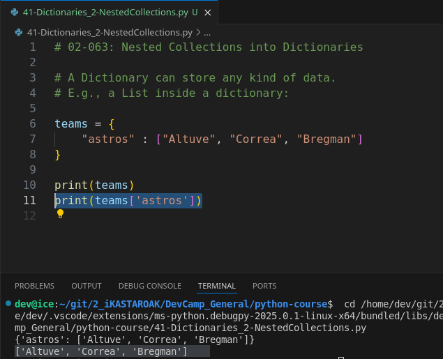
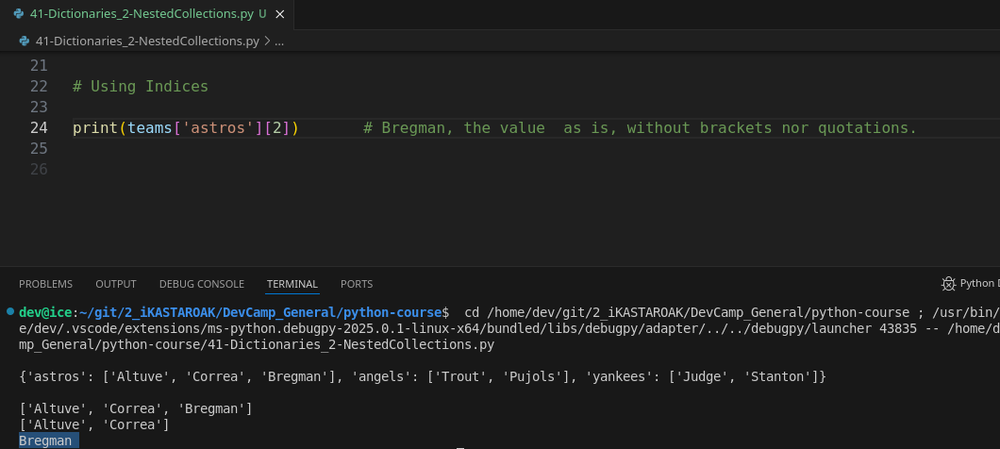
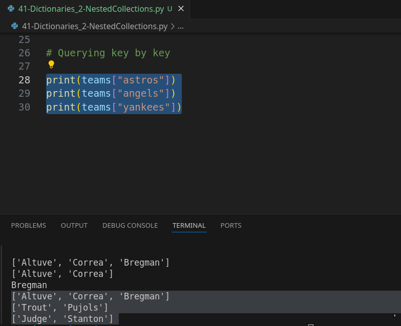
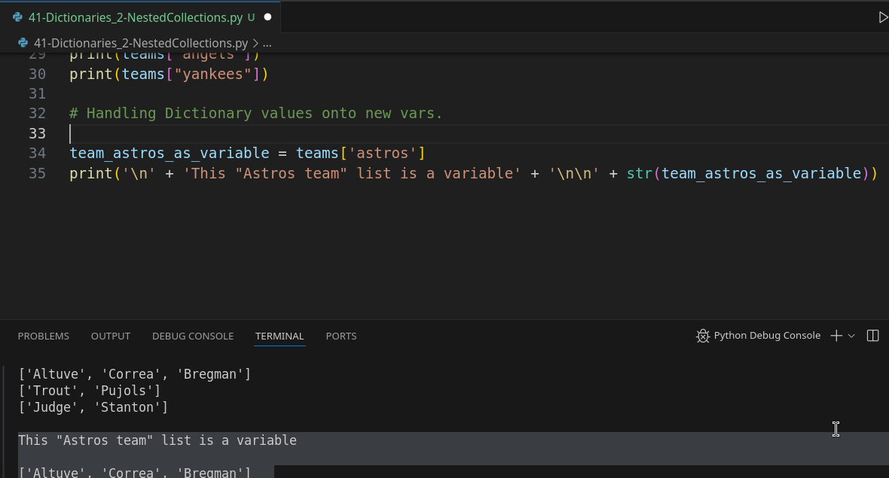

# MODULE 02-063: Python - Dictionaries, Nested Collections


****

## Video lesson Speech

In the last guide we discussed the overall structure of a basic dictionary in python and in this guide I want to extend that knowledge and talk about nested collections because this is going to be a practice that you see quite a bit.

****

You are going to have to have this concept of key-value pairs, but within that key-value structure, you're going to see that many times that value is not a single value but it's actually a collection of values.   

And let's walk through an example to see how we can do this and then also how we can query those elements.

So, I'm going to set up a variable here called teams and create a dictionary.   

Now, the syntax for implementing a nested collection is exactly the same as building a standard dictionary.  

 So, here, I'm going to set up a collection of baseball teams so I'm going to say Astro's and then a colon followed by a list.  

 So, the list can be the value.   

You can only have a single key-value one to one type of relationship but the 
value can contain any other type of data structure it could contain a list or a tuple, or it could contain another dictionary, or a string, or a number, or anything like that.   

So, that's very important to think about.

Here, we're going to have a list and it is going to say just some names of baseball players.   

I'm going to say Altuve, Correa, and then Bragman.   

And that is a single element inside of teams.

```python
teams = {
 "astros": ["Altuve", "Correa", "Bregman"]
}
```

So, if I want to print this out, I can just say print teams and then I can parse it exactly like how we've walked through before where I grab the dictionary value so I perform this lookup by passing in the key and so if I run this you can see it prints out that list.



Now, the nice thing about this and this is a very important topic when it comes to understanding programming and computer science is that when you break elements down in their lowest form possible like what we're doing here.

```python
teams = {
 "astros": ["Altuve", "Correa", "Bregman"]
}
print(teams['astros'])
```

One thing that's very helpful is this may look kind of complex if you've never seen this type of structure before we have a variable we have curly brackets we have all of these kinds of elements.   

However, if you start to look at it and dissect it into little pieces you actually know what each one of these elements is and how to work with them.   

So, for example, you know what a variable is you know what assignment is you now know what a dictionary is with these curly braces.  

 You know what a key for a dictionary is.  

 And then also you know what a list is.   

You just went through a full section on lists and the cool thing about this is we can perform all of those same types of processes that we went through such as slicing and going through it querying all of those elements you can do all of those with this list because at the end of the day we've broken it down into its smallest form possible.

And so I think that is something that personally helped me out a lot when I was first learning how to code was to be able to break each one of the concepts into as little of a chunk as possible because I can understand little chunks.

I have a hard time when I try to understand the entire system all at one time and I think many other people do as well.  

 But one thing that I discovered is when I started to break down those large systems and I started to see that a large system and a large program was made up of was just a bunch of very small tiny concepts just like what we have right here.

So, say that you wanted to look up and grab a slice of this.   

You can perform all of those same things that we did before so I can run this and you can see we now have Altuve and Correa:


and this process is something we covered in-depth than being able to 
grab the slices.   

You can also just grab a single element so I can just say zero if I want Altuve or I could say two I just want Bregman or -1 anything like that.   

And so that's what I wanted to reiterate is that's a very cool concept is this type of code. 

If you've never seen it before might look a little bit intimidating.

However, if you build up your knowledge in a very foundation first 
approach where you try to understand all of the key low-level concepts 
and you build up your knowledge that way you're going to be able to 
start understanding the much more advanced and complex topics because 
that's all a complex program is. It's a series of these smaller concepts
 that are all built up together and combined to build advanced behavior.

So with all that being said let's now-now that we know how to set 
this up, let's add a few more just so you can see exactly the way it 
works so here let's add another team so I'm going to say the angels and 
let's just add a couple of players we'll add Trout and then Pujos and 
let's add just one more. And for this one, we'll go with the Yankees so 
here we'll say Judge and Stanton and now we can go through and query 
this list or this dictionary of lists however we want.

So I can say print teams and we can do this just to make sure that we
 don't have any type of syntax errors or anything like that. As you can 
see we have a fully functioning dictionary right there.



And, then, you could grab any of these elements so you could grab the Yankees will make a few copies of this.   

We'll grab the Astro's and then the angels just like this. If you run this you can see that now we have our lists.



And, as we saw earlier, we can work with these lists just like they were just stored in a plain variable and that is one last item I want to show is that whenever you're working with these you can just store these items in a variable.

So, if you wanted to set up, for example, the Astros you could say Astro's equals teams and then just pass an Astros and then right here you can just use the variable.   

And if I run this you can see everything here is working exactly the same.



So that is a high-level overview of how you can use nested collections inside of a dictionary.

****

## Code

```python
# 02-063: Nested Collections into Dictionaries

# A Dictionary can store any kind of data.
# E.g., a List inside a dictionary:

teams = {
    "astros"    : ["Altuve", "Correa", "Bregman"],
    "angels"    : ["Trout", "Pujols"],
    "yankees"   : ["Judge", "Stanton"]
}

print('\n' + str(teams) + '\n')


# Using index RANGES
# Syntax:   dictionary['key'][ start : stop : step]

print(teams['astros'])
print(teams['astros'][:2])      # From key 'astros', start: 0, stop: 2


# Using Indices

print(teams['astros'][2])       # Bregman, the value  as is, without brackets nor quotations.

# Querying key by key

print(teams["astros"])
print(teams["angels"])
print(teams["yankees"])

# Handling Dictionary values onto new vars.

team_astros_as_variable = teams['astros']
print('\n' + 'This "Astros team" list is a variable' + '\n\n' + str(team_astros_as_variable))
```
