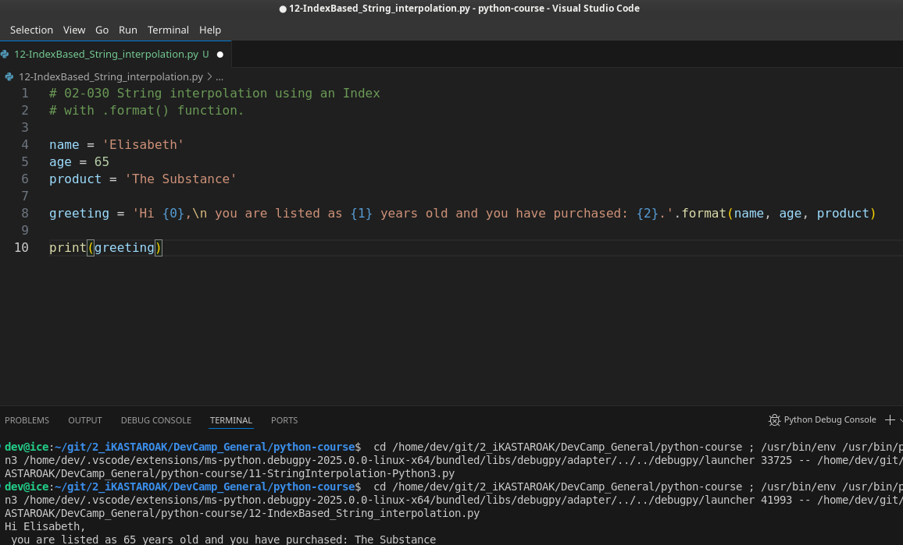
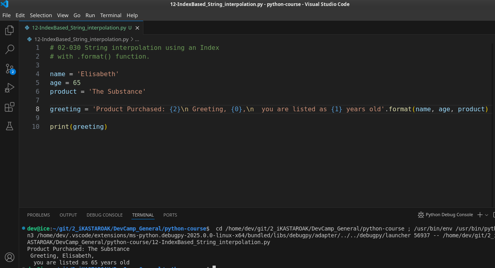
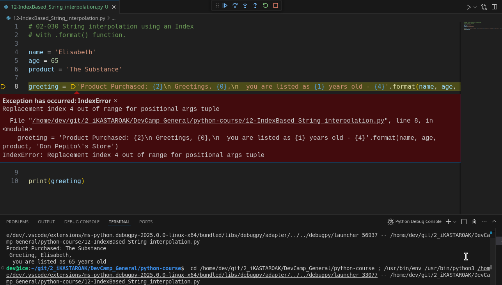
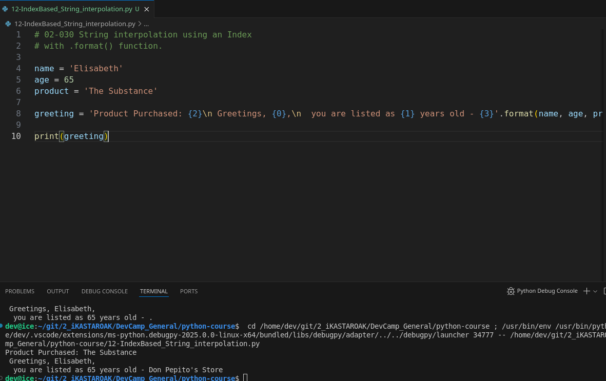
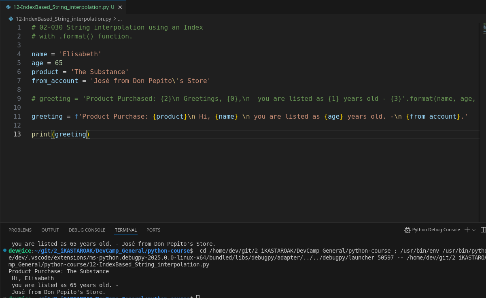

## MODULE 02 - 030: Python Index-Based String Interpolation (`.format()` Method)

## **Understanding the `.format()` Method in Python**

String interpolation allows dynamic insertion of values into strings. While **f-strings (`f""`)** are the modern approach, the **`.format()` method** was widely used in Python before version 3.6.

### **Why Learn `.format()`?**

- Older Python projects often use `.format()`.
- It helps reinforce **zero-based indexing**.
- Some environments may not yet support f-strings.

✅ **Best Practice:** Use **f-strings** for new projects but understand `.format()` for compatibility with legacy code.

---

## **1️⃣ Basic Usage of `.format()`**

The `.format()` method replaces placeholders `{}` inside a string with values passed as arguments.

```python
name = 'Kristine'
age = 12
product = 'Python eLearning course'

greeting = "Hi {0}, you are listed as {1} years old and you have purchased: {2}.".format(name, age, product)
print(greeting)
```

### **How does this work?**

- `{0}`, `{1}`, `{2}` are **positional placeholders**.
- `.format(name, age, product)` replaces `{0}` with `name`, `{1}` with `age`, and `{2}` with `product`.

✅ **Use `.format()` when working with Python <3.6 or when modifying older codebases.**

---

## **2️⃣ Reordering Arguments with `.format()`**

Arguments can be used **out of order**:

```python
greeting = "Product Purchased: {2}. Hi {0}, you are {1} years old.".format(name, age, product)
print(greeting)
```

✅ **Benefit:** You can dynamically reorder elements without changing the original argument order.

---

## **3️⃣ Using Named Arguments in `.format()`**

Instead of positional indexes, you can use **named arguments**:

```python
greeting = "Hi {user}, you have purchased {item}.".format(user=name, item=product)
print(greeting)
```

✅ **Benefit:** Named arguments improve readability in long strings.

---

## **4️⃣ Handling Errors and Zero-Based Indexing**

Python uses **zero-based indexing**, meaning counting starts from `0`. A common mistake is using an out-of-range index:

```python
print("Hi {4}".format(name, age, product))  # IndexError: tuple index out of range
```

🚨 **Error Handling Tip:** Always count **from zero** when using indexed placeholders.

---

## **5️⃣ Why f-strings (`f""`) are Preferred Over `.format()`**

The `.format()` method is useful but has limitations:

- Requires **explicit indexing** (`{0}, {1}`) or named parameters.
- **Less readable** for complex formatting.
- **More verbose** than f-strings.

### **Example: Using f-strings Instead of `.format()`**

```python
greeting = f"Hi {name}, you are {age} years old and purchased {product}."
print(greeting)
```

✅ **Best Practice:** Use **f-strings** for clarity, readability, and efficiency.

---

## **🔍 Summary: Key Takeaways**

| Feature                  | `.format()`         | f-strings (`f""`)     |
| ------------------------ | ------------------- | --------------------- |
| **Positional Arguments** | `{0}, {1}, {2}`     | `{var}`               |
| **Named Arguments**      | `{name}, {product}` | `{name}, {product}`   |
| **Readability**          | Moderate            | High                  |
| **Performance**          | Slower              | Faster                |
| **Best For**             | Legacy Code         | Modern Python (>=3.6) |

---

## **📌 Python Documentation Reference**

🔗 **[str.format()](https://docs.python.org/3/library/stdtypes.html#str.format)**

> Perform string formatting by replacing `{}` placeholders with values.

***

## Video lesson speech

How to Use Python's format method to Implement Index Based String Interpolation

In the last few guides we've discussed how we could work with string interpolation inside a python and I've mainly been showing you how to leverage string literals by being able to place curly brackets inside of the string and then simply placing variables inside of those and that is probably going to be your best bet and your best option for 
implementing string interpolation in your own Python projects.  

However, I also wanted to show you the `format` method and  the main reason I'm going to show you this isn't even so much that I think you should use it because I don't use it very much myself anymore.  

 However, if you are coming across older projects that leverage the format method I wanted you to be able to be aware of it and what it does  and the other nice benefit is that this will help reinforce the zero base numbering methodology that if you're not familiar with will help to kind of put that back into your mind.

So I'm going to start off with a few variables here.  

 You can have one that is a name another that's an age and then one more that's a 
product.  

```python
name = 'Kristine'
age = 12
```

This is pretty similar to what we've implemented so far when we're working with heredocs and those types of strings you say Python e-learning course and now what I'm going to do is I'm going to create a greeting.  

 So I'm going to say hi. And the first spot that I want to slide in the first content is name. Now you know that with our string literal interpolation I could do this.  

```python
greeting = "Hi {name}"
```

However, what I'm going to do is I'm actually going to show you how you can use the format method so I'm going to say `hi {0}` and then you are listed as I'm going to a place the number 1 in there and this is going to look weird.   

I'm going to show you how it makes sense later on.   

So you say hi you're listed as the one and then years old and you have purchased and then place inside of here. Just the curly brackets once again. The number two and let's call format on this.

Now the way that format works is format takes any number of arguments that you want to pass in so I can say name age and product:  

```python
```python
name = 'Kristine'
age = 12
product = 'Python eLearning course'

greeting - "Hi {0}, you are listed as {1} years old and you have purchased: {2}...".format(name, age, product)
```

and what this is going to do is it's going to go into the string and 
it is going to map to each one of these values.   

So name is going to be mapped to the very first element which is 0.  

 Age is going to be mapped to the second element which has the index 1 and then product is going to be mapped right here.

Let's see if this works. I'm going to say greeting and I want to print this out.   

So if I run this code here. You can see it says hi Kristine. You are listed as 12 years old and you have purchased Python eLearning course.



Just so you know **you don't have to supply these in order.   **

**They simply have to be mapped to this order so I could do something like this. **  

I could take this two here end it at years old and say something like 
product purchase that number two.

And then just like that, I could run it again.  

 And as you can see it says `product purchased Python e-learning course`.  

 And then `Hi Kristine`.



So the order that you placed these in the string doesn't matter you simply have to know that whenever you want to reference name you're going to use the brackets with the zero whenever you want to use age you're going to be using one and product is going to use two.   

Now you're not limited to simply using three elements here you could put as many 
as you want.   

So you could even place you don't even need to place variables in here.  

 So if I wanted to say place my name right here.   

And it's going to give us an air. There's too many arguments for the format string because it's actually looking for a number for now.   

So I could say here and pass in a number for because that's the index.   

And now if I run this oh says file Python line 5 tuple index out of range.



and that was simply my mistake.  

Even though I've been doing this for a very long time I still get tripped up on having zero-based indexes. I counted 1, 2, 3, and 4 elements here.   

But forgot that these are mapped to indexes.  

 Part of this is part of the reason why I wanted to implement these is because this may not be a very intuitive topic for you to grasp.  

 You've never use zero-base indexes one of the most natural things that we do as individuals if we've learned counting from 1 we're going to do exactly what I did right there which was count four elements and then I automatically thought of placing a 4 there when in actuality name is mapped to the index 0, Age is 1, product is 2, Jordan is 3.

So if I run this again you'll see that it works



And so that, you can pass just a string in here.

It doesn't have to be a variable you can pass in whatever you want.   

Just know it's going to be mapped to a specific index value so that is something that is important in it.

***

### Explaining again repeating the same mistakes

One other note to keep in mind, part of the reason why you don't edit out the errors like that is because I want you to be able to see common  errors.   

You get to see what the error message was so if I come back and change this back to 4 and run it you can see we:


Now that is unless you're familiar with what tuples are and you've 
worked with an out of range error that may not be the most intuitive 
kind of idea to grasp. So I want to keep these errors in and whenever I 
make a typo or I type in something wrong like that I want to keep it in 
so that when you run into these errors because my guess is you're going 
to run into a lot of errors. I know I personally do when I'm working on 
my own projects and obviously even when I'm working and teaching and so 
since you're going to run into errors I want to try to keep those in as 
much as possible so that when you run into similar ones you'll know how 
to debug them.

I'm going to switch back to 3 hit run and now everything is once again working.


So this is how you can use the format method in order to implement string interpolation.

Now once again just to kind of reiterate this is one option of performing this task but my personal favorite now is instead of to implement it this way is to use the string literal so I can get rid of all of this code right here.   

And then I can simply type an "f" right here which is short for format.   

This is I think a cleaner way of doing it and then I don't have to worry about these index numbers anymore. And so here I can just say product and then name, age and then if I wanted to I could throw up a from_account and place it just like that and if I type all of that out and now run this you're going to get the exact same output.  



But the reason why I like this better is because it's more intuitive.  

 I do not have to go and count each one of those index values and then see where it's mapped because if you end up with a very large string then it's going to be more challenging to keep track of it.   

Whereas instead if I simply slide in the expression which would be a variable such as 
product or name I'll know exactly what values going in there.   

So once again those are two ways of being able to use string interpolation and also a reason why I personally like using this more modern string literal form of doing it.

***

## [Python Documentation](https://docs.python.org/3/library/stdtypes.html)

> ## [str.format(*args, **kwargs)](https://docs.python.org/3/library/stdtypes.html#str.format)
> 
> Perform a string formatting operation. The string on which this 
> method is called can contain literal text or >replacement fields 
> delimited by braces {}. Each replacement field contains either the 
> numeric index of a positional >argument, or the name of a keyword 
> argument. Returns a copy of the string where each replacement field is 
> 
> > replaced with the string value of the corresponding argument.
