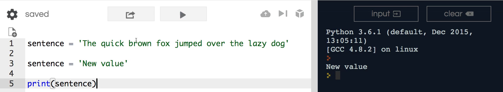

# MODULE 02 - 032: Python - Finding and Replacing String Values with `.replace()`

---

### `.replace()`  -  Manipulating string values in Python while respecting immutability!

***

## **Understanding String Immutability in Python**

Before diving into the `.replace()` method, it's crucial to understand a fundamental property of strings in Python: **immutability**.

- **Strings in Python cannot be changed** after they are created.
- If you come from other programming languages, this might seem unusual, but in Python, modifying a string **directly** is not possible.
- Instead, we use **workarounds** to achieve similar effects.

This is where the `.replace()` method comes in.

---

## **1️⃣ Using the `.replace()` Method**

Python provides the `.replace()` method to **find and replace** substrings within a string. However, since strings are immutable, `.replace()` does not modify the original string—instead, it returns a **new** string.

Let's look at an example:

```python
sentence = 'The quick brown fox jumped over the lazy dog.'

# Using replace()
new_sentence = sentence.replace('quick', 'slow')
print(new_sentence)  # Output: 'The slow brown fox jumped over the lazy dog.'
```

### **How does `.replace()` work?**

- The first argument is the **substring to find** (`'quick'`).
- The second argument is the **replacement substring** (`'slow'`).
- A **new string** is returned with the replacement applied.

🚨 **Important:** The original `sentence` variable remains unchanged unless reassigned.

---

## **2️⃣ Reassigning a String After Using `.replace()`**

Since `.replace()` returns a new string, we can reassign the variable to update its value:

```python
sentence = sentence.replace('quick', 'slow')
print(sentence)  # Output: 'The slow brown fox jumped over the lazy dog.'
```

### **Why is reassignment necessary?**

- The original string remains unchanged (`.replace()` does not modify in-place).
- By reassigning, we update `sentence` to reference the new modified string.

✅ **Best Practice:** Always reassign the variable if you want to keep the changes.

---

## **3️⃣ Multiple Replacements in a Single Call**

The `.replace()` method can replace **all occurrences** of a substring:

```python
sentence = 'The quick quick quick brown fox.'
new_sentence = sentence.replace('quick', 'slow')
print(new_sentence)  # Output: 'The slow slow slow brown fox.'
```

It replaces **every instance** of `'quick'` in the string.

✅ **Best Practice:** Use `.replace()` for bulk replacements when modifying repeated substrings.

---

## **4️⃣ Limiting the Number of Replacements**

You can specify the **number of replacements** by adding a third argument:

```python
sentence = 'The quick quick quick brown fox.'
new_sentence = sentence.replace('quick', 'slow', 2)
print(new_sentence)  # Output: 'The slow slow quick brown fox.'
```

### **How does it work?**

- The **third argument** (`2`) specifies the **maximum** number of replacements.
- Here, only **two occurrences** of `'quick'` are replaced, leaving the third one unchanged.

✅ **Best Practice:** Use this feature when you want to replace only a limited number of occurrences.

---

## **🔍 Summary: Key Takeaways**

| Feature                   | Behavior                                                                         |
| ------------------------- | -------------------------------------------------------------------------------- |
| **Immutability**          | Strings in Python cannot be modified in place.                                   |
| **Return Value**          | `.replace()` returns a **new** string (it does not modify the original).         |
| **Reassignment**          | To keep the changes, reassign the variable (`sentence = sentence.replace(...)`). |
| **Multiple Replacements** | Replaces **all** occurrences by default.                                         |
| **Limited Replacements**  | A third argument allows you to limit the number of replacements.                 |

---

## **📌 Python Documentation Reference**

🔗 **[str.replace(old, new[, count])](https://docs.python.org/3/library/stdtypes.html#str.replace)**

> Returns a copy of the string with all occurrences of `old` replaced by `new`. If `count` is given, only the first `count` occurrences are replaced.

***

## Video lesson Speech

Continuing our journey on this string data type in Python. We're going 

to come back and discuss immutability if you remember back a few guides 
ago we talked about how strings in python are immutable which means that
 they can't be changed and that may sound like a weird concept because 
if you're coming from other programming languages it is incredibly easy 
to change the values of strings.

***

In Python, it's not even possible. So 
thankfully there are a number of workarounds and in this guide, I want 
to talk about the Replace function and it is not possible to leverage 
Replace in order to completely replace a string. So what we're going to 
do is leverage the ability to replace and then reassign a string value.

Now if that entire process sounds about as clear as mud. Don't worry 
we're going to work through an example. So yes a sentence and we'll go 
with our favorite one. The quick brown fox jumped over the lazy dog

sentence = 'The quick brown fox jumped over the lazy dog'

and now let's talk about how we can perform reassignment. So 
reassignment is simply just like it sounds, it gives us the ability to 
reassign a value. So if we wanted to say write over the sentence value I
 could say "sentence" and then say new value. If I come down here and 
print out the sentence you may guess what is going to be printed out. 
Right here we get new value.



Now we did not change this string. Remember when we did that very 
slow break out where I showed that a string is not the variable? That 
these are different elements, that we have a variable we have an 
assignment operator then we have the string itself and so what we're 
doing here is when we are redefining this or when we're reassigning a 
new value to be in the sentence. We are not touching the string. All 
we're telling the Python interpreter is that the sentence variable now 
is equal to this string. But these are completely different strings and 
when this new value got printed out it is pointing to this exact string 
where we assigned it to be 'New value'.

So with this knowledge what we can do is not worry about changing the
 string because that's not possible in python but what we can do is we 
can take that string, perform any changes that we want on it, and then 
reassign it and we can even reassign it back into the sentence variable.
 So what I'm going to do here is I am going to call sentence and then 
here I'm going to say sentence.replace

Replace takes two arguments it takes the word that you're looking for
 and then it takes the word you want to replace it with. So here I'm 
going to say I want you to try to find quick and I want to replace it 
with slow. So now if I return you can see that it says the slow brown 
fox jumped over the lazy dog.


So what happened here? We took the sentence right here which was 
assigned to this specific string and then we reassigned it into the same
 name and this is the same variable but we took the reference to that 
string so we took that sentence and we said I want you to replace quick 
with slow and so that is the process of being able to not change a 
string because that's not possible. But to leverage the replace keyword 
the replace function with a reassignment process and so we're able to 
accomplish the exact same type of goal we had which was to take one 
string and to change it but we were able to do it within the rules that 
Python gives us.

That's how you can leverage the replace function inside of Python.

## Code

```python
sentence = 'The quick brown fox jumped over the lazy dog.'

sentence = sentence.replace('quick', 'slow')
print(sentence.replace('quick', 'slow'))
print(sentence)
```
