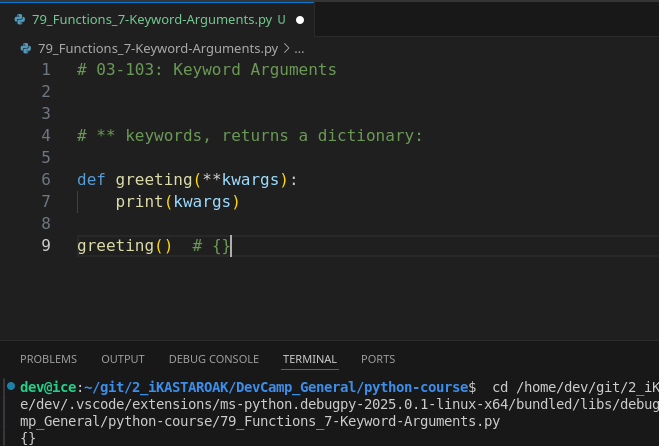
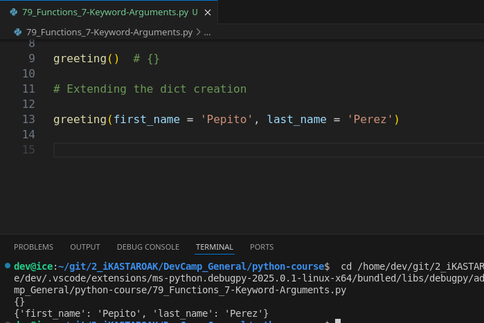
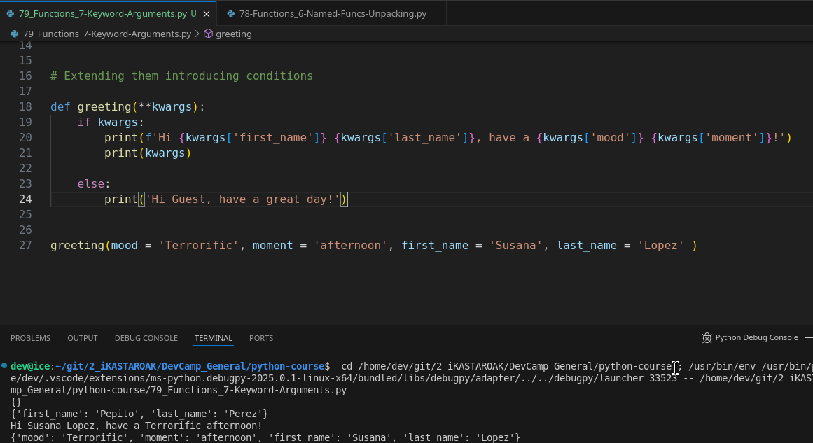
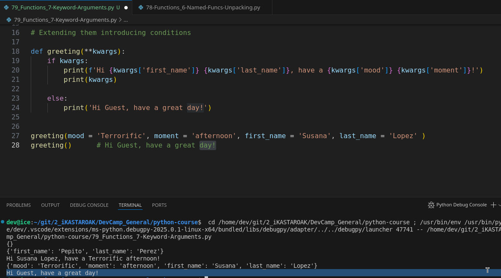

# MODULE 03 - 103: Python - Keyword Arguments

In the previous guide, we explored **argument unpacking** using `*args`. Now, we will take it a step further by introducing **keyword arguments (`**kwargs`)**, which allow functions to accept a **dynamic number of named arguments**.

Unlike `*args`, which collects positional arguments into a tuple, `**kwargs` collects **named arguments into a dictionary**. This makes `**kwargs` extremely useful when working with flexible function calls where the number of parameters is unknown.

🔗 **Reference:** [Python Keyword Arguments](https://docs.python.org/3/tutorial/controlflow.html#keyword-arguments)

---

## 🔹 How `**kwargs` Works

### ✅ Example: Printing Keyword Arguments as a Dictionary

```
def greeting(**kwargs):
    print(kwargs)

greeting(first_name="Kristine", last_name="Hudgens")
```

📌 **What Happens?**

- The function accepts multiple named arguments.
- It collects them into a **dictionary**.
- The function prints `{'first_name': 'Kristine', 'last_name': 'Hudgens'}`.

🔗 **Reference:** [Python Dictionaries](https://docs.python.org/3/tutorial/datastructures.html#dictionaries)

---

## 🔹 Using `**kwargs` in Conditional Logic

Keyword arguments allow for **dynamic behavior** based on user input.

### ✅ Example: A Dynamic Greeting Function

```
def greeting(**kwargs):
    if kwargs:
        print(f"Hi {kwargs['first_name']} {kwargs['last_name']}, have a {kwargs['mood']} {kwargs['moment']}!")
    else:
        print("Hi Guest, have a great day!")

greeting(mood="wonderful", moment="morning", first_name="Susana", last_name="Lopez")
greeting()
```

📌 **What Happens?**

- If keyword arguments are provided, the function personalizes the message.
- If **no arguments** are given, it defaults to "Hi Guest, have a great day!".

🔗 **Reference:** [Python String Formatting](https://docs.python.org/3/library/stdtypes.html#str.format)

---

## 🔹 Understanding `**kwargs` as a Dictionary

Since `**kwargs` collects arguments into a **dictionary**, we can access values using dictionary syntax.

### ✅ Example: Looping Through `**kwargs`

```
def display_info(**kwargs):
    for key, value in kwargs.items():
        print(f"{key}: {value}")

display_info(name="Alex", age=30, country="USA")
```

📌 **Key Concept:**

- `kwargs.items()` retrieves key-value pairs.
- We iterate through them and print each argument dynamically.

---

## 📌 Summary

- `**kwargs` allows functions to accept **any number of named arguments**.
- Keyword arguments are stored in a **dictionary**, making them flexible.
- They are useful for creating **dynamic functions** that handle different sets of inputs.
- Python allows mixi

****

## Video lesson Speech:

In the last guide, we walked through how we could unpack function arguments with the args keyword and that's where we place the star right in front of the word args and that is very helpful in a number of situations.

****

Now, a common question that can come up is can you give named arguments in a list so we have talked about unpacking where we work with args.  

 And we've also talked about named arguments where we can do things such as pass in say a first name argument and a last name argument just like this.

However, we have not combined those two yet but thankfully python does have a way where you can take in a keyword list of arguments so this is where you may not know how many arguments to take in very similar to what we did when we integrated unpacking.   

But now we can combine named arguments with the same concept. And so I'm going to get rid of our greeting calls on lines 5 and 6. And instead of saying args, I'm going to give a double asterisk. So it's going to be two stars followed by kw.

Now, once again **kw is not a reserved word**.   

However, this is the **common convention** as you look over other Python programs, this is the code that you're going to see the most often.   

Now before we even make our program functional let's just take this and print it out. 

So, if I put this inside of a print statement and then come down here and say greeting and pass in no arguments and run this you can see that what gets returned back is a dictionary.



So, that is one of the biggest keys between working with keyword arguments versus just traditional unpacking.   

If you remember back when we unpacked our list of arguments it got returned as a tuple.   

**Whenever you are unpacking keyword arguments it gets returned as a dictionary**.   

I think this is a logical approach because if you think about it a keyword argument needs to have a set of keys and associated values which as you know is the very definition of a dictionary and so that is one of the key elements to remember.

Now, let's take this and extend it out a little bit.   

So, now, if I call greeting and I pass in some named arguments so I could say first_name like this and then pass in Kristine and then I can say last_name equals 
Hudgens.   

If I run this code you can see that what gets printed out is a dictionary where the name to Key so this name parameter first name is the key and then the value is whatever I passed into it.



And so this is a very basic way of working with keyword arguments.

Now, with this in place let's take our example here, and let's extend it out a little bit so I'm gonna say def greeting with our keyword args this is going to remain the same.   

But now I'm going to implement a conditional and so the behavior that I'm wanting to build out is a true greeting function that will work for both guest users and users that are logged into the system.

So, I could say if keyword args. What this is going to do is it's going to check to see if the keyword args was set or not.   

And then if it was then we can print this out.   

So I can say print and then Hi and the way that we can grab these elements is the exact same way that we would when we're working with a traditional dictionary so I can say keyword args and pass in the bracket syntax and I'll say first_name because that
 is the value they'll be passing in or the named argument.

So, I can say hi first_name and then I'll copy this because the last name is going to be the same I'm just adding a space in between the two. So say a last_name.   

And now I'll just add a little greeting so have a great day, just like this. And then that string. And then if that is not the case. So in other words, if no keyword args were given then I can just take this and come down here and print it out.   

Except instead of having a first name I'm just going to say hi guest have a great day.

Okay, let's first try it out for our named argument set. So if I run this you can see that that works perfectly it says Hi Kristine Hudgens have a great day.



Now if I come down here and I simply pass in greeting with no values you can see the next. That statement works perfectly fine and it says hi guest. Have a great day.



So, here we're able to effectively work with keyword arguments on a dynamic basis. So we're able to have the function itself check to see if keyword args were given if they were.   

Then it implements one kind of protocol and if not then it has an alternative. And so this is a very common way to work with keyword arguments.

****

## Code

```python
# 03-103: Keyword Arguments

# ** keywords, returns a dictionary:

def greeting(**kwargs):
    print(kwargs)

greeting()  # {}


# Extending the dict creation

greeting(first_name = 'Pepito', last_name = 'Perez')


# Extending them introducing conditions

def greeting(**kwargs):
    if kwargs:
        print(f'Hi {kwargs['first_name']} {kwargs['last_name']}, have a {kwargs['mood']} {kwargs['moment']}!')
        print(kwargs)

    else:
        print('Hi Guest, have a great day!')


greeting(mood = 'Terrorific', moment = 'afternoon', first_name = 'Susana', last_name = 'Lopez' )
greeting()      # Hi Guest, have a great day!
```
