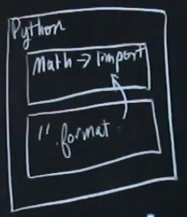
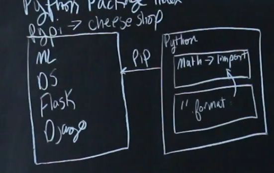

## MODULE 03 - 108: Modules, Introduction


In this section, we will explore **how to import modules in Python**.

So far, we have written all our own code, defining functions and implementing logic manually. However, one of Python’s biggest strengths is its **rich ecosystem of modules and libraries**, contributed by a large community of developers. These modules allow us to extend Python’s functionality without reinventing the wheel. 🚀

🔗 **Reference:** [Python Modules](https://docs.python.org/3/tutorial/modules.html)

---

## 🔹 Understanding Python’s Core Library

By default, Python provides access to its **core library**, which includes many built-in functions and methods. For example:

- We can format strings using `.format()` without importing anything.
- We can manipulate lists, dictionaries, and other data structures seamlessly.

However, not everything is available **automatically**—some functionality requires importing specific modules.

### ✅ Example: Using the `math` Module

Some advanced mathematical functions are **part of the standard library**, but require importing:

```
import math
print(math.floor(4.7))  # 4
print(math.ceil(4.2))   # 5
```

📌 **Key Concept:** Standard Python functions are available immediately, but specialized tools (e.g., `math`) must be explicitly imported.

🔗 **Reference:** [Python `math` Module](https://docs.python.org/3/library/math.html)

---

## 🔹 Beyond the Standard Library: Third-Party Modules

Python also provides access to thousands of **third-party libraries** that expand its capabilities. These libraries are not included by default and must be installed separately.

### 📌 How Are These Modules Managed?

Python maintains a **centralized repository** called the **Python Package Index (PyPI)**, also known as:

- **PyPI** (short for Python Package Index)
- **The Cheese Shop** (a nickname from an old SNL skit)

### 📌 How Do We Access These Modules?

To install third-party modules, we use **Pip**, which connects directly to PyPI and allows us to install packages effortlessly:

```
pip install package_name
```

📌 **Example Third-Party Modules:**

- **NumPy** → For numerical computing.
- **Pandas** → For data analysis.
- **Flask/Django** → For web development.

🔗 **Reference:** [Python Package Index (PyPI)](https://pypi.org/)

---

## 🔹 Three Types of Python Modules

Python modules are structured in three categories:
1️⃣ **Built-in functions** → Available by default (e.g., `print()`, `len()`).  
2️⃣ **Standard Library Modules** → Require importing but are included with Python (e.g., `math`, `datetime`).  
3️⃣ **Third-Party Modules** → Require **installation via Pip** (e.g., `requests`, `numpy`).  

Each of these plays a vital role in **expanding Python’s capabilities** while maintaining flexibility and efficiency.

---

## 📌 Summary

- **Python modules extend functionality** beyond built-in features.
- The **core library** includes many useful functions without requiring imports.
- Some modules, like `math`, are **part of the standard library** but must be explicitly imported.
- **Third-party modules** require installation via **Pip**, connecting to **PyPI**.
- Understanding how to use modules makes Python **more powerful and versatile**.


---

## Video Lesson Speech

Hi, and welcome to this section where we're going to learn how to import modules in Python. 

---

So far in this course, we've mainly been writing all of our own code. Anytime we wanted a piece of functionality, such as building out some type of function, we wrote all the functionality inside of that.

However, one of the best things about Python is that it has a massive community of developers and open-source contributors who've built out some pretty amazing libraries. What we can do with Python is actually go into some of those libraries, pull them down into our own programs, and use them ourselves. I think it helps to have a visual, so before we go into the code, we're going to draw exactly how modules work inside Python.

So far in this course, we have been working with the core Python library. What that means is that in that library, we have a set of functionality that we automatically have access to. For example, when we were using strings, we could call the `format` method and work with it without doing anything at all. We could simply have a string, and just because we were working with the core language, we could call `format`. We didn't have to import any modules or anything like that.


Now, this is still within the base Python language. If you remember back to the numbers section, whenever we wanted to use some advanced math functions, we had to perform an import. Here, this is also going to be within the core Python language, but if we wanted one of the math libraries, we had to import it. So, if we wanted that in our main program right here, we had to say `import math`.



From there, we could call the `floor` function or the `ceil` function and use them exactly like we did. Now, those were still all within the core Python library. However, there is a very large ecosystem of other libraries out there that sit outside of the core language. What that means is we can't simply call them the way we did with the math library. Before we can do that, we need to import them into our own system.

There are a number of different names for this. This is the **Python Package Index**, which is just a fancy way to say they keep a database of all the different modules that you want to import. For short, it's usually called **PyPI**. A little secret code word that people use is they call it the **Cheese Shop**. If you're ever curious about why that is, you can simply Google "Python Cheese Shop," and you'll see it dates back to a popular SNL skit from decades ago. But if you hear all three of these terms, I wanted you to be aware of them: **Cheese Shop**, **PyPI**, **Python Package Index**.

Now, inside of this, it contains a very large number of libraries. You're going to have machine learning libraries, different ones for working with data structures, and all kinds of things you can imagine. Also, when we get into frameworks such as Flask or Django, these are all packages within this index right here. What we need to do in order to call those is we need a connection here, and that's what we're going to go through throughout this section.

The connector is called **Pip**, and that is going to give us a direct feed into this entire database. Then, we can simply install those libraries on our system and call them exactly the same way we did with the math library.



So, that is a very high-level overview of the architecture and how packages and modules are structured. There are three ways: one where you have direct access, another where they're in the core language but you still need to import them, and then the third where you have third-party types of libraries that need to be manually installed.
