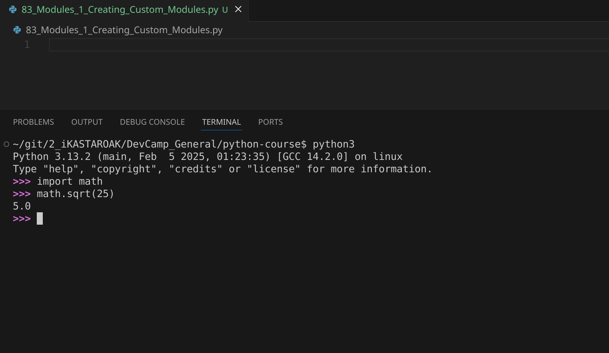
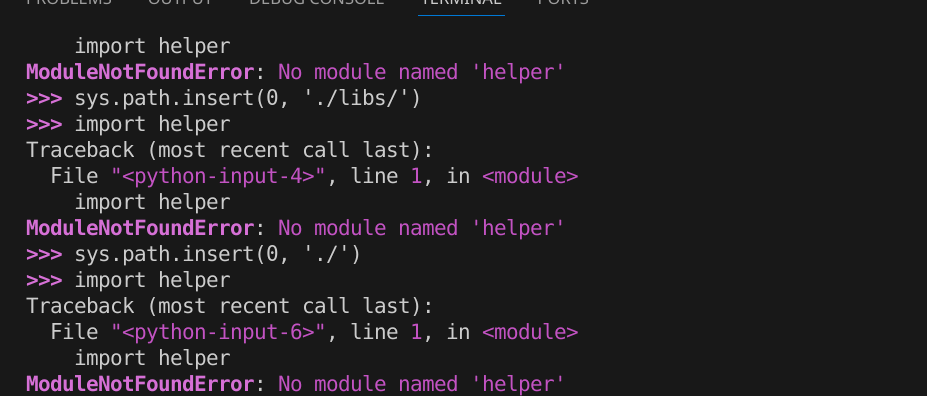
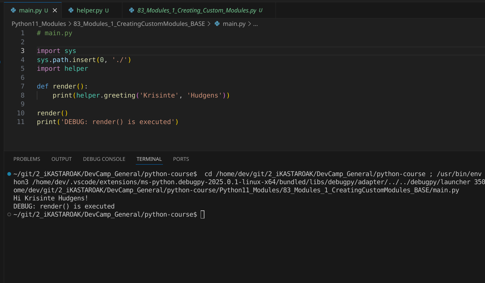

# MODULE 03 - 109: Python - Importing Custom Modules

In the previous guide, we explored how to work with built-in Python modules. Now, we will focus on **creating and importing custom modules**, allowing us to structure our programs more effectively.

There are two main use cases for importing custom modules:  
1️⃣ **Reusing code within the same project** (e.g., storing helper functions for data processing).  
2️⃣ **Organizing scripts in separate directories** while ensuring they remain accessible.  

🔗 **Reference:** [Python Modules](https://docs.python.org/3/tutorial/modules.html)

---

## 🔹 Importing a Custom Module in the Same Directory

### ✅ Example: Basic Module Import

Consider the following file structure:

```
project/
 ├── main.py
 ├── helper.py
```

#### 📌 Steps:

1️⃣ **Create a module (`helper.py`)**:  

- Define a function inside it.  
  2️⃣ **Import it into `main.py`** using `import helper`.  
  3️⃣ **Call functions from `helper.py`** inside `main.py` .  

### 🔍 How Python Handles Imports

- Python looks for `helper.py` **inside the current directory**.  
- If found, it loads the module and allows access to its functions.  

🔗 **Reference:** [Python Import System](https://docs.python.org/3/reference/import.html)

---

## 🔹 Importing Modules from Another Directory

Often, we organize projects by placing modules in a **separate directory** (e.g., `libs/`).

### ✅ Example: Importing from a Subdirectory

Updated file structure:

```
project/
 ├── main.py
 ├── libs/
 │   ├── helper.py
```

### 📌 Why Does `import helper` Fail Now?

- Python **only searches the current directory** and system-wide installed modules.
- Since `helper.py` is now inside `libs/`, we must **manually update Python’s search path**.

### 🛠 Solution: Using `sys.path`

We modify `sys.path` to **tell Python where to find our custom module**:

```
import sys
sys.path.insert(0, './libs')
import helper
```

🔍 **What Happens?**

- `sys.path.insert(0, './libs')` adds `libs/` to Python’s module search path.
- Now `import helper` works as expected.

🔗 **Reference:** [Python `sys.path`](https://docs.python.org/3/library/sys.html#sys.path)

---

## 📌 Summary

- **Custom modules** allow for code reuse and better project organization.
- Python **automatically finds modules in the current directory**.
- If modules are placed in **subdirectories**, we must **update `sys.path`** to include the new location.
- This technique enables structured, modular Python programs.

****

## Video Lesson Speech

In the last guide, we walked through how we could create our own custom module in Python and then import it directly into the REPL.   

There are going to be many times where you want to build out modules on your own system and then call them from the REPL. 

****

Imagine if you're a data scientist and you have a number of common preprocessing scripts that you want to run on data. You simply want to keep those on your system and be able to call them whenever you're working on programs in the REPL.  

That is a very common convention and a helpful tool.   

However, there is also another use case for importing, and that is when you're buildi ng out your own programs and you want to call one of your modules from another file.  

 That's what we're going to walk through in this guide. We're going to see how we can create a custom module, just like we have right here with our `helper.py` file and our `greeter` function.  



Then, we are going to create another file and import it directly. Later on in the guide, we're going to expand our knowledge and see how we can call our helper functions from outside of the current directory.  

We're going to cover all of that in this guide. Let's first go with the base case. What we're going to do is create a new file here.  

It's going to be called `main.py`. I'm going to save this file, and if I come and refresh the tree here on the left-hand side, you can see we have a `main.py` file.


Now, in order to import this, it's actually the exact same syntax that we used for the REPL. I can say `import helper`. What Python is going to do by default is look inside of the current directory for a `helper.py` file. Then, it's going to import that module and the functions inside of it. So, I'm going to import the helper and then create a function called `render`. It's not going to take any arguments, and from there, I'm simply going to print out `helper.greeting` and pass in the string. I'll say `'Tiffany'`, `'Hudgens'`, and that's all I need to do.

```python
# helper.py

def greeting(first, last):
 return f'Hi {first} {last}'

# main.py

import helper
def render():
 print(helper.greeting('Tiffany', 'Hudgens'))
```

I'm also going to call this `render` function so that it runs automatically whenever the `main` file is called.   

Now, if I open up the terminal right inside this directory—and that is very key—if you're running this script, make sure that you are inside of whatever directory both of these files are in.   

Then, run `python main.py`. If I run this, you can see that it works perfectly.


It went, grabbed the `helper` module, brought it into the `main` file, and then had access to the `greeting` function. So far, everything is looking really good.  

 Now, that is what happens whenever you want to import a helper module or any kind of module directly within the same directory.

However, many times you're going to want to keep all of your scripts in different 
directories.   When you want to do that, you have to add a few more steps.  

 I'm going to recreate that by creating a directory here called `libs`, and then I'm going to move our `helper` module into the `libs` directory. So, everything's going to be identical except now, if I come down and hit refresh, you can see that I have a `libs` directory, and that is where the `helper.py` file is located.


Now, if I go into `main` and don't make any changes and try to run this, you're going to see that we run into an error.   

If I run this, you can see it gives the error that inside of the `main.py` file on line 1 for `import helper`, the module was not found.



The reason for that goes directly to the default behavior of how 
Python imports modules. Whenever you're using this kind of syntax `import helper`,
 Python is going to look at the default set paths.   

It's going to look inside of the current directory and then also look for any third-party 
packages that you've imported because those, by default, get added to 
the Python import path.

Now, in order to have our own custom set of modules accessible, we're going to have to work with the system.   

We're going to add a couple more lines here. First, we're going to import the `sys` library.   

This is directly available to us inside of the Python language. Then, from here, we're going to add a new path.  

 We simply need to take our `libs` directory and add it to the path that Python looks for whenever it's looking for modules that it can import.

So here, I can say `sys.path.insert` and then pass in, first, the place where in the path I want this accessible. What `insert` is going to do is take the full list of paths that Python looks at and 
say, at the very first spot, I want you to insert this new path. This is
 only going to be set for this current file; it's not going to affect 
any other programs that you have on your system. The second argument is 
the path itself.

Now, if this file is located exactly where we have it, you can't simply call `libs`. Instead, we have to explicitly say `'./libs'`.
 What that's going to do is tell Python that I want you to look inside 
of the working directory where we're at and then look for a directory 
called `libs`. Then, it's going to insert that path. So, I'm 
going to save this file. Now, we're going to try to rerun this code. If I
 run this now, you can see that it is working properly.



So, congratulations! If you went through that, you now know how to create a custom Python module, call it from either the current directory that your other files are in, or even a directory somewhere else on your system entirely.

****

## Code

```python
# 03-109: Creating custom modules

# helper.py

def greeting(first, last):
    return f'Hi {first} {last}!'


# main.py 

import sys
sys.path.insert(0, './libs')
import helper

def render():
    print(helper.greeting('Krisinte', 'Hudgens'))
render()

```
