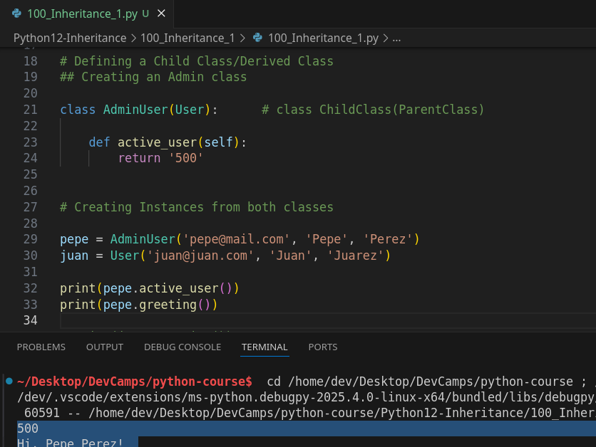

## MODULE 03 - 129: Python - Inheritance


**Inheritance** is a fundamental concept in **object-oriented programming (OOP)** that allows us to create **specialized versions of a class**. Instead of writing new classes from scratch,     we can build upon existing classes and **reuse attributes and methods**.

By the end of this guide, you'll understand:
✅ How inheritance allows us to define **parent (base) and child (derived) classes**.  
✅ How child classes **inherit attributes and methods** from parent classes.  
✅ How to **extend functionality** by adding new methods to a child class.

🔗 **Reference:** [Python Inheritance](https://docs.python.org/3/tutorial/classes.html#inheritance)

---

## 🔹 Defining a Base (Parent) Class

A **parent class** (also called a **base class**) provides general attributes and behaviors that other classes can **inherit**.

### ✅ Example: Creating a `User` Class

```python
class User:
    def __init__(self, email, first_name, last_name):
        self.email = email
        self.first_name = first_name
        self.last_name = last_name

    def greeting(self):
        return f'Hi {self.first_name} {self.last_name}'
```

📌 **What Happens?**

- The `User` class has **three attributes**: `email`, `first_name`, and `last_name`.
- It has **one method**: `greeting()`, which returns a formatted message.

🔗 **Reference:** [Python Class Syntax](https://docs.python.org/3/tutorial/classes.html#class-definition-syntax)

---

## 🔹 Creating a Child (Derived) Class

A **child class** inherits attributes and methods from a parent class. This allows us to create specialized versions of existing classes **without duplicating code**.

### ✅ Example: Defining an `AdminUser` Class that Inherits from `User`

```python
class AdminUser(User):
    def active_users(self):
        return '500'
```

📌 **Key Takeaways:**

- The `AdminUser` class **inherits** from `User`.
- It **automatically gets** all attributes (`email`, `first_name`, `last_name`) and methods (`greeting()`).
- We **add a new method** `active_users()`, exclusive to `AdminUser`.

🔗 **Reference:** [Python Inheritance](https://docs.python.org/3/tutorial/classes.html#inheritance)

---

## 🔹 Creating Instances of Both Classes

### ✅ Example: Instantiating Objects

```python
tiffany = AdminUser('tiffany@devcamp.com', 'Tiffany', 'Hudgens')
kristine = User('kristine@devcamp.com', 'Kristine', 'Hudgens')

print(tiffany.active_users())  # ✅ 500
print(tiffany.greeting())      # ✅ Hi Tiffany Hudgens

print(kristine.greeting())     # ✅ Hi Kristine Hudgens
print(kristine.active_users()) # ❌ ERROR (not defined in `User`)
```

📌 **What Happens?**

- `tiffany` (AdminUser) has access to **both inherited and new methods**.
- `kristine` (User) does **not** have access to `active_users()`, since it's only defined in `AdminUser`.

🔗 **Reference:** [Python Object Instantiation](https://docs.python.org/3/tutorial/classes.html#class-instances)

---

## 🔹 How Python Resolves Methods in Inheritance (Method Resolution Order - MRO)

When calling a method, Python follows this order:

1. 1️⃣ **Looks in the child class.**     

2. 2️⃣ **If not found, looks in the parent class.**   

3. 3️⃣ **If still not found, looks in higher-level parent classes** (if multiple inheritance is used).

📌 This is why `AdminUser` can call `greeting()`, even though it’s not explicitly defined in the `AdminUser` class—it **inherits it** from `User`.

🔗 **Reference:** [Python Method Resolution Order (MRO)](https://docs.python.org/3/tutorial/classes.html#multiple-inheritance)

---

## 🔹 Overriding Parent Methods in Child Classes

Sometimes, we want a child class to **change the behavior** of a method inherited from a parent class.

### ✅ Example: Overriding `greeting()`

```python
class AdminUser(User):
    def greeting(self):
        return f'Hello Admin {self.first_name} {self.last_name}'
```

📌 **What Changes?**

- `AdminUser` now **has its own version** of `greeting()`, replacing the parent’s method.
- If an `AdminUser` calls `greeting()`, Python uses **the overridden method**.

🔗 **Reference:** [Method Overriding in Python](https://docs.python.org/3/tutorial/classes.html#inheritance)

---

## 🔹 Extending Parent Methods Instead of Overriding

If we want to keep the original functionality while adding something new, we can use `super()`.

### ✅ Example: Extending a Method

```python
class AdminUser(User):
    def greeting(self):
        return f'{super().greeting()} (Admin Access Granted)'
```

📌 **Why Use `super()`?**

- Calls the **parent class’s `greeting()`** method.
- Allows us to **extend functionality instead of fully overriding it**.

🔗 **Reference:** [Python `super()` Function](https://docs.python.org/3/library/functions.html#super)

---

## 📌 Summary

- **Inheritance** allows creating specialized versions of a class while reusing existing code.
- **Child classes inherit all attributes and methods** from parent classes.
- **New methods can be added** in child classes.
- **Methods can be overridden** to customize behavior.
- **Use `super()`** to extend rather than replace parent methods.

By mastering **inheritance**, you can build **scalable, reusable, and efficient** object-oriented programs in Python! 🚀

****

## Video lesson Speech

One of the fundamental tenants of object-oriented programming in any 
language is the concept of inheritance. At a high level inheritance is 
the ability to create specialized versions of classes.

I think one of the best ways of understanding 
the way inheritance works if you've never used it before is with an 
example and so that's what we're going to walk through this guide. So 
I'm going to create a class of user and this is going to be a pretty 
standard user.

This is going to be an abstract user that simply has three 
attributes, so I'll say def double underscore init, pass in self, and 
then we're going to pass in an e-mail, first name, and then a last name.
 These are all standard attributes so you'd expect in a User class. From
 there you can create some instance attributes so we'll create one for 
email, one for first name, and then one for a last name and that's going
 to be all we really need to do for the attributes.

Now let's add some behavior and so we're going to go with a greeting 
so I'll say def greeting. It expects self as the only argument and then 
it's going to return a formatted string so format and say hi and pass in
 with string interpellation self.first_name and then self.last_name and 
that's all that we're going to need in this class.

```python
def greeting(self):
 return f'Hi {self.first_name} {self.last_name}'
```

But imagine that you're building out a full web application and you 
need to have the concept of admin users so admin users are going to be a
 specific type of user. And whenever you're trying to decide if you want
 to use inheritance you can always ask yourself is this new element that
 I'm wanting to build into the program is it a type of one of the other 
classes that I have? And in this case, an admin user is definitely a 
type of user. Our user is our abstract high-level type of class, it's a 
blueprint that has elements such as email, first name, and last name, 
and then it has a function built into it. This function is something 
that should be globally available to all users.

But let's create an admin class, so I'm gonna say class admin user 
and the way that you declare that one type a class inherits from another
 is right here in the top line where you say class you give the name of 
the class and then you pass in using parentheses the element so whatever
 class you want it to inherit from. So I'm gonna say class admin user 
inherits from user.

```python
class AdminUser(User):
```

And now I can create a custom function. So imagine that you want the 
admin users and admin users only to be able to know how many active 
users are on the site. I could say `def active_users` and it is going to just take in self and then for right now, we're just going to hard code a number in.

```python
class AdminUser(User):
 def active_users(self):
 return '500'
```

so that is how you create a basic class and then how you create a 
class that inherits from that. So now let's test this out I'm going to 
create a few instances, one is going to be of an admin user the other 
one's going to be a regular user.

I'm gonna say Tiffany admin user and she's going to need to have the 
same elements and same attributes that are inside the User class so 
she's going to have to have [Tiffany@devcamp.com](mailto:Tiffany@devcamp.com) and then she's going to have to have a first name and then a last name 
just like how you'd expect. And then I'm going to create another user 
called Kristine who's just going to be a regular user. So this one will 
be [Kristine@devcamp.com](mailto:Kristine@devcamp.com) and she'll have a first name and a last name.

So now let's actually use these new instances. So if I want to call 
print and then Tiffany and I'm going to call the instance right here 
from here I can print out and have access to that active users method. 
So I'm going to hit save here and let's run this code you can see it 
prints out five hundred now.



If I try to do the same thing with Kristine so if I have the user 
Kristine and I try to allow her to access that active users method I'm 
going to get an error. And it says AttributeError User object has no 
attribute active user.


So this is it doing exactly what we want. We've created a specialized
 class that has all of the attributes and all the behavior of the parent
 class. So Tiffany when we created it, it needed an email, a first name,
 and a last name. Now also if I come down here and I call the greeting 
function. So if I say greeting here for Tiffany even though Tiffany is 
an admin user and there is no greeting function inside of this class. If
 I run this again you'll see that it prints out the full greeting.

+in+Python/Introduction+to+Inheritance+in+Python+%23+1604/image13.png)

So it says Hi Tiffany Hudgens, and the reason why this is possible is
 because of inheritance. Whenever we use inheritance the way it works is
 that the child classes like AdminUser these specialized classes have 
access to all of the same attributes and behavior as the parent class. 
And then you can simply add on any specialized attributes or behavior 
into that child class the way we did right here with the admin user.

So in review, that is the basic introduction to how to work with inheritance in Python.

****

## Code

```python
# 03-129: Inheritance

# Defining a Parent Class/Base Class
## Creating a user class

class User:

    def __init__(self, email, first_name, last_name):
        self.email = email
        self.first_name = first_name
        self.last_name = last_name

    def greeting(self):

        return f'Hi, {self.first_name} {self.last_name}!'
        
# Defining a Child Class/Derived Class
## Creating an Admin class

class AdminUser(User):      # class ChildClass(ParentClass)

    def active_user(self):
        return '500'
    

# Creating Instances from both classes

pepe = AdminUser('pepe@mail.com', 'Pepe', 'Perez')
juan = User('juan@juan.com', 'Juan', 'Juarez')

print(pepe.active_user())
print(pepe.greeting())

print(juan.greeting())
# print(juan.active_user())     # Cannot be called, error active_user for juan is not defined


```
