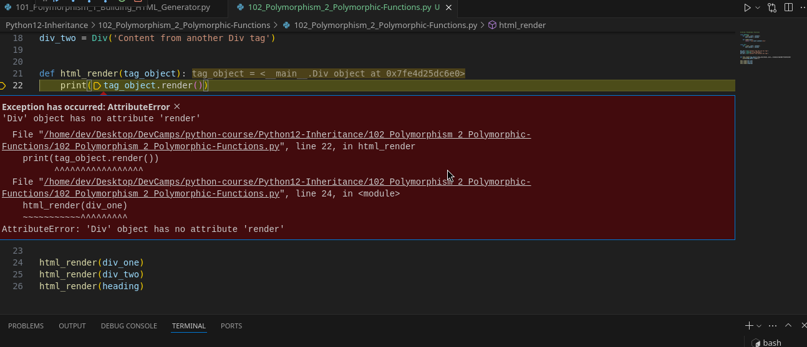

# MODULE 03 - 131: Python - Polymorphic Functions

In the previous guide, we explored **class-based polymorphism**, where different child classes inherited a shared interface from an abstract parent class. However, **Python offers another approach**—function-based polymorphism.

Instead of enforcing structure through **inheritance**, we can design functions that work with **any object type**, as long as it follows a common interface (i.e., implements a specific method like `render()`).

This guide will cover:  

* ✅ How to implement polymorphism **without inheritance**.  

* ✅ When to use function-based vs. class-based polymorphism.  

* ✅ Best practices for writing flexible, reusable code.

🔗 **Reference:** [Python Polymorphism](https://docs.python.org/3/tutorial/classes.html#inheritance)

---

## 🔹 Moving Away from Inheritance

Previously, we enforced structure using **abstract base classes (ABC)**, requiring child classes to implement a `render()` method. While this ensures consistency, it also adds **boilerplate code** and complexity.

📌 **What if we don’t need inheritance?**

- If our classes **only share a single behavior** (like `render()`), we don’t need a base class.
- Instead, we can use **function-based polymorphism**, which focuses on behavior rather than structure.

🔗 **Reference:** [Python Duck Typing](https://docs.python.org/3/glossary.html#term-duck-typing)

---

## 🔹 Implementing Standalone Classes

Instead of using an abstract class, we define **independent classes**, each with a `render()` method.

### ✅ Example: Creating `Heading`, `P`, and `Div` Classes

```python
class Heading:
    def __init__(self, content):
        self.content = content

    def render(self):
        return f'<h1>{self.content}</h1>'

class P:
    def __init__(self, content):
        self.content = content

    def render(self):
        return f'<p>{self.content}</p>'

class Div:
    def __init__(self, *content):
        self.content = content

    def render(self):
        div_content = ''.join(
            [div_item.render() if hasattr(div_item, 'render') else str(div_item) for div_item in self.content]
        )
        return f'<div>{div_content}</div>'
```

📌 **Key Takeaways:**

- **No inheritance** → Each class is standalone but follows a common pattern (`render()`).
- `Div` can hold multiple elements and **calls `render()` on each child element**.

🔗 **Reference:** [Python `hasattr()`](https://docs.python.org/3/library/functions.html#hasattr)

---

## 🔹 Writing a Polymorphic Function

Instead of checking types manually, we create a function that assumes all objects have a `render()` method.

### ✅ Example: Function-Based Polymorphism

```python
def html_render(tag_object):
    print(tag_object.render())
```

📌 **Why This Works:**

- The function does **not care** whether the object is `Heading`, `P`, or `Div`.
- It **assumes** that any object passed to it **implements `render()`**.
- This is known as **duck typing**—"If it looks like a duck and quacks like a duck, it's a duck."

🔗 **Reference:** [Python Duck Typing](https://realpython.com/python-type-checking/#duck-typing)

---

## 🔹 Using the Function with Different Objects

### ✅ Example: Rendering HTML Elements

```python
heading = Heading('A big Heading')
div_one = Div(Heading('Another heading but div-tagged'))
div_two = Div(P('Content from another Div tag'))

html_render(heading)
html_render(div_one)
html_render(div_two)
```

📌 **What Happens?**

- `html_render(heading)` → Calls `Heading.render()`, returning an `<h1>` tag.
- `html_render(div_one)` → Calls `Div.render()`, processing a `Heading` inside it.
- `html_render(div_two)` → Calls `Div.render()`, processing a `<p>` tag inside it.

This **flexibility** allows us to treat **different objects interchangeably**, as long as they implement `render()`.

🔗 **Reference:** [Python Functions as First-Class Citizens](https://docs.python.org/3/tutorial/controlflow.html#defining-functions)

---

## 🔹 Function-Based vs. Class-Based Polymorphism

| Approach                        | Advantages                                      | When to Use                                      |
| ------------------------------- | ----------------------------------------------- | ------------------------------------------------ |
| **Class-Based Polymorphism**    | Ensures structure via **abstract base classes** | When many methods are shared across subclasses.  |
| **Function-Based Polymorphism** | Less boilerplate, more flexible                 | When **only one behavior** needs to be enforced. |

📌 **Rule of Thumb:**

- **Use inheritance** when many behaviors must be shared across classes.
- **Use function-based polymorphism** when enforcing just **one method**.

🔗 **Reference:** [Python Abstract Base Classes](https://docs.python.org/3/library/abc.html)

---

## 📌 Summary

- **Polymorphic functions** allow different objects to be processed **without inheritance**.
- **Duck typing** assumes objects implement a required method instead of checking their type.
- **Function-based polymorphism** works best when **only one shared behavior** is needed.
- **Class-based polymorphism** is better for complex cases with multiple shared methods.

---

## Video lesson Speech

In the last guide, we walk through how we could leverage polymorphism in
 a python program to generate HTML. And that is going to be a common way
 that you implement inheritance and polymorphism.

****

But Python also gives us another option, so right here we were able to create an abstract class and then have a few classes that inherited from it.   

But if you do not want to follow this type of pattern we also have another way of doing this and we're going to leverage functions in order to make it possible.

So I'm going to start off by just rearranging things a little bit.   
I'm going to get rid of this abstract class at the top and then I'm
going to instead copy this init function into both of our classes.   

We're going to have a heading class and a div class and these are going to be
 standalone classes.  

 So, in this case, we are not going to have them inherit from anything and they're simply going to be their own classes.  

And then we're going to get rid of all this boilerplate for the 
abstract class.   

So here we have a heading, it takes in content and then we have a div that takes in content and I'm also going to keep the render functions here the same.

Now the next step is instead of creating this set of tags instead what I'm going to do is I'm just going to show you a little bit of a different approach.   

We could keep this but I want to show you that it's possible to do it in a different way. Now what I'm going to do is I'm going to store these each in their own variables. 

 So let me move these over to the left and here I'll say div_one and then here I'll say 
heading and then here I'll say div_two.

Now what I'm going to do is I'm going to create a function and this is going to be where the polymorphism occurs.  

 So I'm going to create a function here called html_render. And it is going to take a tag object and so this tag object is going to be a div it's going to be a heading or another div it's going to be anything that has a render function that's going to be the only requirement.

And so now what I can do is I can say print and I also could return but for right now to make it easier I'm just going to say `print(tag_object.render())`.  

 So I'm calling the render function and that is it.   

So now all I have to do to get this behavior is I can say `html_render(div_one)` and then we can also do this with div_two and the heading.   

So I'll say div_two and the heading. And now if I come and I run this code it looks like I've got a little bit of an error.



It says tuple object has no attribute of render.   

It's because if you notice the little error message where it says tuple you may have 
noticed we didn't create a tuple but if you're member that if you place a comma at the end of anything like this python is going to assume you're creating a tuple out of it, so that was the reason why it gave that error.

Let me save this and let's run it one more time. And there you go, it is working perfectly.

+in+Python/Building+Polymorphic+Functions+in+Python+%23+1606/image12.png)

### Explanation

- **`html_render(div_one)`**: The `div_one` object is an instance of the `Div` class. Its `render` method returns a `<div>` tag containing the string representation of a `Heading` object, which is `<h1>Another heading but div-tagged</h1>`.

- **`html_render(div_two)`**: The `div_two` object is also an instance of the `Div` class. Its `render` method returns a `<div>` tag containing the string representation of a `P` object, which is `<p>Content from another Div tag</p>`.

- **`html_render(heading)`**: The `heading` object is an instance of the `Heading` class. Its `render` method returns a `<h1>` tag containing the content "A big Heading".

### Polymorphism in Action

The key point here is that the `html_render` function doesn't need to know the specific type of the object it's dealing with.   

As long as the object has a `render` method, `html_render` can call it and print the result.   

This is polymorphism in action—different classes (`Heading`, `P`, `Div`) can be used interchangeably because they all implement a common interface (the `render` method).

****

So we were able to create the exact same behavior that we had before 
but instead of having an abstract class we were able to create this HTML
 render function and so this is very different from an implementation 
side even though the behavior is identical.

And so the very first question that you may be asking yourself is 
when to use one over the other? And what my rule of thumb would be is if
 you have quite a bit of shared behavior so if your HTML class had say a
 half dozen functions inside of it, that each one of the inherited 
classes like a div or heading would need then that would be one time 
where you'd want to use inheritance.

If on the other hand you don't really have a lot of shared behavior 
but you simply want to be able to call the same function just like we 
have right here where you want to make sure that each one of these 
classes has a render function that you can call it then being able to 
use polymorphism with a function-based approach is a great way of doing 
it. As you see we were actually able to cut out a decent amount of 
boilerplate code and were still able to replicate the exact same 
behavior.

And so this is something that you will see quite a bit and it's 
whenever you want the ability to treat objects in a very similar manner.
 Notice how our html_render function didn't have to know what kind of a 
class that it was dealing with. It didn't care if it was working with a 
div or a heading or anything like that. If we had 20 other kinds of 
classes that each had a render function that is all that mattered. We 
could have called this htmo_render function on any of those and all it 
needed to know was that it was going to be passed an object and that 
object was going to be able to have render called on it.

****

## Code

```python
# 03-131: Polymorphic Functions

class Heading:
    def __init__(self, content):
        self.content = content

    def render(self):
        return f'<h1>{self.content}</h1>'

class P:
    def __init__(self, content):
        self.content = content

    def render(self):
        return f'<p>{self.content}</p>'

class Div:
    def __init__(self, *content):
        self.content = content

    def render(self):
        div_content = ''.join(
            [div_item.render() if hasattr(div_item, 'render') else str(div_item) for div_item in self.content]
            )

        return f'<div>{div_content}</div>'


heading = Heading('A big Heading')
div_one = Div(Heading('Another heading but div-tagged'))
div_two = Div(P('Content from another Div tag'))

def html_render(tag_object):
    print(tag_object.render())

html_render(heading)
html_render(div_one)
html_render(div_two)
```
