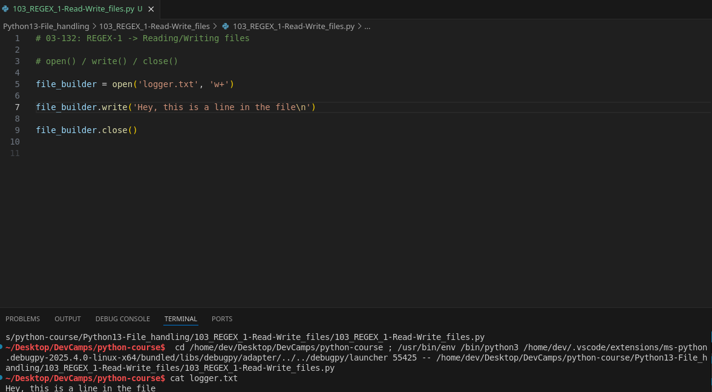
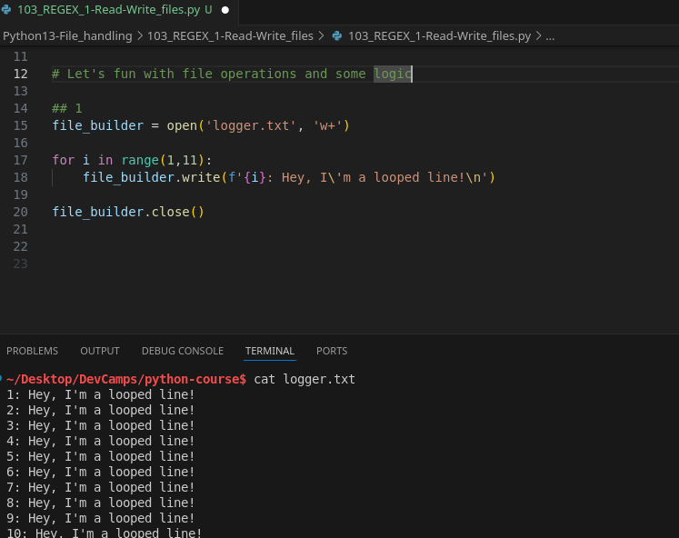
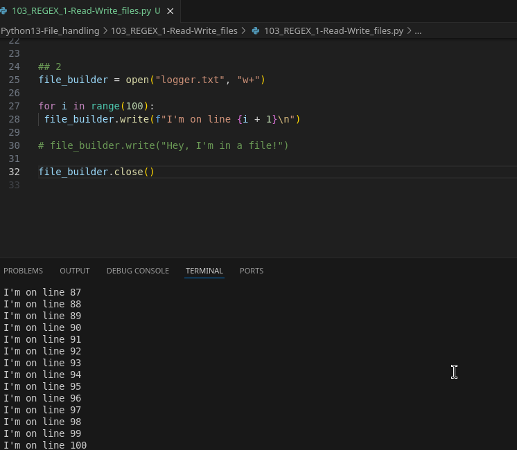

# MODULE 03 - 132: Python - REGEX 1: Handling server files

Working with the **file system in Python** is a fundamental skill, especially for tasks like logging, data storage, and automation.

In this guide, we will:
✅ Learn how to **create and write** to files.  
✅ Understand **how file modes (`w+`) affect file content**.  
✅ Implement a **basic logging system**.  
✅ Discuss **important considerations** when working with files.

🔗 **Reference:** [Python File Handling](https://docs.python.org/3/tutorial/inputoutput.html#reading-and-writing-files)

---

## 🔹 Creating and Writing to a File

Python provides the built-in `open()` function, which allows us to **create, read, and modify** files.

### ✅ Example: Creating and Writing to `logger.txt`

```python
file_builder = open("logger.txt", "w+")
file_builder.write("Hey, I'm in a file!")
file_builder.close()
```

📌 **Key Takeaways:**

- `open("logger.txt", "w+")` creates a file if it doesn’t exist.
- **If the file exists, it will be overwritten**.
- Always call `close()` to ensure the file is properly saved.

🔗 **Reference:** [Python `open()` Function](https://docs.python.org/3/library/functions.html#open)

---

## 🔹 Automating File Writing with a Loop

Instead of writing a single line, let’s create **multiple log entries dynamically**.

### ✅ Example: Writing Multiple Lines

```python
file_builder = open("logger.txt", "w+")

for i in range(1, 11):
    file_builder.write(f"{i}: Hey, I'm a looped line!\n")

file_builder.close()
```

📌 **What Happens?**

- A loop writes **10 lines** dynamically.
- `\n` ensures **each entry appears on a new line**.

🔗 **Reference:** [Python String Formatting](https://docs.python.org/3/library/stdtypes.html#str.format)

---

## 🔹 Handling Larger Log Files

If we need a **larger log file**, we can increase the loop range.

### ✅ Appending more content without losing the previous

```python
file_builder = open("logger.txt", "a+")

for i in range(100):
    file_builder.write(f"I'm on line {i + 1}\n")

file_builder.close()
```

📌 **Important Consideration:**

- Every time this script runs, it **overwrites** the existing `logger.txt`.
- To append new data instead of replacing it, use **append mode (`a+`)** (covered in the next guide).

🔗 **Reference:** [Python File Modes](https://docs.python.org/3/tutorial/inputoutput.html#methods-of-file-objects)

---

## 🔹 Understanding File Overwriting

One of the most important lessons from this guide:

> **Using `w+` mode will overwrite existing file contents.**

If your script runs twice, all previous data is **erased**. This is useful for **temporary logs** but can be problematic for persistent data.

📌 **How to Prevent Overwriting?**

- Use **append mode (`a+`)** to add data instead of replacing it.
- Check if the file exists **before writing**.

🔗 **Reference:** [Python `os.path.exists()`](https://docs.python.org/3/library/os.path.html#os.path.exists)

---

## 📌 Summary

- **`open("file.txt", "w+")` creates or overwrites a file**.
- **Use `write()`** to add content to a file.
- **Loops automate** file writing for multiple lines.
- **Beware:** `w+` mode **replaces existing content**.
- In the next guide, we will learn how to **append** to a file instead of overwriting it.

---

## Video lesson Speech

In this section of the course, we're going to start working with the 
file system in Python. So we're going to start off with the basics.

****

I want to walk through a practical example.   

A very common use case for working with the files system is to log values.

What we're going to do is we're going to build a small program here that is going to be able to create a logger. We're gonna see how we can create a file, and then add it to it.

Then we're also going to walk through a few potential issues that you may run into. Let's start off. I have a file here called `file builder`,
 and I'm going to create a variable here where I'm going to open up a 
file. I'm going to show you here in the console that if I type `ls`, you can see we do not have a file called `logger`.

That is what we are going to be creating. Let's create this variable. It's going to be `file_builder`, and then I'm going to call the function `open`. `open` is a function built into the Python core language, and it is going to allow us to open or create a file.

Now one thing that I want to point out is that the function name here might be a little bit confusing. The word `open` kind of makes you assume that it is opening up a preexisting file; however, the way that Python works is if you call `open`, if it finds a file then it will open up that file.

Then you can perform whatever you need to inside of it. If it does 
not find a file with that name, then it will automatically create it. So
 I'm going to call `open` here and pass in the name of the file. So I can say:

```python
file_builder = open("logger.txt",
```

This is just going to be a regular text file, and it takes another 
argument which is the way that we want to open it up. This is the set of
 permissions that we want our program to follow. It takes in a string 
and I'm gonna say:

```python
file_builder = open("logger.txt", "w+")
```

This allows us to write to this file, and then we close off the 
parens. That is going to then open up that file. Now the very first 
thing I want to do is just show you how to add content dynamically into 
the file. I can say `file_builder.write`. So `write` is a function inside of the file library in Python and then inside of it I'm just going to say:

```python
file_builder = open("logger.txt", "w+")
file_builder.write("Hey, I'm in a file!")
```

Let's just make sure that this is working. Now after you have written
 a file, and you've called that write function, you need to close the 
file off. So I'm going to say `file_builder.close()` and then we're going to call the `close` function.

```python
file_builder = open("logger.txt", "w+")
file_builder.write("Hey, I'm in a file!")
file_builder.close()
```

It's not going to take any arguments. It simply is going to say this 
file has been opened, it was written, and now we're closing it off. 
Nothing thing else is going to be added to that. If I run this code, I'm
 going to say `python file_guide.py`, and hit return. We don't get any errors.

Now if you type `ls`, you can see that we have a `logger` file. Let's open it up, and you can see that our text `"Hey, I'm in a file"` has been added to that. That is working nicely.



Now let's take something that's a little bit more practical. I'm 
going to just comment this out for us so that you can have it in the 
show notes. Now let's build an actual logging system. This is going to 
be a little bit more practical for how you typically use this. So I'm 
going to say:

```python
## Let's fun with file operations and some logic

file_builder = open('logger.txt', 'w+')

for i in range(1,11):
    file_builder.write(f'{i}: Hey, I\'m a looped line!\n')

file_builder.close()
```

/)

Then inside of this `for-in-loop`, what I want to do is I want to call the same exact process. I can say:

```python
file_builder = open("logger.txt", "w+")

for i in range(100):
 file_builder.write()

# file_builder.write("Hey, I'm in a file!")

file_builder.close()
```

In a formatted string, I'm going to say `"I am on line"`, and then using the string literal interpolation I'll say `{i + 1}`. The reason why I'm adding one is because I want to increment it, and I do not want it to start at `0`. When you called range it would start at zero, so I actually want to just start on one.

So you are going to say `I'm on line` and then it's going 
to give that dynamic line number. Then I want to add a carriage return. 
The way you can do that is right after the curly braces pass in `\n`, and then close off the formatted string, close off the file builder right function, and hit save.

```python
file_builder = open("logger.txt", "w+")

for i in range(100):
 file_builder.write(f"I'm on line {i + 1}\n")

# file_builder.write("Hey, I'm in a file!")

file_builder.close()
```

Now if I come over here, and I run that same command of `python file_guide.py`, it runs right away. Let's take a look at that `logger` now. Now you can see that it went and built that entire program.



If you come all the way down to the bottom. You can see it as `I'm on line 100`.
 On every one of these lines, it gives the line number actually lists it
 out. That is how you can have your dynamic numbers. Now, one thing you 
may have noticed where originally we said `Hey, I'm in a file`, that has been overwritten.

Whenever you use this kind of syntax where you are opening a file and
 then you're just calling right on it, it is not going to care 
whatsoever about the contents of the file previously.

This is what you would do if you want to have almost like a temp type
 of logger. You only want to have these files available and the data 
inside them available in a temporary fashion.

In the next guide, we're going to walk through how we can append to a file. Say that we wanted to come here and instead of `100`, we want to change this to `1000`. Then we can run this again.

```python
file_builder = open("logger.txt", "w+")

for i in range(1000):
 file_builder.write(f"I'm on line {i + 1}\n")

# file_builder.write("Hey, I'm in a file!")

file_builder.close()
```

You can see how fast it is. It works very quickly. Now if we take a 
look, you can see even though it has these numbers, it'll have 1 to 100 
and that looks the same, these are actually written completely from 
scratch.

One of the elements I want you to truly remember from this guide is 
that if you use this syntax, where you're opening a file and you're 
simply calling right you will overwrite all of the content in that file.
 If I go all the way to the bottom you can see it goes all the way down 
to line number `1000`.

So in review, that is the basic introduction for how you can create and then add content to a file in Python.

****

## Code

```python
# 03-132: REGEX-1 -> Reading/Writing files

# open() / write() / close()

file_builder = open('logger.txt', 'w+')

file_builder.write('Hey, this is a line in the file\n')

file_builder.close()


# Let's fun with file operations and some logic

## 1
file_builder = open('logger.txt', 'w+')

for i in range(1,11):
    file_builder.write(f'{i}: Hey, I\'m a looped line!\n')

file_builder.close()


## 2
file_builder = open("logger.txt", "w+")

for i in range(100):
 file_builder.write(f"I'm on line {i + 1}\n")

# file_builder.write("Hey, I'm in a file!")

file_builder.close()

"""
## Handling files with os

import os

new_folder = os.mkdir('new_subfolder')

list_folder = os.listdir()

change_back_dir = os.chdir('..')
# change_last_dir = os.chdir('-')

file_mv = os.rename('old_file', 'new_file')

remove_file = os.remove('logger.txt')

remove_folder = os.rmdir('new_subfolder')

folder_to_check = 'new_subfolder'
does_the_folder_exist = os.path.exists(folder_to_check)

if does_the_folder_exist is True:
    print('it exists!')
else:
    print('It does not exist') 

get_info_from_file = os.stat('test_file.md')
"""
```
