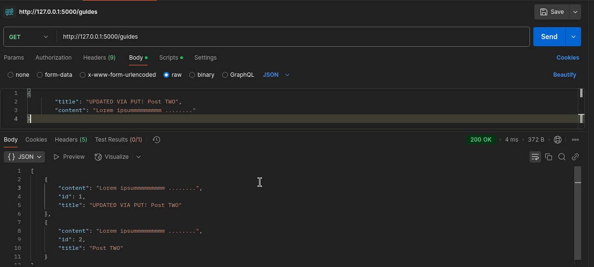

# MODULE 03 - 143: Python - Flask (7)

## Building an Update Action with a PUT Request in Flask

****

# Notice:

As we are using VSCode instead of Repl, and ultimately, we are breaking down the original "hello-flask" project into the Python 14 - API section, many modifications have to be donde.

Therefore, it’s essential to complete each app.py according to the corresponding Python-Course NumFolder.

This PUT data guide will use:  `app_113.py` .

### ALSO, QUERY() method HAS BEEN DEPRECATED FROM NEWER SQLAlchemy Versions, so, there is a Code Update:

To replace Repl with VSCode, you can run the following commands in the terminal:    

```bash
(pipenv) $: python
>>> from app_113 import db, app

>>> with app.app_context():
    db.create_all()
```

Alternatively, you can create a runner script, such as `run.py`:

```
# runner

from app_113 import db, app

with app.app_context():
    db.create_all()
```

Then, you can load it by pressing **F5** to start debugging in VSCode.

So, the setup steps will be:

1. Run `run.py`.
2. Run `app.py`.
3. Perform actions in the Postman app.

### ALSO, QUERY() method HAS BEEN DEPRECATED FROM NEWER SQLAlchemy Versions, so, there is a Code Update:

```python
##################
# from app_109
# Setting up var environment and class'es
basedir = os.path.abspath(os.path.dirname(__file__))
app.config['SQLALCHEMY_DATABASE_URI'] = 'sqlite:///' + os.path.join(basedir, 'app.sqlite')
db = SQLAlchemy(app)
ma = Marshmallow(app)

class Guide(db.Model):

    id = db.Column(db.Integer, primary_key=True)
    title = db.Column(db.String(100), unique=False)
    content = db.Column(db.String(144), unique=False)

    def __init__(self, title, content):
        self.title = title
        self.content = content


class GuideSchema(ma.Schema):
    class Meta:
        fields = ('id', 'title', 'content')


guide_schema = GuideSchema()
guides_schema = GuideSchema(many=True)


#######################
# from app_110
## NEW POST endpoint
@app.route('/guide', methods=["POST"])
def add_guide():

    db.create_all()

    title = request.json['title']
    content = request.json['content']

    new_guide = Guide(title=title, content=content)

    db.session.add(new_guide)
    db.session.commit()

    return guide_schema.jsonify(new_guide)


##################
# from app_111
# NEW GET endpoint
@app.route("/guides", methods=["GET"])
def get_guides():

    db.create_all()

    all_guides = Guide.query.all()
    result = guides_schema.dump(all_guides)

    return jsonify(result)


##################
# from app_112
# NEW GET/<id> single data endpoint
@app.route('/guide/<id>', methods=['GET'])
def get_guide(id):

    db.create_all()

    session = Session(db.engine)
    guide = session.get(Guide, id)

    return guide_schema.jsonify(guide)
```

---

## Video lesson Speech

Great job in working through the course. So far we've created a number 
of endpoints and we only have two left before we're done with this 
project.

****

I really want to focus on one thing because I know we've covered a lot of different topics starting at the beginning from importing modules to creating databases to creating a schema and then implementing each one of these endpoints. 

One thing that I really want to reiterate, because I know that whenever, if this is new to you and you've never built out an application like this before, it might be kind of intimidating. But what I want you to really focus on is, if you're familiar with python, every one of the things that we've talked about is just basic python code, so I don't want you to be intimidated by these concepts. 

If you think about it each one of these can be broken down into a small easy to manage kind of component. And so that's what my goal for this particular project is is that even though this may look a little intimidating, don't worry. 

that's the reason why we go through the screencasts, so that one, you will learn it at a high level, but also so that you'll have a reference point later on. you'll be able to know the syntax for using a decorator like we have here and how that passes in data to these functions and those functions are just normal python code like right here creating a variable.

That's something that we did on the very first day of the Python course, then returning a value and calling at different functions like we have here. So I know it's a lot of different types of behavior than we've done before but at the end of the day, it's just python code. so any time that you get a little intimidated by it do not worry, just really try to focus on breaking it down into python code because the more that you do that the more it's going to start to make sense. 

So now with all that being said let's move on to our next endpoint. This is going to be where we update or edit the guide. Let's add that in under our last endpoint.

**app.py**

```py
##################
# from app_113
## NEW PUT endpoint
@app.route('/guide/<id>', methods=['PUT'])
def guide_update(id):
```

Now the difference is going to be in the methods. We're putting in a PUT request, and if our system recognizes a request being sent by Postman, or by the API, or by the front-end that is communicating with, it then it is going to know to contact this endpoint as opposed to our other endpoints. 

And that is a very important thing to understand when it comes to working with APIs, because you may wonder how in the world does this application know when to get routed to one route versus another. Especially right here the routes are identical but what's different is, if you switch to Postman, whenever you send a different verb our flask application is going to listen for that verb that gets sent. That's why it's so important if you send a get request versus a post versus a put. 

Those are all going to trigger different actions and our application is looking for those actions so hopefully, that part makes a little more sense on why you are on how the system will recognize two identical paths and two identical endpoints but have different behavior based on the method that gets used. 

So now that we have that let's go and let's create the update action. 

**app.py**

```py
##################
# from app_113
## NEW PUT endpoint
@app.route('/guide/<id>', methods=['PUT'])
def guide_update(id):

    db.create_all()

    guide = Guide.query.get(id)

    guide.title = request.json['title']
    guide.content = request.json['content']
```

So the reason why we're doing this is because if we're editing the guide then we are assuming that they're sending a different title and a different content here for editing purposes. Now in a full-scale application once we get into a much more complex app I'll show you how you can be a little bit more efficient because right now this is kind of taking a naive approach, where it assumes that we're always going to be sending a title and a content. 

But imagine a scenario where we're only sending in, say, a new content element not a title. This would set the title in the database equal to the empty string so we wouldn't want that. But for right now we're not to worry about it. We'll be concerned about that later on when we get into a more advanced kind of project. 

So right now just know we're performing a database query for the guide, and we are taking in the title and the content from that API request, and now what we want to do is we want to set the guide's title and the guide's content. So we're going to take that guide we got from the database and zoning as a guide title and then set that equal to title and then I do the same thing for the content.

**app.py**

```py
##################
# from app_113
## NEW PUT endpoint
@app.route('/guide/<id>', methods=['PUT'])
def guide_update(id):

    db.create_all()

    guide = Guide.query.get(id)

    guide.title = request.json['title']
    guide.content = request.json['content']

    db.session.commit()
    return guide_schema.jsonify(guide)
```

OK. I believe everything there is working so we're about to find out. We'll test it out. `python app.py` and let's come here to our Postman, and so now we're going to perform a very similar request except Let's change this to PUT and then set it to `localhost:5000/guide/1`, and we're going to change our title to say `Updated First Guide Title`. OK. So what we should expect here is that it should go in the database and it should save the guide with an ID 1 an update its title to be this. 

So let's hit send and OK that looked like it worked.


And we also have `Updated First Guide Title`. So that looks like it's all working let's test it out. Let's go back to our index actions as a get and let's just say get guides, just bring back all of them. So now if I hit send and yes that's working. 



The first one that was returned is `Updated First Guide Title`. So what that means is that our update action is working and we now have the ability to edit our guides via API requests. 

****

## Source Code

- [Code at this stage](https://github.com/bottega-code-school/hello-flask/tree/49437b139cf958b5c47e60f1dabacdc7b4616021)
