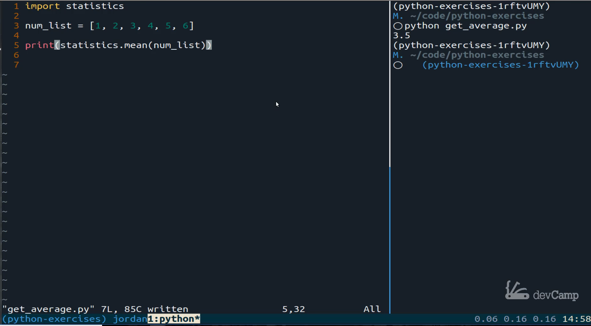
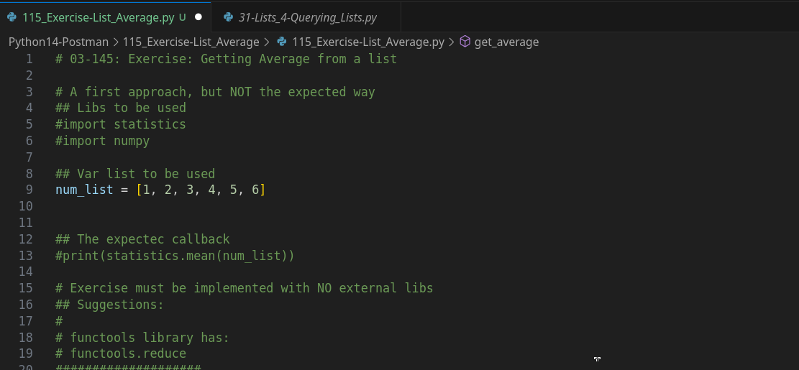
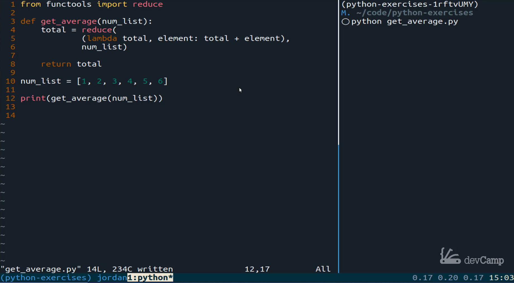
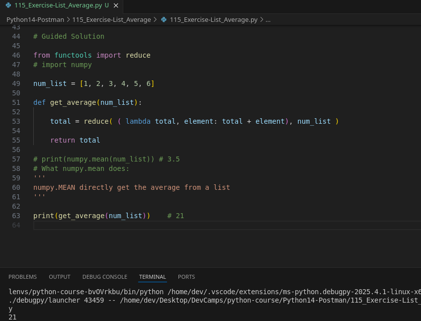
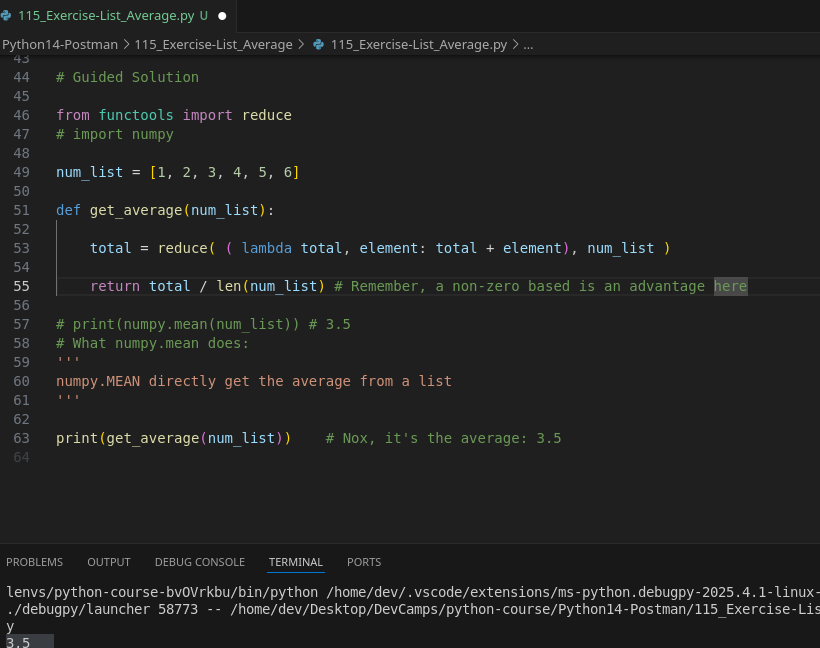

# MODULE 03 - 145: Python - Exercise

## Get the Average from a List in Python

****

## Video Lesson Speech:

In this python coding exercise we are going to build out a function that can get an average from a list.

****

 In this python coding exercise, we are going to build out a function that can get an average from a list.   

What I mean by that is if I have a list like this I could say I have a list and inside of the list I have the numbers one through six.  

 What I want to be able to do is to pass that number list into our function and then have it return the average which in this case is three point five. 


Now there are many ways to do this! One caveat and I'm going to tell you is I do not want you to use any library for this specific exercise. Now in a production application then you typically are going to use the library because they have been worked on by developers for years and they catch all of the various edge cases, and they're typically very good from a performance perspective. For the sake of this exercise, I want you to build this out from scratch. 

Now if you've never seen any of the average functions, there are a few libraries that specialize in them. So before we go into that exercise it will show you those. If you wanted to get a very thorough kind of average or mean, then I would use the statistics library which is built directly into python. I believe starting at around Python 3.3 and so with that what you could do is you can say `print(statistics.mean(num_list)` and then pass in that number list. 



That should return 3.5 for you if I run python get average you can see that is correct and that returns 3.5. 

Now if you wanted to use another library, so statistics is good, but it is a very thorough and therefore it's not as performance as  NumPys libraries. If you have Numpy installed on your system it also has a mean function.  You could implement it just like this. Run it, and that works, and because this is such a small list you're not going to notice the difference in performance.


 Those are the two that I use the most often. So that is the behavior we're looking for, but I don't want you to use any specific library like that. One thing I will say is you can bring in the "funk tools library of reduce," and I've talked about "reduce" in a number of my guides. If you haven't seen any of those, then you can go and reference that. I'm not going to go into a ton of detail on it right now, but in a solution, I'll walk through it. You need to know that the funk tools library has a function called reduce. That is going to be able, to sum up, values from a list. If you remember your early math days, you know that to get the mean what you need is the sum of the values divided by the total number of elements. That's how you're going to get that mean or that average back.



Right now pause the video go out build your solution and then when you come back you can see how I built it. I hope you had a good time building out that solution. I am now going to build out my version of that. 

****

# ## Code 1st Attempt:

```python
####################
# 1st Attempt
# 
# Resources read:
# https://www.geeksforgeeks.org/reduce-in-python/
from functools import reduce

num_list = [1, 2, 3, 4, 5, 6]

def get_average(num_list):

    total = reduce(
        lambda x, y: x + y, num_list
    )

    total_elements = int(len(num_list))

    average = total / total_elements

    return average

print(get_average(num_list))
```


****

I'm going to get rid of these comments here and I'm going to say from funk tools import reduce.   

Now I'm going to build out our "get average" and I am going to say `def get average` and this expects a list of numbers. I'm going to call it num_list and just, so you're aware there is no reason why this has to be named the same as the variable name that we have here.   

I think it is a descriptive name. That is the reason why I'm using it, and now we're going to first get our total, and that's what we're going to use that reduce function for.   

I'll say total set equal to reduce, and I'm going to stretch this into a few different lines because many times when I use reduce I have it all on one line. But because I have the text editor who zoomed in it makes some weird and indentation.  

 I'm going to simply move this down to this line, and I'm going to separate the arguments because if you remember when you went through the reduced documentation that reduce takes two arguments.   

The first is a function, and it's going to be a lambda function where we tell reduce what we want it to do. In this case, we want it to add up numbers.   

I'm going to say LAMDA and give the arguments which are going to be total and then element. This is what's going to be passed into reduce, and then I want the total to be added to the element. 


If you are a little rusty on the reduced documentation what that means is when this starts it's going to set the total equal to the first element of one.   

Then it's going to keep track of one, so it's going to keep that in the total variable.  

 It's going to go with the next element here and It's going to add the element plus the total.   

So at this stage, the total is now going to be set 3. Then it's going to make its way here. It's going to have the total equal to 3.   

That element is going to be equal to 3, and then it's going to add those together which will be six and then go on to each one of the elements like that.   

That's the first argument which is that function. The next argument is the list we want it to go over, in this case, it is that `num_list`.   

Now let's make sure that what we have up to this point is working.   

This is not going to return the average, but it will return the total as long as I don't have any kind of typos or anything like that.   

So let's get rid of this numpy and call "get average". 



Let's run this again and there we go our total is 21. 



Everything is working with our reduce function. Now all will we need to do is take that total and say return the total divided by the length of that number list. That's all we need to do. 


One thing to note if you're coming from a language such as a ruby at this stage in the ruby code you'd need to convert the length of the number list into a float to get a decimal value. Python does that for us automatically, so we don't have to do that. We should get 3.5, and now I'm running that, and we do.  



Everything there is working correctly. Great job if you went through that you now know how to create an averaging function inside a python.

****

## Resources

- [Exercise Code](https://github.com/jordanhudgens/python-exercises/blob/master/data-structures/get_average.py)
