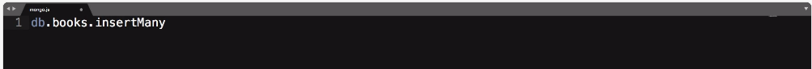
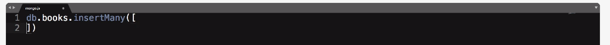
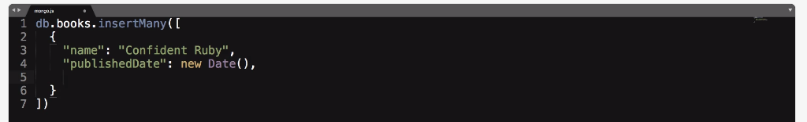
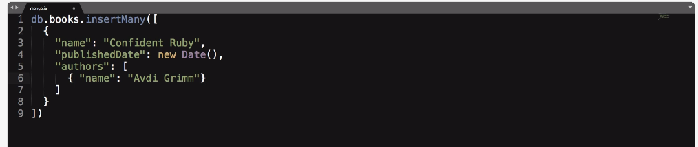
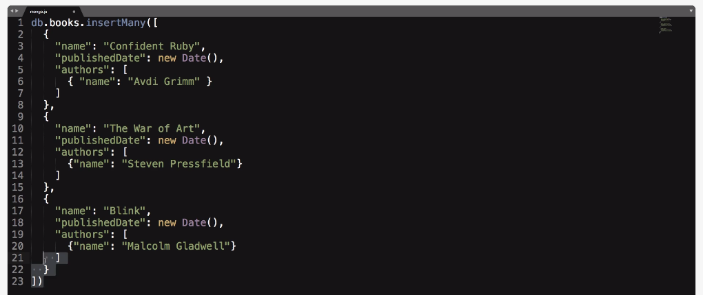
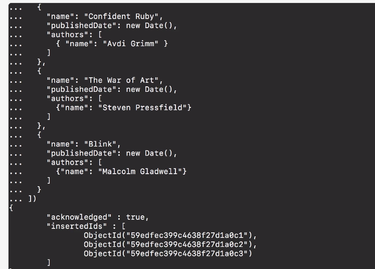

# MODULE 03-150: MongoDB (5)

## Inserting many Documents

---

## Video Lesson Speech

In the last guide, we walked through how you can insert documents into a Mongo collection and that's great but that only allowed us to insert one at a time.

****

If you're building out a large application there's probably going to be a time where you're going to need to insert multiple documents at the same time and that's where the insert `many function` comes into play.     

I'm going to switch to Sublime Text and create that function. We're going to start off with `db.books`. So we're going to start off with the name of our database object which represents whatever database we're using then books, the name, and the collection, and then the function is `insertMany`.  



Now `insertMany` is a little bit different, remember that with insert it took a Javascript object, `insertMany` takes an *array*. So you're going to go with the brackets just like this.  



Then inside of this is where we're going to place our objects. So I'm going to write the first one then I'll just paste a few more in so you don't have to watch me type all of this but it is good to practice this just so you can become familiar.   

So I'm going to say *name* *Confident Ruby*, and we're going to stick with our *publishDate* as our second attribute there and we'll just start off with *new Date()*, obviously you could pass in a custom one and that should be a comma there.   



Now let's pass in authors now authors can have one author or it can have multiple for this one it's just going to be a single author.   

Now here we're going to pass in an object for the authors, we are going to pass in a `"name": "Avdi Grimm"`.   



Now I'm going to go and grab some other ones that I wrote out previously and now I'll paste those in. If you notice they have the exact same structure so we have a *name* a *publishedDate*, *authors* and then the authors *name*.   



So each one of these matches they're going to have the same structure, and now if I copy this come into the terminal and hit save then it's going to save those. 



Now this gives us a different return value.   

So that's very important to know if you're building out some kind of script if you're inserting a single one.   

Remember that we just got that one object back. If I scroll up here we should still have it. Yes, so we have the right result of an inserted one.  

 Now if you are doing insert many it changes and so it gives you an acknowledged true and then inserted ID. So each one of these is the ID that the system generated.   

So we'll get into how we can retrieve that ID and what it represents. But essentially what Mongo does is creates this hash value and it gives some type of unique structure to that document so that it can be retrieved and so that every document in your database is guaranteed to be unique.  

 You need to be able to have some level of confidence in knowing that you can retrieve that if you have nothing besides the ID. And if you're working with very large applications you will start to see IDs that look something like this just because you need the ability to make sure that no matter how many items you get if you have millions or billions of records then you have a way of keeping track of them and making sure that you still can get unique values there.   

So now you should have a pretty good idea of how to insert one or insert many documents into a Mongo database. 

****

## Code

```js
db.books.insertMany([
  {
    "name": "Confident Ruby",
    "publishedDate": new Date(),
    "authors": [
      { "name": "Avdi Grimm" }
    ]
  },
  {
    "name": "The War of Art",
    "publishedDate": new Date(),
    "authors": [
      {"name": "Steven Pressfield"}
    ]
  },
  {
    "name": "Blink",
    "publishedDate": new Date(),
    "authors": [
      {"name": "Malcolm Gladwell"}
    ]
  }
])
```
