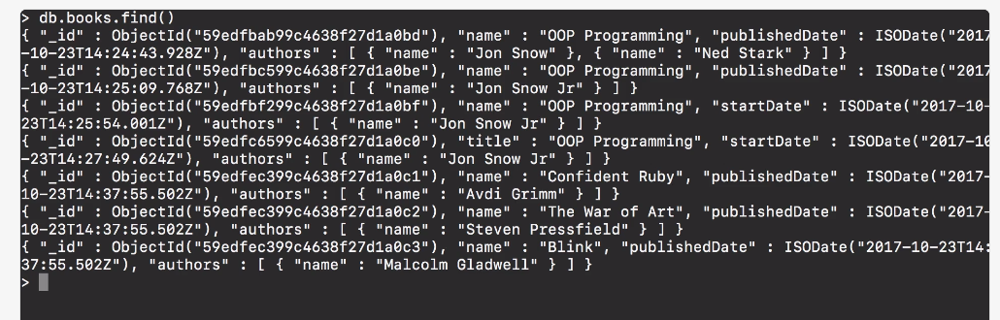
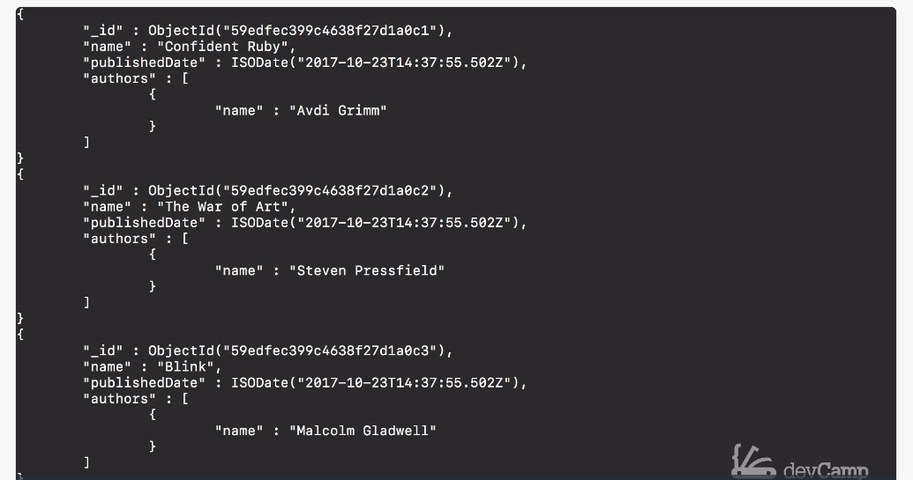

# MODULE 03-151: MongoDB (6)

## Querying Documents with `find()` Method

---

## **Index**

1. Understanding the `find()` Method

2. Using `find().pretty()` for Better Readability

3. MongoDB vs SQL: Querying All Documents

4. Automatic Object IDs in MongoDB


---

So far, we have focused primarily on inserting documents into MongoDB collections. However, retrieving and querying data is just as important. MongoDB provides various methods to retrieve data efficiently, with the `find()` method being the most fundamental.

In this guide, we will explore how to use `find()` to query documents and compare its functionality to SQL-based queries. We will also discuss MongoDB's automatic Object ID generation.

---

## **Understanding the** `**find()**` **Method**

The `find()` method in MongoDB is used to retrieve documents from a collection. It works similarly to the `SELECT` statement in SQL, allowing users to fetch data that matches specific criteria. By default, calling `find()` without any parameters returns all documents in the collection.

### **Syntax:**

```
// Retrieve all documents in a collection db.books.find()
```

### **Example Output:**

```
{ "_id" : ObjectId("507f191e810c19729de860ea"), "name" : "Confident Ruby", "publishedDate" : ISODate("2023-01-01T00:00:00Z") }{ "_id" : ObjectId("507f191e810c19729de860eb"), "name" : "The War of Art", "publishedDate" : ISODate("2023-01-02T00:00:00Z") }
```

---

## **Using** `**find().pretty()**` **for Better Readability**

MongoDB allows us to improve the readability of query results using the `pretty()` method. This method formats the output in an easily readable JSON structure.

### **Syntax:**

```
// Retrieve and format all documents db.books.find().pretty()
```

### **Example Output:**

```
[  {    "_id": ObjectId("507f191e810c19729de860ea"),    "name": "Confident Ruby",    "publishedDate": ISODate("2023-01-01T00:00:00Z")  },  {    "_id": ObjectId("507f191e810c19729de860eb"),    "name": "The War of Art",    "publishedDate": ISODate("2023-01-02T00:00:00Z")  }]
```

Using `pretty()` makes it easier to read and analyze large sets of documents in the database.

---

## **MongoDB vs SQL: Querying All Documents**

For users coming from a relational database background, it is useful to compare MongoDB’s `find()` method with SQL queries.

| Operation              | MongoDB Query     | SQL Equivalent         |
| ---------------------- | ----------------- | ---------------------- |
| Retrieve all documents | `db.books.find()` | `SELECT * FROM books;` |

This comparison helps in understanding MongoDB’s document-oriented approach in contrast to SQL’s table-based structure.

---

## **Automatic Object IDs in MongoDB**

MongoDB automatically generates a unique identifier (`_id`) for each document. This field acts similarly to a **primary key** in SQL databases and is crucial for uniquely identifying each document.

### **Example Document with Object ID:**

```
{  "_id": ObjectId("507f191e810c19729de860ea"),  "name": "Confident Ruby",  "publishedDate": ISODate("2023-01-01T00:00:00Z")}
```

### **Key Points:**

- The `_id` field is automatically added if not specified.

- It ensures each document is uniquely identifiable.

- Object IDs contain encoded timestamp information, making them useful for tracking document creation times.

****

## References

[MongoDB Querying Guide:](https://www.mongodb.com/docs/manual/tutorial/query-documents/)

[MongoDB **`find()`** Method Documentation](https://www.mongodb.com/docs/manual/reference/method/db.collection.find/)

---

## Video Lesson Speech

So far in this course, we have focused primarily on just adding 
documents but that's only one part of how Mongo is used.   

We also need to  be able to retrieve those.   

What we can do is we have a number of different find methods in Mongo that make it very straightforward to query documents.

****

What I'm going to do is I'm going to show you some of the common **find functions** but then I'm also going to give you their SQL equivalent because if you're coming from SQL than some of the various tasks we're going to be performing may seem a little bit alien. I know when I was first learning Mongo a number of these types of behaviors on the querying side especially felt kind of odd, so what really helped was having what the SQL equivalent to that code would be, and then it started to make more sense. So the first thing I'm going to do is I'm going to say `db.book.find()`, then with the parens because this is a function and if I return that you can see only the books we have created are right here. 



Now, this is the same as if I did something like saying `SELECT * from books` in SQL where I'm just saying bring everything back. Now there is a very helpful little function inside of Mongo that you can add to any of these **find functions** and it's called **pretty**, if I say `find().pretty()` this is going to return all of the records back, but it's going to return in a much nicer formatted kind of setup. 



So right here you can see that each one of the records that we created is now in the database and it also added this `_id`. Now, this happens automatically, if you remember when we did that batch create process and I showed you the object IDs. This is where it's stored so that you do not have to put this in the create statement. Mongo handles this for you and so this is very similar to a primary key in SQL. So this is the one element that you do not have to really worry about in regards to creating them because Mongo has a pretty complex algorithm in the back end that will go and it checks to make sure that no id like this is already taken. It creates this large unique cache and randomizes and then adds it right into that document. That way you always have something that you can reference so you can see you have our **id** the **name** and the **publish date**. If you scroll up you can see that not all of them are the same if you remember when we created the books that have a title instead of a name that is in there as well. 


That's a pretty nice way of being able to see how you can query these because 

****

## Code

```js
db.books.find().pretty()
```

### SQL Equivalent

```sql
SELECT * from books
```
