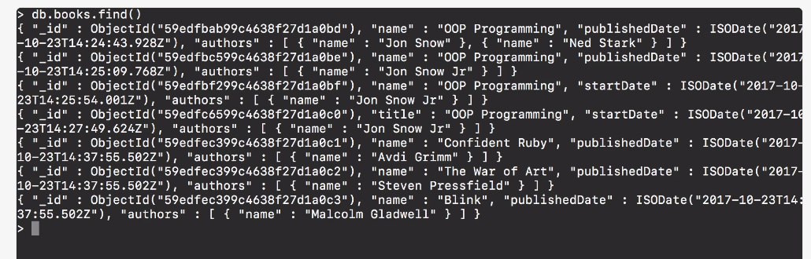
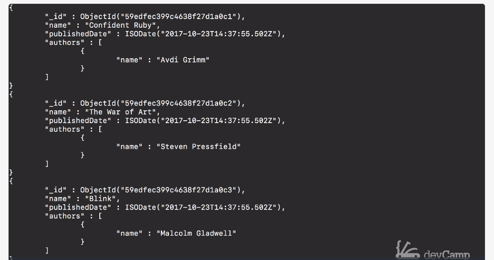

# MODULE 03-151: MongoDB (6) - Querying Documents with find() method

---

## Video Lesson Speech

So far in this course, we have focused primarily on just adding 
documents but that's only one part of how Mongo is used.   

We also need to  be able to retrieve those.   

What we can do is we have a number of different find methods in Mongo that make it very straightforward to query documents.

****

What I'm going to do is I'm going to show you some of the common **find functions** but then I'm also going to give you their SQL equivalent because if you're coming from SQL than some of the various tasks we're going to be performing may seem a little bit alien. I know when I was first learning Mongo a number of these types of behaviors on the querying side especially felt kind of odd, so what really helped was having what the SQL equivalent to that code would be, and then it started to make more sense. So the first thing I'm going to do is I'm going to say `db.book.find()`, then with the parens because this is a function and if I return that you can see only the books we have created are right here. 



Now, this is the same as if I did something like saying `SELECT * from books` in SQL where I'm just saying bring everything back. Now there is a very helpful little function inside of Mongo that you can add to any of these **find functions** and it's called **pretty**, if I say `find().pretty()` this is going to return all of the records back, but it's going to return in a much nicer formatted kind of setup. 



So right here you can see that each one of the records that we created is now in the database and it also added this `_id`. Now, this happens automatically, if you remember when we did that batch create process and I showed you the object IDs. This is where it's stored so that you do not have to put this in the create statement. Mongo handles this for you and so this is very similar to a primary key in SQL. So this is the one element that you do not have to really worry about in regards to creating them because Mongo has a pretty complex algorithm in the back end that will go and it checks to make sure that no id like this is already taken. It creates this large unique cache and randomizes and then adds it right into that document. That way you always have something that you can reference so you can see you have our **id** the **name** and the **publish date**. If you scroll up you can see that not all of them are the same if you remember when we created the books that have a title instead of a name that is in there as well. 


That's a pretty nice way of being able to see how you can query these because 

****

## Code

```js
db.books.find().pretty()
```

### SQL Equivalent

```sql
SELECT * from books
```
