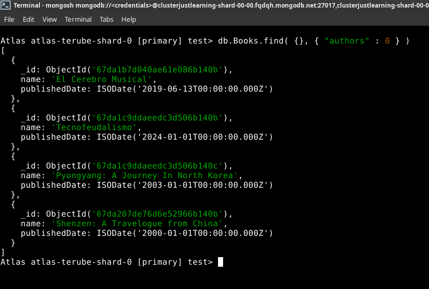
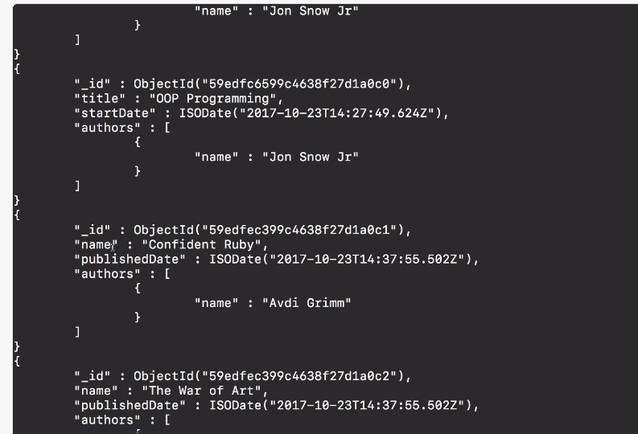

# MODULE 03-153: MongoDB (8)

## Introduction to Projections

---

## **Index**

1. Understanding Projections in MongoDB

2. Using Projections with the `find()` Method

3. Including and Excluding Fields

4. MongoDB vs SQL: Projection Queries

---

By default, when querying a MongoDB collection using the `find()` method, all fields of a document are returned. However, in most cases, retrieving all attributes is unnecessary and inefficient, especially in large datasets.

**Projections** in MongoDB allow you to specify which fields should be included or excluded from the query results.

In this guide, we will explore how to use projections in MongoDB queries to retrieve only the necessary fields efficiently.

---

## **Understanding Projections in MongoDB**

A **projection** is a specification of the fields that should be included or excluded in the query results. This helps optimize performance by reducing the amount of data transferred from the database.

### **Why Use Projections?**

- Improves query performance by reducing data retrieval size.

- Helps prevent over-fetching unnecessary data.

- Optimizes network bandwidth and response time.

---

## **Using Projections with the** `**find()**` **Method**

The `find()` method in MongoDB accepts two parameters:

1. **Query object** - Specifies the selection criteria.

2. **Projection object** - Specifies the fields to include or exclude.

```mongodb
// Find documents with projection

MongoCourse> db.Books.find(
{ "name" : "El Cerebro Musical" },
{ "name" : 1, "authors" : 1, "_id" : 0 }
)


[
  {
    name: 'El Cerebro Musical',
    authors: [ { name: 'Daniel J. Levitin' } ]
  }
]
```

The projection `{ name: 1, authors: 1, _id: 0 }` specifies that only the `name` and `authors` fields should be returned while excluding `_id`.

---

## **Including and Excluding Fields**

MongoDB allows **two approaches** for projections:

### **1. Including Specific Fields**

Set the desired fields to `1` (except for `_id`, which is included by default unless excluded explicitly).

#### **Example:**

```js
// Return only the name and authors fields

MongoCourse> db.Books.find( {}, { "name" : 1, "authors" : 1 } )


[
  {
    _id: ObjectId('67d9c1555c76fae2cc6b140b'),
    name: 'El Cerebro Musical',
    authors: [ { name: 'Daniel J. Levitin' } ]
  },
  {
    _id: ObjectId('67d9cb025c76fae2cc6b140c'),
    name: 'Tecnofeudalismo',
    authors: [ { name: 'Yanis Varoufakis' } ]
  },
  {
    _id: ObjectId('67d9cb025c76fae2cc6b140d'),
    name: 'Pyongyang: A Journey In North Korea',
    authors: [ { name: 'Guy Delisle' } ]
  },
  {
    _id: ObjectId('67d9da355c76fae2cc6b1410'),
    name: 'Shenzen: A Travelogue from China',
    authors: [ { name: 'Guy Delisle' } ]
  }
]
```


### **2. Excluding Specific Fields**

Set the fields to `0` to remove them from the results.

#### **Example:**

```js
// Exclude the Authors field

MongoCourse> db.Books.find( {}, { "authors" : 0 } )


[
  {
    _id: ObjectId('67d9c1555c76fae2cc6b140b'),
    name: 'El Cerebro Musical',
    publishedDate: ISODate('2025-03-18T18:54:13.978Z')
  },
  {
    _id: ObjectId('67d9cb025c76fae2cc6b140c'),
    name: 'Tecnofeudalismo',
    publishedDate: ISODate('2024-01-01T00:00:00.000Z')
  },
  {
    _id: ObjectId('67d9cb025c76fae2cc6b140d'),
    name: 'Pyongyang: A Journey In North Korea',
    publishedDate: ISODate('2003-01-01T00:00:00.000Z')
  },
  {
    _id: ObjectId('67d9da355c76fae2cc6b1410'),
    name: 'Shenzen: A Travelogue from China',
    publishedDate: ISODate('2000-01-01T00:00:00.000Z')
  }
]
```

- You **cannot mix** inclusion (`1`) and exclusion (`0`) in the same query, **except for** `**_id**`.

- If no projection is specified, all fields are returned by default.




### 

- 

---

## **MongoDB vs SQL: Projection Queries**

| **Operation**          | **MongoDB Query**                            | **SQL Equivalent**                 |
| ---------------------- | -------------------------------------------- | ---------------------------------- |
| Select specific fields | `db.books.find({}, { name: 1, authors: 1 })` | `SELECT name, authors FROM books;` |
| Exclude a field        | `db.books.find({}, { publishedDate: 0 })`    | `SELECT name, authors FROM books;` |

---

## **References**

---

## Video lesson Speech

In the past few guides as we've been going through some of the various querying functions that are available in Mongo you may have noticed something that might be kind of strange if you remember back where we run some command like `b.books.find()` do you notice how all of the attributes are brought back.

****


So let's take a look at what it looks like when it's `pretty` so we can see it easier. 


So you notice that we have the **name, published date, authors**, and the **id**. We have all of these different elements and that is fine in some cases, however, if you remember back when you were learning about SQL, if you have learned about SQL then you would remember that running a star query where you bring back all of the attributes, that's actually considered a poor practice.   

So in Mongo, it's the same thing. It's fine to run it at certain times however it's pretty rare that you want every single one of the attributes usually you want to pick and choose what gets returned back.   

And so that takes us into the conversation where we learn about what are called projections and so projections are various constraints that we can put on our query so that we can ensure that we're only getting back the elements that we actually want.   

So let's open up Sublime Text and let's create a new query with projections.   

So I'm going to say `db` followed by the collection that we want to find and then `find`, inside of find where we're going to place a couple of different arguments.    

So what find allows us to do is not only pass in what we've done so far which is pass and a single object. It also allows us to pass in our second object which is our projection.  

 Here I'm going to pass in one object and this is going to be similar to what we've done so far, I can a `name` and then `Confident Ruby` and also notice that we have a couple of different syntax options.   

There are times where I will wrap this up just like this in a string. But if you just say name just like I'm doing right here then Mongo is still going to be able to interpret that. So this is what we've done so far and if I copy this


and come in the terminal and run it you can see that it brings back the correct book. However, it brings back all the attributes. 



So now what we can do is pass in a second object and in the second object, this is where all of our projections go, our constraints that allow us to say that we only want certain attributes.   

The way that we can do this is by naming the attributes that we want. So if I say `publishedDate` and then the way that you tell it if you want it or not is with either a **1** or **0**. In this case, I want the `publishedDate` and I want the `authors`. 


So now if I run this and run this in the terminal now you can see and let me make it so it's pretty as well. Now you can see that it's actually working and that we only got back the `id` the `publishedDate` and the list of `authors`.


Now if we wanted the `name` then we could add that right to the list and here I will add my `pretty` statement right to the end, and now if I pass this and again you can see it's working and now we have the name back.


Now let's see what happens when we want to not have some of those elements. So say I just want the `name` and the list of `authors` but not the `publishedDate`.   

So if I copy all of this and run it. Notice that the published date is not there anymore. 


You may think that you'd have to place a zero by the published date but that's not true because the way that Mongo works is it is expected that if you want the value then in that list of projections you're going to ask for it.   

The only one that you do not have that's not the expected result is that `id` field. So if you do not want the `id` field then you can pass in a zero just like this and now if I run this you can see and it looks like I have a little syntax error and I do I need to add a comma.   

 Remember this is an object so you have to pass it in and have a comma after each one of the items in the list.   
Now let me clear this off and run it again and you can see that now we have run it and it does not have the `id` field anymore.  


The `id` field is the only one that comes by default in your projections. You simply have to list out with either a **1** or a **0** which one of the attributes that you want to return.   

So the way that this would be in SQL so this command right here would be the same as if we did something like 

```
SELECT name, authors FROM books WHERE name = 'Confident Ruby'
```

So this is something that when I was learning Mongo it really helped me to be able to see that mapping because even though Mongo may be incredibly different from SQL at the end of the day your end goal is the same.   

You need to be able to insert items into a database and then you need to be able to retrieve them.   

Typically you need to be able to retrieve only certain components that you want back and you want to be able to also pass in clauses for being able to say that I don't want you to return all the documents back.   

I only want the ones that match these certain values. So being able to have an understanding of how similar SQL would be helped me quite a bit so hopefully, it also helps you.   

So in review what we've worked through here is being able to limit the amount of data that comes back in a query by adding that second object into the **find method** which is called your **set of projections**. 

****

## Code

```js
db.books.find(
  {
    name: "Confident Ruby"
  },
  {
    _id: 0,
    name: 1,
    authors: 1
  }
).pretty()
```

### SQL Equivalent

```sql
SELECT name, authors FROM books WHERE name = 'Confident Ruby'
```
