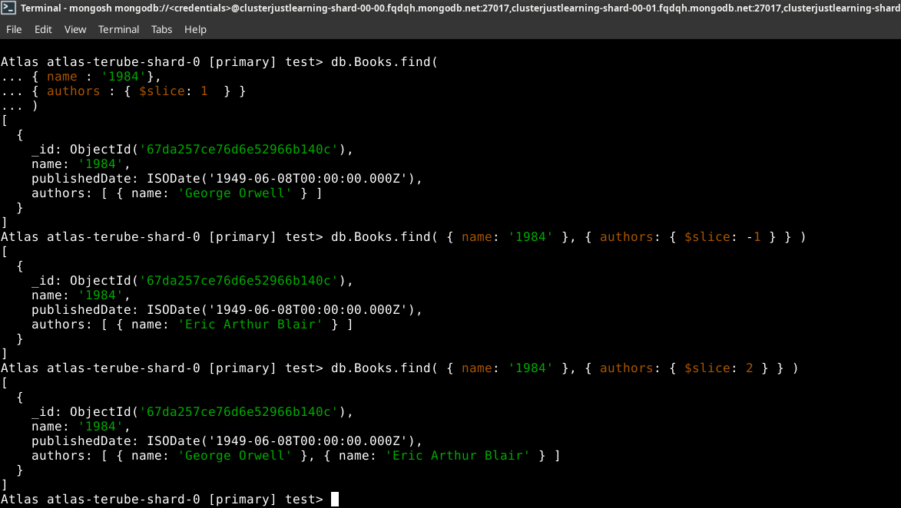
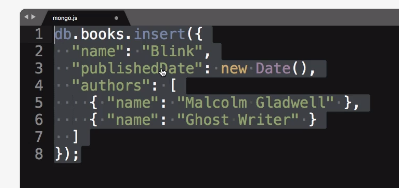
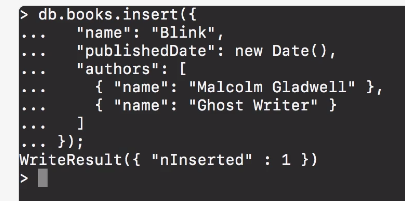
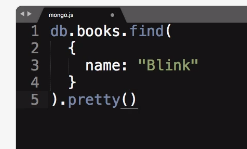
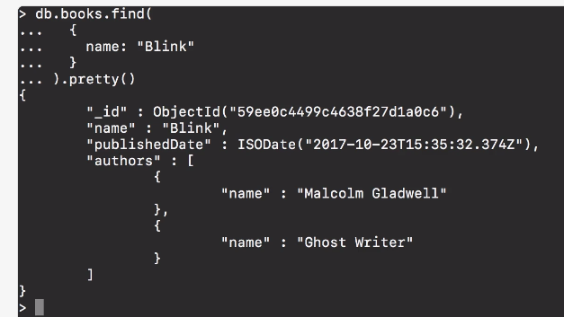
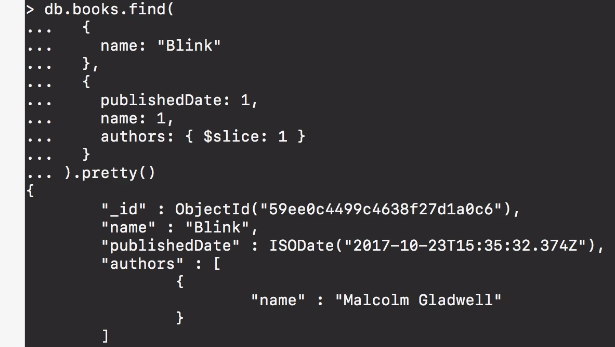
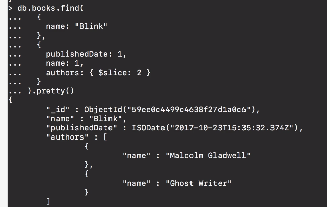
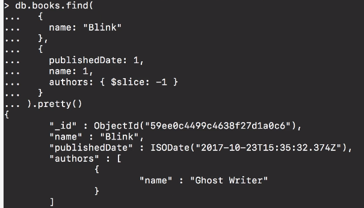

# MODULE 03-154: MongoDB (9)

## Querying for a Portion of a Nested Array Element using `$slice`

---

## **Index**

1. Understanding the `$slice` Operator

2. Using `$slice` in Queries

3. Examples of `$slice` Projections

4. MongoDB vs SQL: Handling Nested Arrays


****

Actual database:

```mongodb
test> db.Books.find()
[
  {
    _id: ObjectId('67da1b7d040ae61e086b140b'),
    name: 'El Cerebro Musical',
    publishedDate: ISODate('2019-06-13T00:00:00.000Z'),
    authors: [ { name: 'Daniel J. Levitin' } ]
  },
  {
    _id: ObjectId('67da1c9ddaeedc3d506b140b'),
    name: 'Tecnofeudalismo',
    publishedDate: ISODate('2024-01-01T00:00:00.000Z'),
    authors: [ { name: 'Yanis Varoufakis' } ]
  },
  {
    _id: ObjectId('67da1c9ddaeedc3d506b140c'),
    name: 'Pyongyang: A Journey In North Korea',
    publishedDate: ISODate('2003-01-01T00:00:00.000Z'),
    authors: [ { name: 'Guy Delisle' } ]
  },
  {
    _id: ObjectId('67da207de76d6e52966b140b'),
    name: 'Shenzen: A Travelogue from China',
    publishedDate: ISODate('2000-01-01T00:00:00.000Z'),
    authors: [ { name: 'Guy Delisle' } ]
  },
  {
    _id: ObjectId('67da257ce76d6e52966b140c'),
    name: '1984',
    publishedDate: ISODate('1949-06-08T00:00:00.000Z'),
    authors: [ { name: 'George Orwell' }, { name: 'Eric Arthur Blair' } ]
  }
]

```

---

When working with MongoDB, we often deal with **nested arrays** inside documents.   

By default, querying a document with an array field will return all elements of that array.   

**However, there are cases where we may only want to retrieve a portion of the array rather than the full dataset.**

MongoDB provides the `$slice` operator to limit the number of elements returned from an array field.   

This guide will explain how to use `$slice` to refine query results efficiently.

---

## **Understanding the** `$slice` **Operator**

The `$slice` operator allows retrieving a subset of an array field when querying documents. It is used within the **projection object** of the `find()` method.


- Limits the number of array elements returned.

- Can return elements from the beginning, end, or a specified range within the array.

- Helps reduce data transfer size when working with large datasets.

---

## **Using** `$slice` **in Queries**

The `$slice` operator is used within the projection part of the `find()` method.

```mongodb
// Retrieve only the first N elements of an array field

 db.books.find(
   { name: "1984" }, // Query condition
   { authors: { $slice: 1 } } // Projection using `$slice`
 )
```

### **Example Document:**

```mongodb

Atlas atlas-terube-shard-0 [primary] test> db.Books.find(
... { name : '1984'},
... { authors : { $slice: 1  } }
... )
[
  {
    _id: ObjectId('67da257ce76d6e52966b140c'),
    name: '1984',
    publishedDate: ISODate('1949-06-08T00:00:00.000Z'),
    authors: [ { name: 'George Orwell' } ]
  }
]


```

The above query will return only the **first author** from the `authors` array.

---

## **Examples of** `**$slice**` **Projections**

### **Retrieving the First Element**

```js
// Return only the FIRST author value

 db.books.find(
   { name: "Blink" },
   { authors: { $slice: 1 } }
 )
```

### **Retrieving the Last Element**

```mongodb
// Return only the last author

 db.books.find(
   { name: "1984" },
   { authors: { $slice: -1 } }
 )


[
  {
    _id: ObjectId('67da257ce76d6e52966b140c'),
    name: '1984',
    publishedDate: ISODate('1949-06-08T00:00:00.000Z'),
    authors: [ { name: 'Eric Arthur Blair' } ]
  }
]

```

### **Retrieving Multiple Elements from the Start**

```mongodb
// Return the first two element

 db.books.find(
   { name: "1984" },
   { authors: { $slice: 2 } }
 )


[
  {
    _id: ObjectId('67da257ce76d6e52966b140c'),
    name: '1984',
    publishedDate: ISODate('1949-06-08T00:00:00.000Z'),
    authors: [ { name: 'George Orwell' }, { name: 'Eric Arthur Blair' } ]
  }
]

```




---

## **MongoDB vs SQL: Handling Nested Arrays**

In SQL-based databases, handling nested array structures typically requires **JOIN operations** or **subqueries**.   

However, MongoDB’s `$slice` operator provides a simpler, built-in solution for retrieving partial array data efficiently.

| **Operation**                         | **MongoDB Query**                                               | **SQL Equivalent**                                          |
| ------------------------------------- | --------------------------------------------------------------- | ----------------------------------------------------------- |
| Retrieve first N elements of an array | `db.books.find({ name: "Blink" }, { authors: { $slice: 1 } })`  | No direct equivalent (requires **JOINs** or **subqueries**) |
| Retrieve last element of an array     | `db.books.find({ name: "Blink" }, { authors: { $slice: -1 } })` | No direct equivalent                                        |

---

## Video lesson Speech

Now that you're familiar with how projections work in Mongo what we can do is we can actually dive down even further to be able to be more explicit with what gets returned back for nested collections.

****

So I'm going to create a new document here for `Blink` and it's going to have multiple `authors`, it's going to have a `Malcolm Gladwell` as one of the authors and then a `Ghost Writer` as the second one.   

What the goal is going to be is once this is added to the database then I want to be able to query this document but I want to be able to query it and I want to leave out the second author so it only pulls in `Malcolm Gladwell`.   

So that's going to be something that we can use what is called the **slice method** inside of Mongo and so we'll get into how that works. 



Now if I go into the terminal and run this it is inserted. 



Now earlier on in the course, I inserted blank but in between guides I went and I removed it.   

I'll show you how to remove documents in a later guide but just so it's not confusing. I removed it so we can be working just with the single one.   

So now that is in the database I'm going to come to delete here and let's create our query. We are going to start with 

```
db.books.find
```

As usual, here I'm going to give it two objects.   

The first object is our query object so here I'm going to say `Blink` and let's indent this and then I'm also going and `pretty` at the very end. 



Just to make sure that all of this is working I'm going to come run it and you can see that `Malcolm Gladwell` and the `Ghost Writer` are both included in that query. 



So with our projection let's come here and our set of constraints. I'm going to say that I want the `publishedDate`, So I do `publishedDate:  1`. I want the `name: 1`,  and then I want `authors`. But instead of giving it a **1** like we've done in the past what I'm going to do is pass it an object and instead of passing in say name or one of the attributes inside I'm going to pass in a special function called `$slice` and with `$slice` what I can do is pass in and say I want this specific element in the array. So now if I copy this 


and I run this you can see that it works. 



So now what we've done is we've essentially created a query and we've gone into a nested collection and said I only want the very first element in that array. Now if we wanted to go the other direction then we could say `$slice: 2` and that would bring us back the second item and so now it's showing the `Ghost Writer` and `Malcolm Gladwell` right here. 



If we only wanted the `Ghost Writer` by himself I can say `$slice: -1` and if I run that you can see only has the `Ghost Writer`.



So what exactly is going on here is that we're working with a very similar construct as that is contained in pretty much every other programming language which is our array manipulation.   

So what that means is if you remember back authors is an array. So the nice thing about working with Mongo is we're able to treat that array just like we would in a regular programming language.  

 And in a regular language if I gave a **-1** to an array index that will go backward and it will go pull whatever the last author is or the last element in the array and you'll pull that one whereas we could pass in and go one and two and bring the first couple items so that using the **slice method** is a very nice way of being able to go into nested collections and be able to retrieve only the data that you want to have. 

****

## Code

```js
db.books.insert({
  "name": "Blink",
  "publishedDate": new Date(),
  "authors": [
    { "name": "Malcolm Gladwell" },
    { "name": "Ghost Writer" }
  ]
});


db.books.find(
  {
    name: "Blink"
  },
  {
    publishedDate: 1,
    name: 1,
    authors: { $slice: 1 }
  }
).pretty()
```
