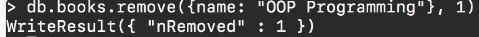

# MODULE 03-155: MongoDB (10)

## How to Delete Documents in MongoDB

---

## **Index**

1. Understanding Document Deletion in MongoDB

2. Using the `remove()` Method

3. Deleting a Specific Document

4. Deleting Multiple Documents

5. MongoDB vs SQL: Delete Queries

---


So far, we have explored various methods for inserting and querying documents in MongoDB.   

However, managing a database also involves removing unwanted or obsolete documents. In this guide, we will focus on how to **delete documents** efficiently using MongoDB's built-in methods.

---

## **Understanding Document Deletion in MongoDB**

MongoDB provides multiple ways to delete documents:

- `**remove()**` **(Deprecated)** – Previously used to delete documents (replaced by `deleteOne()` and `deleteMany()`).

- `**deleteOne()**` – Removes a single document matching a query.

- `**deleteMany()**` – Removes all documents that match a given query.

Using the appropriate method ensures that only the intended documents are removed while preserving database integrity.

---

## **Using the** `**remove()**` **Method**

> ⚠️ **Note:** The `remove()` method is deprecated and has been replaced by `deleteOne()` and `deleteMany()`. However, we include it here for historical reference.

### **Syntax:**

```js
// Remove all documents that match the query
 db.books.remove({ name: "OOP Programming" })

// Remove only one document that matches the query
 db.books.remove({ name: "OOP Programming" }, 1)
```

---

## **Deleting a Specific Document**

To delete a single document that matches a given filter, use `deleteOne()`.

### **Syntax:**

```js
// Delete one document where name is "OOP Programming"

db.books.deleteOne({ name: "OOP Programming" })
```

### **Example Output:**

```json
{ "acknowledged": true, "deletedCount": 1 }
```

This command removes only **one** matching document, even if multiple exist.

---

## **Deleting Multiple Documents**

To delete **all documents** that match a given query, use `deleteMany()`.

### **Syntax:**

```js
// Delete all documents where name is "OOP Programming"

db.books.deleteMany({ name: "OOP Programming" })
```

### **Example Output:**

```json
{ "acknowledged": true, "deletedCount": 3 }
```

This command removes **all** documents that have `name: "OOP Programming"`.

---

## **MongoDB vs SQL: Delete Queries**

| **Operation**             | **MongoDB Query**                                  | **SQL Equivalent**                                          |
| ------------------------- | -------------------------------------------------- | ----------------------------------------------------------- |
| Delete a single document  | `db.books.deleteOne({ name: "OOP Programming" })`  | `DELETE FROM books WHERE name = 'OOP Programming' LIMIT 1;` |
| Delete multiple documents | `db.books.deleteMany({ name: "OOP Programming" })` | `DELETE FROM books WHERE name = 'OOP Programming';`         |

---

## Video lesson Speech

So far we've gone through a number of ways to query documents in Mongo. 
We've also talked about inserting either single or multiple documents.

****

In this guide, we're going to talk about how we can remove documents.   

So here I'm going to start off with a query I'm going to say db and then books because that's the name of our collection.   

And then we're going to pass in remove and that is the function we're going to pass. It expects an object so I can say name and then here I'll say OOP programming.   

Because if you remember we have a number of those guides there and those are they have different names and titles and so I just want to remove all of them to be able to clean them up.   

So right here I can I have a couple of different options. First is where I can run this and it's going to remove all of the items.   

Now if I passed in a second element so if I passed in say a 1 it's only going to remove one of the items.   

So here if I run this you can see that it gives us a return result and says number removed is 1. 



If I go back and say db.books.find and pass in name OOP programming this is going to tell us that we still have a number of books left there. 

```
db.books.find({name: "OOP Programming"})
```

Now if we run it again and remove that 1 flag now it has removed 2 of them and if we run the query again you can see that we have no documents with the name of OOP programming.

So those are the two common ways where you can remove documents in Mongo.   

The first is where you can pass in an explicit number on how many you want to remove and the other is where you simply want to delete all of the documents that match that query.

****

## Code

```js
db.books.remove({name: "OOP Programming"}, 1) // Removes a single document
db.books.remove({name: "OOP Programming"}) // Removes all documents
```
