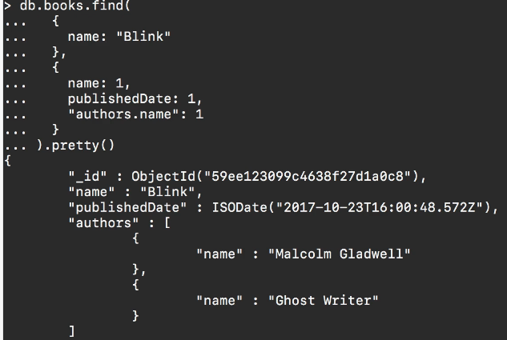
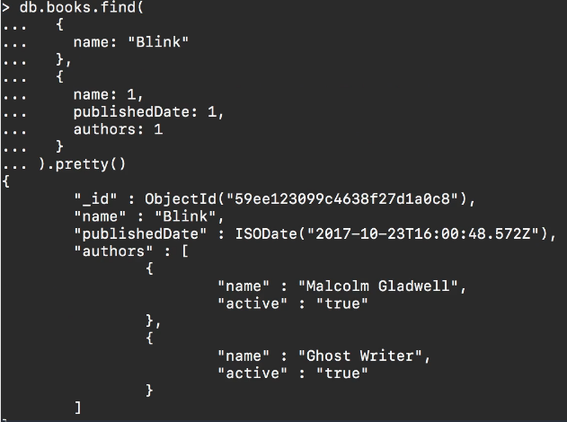

# MODULE 03-156: MongoDB (11)

## Including Nested Fields in a find Query

---

## **Index**


1. Working with Nested Fields in MongoDB

2. Querying Specific Nested Fields

3. Using Projections to Limit Nested Data

4. MongoDB vs SQL: Nested Queries

---


MongoDB provides a flexible schema design that allows documents to have **nested fields** and **embedded arrays**.   

This structure is beneficial when working with complex data relationships. However, retrieving specific data from these nested structures requires special querying techniques.  

In this guide, we will explore how to query **specific fields inside nested objects** using projections in MongoDB.  

---

## **Working with Nested Fields in MongoDB**

In MongoDB, documents can contain **nested objects** or **arrays of objects**. This allows data to be stored in a hierarchical manner.

### **Example Document with Nested Fields:**

```json
{
    "name": "Blink",
    "publishedDate": "2024-03-10T10:00:00Z",
    "authors": [
        { "name": "Malcolm Gladwell", "active": true },
        { "name": "Ghost Writer", "active": true }
    ]
}
```

In this example:

- `authors` is an **array** of objects.

- Each object inside `authors` contains `name` and `active` fields.

Retrieving specific nested fields requires **dot notation** (`"parent.child"`).

---

## **Querying Specific Nested Fields**

We can use the `find()` method to retrieve only specific **nested fields** from documents.

### **Syntax:**

```js
// Find books where name is "Blink" and return only the authors' names  

db.books.find(
  { name: "Blink" },
  { "authors.name": 1 }
).pretty()
```

### **Example Output:**

```json
{
    "_id": ObjectId("65f9c3e45a2b1e4d8e52f654"),
    "authors": [
        { "name": "Malcolm Gladwell" },
        { "name": "Ghost Writer" }
    ]
}
```

Here, only the `name` field inside the `authors` array is returned, **excluding** the `active` field.

---

## **Using Projections to Limit Nested Data**

Projections allow us to control which **nested fields** are included or excluded in query results.

### **Example:** Excluding `_id` and Returning Only Specific Fields

```js
// Return only the book name and authors' names, excluding _id  

db.books.find(
  { name: "Blink" },
  {
    _id: 0,
    name: 1,
    "authors.name": 1
  }
).pretty()
```

### **Example Output:**

```json
{
    "name": "Blink",
    "authors": [
        { "name": "Malcolm Gladwell" },
        { "name": "Ghost Writer" }
    ]
}
```

### **Key Notes:**

- `_id: 0` explicitly **excludes** the `_id` field.

- `name: 1` includes the `name` field of the book.

- `"authors.name": 1` retrieves only the `name` field inside the `authors` array.

---

## **MongoDB vs SQL: Nested Queries**

| **Operation**                   | **MongoDB Query**                                         | **SQL Equivalent**                                     |
| ------------------------------- | --------------------------------------------------------- | ------------------------------------------------------ |
| Retrieve specific nested fields | `db.books.find({ name: "Blink" }, { "authors.name": 1 })` | `SELECT authors.name FROM books WHERE name = 'Blink';` |
| Exclude `_id` field             | `db.books.find({}, { _id: 0, "authors.name": 1 })`        | `SELECT authors.name FROM books;`                      |

---

## Video lesson Speech

In production applications that utilize Mongo's database a very common pattern that you'll see is that your documents start to get pretty big and you start to have a number of nested collections.   

It's one of the top reasons why you actually use a document based system like Mongo 
because you have the flexibility and then you also have the ability to nest as many items as you want.

****

Just like we have right here


Now, I've extended our blank document here and in addition to just having a name for authors we now also have if they're active or not. I also deleted all the blank instances in our database so that we can just be working with a single one. And now if I paste this in you can see that we got one inserted. 

```
WriteResult{"nInsterted" : 1 })
```

Now, I want the ability to query our document here and I do not want to list if the author is active or not. Imagine a scenario where you're querying it to show an author page on the Website you don't care about if the author is active for that page you simply need to know their name. What we can do is we can actually go in and select the nested elements that we want

```
db.books.find(

)
```

As usual, we're going to set up two different objects. The first is going to be our query which would be Blink. And then we're going to set up our projections.

```
db.books.find(
  {
    name: "Blink"
  },
)
```

Now our projections are going to be pretty standard so we're going to have a name of one because I want the name back and then a publish date of 1 because I'd like that date and the next part is going to look a little bit different. We can't use our same syntax as we're using right here where we write it without the strings. We do need to embed this in strings. And what we can say is authors which is a name of our collection and then name and so we have authors which are an array and then inside of it there are all of those various elements we have all those objects and so when we do authors dot name what Mongo's going to do it's going to go into that array and then it's all going to go through each one of those objects each one of those authors objects and then it's going to bring back the name attribute only and we can give that a 1 and then we'll also add the pretty function at the end. And now let's run this. If I run this now you can see that it only returns the authors and their respective names. It doesn't bring back if they're active or not. 



Now just to prove that that is the way it's really working. If I delete most of this and just say authors and run that you can see that's where it brings active true on both of those.



But the biggest key here to remember is you have the ability with those embedded nested objects to be able to go through them by first calling the name of whatever the key is here and then follow that up by whatever the key is inside of all the nested objects.   

This kind of gets to the heart on why Mongo was designed the way that it was is because it has that key-value kind of set up.   

It gives us the ability to treat it just like a regular set of objects the same way we would in javascript or any language like that where we have the ability to call collections and then go inside of those and then call the respective keys so that we can retrieve the values.

****

## Code

```
db.books.insert({
    "name": "Blink",
    "publishedDate": new Date(),
    "authors": [
        { "name": "Malcolm Gladwell", "active": "true" },
        { "name": "Ghost Writer", "active": "true" }
    ]
});
```

```js
db.books.find(
  {
    name: "Blink"
  },
  {
    name: 1,
    publishedDate: 1,
    "authors.name": 1
  }
).pretty()
```
