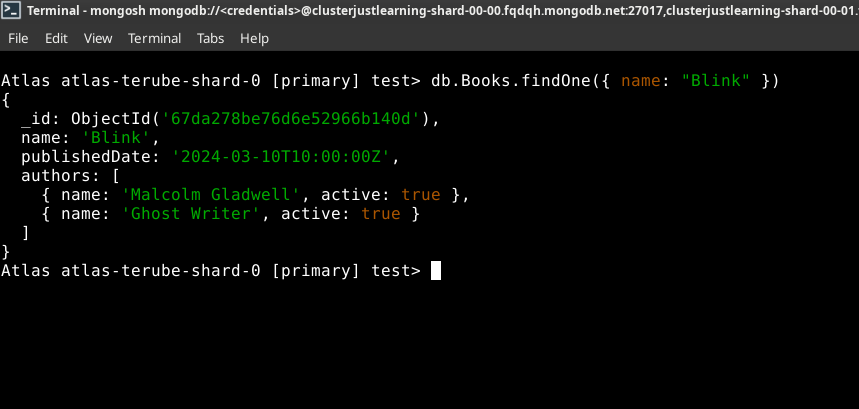
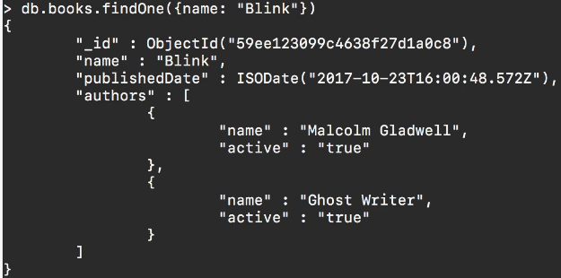

# MODULE 03-157: MongoDB (12)

## Using the `findOne` Method in MongoDB

---

## **Index**

1. Understanding the `findOne` Method
2. Using `findOne` to Retrieve a Single Document
3. Comparing `find()` vs `findOne()`
4. MongoDB vs SQL: Single Record Query

---

When querying a MongoDB collection, sometimes you need to retrieve only a single document rather than multiple results. MongoDB provides the `findOne()` method, which is designed to return the first document that matches a given query.

This guide will explain how `findOne()` works, its differences compared to `find()`, and how it can be leveraged in applications where retrieving a single record is necessary.

---

## **Understanding the `findOne` Method**

MongoDB’s `findOne()` method is used to return the **first** document that matches a given query. If no matching document is found, it returns `null`.

### **Syntax:**

```mongodb
// Basic findOne query

 db.<collection>.findOne({ query })
```

The key difference between `findOne()` and `find()` is that `findOne()` **only returns a single document** instead of a cursor containing multiple documents.

---

## **Using `findOne` to Retrieve a Single Document**

If multiple documents match the query, all will be returned. However, using `findOne()`, only the first matching document will be retrieved:

```mongodb
Atlas atlas-terube-shard-0 [primary] test> db.Books.findOne(
... { name: "Blink" }
)


{
  _id: ObjectId('67da278be76d6e52966b140d'),
  name: 'Blink',
  publishedDate: '2024-03-10T10:00:00Z',
  authors: [
    { name: 'Malcolm Gladwell', active: true },
    { name: 'Ghost Writer', active: true }
  ]
}
```



 **Benefits of `findOne()`:**

- Guarantees that only one document is returned.
- Eliminates the need to iterate over multiple documents.
- Useful in applications that require a single result (e.g., retrieving user profiles, fetching configuration settings).

---

## **Comparing `find()` vs `findOne()`**

| Feature            | `find()`                    | `findOne()`               |
| ------------------ | --------------------------- | ------------------------- |
| Returns            | Cursor (multiple documents) | Single document or `null` |
| Use Case           | Retrieving multiple records | Retrieving one record     |
| Requires Iteration | Yes                         | No                        |
| Default Output     | JSON array                  | JSON object               |

If multiple documents match the query, `findOne()` returns **only the first document** found, whereas `find()` returns a cursor that can contain multiple documents.

---

## **MongoDB vs SQL: Single Record Query**

| **Operation**        | **MongoDB Query**                     | **SQL Equivalent**                                  |
| -------------------- | ------------------------------------- | --------------------------------------------------- |
| Find a single record | `db.books.findOne({ name: "Blink" })` | `SELECT * FROM books WHERE name = 'Blink' LIMIT 1;` |

In SQL databases, retrieving a single record often involves using the `LIMIT 1` clause, while in MongoDB, `findOne()` handles this automatically.

---

## **References**

- [**MongoDB findOne() Documentation:**](https://www.mongodb.com/docs/manual/reference/method/db.collection.findOne)

---

## Video lesson Speech

This is going to be a quick guide on how to drill down and become more 
specific with our search queries. Specifically, in being more specific 
with how many elements get returned.

****

During the break, I created another book for Blink. If I do 

```js
db.books.find({name: "Blink"})
```

Then right here you'll see that we have two items and one other item I wanted to tell you about was there are many times where you want to be able to see how many elements match a query and you can use the length function for that.  

 And so you can call length with parens and you can see that that returns 2. So it's going to let you know how many documents are inside that query.  

 So you can see that we have two.   

Now let's imagine that you are cognizant that your system has two documents in it that are gonna match equerry but you only want to return one.   

Well in a regular web application or mobile type of application system then you'd have to be able to take care of that on the programming side.   

But if you want to take care of it on the query side you also have the ability to do that here.   

So I'm going to get rid of this link call and instead of saying find I'm going to say findOne. Now if I return this you can see it does a couple of things. 



It only returns one item.

Also, I didn't have to add the pretty function at the end of it so it just brings that back and it formats it in a very nice and easy to read format.   

And so now what we can do is in our application we can be confident that we're only going to get back one document which means that if you're calling this and you're rendering it say, in a mobile app you don't have to worry about what you need to do if you get one versus two versus 10 documents back.  

 You don't have to worry about iterating through them.   

You know that you're going to get this one object back. You can then call name on it.   

You can check for its published date. You can then iterate through the list of authors all of those kinds of things.   

So this is something that may not seem like a very big deal until you actually get into building applications with Mongo.   

And what this allows you to do is to be explicit with the number of elements that you're going to get back because that is going to change the way they actually write your code.   

And so it's nice to have this flexibility where you can return multiple items or you can be guaranteed to only get one.

****

## Code

```js
db.books.findOne({ name: "OOP Programming" } )
```
