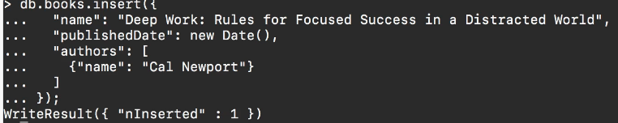
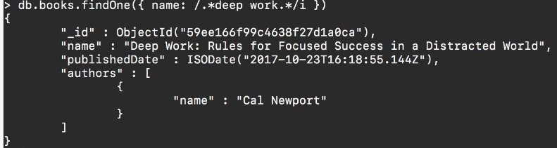

# MODULE 03-158: MongoDB (13)

## How to Query for a Portion of a String in a MongoDB Document

---

## Video lesson Speech

This is going to be a very important guide and that's because this is going to be one 
of the guides we're get into some very similar code that you're going to see in production applications that use Mongo.

****

We're going to insert a new book and this one has a much longer title, It's called "Deep Work: Rules for Focus Success in a Distracted World".   

Now what we've done so far in regards to querying is all of those searches that we've done have required an exact match which means that if we wanted to run a query for this book we would need to take the exact title and plug that into the query.   

And that is not something that you're usually going to do in a real application. Instead, you're going to implement what's called a regular expression, and then you're going to match for something similar.  

 So let's go in and we're going to add this into the database. 



And so that got inserted. And now what we're going to do is build out that query the one that uses regular expressions.   

So I can say `db.books. findOne.`   


If you remember back. So we just want to find one item that matches here.  

 And then inside of this, we're going to pass in an object just like we've done before but now we're going to pass in a regular expression.  

 So we're going to pass in this forward slash followed by a dot followed by an asterisk and then we're going to put in the pattern we're looking for, here we're looking for deep work followed by a dot followed by another Asterix followed by a slash and then the letter I and that is the object

```js
db.books.findOne({ name: /.*deep work.*/i })
```

and let's run it and see if this works.

Then we'll take a step back and analyze the entire expression. So you can see that that worked



 If we would have done that with just the regular find and then the name it would not have worked. Just so you trust me on that one, I'm going to test it out.  

 So we're in a deep work just with the text by itself.   

And now if I run this it returns NULL which means it couldn't find anything. 

```
db.books.findOne({ name: 'deep work' })
null
```

What exactly is happening here?   

Well, the first part is to have the slashes (//) because what these slashes do and this is pretty much common in just about every programming language I've ever worked in is whenever you see text in between slashes.   

That typically means it's going to be a regular expression and that it's trying to match a pattern in a string.   

So with our dot and asterisk here what we're saying is regardless if this content is at the beginning the middle or the end.   

I want you to bring back anything that matches this set of values now where the i comes in, this part is pretty cool.   

The i makes it case insensitive that means that deep work if you notice it's capitalized at the top.   

And so with what the i allows us to do is just ignore what is capital or not capital.   

And it simply runs a query and returns back any of the documents that match that particular pattern.

This is a very popular thing that you're going to be implementing whenever you're building out a query engine.  

 Imagine a search engine through your documents.   

You don't want to care about if someone typed in is the right thing whether it's capitalized or not and you don't want to care if they put maybe not enough words and if they didn't type this entire title out you don't want to require that in order for them to bring back this book.   

A pretty common practice would be to just type a few keywords in and then it runs the query and then returns back what they're looking for. 

Now, **Regular expressions** are a massive topic and there are entire books and courses dedicated just to regular expressions so I definitely recommend for you if you're interested to look into that more.  

 But as far as a basic **regular expression** implementation this will work in many cases where you just want to slide of view patterns in such as a few words and then make sure that if those match it brings back the query.

## Code

```js
db.books.findOne({ name: /.*deep work.*/i })
```

```js
db.books.insert({
    "name": "Deep Work: Rules for Focused Success in a Distracted World",
    "publishedDate": new Date(),
    "authors": [
        {"name": "Cal Newport"}
    ]
});
```

```js
db.books.find({name: "Blink"})
```

Then right here you'll see that we have two items and one other item I wanted to tell you about was there are many times where you want to be able to see how many elements match a query and you can use the length function for that.  

 And so you can call length with parens and you can see that that returns 2. So it's going to let you know how many documents are inside that query.  

 So you can see that we have two.   

Now let's imagine that you are cognizant that your system has two documents in it that are gonna match equerry but you only want to return one.   

Well in a regular web application or mobile type of application system then you'd have to be able to take care of that on the programming side.   

But if you want to take care of it on the query side you also have the ability to do that here.   

So I'm going to get rid of this link call and instead of saying find I'm going to say findOne. Now if I return this you can see it does a couple of things. 


It only returns one item.

Also, I didn't have to add the pretty function at the end of it so it just brings that back and it formats it in a very nice and easy to read format.   

And so now what we can do is in our application we can be confident that we're only going to get back one document which means that if you're calling this and you're rendering it say, in a mobile app you don't have to worry about what you need to do if you get one versus two versus 10 documents back.  

 You don't have to worry about iterating through them.   

You know that you're going to get this one object back. You can then call name on it.   

You can check for its published date. You can then iterate through the list of authors all of those kinds of things.   

So this is something that may not seem like a very big deal until you actually get into building applications with Mongo.   

And what this allows you to do is to be explicit with the number of elements that you're going to get back because that is going to change the way they actually write your code.   

And so it's nice to have this flexibility where you can return multiple items or you can be guaranteed to only get one.

****

## Code

```js
db.books.findOne({ name: "OOP Programming" } )
```
