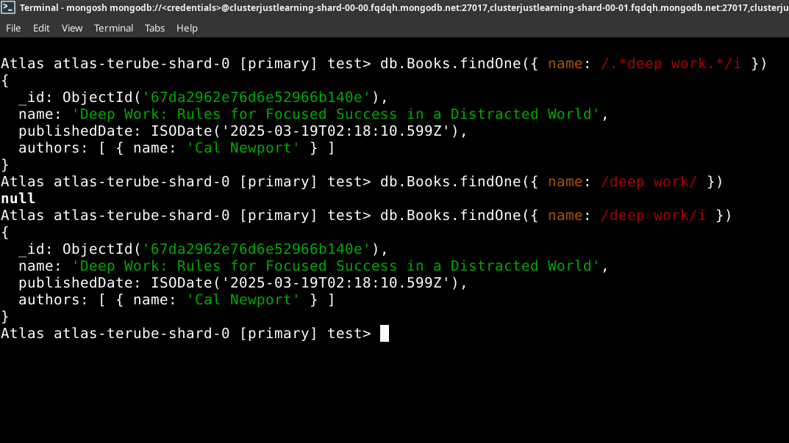

# MODULE 03-158: MongoDB (13)

## Querying for a Portion of a String in a MongoDB Document

***

1. Understanding String Queries in MongoDB
2. Using Regular Expressions for Partial String Matching
3. Case-Insensitive Queries
4. Comparison with SQL LIKE Operator

---

## **Introduction**

In real-world applications, exact string matching is rarely sufficient.   

Instead, developers often need to query documents based on **partial string matches**, such as searching for keywords within a larger text field.   

MongoDB provides **regular expressions (RegEx)** as a powerful tool to perform such queries.

This guide will demonstrate how to use **MongoDB's find() method** with regular expressions to search for a portion of a string inside a document.

---

## **Understanding String Queries in MongoDB**

MongoDB's `find()` method typically retrieves documents where field values match the query exactly. However, when searching for substrings or patterns within a text field, an **exact match is not practical**.

Consider the actual Books collections as :

```mongodb
Atlas atlas-terube-shard-0 [primary] test> db.Books.find()


[
  {
    _id: ObjectId('67da1b7d040ae61e086b140b'),
    name: 'El Cerebro Musical',
    publishedDate: ISODate('2019-06-13T00:00:00.000Z'),
    authors: [ { name: 'Daniel J. Levitin' } ]
  },
  {
    _id: ObjectId('67da1c9ddaeedc3d506b140b'),
    name: 'Tecnofeudalismo',
    publishedDate: ISODate('2024-01-01T00:00:00.000Z'),
    authors: [ { name: 'Yanis Varoufakis' } ]
  },
  {
    _id: ObjectId('67da1c9ddaeedc3d506b140c'),
    name: 'Pyongyang: A Journey In North Korea',
    publishedDate: ISODate('2003-01-01T00:00:00.000Z'),
    authors: [ { name: 'Guy Delisle' } ]
  },
  {
    _id: ObjectId('67da207de76d6e52966b140b'),
    name: 'Shenzen: A Travelogue from China',
    publishedDate: ISODate('2000-01-01T00:00:00.000Z'),
    authors: [ { name: 'Guy Delisle' } ]
  },
  {
    _id: ObjectId('67da257ce76d6e52966b140c'),
    name: '1984',
    publishedDate: ISODate('1949-06-08T00:00:00.000Z'),
    authors: [ { name: 'George Orwell' }, { name: 'Eric Arthur Blair' } ]
  },
  {
    _id: ObjectId('67da278be76d6e52966b140d'),
    name: 'Blink',
    publishedDate: '2024-03-10T10:00:00Z',
    authors: [
      { name: 'Malcolm Gladwell', active: true },
      { name: 'Ghost Writer', active: true }
    ]
  },
  {
    _id: ObjectId('67da2962e76d6e52966b140e'),
    name: 'Deep Work: Rules for Focused Success in a Distracted World',
    publishedDate: ISODate('2025-03-19T02:18:10.599Z'),
    authors: [ { name: 'Cal Newport' } ]
  }
]

```

A **standard** query would require an exact match:

```mongodb
db.books.findOne(
... { name: "Deep Work: Rules for Focused Success in a Distracted World" }
)

```

This is **not flexible**. If a user searches for just **"Deep Work"**, this query would fail. To overcome this limitation, we use **regular expressions**.

---

## **Using Regular Expressions for Partial String Matching**

MongoDB supports **regular expressions (RegEx)** to search for substrings within a text field. The following query searches for the substring **"Deep Work"** anywhere within the `name` field:

```mongodb
// REGEX    /.* */i

Atlas atlas-terube-shard-0 [primary] test> db.Books.findOne(
... { name: /.*deep work.*/i }
)


{
  _id: ObjectId('67da2962e76d6e52966b140e'),
  name: 'Deep Work: Rules for Focused Success in a Distracted World',
  publishedDate: ISODate('2025-03-19T02:18:10.599Z'),
  authors: [ { name: 'Cal Newport' } ]
}

```

### **Explanation**

- `/.*deep work.*/` → Matches any occurrence of "deep work" in the string.
- `.*` → Wildcard characters to match anything before or after "deep work".
- `/i` → Case-insensitive flag (matches "Deep Work" and "deep work").


---

## **Case-Insensitive Queries**

By default, string queries in MongoDB are **case-sensitive**. Using the `/i` flag ensures that searches are case-insensitive.

### **Example:**

Without `/i`:

```mongodb
Atlas atlas-terube-shard-0 [primary] test> db.Books.findOne(
... { name: /deep work/ }
)


null
```

- This query **fails** if "Deep Work" is capitalized in the document.

With `/i`:

```mongodb
Atlas atlas-terube-shard-0 [primary] test> db.Books.findOne(
... { name: /deep work/i }
)


{
  _id: ObjectId('67da2962e76d6e52966b140e'),
  name: 'Deep Work: Rules for Focused Success in a Distracted World',
  publishedDate: ISODate('2025-03-19T02:18:10.599Z'),
  authors: [ { name: 'Cal Newport' } ]
}

```

- This query **succeeds**, regardless of capitalization.

---



****

## **Comparison with SQL LIKE Operator**

The **equivalent SQL query** for partial string matching uses the `LIKE` operator:

| **Operation**    | **MongoDB Query**                          | **SQL Equivalent**                                          |
| ---------------- | ------------------------------------------ | ----------------------------------------------------------- |
| Exact Match      | `db.books.findOne({ name: "Deep Work" })`  | `SELECT * FROM books WHERE name = 'Deep Work';`             |
| Partial Match    | `db.books.findOne({ name: /deep work/i })` | `SELECT * FROM books WHERE name LIKE '%deep work%';`        |
| Case-Insensitive | `db.books.findOne({ name: /deep work/i })` | `SELECT * FROM books WHERE LOWER(name) LIKE '%deep work%';` |

Unlike SQL, MongoDB does **not** require explicit `%` wildcards for substring searches. Instead, regular expressions provide more flexibility.

---

## **References**

- [**MongoDB find() Documentation:**](https://www.mongodb.com/docs/manual/reference/method/db.collection.find/)
- [**MongoDB Regular Expressions:** ](https://www.mongodb.com/docs/manual/reference/operator/query/regex/)

---

## Video lesson Speech

This is going to be a very important guide and that's because this is going to be one 
of the guides we're get into some very similar code that you're going to see in production applications that use Mongo.

****

We're going to insert a new book and this one has a much longer title, It's called "Deep Work: Rules for Focus Success in a Distracted World".   

Now what we've done so far in regards to querying is all of those searches that we've done have required an exact match which means that if we wanted to run a query for this book we would need to take the exact title and plug that into the query.   

And that is not something that you're usually going to do in a real application. Instead, you're going to implement what's called a regular expression, and then you're going to match for something similar. So let's go in and we're going to add this into the database. 


And so that got inserted. And now what we're going to do is build out that query the one that uses regular expressions. So I can say db.books. findOne. If you remember back. So we just want to find one item that matches here.   

And then inside of this, we're going to pass in an object just like we've done before but now we're going to pass in a regular expression.   

So we're going to pass in this forward slash followed by a dot followed by an asterisk and then we're going to put in the pattern we're looking for, here we're looking for deep work followed by a dot followed by another Asterix followed by a slash and then the letter I and that is the object

```js
db.books.findOne({ name: /.*deep work.*/i })
```

and let's run it and see if this works.

Then we'll take a step back and analyze the entire expression. So you can see that that worked


 If we would have done that with just the regular find and then the name it would not have worked. Just so you trust me on that one, I'm going to test it out. So we're in a deep work just with the text by itself. And now if I run this it returns NULL which means it couldn't find anything. 

```
db.books.findOne({ name: 'deep work' })
null
```

What exactly is happening here? Well, the first part is to have the slashes (//) because what these slashes do and this is pretty much common in just about every programming language I've ever worked in is whenever you see text in between slashes.    

That typically means it's going to be a regular expression and that it's trying to match a pattern in a string.   

So with our dot and asterisk here what we're saying is regardless if this content is at the beginning the middle or the end. I want you to bring back anything that matches this set of values now where the i comes in, this part is pretty cool.   

The i makes it case insensitive that means that deep work if you notice it's capitalized at the top. And so with what the i allows us to do is just ignore what is capital or not capital. And it simply runs a query and returns back any of the documents that match that particular pattern.

This is a very popular thing that you're going to be implementing whenever you're building out a query engine. Imagine a search engine through your documents.   

You don't want to care about if someone typed in is the right thing whether it's capitalized or not and you don't want to care if they put maybe not enough words and if they didn't type this entire title out you don't want to require that in order for them to bring back this book.   

A pretty common practice would be to just type a few keywords in and then it runs the query and then returns back what they're looking for. 

Now, **Regular expressions** are a massive topic and there are entire books and courses dedicated just to regular expressions so I definitely recommend for you if you're interested to look into that more. But as far as a basic **regular expression** implementation this will work in many cases where you just want to slide of view patterns in such as a few words and then make sure that if those match it brings back the query.

***

## Code

```js
db.books.findOne({ name: /.*deep work.*/i })
```

```
db.books.insert({
    "name": "Deep Work: Rules for Focused Success in a Distracted World",
    "publishedDate": new Date(),
    "authors": [
        {"name": "Cal Newport"}
    ]
});
```
