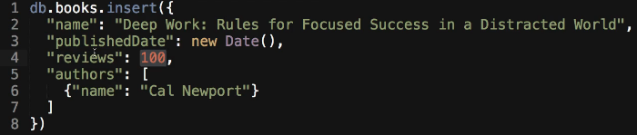
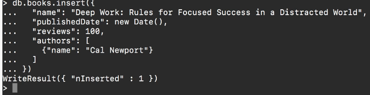
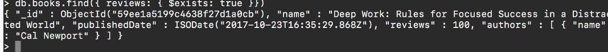
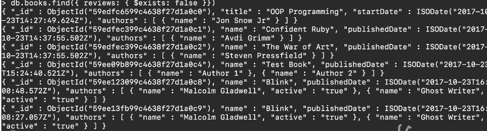

# MODULE 03-159: MongoDB (14)

## How to Check if a Field Exists in a MongoDB Document

---

## **Index**

1. Understanding the Need for Field Existence Checks
2. Using the `$exists` Operator
3. Querying for Documents Where a Field Exists
4. Querying for Documents Where a Field Does Not Exist


---

In MongoDB, documents within the same collection do not have to follow a fixed schema, meaning that some documents may contain fields that others do not. As a result, it is often necessary to check whether a specific field exists in a document before processing it.

This guide explores how to use the `$exists` operator to determine whether a field is present in a MongoDB document.

---

## **Understanding the Need for Field Existence Checks**

Since MongoDB allows flexible document structures, some documents may have fields that others do not. Consider the following example:

- Some books in a `books` collection may have a `reviews` field indicating the number of reviews, while others do not.
- We may need to filter documents based on whether they contain this field.

Using the `$exists` operator, we can efficiently retrieve only those documents that have (or do not have) a particular field.

---

## **Using the `$exists` Operator**

The `$exists` operator is a MongoDB query operator used to check whether a field exists in a document.

### **Syntax:**

```js
{ field: { $exists: <boolean> } }
```

- Setting `$exists` to `true` will return documents where the specified field exists.
- Setting `$exists` to `false` will return documents where the specified field does not exist.

---

## **Querying for Documents Where a Field Exists**

To find all books that include a `reviews` field, use the following query:

```js
db.books.find({ reviews: { $exists: true } })
```

### **Example Output:**

```json
[
  {
    "name": "Deep Work: Rules for Focused Success in a Distracted World",
    "publishedDate": "2024-03-10T00:00:00Z",
    "reviews": 100,
    "authors": [
      { "name": "Cal Newport" }
    ]
  }
]
```

This query retrieves only the documents that include the `reviews` field.

---

## **Querying for Documents Where a Field Does Not Exist**

To find books that do **not** include a `reviews` field, use:

```js
db.books.find({ reviews: { $exists: false } })
```

### **Example Output:**

```json
[
  {
    "name": "The War of Art",
    "publishedDate": "2024-03-10T00:00:00Z",
    "authors": [
      { "name": "Steven Pressfield" }
    ]
  },
  {
    "name": "Blink",
    "publishedDate": "2024-03-10T00:00:00Z",
    "authors": [
      { "name": "Malcolm Gladwell" }
    ]
  }
]
```

This query filters out all books that do contain the `reviews` field.

---

## **Practical Use Cases**

- **Data Integrity Checks:** Identify documents missing expected fields to maintain data consistency.
- **Selective Querying:** Retrieve only documents that include or exclude certain fields.
- **Schema Evolution:** Detect older documents missing newly added fields and update them accordingly.

---

## **MongoDB vs SQL**

| **Operation**                                 | **MongoDB Query**                                | **SQL Equivalent**                               |
| --------------------------------------------- | ------------------------------------------------ | ------------------------------------------------ |
| Find documents where `reviews` exists         | `db.books.find({ reviews: { $exists: true } })`  | `SELECT * FROM books WHERE reviews IS NOT NULL;` |
| Find documents where `reviews` does not exist | `db.books.find({ reviews: { $exists: false } })` | `SELECT * FROM books WHERE reviews IS NULL;`     |

---

## **References**

- **MongoDB `$exists` Documentation:** [https://www.mongodb.com/docs/manual/reference/operator/query/exists/](https://www.mongodb.com/docs/manual/reference/operator/query/exists/)

***

## Video lesson Speech

In this guide, we're going to walk through how we can check to see if a field exists or if it doesn't inside of Mongo.

****

Now, this is something that is needed because of how flexible the Mongo database is. If you remember back to when I showed you how you can create all kinds of different documents in the same database collection with different attributes so one might be name, another might be a title, in this case, I'm adding a new element. 



I'm adding this concept of reviews and then it's going to have a count right here. And in a real-world scenario you might hold a full set of 100 objects of reviews but right now you're just going to make it easy and have that count. Now, this is going to be the only book in the database that has this. 

If I come to the terminal and add this in. It works and so we now have this in the database



The one thing that we need to be able to do is imagine that you're running a query and you need to know if a book has a set of reviews or if it doesn't. Because if it does you want to pull in those reviews and then you want to show them on the page. And if not then you just want to skip over that. And so that is a pretty common thing that you need to do.

With Mungo's nature and with how flexible it is then it's something where you do need to be able to check to see if a field exists or if it doesn't because Mongo gives you the ability to have all of these different kinds of key and value pairs you need to be able to check to see if they exist because you can't really be confident that all of your systems are going to be uniform because of how flexible it is. 

Now in order to run this type of query there, there's actually a specific function for it. And so we can run D-B books find and then pass in an object and I'm not going to pass in any kind of projections or anything like that I want to make this just nice and easy. Obviously you can pass those in and then I'm going to say reviews and then pass in an object. If you remember back to when we talked about the $slice. Well, another function that we can have is $exists. And so this is going to check to see if it exists or if it doesn't. If it does then I want to bring back those items the ones that have reviews and if it doesn't I want you to ignore it and skip over it. If I run this you can see it brings back deep work because that is the one item with reviews. 



Now if I come here and change this to false then you'll see it brings back all of the books except for the deep workbook that has that review count on there.



So this is a way where you can use the regular $exists where you can check to see if it has those values or you can use its contrapositive where you can query for a specific item and say I want you to bring back all of the documents that don't have that attribute. Now from experience one common place where I use this quite a bit especially where I use something where I'm checking to see if it doesn't exist is when I'm going through and I'm cleaning up a database. 

Imagine a scenario as we have right here where we have this book database and we add the concept of reviews later on. What I want to be able to do is to go through that entire collection and check to see which ones have not been updated yet. And then I could run a script that goes and adds reviews to each one of those. So it's a pretty common kind of process that I personally use the $exists for to be able to check for that.

****

## Code

```js
db.books.insert( 
  {
    "name": "Deep Work: Rules for Focused Success in a Distracted World",
    "publishedDate": new Date(),
    "reviews": 100,
    "authors": [
      {"name": "Cal Newport"}
    ]
  }
)

db.books.find({ reviews: { $exists: true } })
db.books.find({ reviews: { $exists: false } })
```

