# MongoDB Course.

## Preamble

***

### **1. What is MongoDB?**

MongoDB is a **NoSQL database** designed for modern application development.   

Unlike traditional relational databases (SQL), MongoDB stores data in **flexible, JSON-like documents** (BSON format).   

This allows developers to work with data in a way that aligns more naturally with how applications are built today.

- **Document-oriented**:     
  
  Data is stored as documents, which are hierarchical and can contain nested structures.

- **Schemaless**:    
  
  Collections (similar to tables in SQL) do not enforce a fixed schema, allowing for dynamic and evolving data models.

- **Scalable**:  
   MongoDB is designed to scale horizontally, meaning you can distribute 
  data across multiple servers (sharding) to handle large datasets and 
  high traffic.

- **High performance**:   
  
  Optimized for read/write operations, with support for indexing, caching, and in-memory processing.

****

### **2. Core Concepts in MongoDB**

To understand MongoDB, you need to familiarize yourself with its core components:

#### **Collections**

- Collections are groups of documents, similar to tables in SQL.

- Unlike SQL tables, collections do not enforce a strict schema. Documents within a collection can have different structures.

#### **Documents**

- Documents are the basic unit of data in MongoDB, stored in BSON (Binary JSON) format.

- Each document is a set of key-value pairs, where values can be strings, numbers, arrays, nested objects, or even binary data.
  
  Example:
  
  ```mongodb
  {
    "_id": ObjectId("64b8f1c7e4b0a1a2b3c4d5e6"),
    "name": "Alice",
    "age": 28,
    "address": {
      "city": "New York",
      "zip": "10001"
    },
    "hobbies": ["reading", "traveling", "photography"]
  }
  ```

#### **Fields**

- Fields are the key-value pairs within a document.   
  For example, `name`, `age`, and `address` are fields in the document above.

#### **Indexes**

- Indexes improve query performance by allowing MongoDB to quickly locate documents.

- You can create indexes on specific fields (e.g., `name`, `age`) or even nested fields (e.g., `address.city`).

### **3. When to Use MongoDB**

MongoDB is particularly well-suited for the following scenarios:

#### **Use Cases**

- **Content Management Systems (CMS)**:  
  
  Flexible schema allows for storing diverse content types (e.g., blogs, articles, media).

- **Real-time Analytics**:  
  MongoDB’s aggregation framework and indexing make it ideal for analyzing large datasets in real time.

- **Internet of Things (IoT)**:  
  MongoDB can handle high volumes of data from IoT devices, with support for time-series data.

- **E-commerce Platforms**:  
  MongoDB’s ability to store product catalogs, user profiles, and orders in a flexible schema is a great fit for e-commerce.

- **Mobile and Web Applications**:  
  MongoDB’s JSON-like documents align well with the data structures used in modern apps.

#### **When Not to Use MongoDB**

- **Highly Transactional Systems**:  
   If your application requires complex transactions with ACID guarantees 
  (e.g., banking systems), a relational database might be a better choice.

- **Strict Schema Requirements**:  
  If your data model is highly structured and unlikely to change, a relational database could be more efficient.

****

### **4. Data Modeling in MongoDB**

One of the most important aspects of working with MongoDB is designing your data model.   
Unlike SQL, where you normalize data into tables, MongoDB encourages **denormalization** and **embedding** for performance and simplicity.

#### **Embedding vs. Referencing**

- **Embedding**: Store related data within a single document.  
  This is ideal for one-to-one or one-to-few relationships.
  
  ```mongodb
  {
    "_id": ObjectId("64b8f1c7e4b0a1a2b3c4d5e6"),
    "name": "Alice",
    "orders": [
      { "order_id": 1, "product": "Laptop", "price": 1200 },
      { "order_id": 2, "product": "Phone", "price": 800 }
    ]
  }
  ```

- **Referencing**: Store references (IDs) to related documents in another collection. This is better for one-to-many or 
  many-to-many relationships.
  
  ```mongodb
  {
    "_id": ObjectId("64b8f1c7e4b0a1a2b3c4d5e6"),
    "name": "Alice",
    "order_ids": [ObjectId("64b8f1c7e4b0a1a2b3c4d5e7"), ObjectId("64b8f1c7e4b0a1a2b3c4d5e8")]
  }
  ```

#### **Best Practices for Data Modeling**

- **Favor Embedding for Read-Heavy Workloads**: Embedding reduces the need for joins, making reads faster.

- **Use Referencing for Large or Frequently Updated Data**: Referencing avoids duplicating data and makes updates more efficient.

- **Consider Document Size**: MongoDB has a 16MB document size limit. Avoid embedding large arrays or deeply nested structures.

- **Plan for Indexes**: Identify fields that will be frequently queried and create indexes for them.

****

### **5. Querying and Aggregation**

MongoDB provides powerful tools for querying and analyzing data.

#### **Basic Queries**

- Find documents that match specific criteria:
  
  ```mongo
  db.users.find({ age: { $gt: 25 } });
  ```

- Use projection to return only specific fields:
  
  ```mongodb
  db.users.find({}, { name: 1, age: 1 });
  ```

#### **Aggregation Framework**

The aggregation framework allows you to perform complex data transformations and 
analysis. It works like a pipeline, where each stage processes the data and passes it to the next stage.

- Example: Group users by city and calculate the average age:
  
  ```mongodb
  db.users.aggregate([
    { $group: { _id: "$address.city", avgAge: { $avg: "$age" } } }
  ]);
  ```

****

### **6. Example Project: Blog Platform**

Let’s design a simple blogging platform using MongoDB.

#### **Collections**

1. **Users**:
   
   ```mongodb
   {
     "_id": ObjectId("64b8f1c7e4b0a1a2b3c4d5e6"),
     "name": "Alice",
     "email": "alice@example.com",
     "password": "hashed_password"
   }
   ```

2. **Posts**:
   
   ```mongodb
   {
     "_id": ObjectId("64b8f1c7e4b0a1a2b3c4d5e7"),
     "title": "Introduction to MongoDB",
     "content": "MongoDB is a NoSQL database...",
     "author_id": ObjectId("64b8f1c7e4b0a1a2b3c4d5e6"),
     "tags": ["MongoDB", "NoSQL", "Database"],
     "created_at": ISODate("2023-10-01T12:00:00Z")
   }
   ```

3. **Comments**:
   
   ```mongodb
   {
     "_id": ObjectId("64b8f1c7e4b0a1a2b3c4d5e8"),
     "post_id": ObjectId("64b8f1c7e4b0a1a2b3c4d5e7"),
     "user_id": ObjectId("64b8f1c7e4b0a1a2b3c4d5e6"),
     "comment": "Great post!",
     "created_at": ISODate("2023-10-01T12:30:00Z")
   }
   ```

#### **Queries**

- Find all posts by a specific user:
  
  ```mongodb
  db.posts.find({ author_id: ObjectId("64b8f1c7e4b0a1a2b3c4d5e6") });
  ```

- Find all comments for a specific post:
  
  ```mongodb
  db.comments.find({ post_id: ObjectId("64b8f1c7e4b0a1a2b3c4d5e7") });
  ```

****

### Some Best Practices

- **Start Small**: Begin with a simple data model and evolve it as your application grows.

- **Monitor Performance**: Use MongoDB’s built-in tools to monitor query performance and optimize indexes.

- **Backup Your Data**: Regularly back up your database to prevent data loss.

- **Learn the Aggregation Framework**: It’s one of MongoDB’s most powerful features for data analysis.

***

***

***

# MODULE 04-161: MongoDB (0)

* **Part 1: Digital Literacy: Guide to NoSQL for Developers**

* **Part 2: Complete NoSQL vs SQL guide**

****

## Part 1: Guide to NoSQL for Developers

This guide will walk through a straightforward explanation of how NoSQL databases work and when they should be used in an application.

### What are NoSQL Databases?

So first and foremost: what are NoSQL databases, and why should I care about them? The easiest way to understand the definition is that **NoSQL databases are not SQL databases**.

- **Standard relational SQL databases** such as Oracle’s SQL server or MySQL have a **tabular structure**, similar to what you’d see in an Excel spreadsheet.
- **NoSQL databases**, on the other hand, have **various types of formats** and can, therefore, be more flexible.

---

### When to Use NoSQL?

For example, imagine that you had to build an application where users were able to define their own fields, such as a survey application where one user may create a survey with two fields and another may create a survey with a hundred fields, and they need to have the ability to be named on the fly.

- **Relational databases** could technically implement this, but it would be very clunky.
- **NoSQL databases** could handle this easily by allowing the fields to be created dynamically, and then each record would be stored with its unique characteristics.

---

### Flexibility vs. Challenges

It’s important to note that one of the greatest strengths of NoSQL—its flexibility—also presents its greatest challenge.

Imagine that you are building out an inventory application that has fields that need to connect to other tables, such as a user table for the employee entering the information, a vendor table, and a tax table to calculate depreciation.

- If you were to attempt to implement a **NoSQL database** for this inventory option, you’d end up having to work very hard to map the values between the models, and it would also make for a very difficult application to maintain.
- In this case study, a **relational database (RDBMS)** would work perfectly.

---

### Choosing the Right Database

So when you’re trying to decide on which database to use, it really comes down to what the requirements of the application are.

- If you wanted to chop a tree down, you wouldn’t use a hammer; you’d use an ax because it’s basic common sense to utilize the right tool for the right job.
- It’s the same way with software development. I don’t believe in the SQL vs. NoSQL debate; they are both tools, and they are the most effective when used in an application that works well with their strengths.

---

### Guidelines for Choosing Between SQL and NoSQL

A good rule of thumb is to simply follow the guidelines given by the names themselves:

- **If you have data that relies heavily on relationships**, then it’s probably the best fit to utilize a **relational SQL database**.
- **If you have an unstructured data set that needs flexibility**, then it may be the best option to go with a database that is **Not SQL**, such as a **NoSQL database**.

---

### Example of NoSQL in MongoDB

For an example of how NoSQL looks, here is a snippet from a MongoDB database:

```mongodb
{
 "_id": "507f1f77bcf86cd799439011",
 "name": "John Doe",
 "age": 30,
 "address": {
 "street": "123 Main St",
 "city": "Anytown",
 "state": "CA",
 "zip": "12345"
 },
 "hobbies": ["reading", "hiking", "coding"]
}
```

Notice how it really just looks like JSON code? It actually is using a form of JSON called **BSON**, short for **Binary JSON**, and it really is just a set of key-value pair data stores that can be structured however your application needs.

****

### Comparison with Relational SQL

This is in comparison with a **relational SQL table**.
 Notice how NoSQL databases encapsulate all of the data into a single object, whereas the SQL structure is built around relationships.

```sql
CREATE TABLE users (
    id INT PRIMARY KEY,
    name VARCHAR(100),
    age INT
);

CREATE TABLE addresses (
    id INT PRIMARY KEY,
    user_id INT,
    street VARCHAR(100),
    city VARCHAR(100),
    state VARCHAR(2),
    zip VARCHAR(10),
    FOREIGN KEY (user_id) REFERENCES users(id)
);
```

****

### Types of NoSQL Databases

If you’re interested in building 
applications with NoSQL databases, it’s important to understand that 
there is no such thing as a standard NoSQL database; there are many 
different variations.

- **Key/Value pair stores**

- **Wide-column family stores**

- **Document databases**

- **Graph databases**

I’ll place a link in the show notes where you can explore each type and see what will work best for your application.

****

## Resources

- [MongoDB document store database](https://www.mongodb.com/)

- [Redis in-memory data store](http://redis.io/)

- [Google BigTable NoSQL database](https://cloud.google.com/bigtable/

****

## Part 2: Complete NoSQL vs SQL guide

### What is SQL?

SQL, or Structured Query Language, is a programming language used to communicate with and manage relational databases. SQL databases are table-based, meaning they store data in rows and columns.   

Each row represents a unique record, and each column represents a field within that record. SQL databases are known for their ability to handle complex queries and transactions, making them ideal for applications that require strong consistency and integrity, such as financial systems.

### What is NoSQL?

NoSQL, or "Not Only SQL," is a type of database that provides a mechanism for storage and retrieval of data that is modeled in means other than the tabular relations used in 
relational databases.   

NoSQL databases are designed to handle large volumes of unstructured or semi-structured data, making them ideal for big data and real-time web applications.   

They are highly scalable and can handle large amounts of data and traffic with ease.

### Key Differences Between SQL and NoSQL

1. **Data Structure**:
   
   - **SQL**: Table-based, with rows and columns.
   
   - **NoSQL**: Document-based, key-value pairs, wide-column stores, or graph databases.

2. **Scalability**:
   
   - **SQL**: Vertically scalable (adding more power to the server).
   
   - **NoSQL**: Horizontally scalable (adding more servers).

3. **Schema**:
   
   - **SQL**: Fixed schema, meaning the structure of the data must be defined in advance.
   
   - **NoSQL**: Dynamic schema, allowing for more flexibility in data structure.

4. **Transactions**:
   
   - **SQL**: ACID-compliant (Atomicity, Consistency, Isolation, Durability).
   
   - **NoSQL**: Often BASE-compliant (Basically Available, Soft state, Eventual consistency).

5. **Use Cases**:
   
   - **SQL**: Best for complex queries, transactions, and applications requiring strong consistency.
   
   - **NoSQL**: Best for large-scale data, real-time applications, and unstructured data.

### When to Use SQL vs. NoSQL

- **Use SQL** when:
  
  - You need complex transactions and queries.
  
  - Your data is structured and relationships are important.
  
  - You require strong consistency and integrity.

- **Use NoSQL** when:
  
  - You are dealing with large volumes of unstructured or semi-structured data.
  
  - You need high scalability and flexibility.
  
  - Your application requires fast, real-time data processing.

## Reference

https://www.coursera.org/articles/nosql-vs-sql

***

***

***

# Module 03 - 146: MongoDB (1)

# MongoDB on Linux + MongoDB Atlas AWS Cluster setup

The original guide explains how to install MongoDB for MAC users but,so that for those Linux users, these steps explains how to set it up.  

Additionally, this guide explains how to install MongoDB without it being system-wide, as well as installing it system-wide. It's suggested to use a non system-wide when posible.

On the other hand, this guide also includes how to set up a free MongoDB Atlas Cluster at AWS (at least while MongoDB allows free accounts for students), to be able to use a remote database or integrate remote MongoDB into our projects.

Finally, a default connection to Atlas@AWS will be performed and explained.

****

# 1) MongoDB Debian 12 alike setup

## A)    Mongo-sh system-wide for shell access + Mongod server/daemon from binaries

1. Add the latest MongoDB sources [from official site](https://www.mongodb.com/docs/manual/tutorial/install-mongodb-on-debian/):

```bash
# Importinf .asc/gpg for apt update
curl -fsSL https://www.mongodb.org/static/pgp/server-8.0.asc | \   sudo gpg -o /usr/share/keyrings/mongodb-server-8.0.gpg \   --dearmor
```

* Adding to sources (These sources could be mordenized)

```bash
echo "deb [ signed-by=/usr/share/keyrings/mongodb-server-8.0.gpg ] http://repo.mongodb.org/apt/debian bookworm/mongodb-org/8.0 main" | sudo tee /etc/apt/sources.list.d/mongodb-org-8.0.list
```

* Getting it

```bash
sudo apt-get update && sudo apt-get install -y mongodb-org
```

2. Getting latest MongoDB Community Server bins, **for the required project folder**:

```bash
curl https://fastdl.mongodb.org/linux/mongodb-linux-x86_64-debian12-8.0.5.tgz

tar -xvz ./mongodb-linux-x86_64-debian12-8.0.5.tgz ./mongodb
```

3. Setting up the mongod.conf file from our project root folder:

```yaml
storage:
    dbPath: ./data/db
systemLog:
    destination: file
    path: ./logs/mongod.log
    logAppend: true
net:
    bindIp: 127.0.0.1
    port: 27017
```

4. Starting the Mongod server, in one terminal tab:

```bash
$ ./mongodb/bin/mongod --config ~/<path-for-the-mongodb-project>/mongod.conf
```

5. Starting the Mongo shell:

```bash
$ mongosh
Current Mongosh Log ID:    *
Connecting to:        mongodb://*
Using MongoDB:        8.0.5
Using Mongosh:        2.4.2

For mongosh info see: https://www.mongodb.com/docs/mongodb-shell/


To help improve our products, anonymous usage data is collected 
and sent to MongoDB periodically (https://www.mongodb.com/legal/privacy-policy).
You can opt-out by running the disableTelemetry() command.

------
   The server generated these startup warnings when booting

test>
```

****

# 2) MongoDB Atlas at Amazon AWS Cluster setup

This part of the guide provides an outline on how to set up and connect a MongoDB Atlas cluster on Amazon AWS, for the moment, free of charge.

Once configured, this action can replace the "Mongod" daemon installed system-wide as it can be accessed through a wide range of methods:

- The local shell in Terminal.
- The official MongoDB WebGUI framework, from the AWS panel.
- A webservice like Render (its free plan accepts connecting both services), or in your own back-end of your own server, with the multitude of languages available to develop using Mongo.

**By default, this mini-course will cover Shell access (JavaScript/JSON alike), and Python back-end using PyMongo**.

****

## General Procedures from AWS side

What will you need?

* A MongoDB (free) registered account (https://www.mongodb.com/cloud/atlas/register)
  
  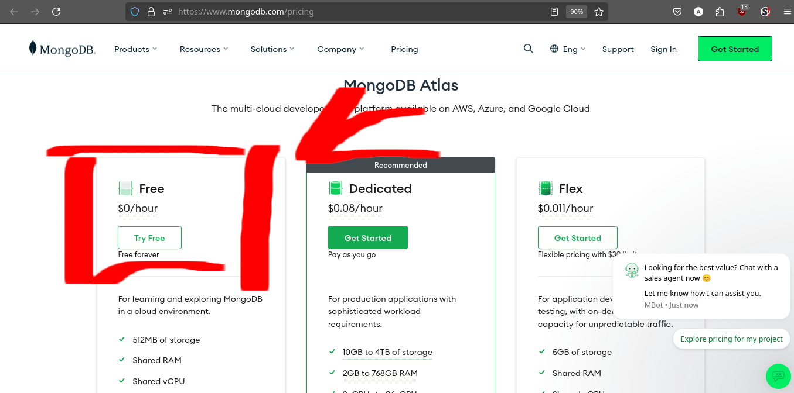

* 

## What is MongoDB Atlas?

*MongoDB Atlas is a multi-cloud database service by the same people that build MongoDB. Atlas simplifies deploying and managing your databases while offering the versatility you need to build resilient and performant global applications on the cloud providers of your choice.*

### 1) Deploy a Database

**1.1 Choose a cluster type** : **FREE CLUSTER**

*Play around with a **free cluster**, launch a serverless instance, or define a dedicated cluster configuration for your application.*

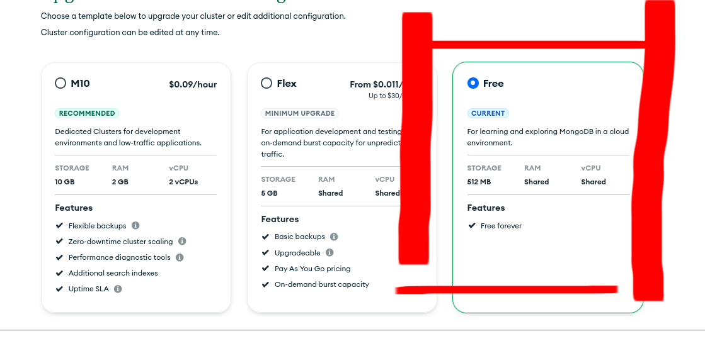

*To choose a deployment type, see Database Deployment Types.*

**1.2 Choose a Cloud Provider and Region:  Amazon AWS @ your nearest location**

*Deploy your database to the same cloud provider and region as your applications to reduce latency and standardize security controls.*

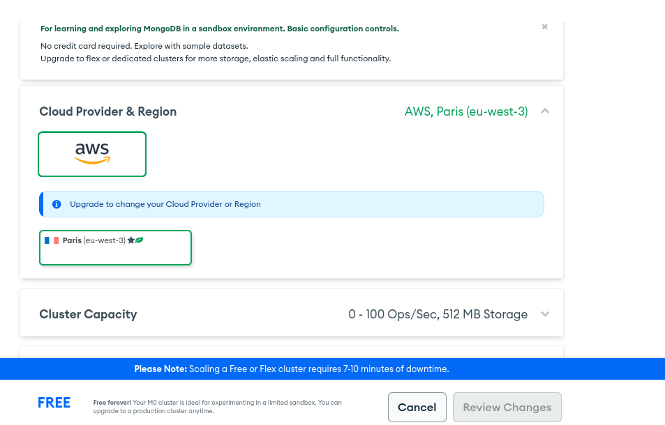

### 2)     Secure the Database

**2.1 Add IP Access List Entries**

*Define an IP access list for your cluster.*

**This can include the IPs of your server, or your webservice on Render, Vercel, etc; or, your IP/DynDNS to access from your shell**.

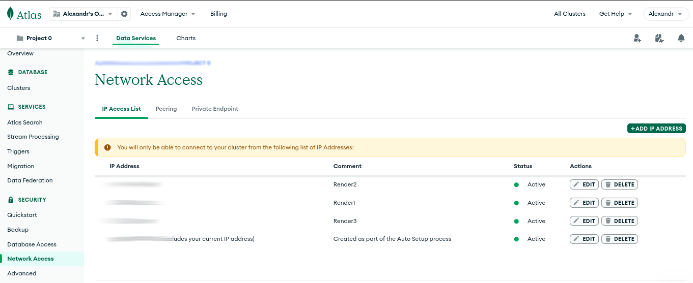

**2.2 Manage Database Users**

*Define how your team members and applications authenticate to your database and what data they can access*.

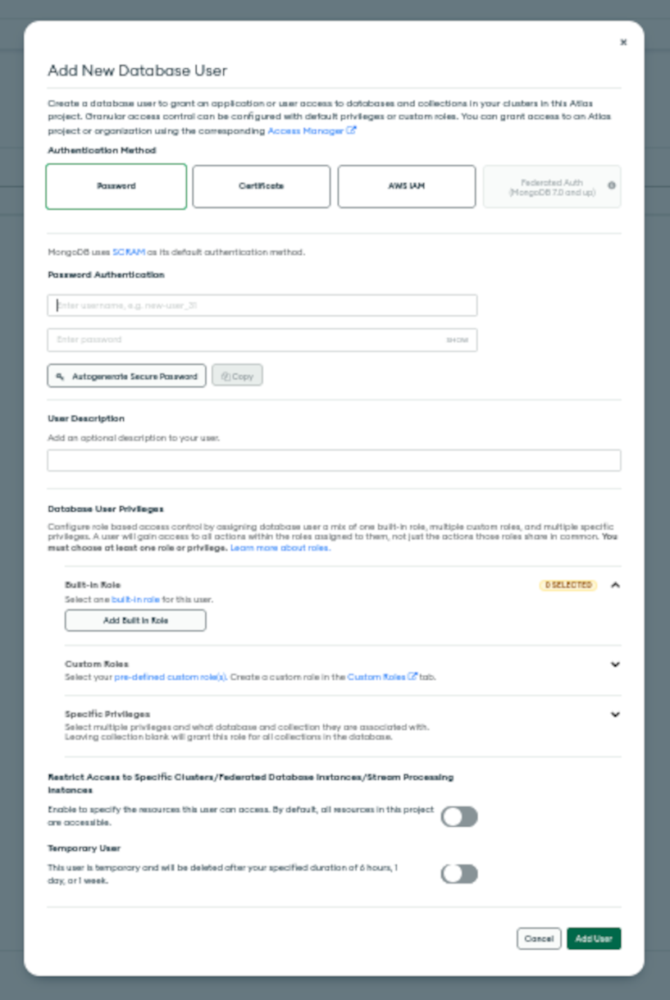

**This means you can create different users, with different permissions, as needed. It is mandatory that you create one, and I suggest to NOT use the default username/passwords of your MongoDB account.**

### 3)    Connect the Database

**3.1 Choose a Connection Type**

*Connect to your database using the MongoDB Shell, one ofMongoDB's native language drivers, MongoDB Compass, or theMongoDB Connector for BI.*

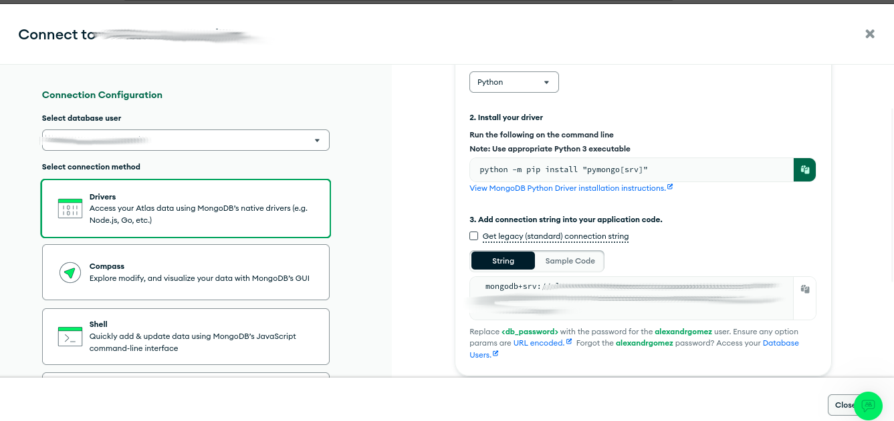

**From this point on, everything is created and configured, so that, how you configure and connect your service depends on the use you are going to make of it (Shell, WebGUI, Render/Vercel/etc...).**

****

# 3) Connecting to MongoDB Atlas via shell

MongoDB Atlas provides a straightforward Connections/Access setup.  

To access it via the local shell, we need at least `mongosh` installed (via sources, via apt install, ....).  

We will create a .conf file and a shell script for quick access.  

Remember to store "secrets" (access paths, username/password, etc.) in a safe place.

1. **Via shell script `./atlas_login.sh`**

```bash
   #!/bin/bash

   echo "Atlas user:  "
   read user
   echo "Atlas Pass: "
   read -s password
   uri="mongodb://<your_FULL_mongoDB_path>"

   # 
   mongosh "$uri" --apiVersion 1 \
   --tls  \
   --authenticationDatabase admin \
   --username "$user" --password "$password"
```

   Expected Output:

```bash
   $ bash ./mongo_shell.sh 
   Atlas user:  
   <user>
   Atlas Pass: 
   Current Mongosh Log ID:    *
   Connecting to:        mongodb://

   Using MongoDB:        8.0.5 (API Version 1)
   Using Mongosh:        2.4.2

   For mongosh info see: https://www.mongodb.com/docs/mongodb-shell/

   Atlas * [primary] test> 
```

Since here, you are enable to start creating, configuring, handling, your database.

****

[database – Database level operations - PyMongo 4.11 documentation](https://pymongo.readthedocs.io/en/4.11/api/pymongo/database.html#pymongo.database.Database.create_collection)

***

***

***

# Module 03-147: MongoDB (2)

## Creating a MongoDB Database Along with Admin Database Users

---

## **Index**

1. Starting MongoDB
2. Listing Existing Databases
3. Creating a New Database
4. Understanding the `db` Object
5. Creating a Database User
6. Listing Users in a Database
7. Deleting a User

---

## **Prerequisites**

Before proceeding, ensure you have MongoDB installed and properly configured on your system. You will need to have the **MongoDB daemon** (`mongod`) running and access to the **MongoDB shell** (`mongo`).

### **Starting MongoDB**

To start the MongoDB daemon, using non system-wide binary and **the current project .conf**, open your terminal and run:

```bash
$ ./mongodb/bin/mongod --config ~/<path-for-the-mongodb-project>/mongod.conf
```

Then, open a new terminal tab or window and enter the MongoDB shell:

```bash
mongosh # mongosh for linux deb users
```

If everything is working correctly, you should see a prompt similar to:

```mongodb
Current Mongosh Log ID:    
Connecting to:        mongodb://
Using MongoDB:        8.0.5
Using Mongosh:        2.4.2

For mongosh info see: https://www.mongodb.com/docs/mongodb-shell/


To help improve our products, anonymous usage data is collected and sent to MongoDB periodically (https://www.mongodb.com/legal/privacy-policy).
You can opt-out by running the disableTelemetry() command.

------
   The server generated these startup warnings when booting

   server logs here...
------

test> 
```

---

## **Listing Existing Databases**

To view the databases currently available on your system, run:

```bash
show dbs
```

Example output:

```
administration  0.000GB
test            0.000GB
```

If you have been working with MongoDB before, you might see additional databases listed.

---

## **Creating a New Database**

To create a new database, use the `use` command followed by the database name:

```bash
use mongoCourse
```

Expected output:

```
switched to db mongoCourse
```

> **Note:** The new database **will not** appear in `show dbs` until at least one document has been inserted.

---

## **Understanding the `db` Object**

MongoDB provides a special object `db`, which always refers to the current active database. To check which database you are in, simply type:

```bash
db
```

Expected output:

```
mongoCourse
```

This confirms that all further operations will be performed on `mongoCourse`.

---

## **Creating a Database User - `.createUser( {...} )`**

Database users are essential for managing access control.   

To create a new user, execute the following JavaScript code inside the MongoDB shell.

**Don't worry if you need many attempts to type full-indented code via CLI. If fails, start again:**

```mongodb
db.createUser({
  user: 'testing',
  pwd: 'testingpass',
  customData: { startDate: new Date() },
  roles: [
    { role: 'clusterAdmin', db: 'admin' },
    { role: 'readAnyDatabase', db: 'admin' },
    'readWrite'
  ]
});


# Return will be { ok: 1 }
```

### **Explanation**

- `user`: The username for the new user.
- `pwd`: The password (ensure you use a strong password in production environments).
- `customData`: Optional metadata, e.g., a timestamp for when the user was created.
- `roles`: Defines the user's permissions:
  - `clusterAdmin`: Grants cluster-wide administrative privileges.
  - `readAnyDatabase`: Allows reading from any database.
  - `readWrite`: Provides read and write access to the current database.

---

## **Listing Users in a Database - `.getUsers()`**

To see all users associated with the current database, use:

```mongodb
db.getUsers()
```

Expected output:

```mongodb
{
  users: [
    {
      _id: 'MongoCourse.testing',
      userId: UUID('ce1ad468-6c8a-4b0a-9bf1-415906014517'),
      user: 'testing',
      db: 'MongoCourse',
      customData: { startDate: ISODate('2025-03-18T18:18:59.343Z') },
      roles: [
        { role: 'clusterAdmin', db: 'admin' },
        { role: 'readAnyDatabase', db: 'admin' },
        { role: 'readWrite', db: 'MongoCourse' }
      ],
      mechanisms: [ 'SCRAM-SHA-1', 'SCRAM-SHA-256' ]
    }
  ],
  ok: 1
}
```

This confirms that our user `testing` has been successfully created with the specified roles.

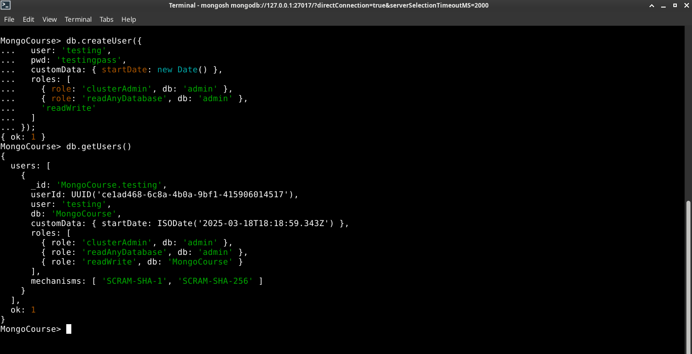

---

## **Deleting a User** `.dropUser()`

If you need to remove a user from the database, run:

```mongodb
db.dropUser('jordan')
```

Expected output:

```mongodb
{ ok: 1 }
```

To verify, check the list of users again:

```bash
db.getUsers()
```

The removed user should no longer appear in the output.

---

## **Review and Best Practices**

- **Ensure the MongoDB daemon (`mongod`) is running** before performing any database operations.
- **Use strong passwords** when creating database users, especially in production environments.
- **Regularly check user permissions** using `db.getUsers()`.
- **Do not rely solely on default roles**—customize roles based on security and access control needs.
- **Remember that a new database will not be listed** until at least one document has been inserted.

---

## References

* [MongoDB Official docs](https://www.mongodb.com/docs/manual/)

* [MongoDB Tutorial: ](https://www.mongodb.com/docs/manual/tutorial/manage-users-and-roles/)

***

***

***

# Module 03-148: MongoDB (3)

## Collections

---

## **Index**

1. Understanding Collections
2. Creating a Collection
3. Listing Collections
4. Understanding System Indexes

---

## **Understanding Collections**

In MongoDB, collections are the equivalent of tables in relational databases. Collections store multiple documents, which are JSON-like objects containing data. Unlike tables, collections do not enforce a rigid schema, allowing flexibility in storing various data structures.

### **Key Differences Between Collections and SQL Tables:**

| Feature     | SQL Table        | MongoDB Collection |
| ----------- | ---------------- | ------------------ |
| Structure   | Fixed schema     | Schema-less        |
| Rows        | Records          | Documents          |
| Columns     | Fields           | Fields (flexible)  |
| Data Format | Structured (SQL) | JSON-like (BSON)   |

---

## **Creating a Collection - `.createCollection()`**

To create a new collection in MongoDB, use the `createCollection` method:

```mongodb
 db.createCollection("books")    # Output { ok: 1 }
```

This response confirms that the collection was successfully created.

> **Note:** Unlike relational databases, MongoDB automatically creates a collection when the first document is inserted. **Explicitly using `createCollection` is only necessary for advanced configurations**.

---

## **Listing Collections**

To view all collections within the current database, run:

```mongodb
MongoCourse> show collections

Books
```

This output shows that the database contains a `books` collection.

---

## **Understanding oldie System Indexes**

It's possible that, if you are using an Old MongoDB version (< 3.x) you'll see another file along with your collection, called `system.indexes`.

It was used for indexing documents in older versions.

Since 3.x version, the `system.indexes`collections are no longer exist.

MongoDB automatically maintained a system.indexes collection, which had stored index metadata. 

****

## **Understanding how MongoDB v3.x work along with Indexes - `db.<collection>.getIndexes()`**

Indexes, in general terms, improve query performance by enabling efficient lookups.

> While you don't need to manage `system.indexes` directly, **understanding how indexes work can help optimize performance**. Learn more in the nowday's [MongoDB Indexing Guide](https://www.mongodb.com/docs/manual/indexes/).

```mongodb
MongoCourse> db.Books.getIndexes()


# Output
[ { v: 2, key: { _id: 1 }, name: '_id_' } ]
```

****

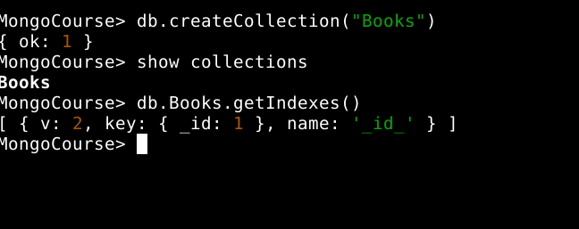

---

## **Best Practices**

- **Let MongoDB create collections automatically** when inserting documents unless specific configurations are required.
- **Use meaningful collection names** (e.g., `users`, `orders`, `logs`).
- **Avoid excessively large collections** without indexing, as performance may degrade.
- **Leverage indexing strategies** to speed up queries and enhance efficiency.

---

## References

[# Databases and Collections in PyMongo](https://www.mongodb.com/docs/languages/python/pymongo-driver/current/databases-collections/)

***

***

***

# Module 03-149: MongoDB (4)

# Inserting Documents

---

## **Index**

1. Understanding MongoDB Documents (1)

2. Inserting a Single Document

3. Handling Flexible Schema

---

## **Understanding MongoDB Documents**

MongoDB stores data in **documents**, which are JSON-like objects consisting of key-value pairs.   

Unlike traditional SQL databases, MongoDB **does not enforce a schema**, allowing documents in the same collection to have different structures.

Each document is stored in a **collection**, which functions similarly to tables in relational databases.

---

## **Inserting a Single Document - `db.<collection>.insertOne( {...})`**

To insert a single document into the `books` collection, use `insertOne()`. This function expects a **JSON object**.

```mongodb
// Insert a single book document - .insertOne()

MongoCourse> db.Books.insertOne(
... {
... "name" : "El Cerebro Musical",
... "publishedDate" : new Date(),
... "authors" : [ { "name" : "Daniel J. Levitin"} ] 
... })
{
```

### **Expected Output:**

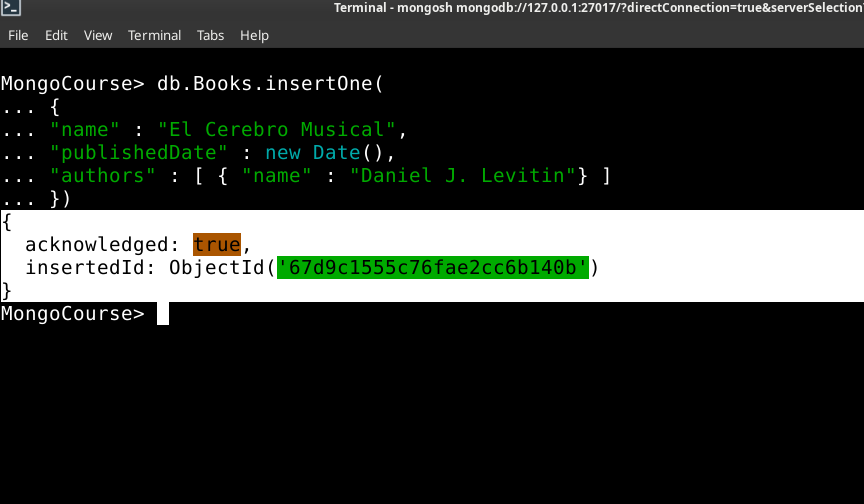

**Note:** `ObjectId` is a unique identifier automatically generated for each document.

---

****

## **Handling Flexible Schema**

MongoDB allows **dynamic schema changes**. 

Documents in the same collection do not need to have identicals structures.

⚠️ **In this case, we're going to introduce a new field key type: Published Year**.

> **Caution:** Schema inconsistency can cause issues when querying and managing data.

**This will help us later in creating a framework to manage records (the database), to specify use cases with flexible fields.**

Example:

```mongodb
db.Books.insertMany([
  {
    "name": "Data Science 101",
    "category": "Technology"
  },
  {
    "name": "Machine Learning",
    "publishedYear": 2023
  }
]);
```

## Expected Output:


---

## **Best Practices**

- **Define a standard document structure** for consistency.

- **Use meaningful field names** that align with your data.

- Leverage indexes to optimize query performance.

- **Validate data** before insertion to prevent inconsistencies.

---

## References

* [MongoDB Docs: Data Modeling](https://www.mongodb.com/docs/manual/data-modeling/)

***

***

***

# MODULE 03-150: MongoDB (5)

## Inserting Multiple Documents

---

## **Index**

1. Understanding Document Insertion (2)
2. The `insertMany()` Method

---

## **Understanding Document Insertion (2)**

In MongoDB, documents are stored in collections, and each document follows a flexible schema.   

Inserting data into a collection is one of the most common operations. MongoDB provides different methods to insert documents, including:

- **`insertOne()`**: Used for inserting a single document.
- **`insertMany()`**: Used for inserting multiple documents at once. **This method expects ARRAYS, not set's/objects.**

In the previous guide, we covered `insertOne()`.   

Now, we'll focus on `insertMany()`, which allows for batch insertion of documents in an efficient manner.

---

## **The `insertMany()` Method**

The `insertMany()` method enables bulk insertion of documents into a MongoDB collection.   

Unlike `insertOne()`, which only takes a single document, `insertMany()` accepts an **array** of documents.

```mongodb
# Basic Sintax

  db.<collection>.insertMany([
    { document1 },
    { document2 },
    { document3 }
 ])
```

## **Inserting Multiple Documents - `db.<collection>.insertMany( {...} )`**

To insert multiple records at once, use `insertMany()` with an **array** of JSON objects.

```mongodb
// Insert multiple book documents - .insertMany())

MongoCourse> db.Books.insertMany([
  {
    "name": "Tecnofeudalismo",
    "publishedDate": new Date("2024-01-01"),
    "authors": [
      { "name": "Yanis Varoufakis" }
    ]
  },
  {
    "name": "Pyongyang: A Journey In North Korea",
    "publishedDate": new Date("2003-01-01"),
    "authors": [
      { "name": "Guy Delisle" }
    ]
  }
])
```

### **Expected Output:**

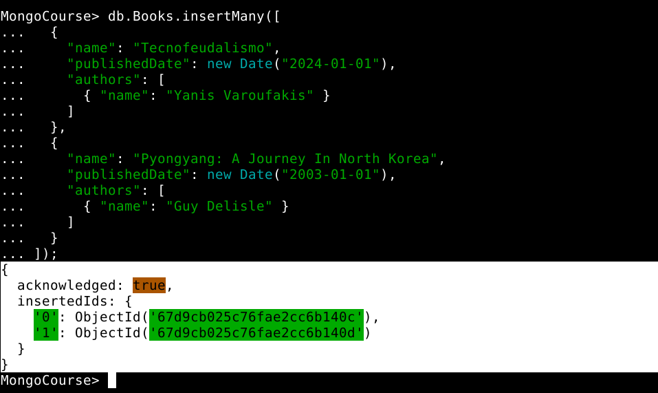

### **Key Points:**

- Each document inside the array must follow valid **BSON** format.
- The method returns metadata, including the `acknowledged` status and a list of inserted **ObjectId** values.
- MongoDB automatically assigns a unique **_id** field to each document if not explicitly provided.

For official documentation, refer to [MongoDB `insertMany()` documentation](https://www.mongodb.com/docs/manual/reference/method/db.collection.insertMany/).

---

## **Best Practices**

### ✅ **Use `insertMany()` for Bulk Insertions**

Instead of inserting documents one at a time, use `insertMany()` to improve efficiency and reduce database load.

### ✅ **Ensure Consistency in Document Structure**

Although MongoDB is schema-less, maintaining a consistent structure across documents simplifies queries and indexing.

### ✅ **Monitor Performance for Large Bulk Inserts**

For **very large** insertions, consider breaking them into smaller batches to avoid excessive memory usage.

### ✅ **Avoid Duplicate Entries passing Documents, not arrays**

MongoDB does not enforce uniqueness unless explicitly defined using **unique indexes**.

```mongodb
db.books.createIndex({ name: 1 }, { unique: true })


# Expected Output: name_1
```

This ensures that no two books share the same name.

****

## References

[MongoDB `**insertMany()**` Documentation](https://www.mongodb.com/docs/manual/reference/method/db.collection.insertMany/)

[MongoDB Data Modeling Best Practices:](https://www.mongodb.com/docs/manual/data-modeling/)

[MongoDB Indexes and Performance Optimization](https://www.mongodb.com/docs/manual/indexes/)

***

***

***

# MODULE 03-151: MongoDB (6)

## Querying Documents with `find()` Method & Advanced Querying with Filters and Projections

---

## **Index**

1. Understanding the `find()` Method

2. Using `find().pretty()` for Better Readability

3. MongoDB vs SQL: Querying All Documents

4. Automatic Object IDs in MongoDB

5. Advanced Querying with Filters and Projections

6. Querying Nested Documents and Arrays

7. Sorting and Limiting Results

8. Counting Documents

9. Debugging and Best Practices

---

So far, we have focused primarily on inserting documents into MongoDB collections.   

However, retrieving and querying data is just as important.   

MongoDB provides various methods to retrieve data efficiently, with the `find()` method being the most fundamental.

In this guide, we will explore how to use `find()` to query documents and compare its functionality to SQL-based queries.   

We will also discuss MongoDB's automatic Object ID generation, advanced querying techniques, and best practices for working with MongoDB queries.  

---

## **Understanding the** `.find()` **Method**

The `find()` method in MongoDB is used to retrieve documents from a collection.  

 It works similarly to the `SELECT` statement in SQL, allowing users to fetch data that matches specific criteria.   

By default, calling `find()` without any parameters returns all documents in the collection.

### **Syntax:**

```mongodb
// Retrieve all documents in a collection 

db.Books.find()
```

### **Example Output:**

```mongodb
[
  {
    _id: ObjectId('67d9c1555c76fae2cc6b140b'),
    name: 'El Cerebro Musical',
    publishedDate: ISODate('2025-03-18T18:54:13.978Z'),
    authors: [ { name: 'Daniel J. Levitin' } ]
  },
  {
    _id: ObjectId('67d9cb025c76fae2cc6b140c'),
    name: 'Tecnofeudalismo',
    publishedDate: ISODate('2024-01-01T00:00:00.000Z'),
    authors: [ { name: 'Yanis Varoufakis' } ]
  },
  {
    _id: ObjectId('67d9cb025c76fae2cc6b140d'),
    name: 'Pyongyang: A Journey In North Korea',
    publishedDate: ISODate('2003-01-01T00:00:00.000Z'),
    authors: [ { name: 'Guy Delisle' } ]
  }
]
```

---

## Why older MongoDB versions **USED** `**find().pretty()**` **for Better Readability**

MongoDB older versions than 5.x returned data like this:

```mongodb
> db.Books.find()
{ "_id" : ObjectId("67d9c1555c76fae2cc6b140b"), "name" : "El Cerebro Musical", "publishedDate" : ISODate("2025-03-18T18:54:13.978Z"), "authors" : [ { "name" : "Daniel J. Levitin" } ] }
{ "_id" : ObjectId("67d9cb025c76fae2cc6b140c"), "name" : "Tecnofeudalismo", "publishedDate" : ISODate("2024-01-01T00:00:00.000Z"), "authors" : [ { "name" : "Yanis Varoufakis" } ] }
```

So that there were available some extending methods, like `.pretty()` or `.toArray()` allowing to  get the query return in a more "human readable" format. This method formats the output in an easily readable JSON structure:

```mongodb
# In older versions, .pretty() pretifies an JSON output ad by-default in newer versions

> db.Books.find().pretty()

{
  "_id" : ObjectId("67d9c1555c76fae2cc6b140b"),
  "name" : "El Cerebro Musical",
  "publishedDate" : ISODate("2025-03-18T18:54:13.978Z"),
  "authors" : [
    { "name" : "Daniel J. Levitin" }
  ]
}
{
  "_id" : ObjectId("67d9cb025c76fae2cc6b140c"),
  "name" : "Tecnofeudalismo",
  "publishedDate" : ISODate("2024-01-01T00:00:00.000Z"),
  "authors" : [
    { "name" : "Yanis Varoufakis" }
  ]
}
```

**It's important to understand that newest MondoDB versions includes by default this helpful output schema when a simple `db.<collection>.find()` query is performed, as long as is also important to be aware of this situation if you have to work with an older Mongo version.**

****

---

## **MongoDB vs SQL: Querying All Documents**

For users coming from a relational database background, it is useful to compare MongoDB’s `find()` method with SQL queries.

| Operation              | MongoDB Query     | SQL Equivalent         |
| ---------------------- | ----------------- | ---------------------- |
| Retrieve all documents | `db.books.find()` | `SELECT * FROM books;` |

This comparison helps in understanding MongoDB’s document-oriented approach in contrast to SQL’s table-based structure.

---

## **Automatic Object IDs in MongoDB**

MongoDB automatically generates a unique identifier (`_id`) for each document.   

This field acts similarly to a **primary key** in SQL databases and is crucial for uniquely identifying each document.

### **Example Document with Object ID:**

```mongodb
{
  "_id": ObjectId("507f191e810c19729de860ea"),
  "name": "Confident Ruby",
  "publishedDate": ISODate("2023-01-01T00:00:00Z")
}
```

* The `_id` field is automatically added if not specified.
- It ensures each document is uniquely identifiable.

- Object IDs contain encoded timestamp information, making them useful for tracking document creation times.

****

## **Advanced Querying with Filters and Projections**

### **Filtering Documents**

You can filter documents by passing a query object to the `find()` method.   

For example, to find books published after a specific date:

```mongodb
MongoCourse> db.Books.find({ publishedDate: { $gt: ISODate("2023-01-01") } })


[
  {
    _id: ObjectId('67d9c1555c76fae2cc6b140b'),
    name: 'El Cerebro Musical',
    publishedDate: ISODate('2025-03-18T18:54:13.978Z'),
    authors: [ { name: 'Daniel J. Levitin' } ]
  },
  {
    _id: ObjectId('67d9cb025c76fae2cc6b140c'),
    name: 'Tecnofeudalismo',
    publishedDate: ISODate('2024-01-01T00:00:00.000Z'),
    authors: [ { name: 'Yanis Varoufakis' } ]
  }
]
```

****

### **Projections**

Projections allow you to specify which fields to include or exclude in the results. For example, to retrieve only the `name` field:

```mongodb
db.Books.find({}, { name: 1, _id: 0 })


[
  { name: 'El Cerebro Musical' },
  { name: 'Tecnofeudalismo' },
  { name: 'Pyongyang: A Journey In North Korea' }
]
```

This query returns only the `name` field and excludes the `_id` field.

****

## **Querying Nested Documents and Arrays**

MongoDB supports querying nested documents and arrays. For example, to find books written by a specific author:

```mongodb
MongoCourse> db.Books.find({ "authors.name": "Yanis Varoufakis" })
[
  {
    _id: ObjectId('67d9cb025c76fae2cc6b140c'),
    name: 'Tecnofeudalismo',
    publishedDate: ISODate('2024-01-01T00:00:00.000Z'),
    authors: [ { name: 'Yanis Varoufakis' } ]
  }
]
```

This query searches for documents where the `authors` array contains an object with the `name` field equal to `"Yanis Varoufakis"`.

****

## **Sorting and Limiting Results**

### **Sorting** - `.sort()`

You can sort the results using the `sort()` method. For example, to sort books by `publishedDate` in descending order:

```mongodb
MongoCourse> db.Books.find().sort({ publishedDate: -1 })
[
  {
    _id: ObjectId('67d9c1555c76fae2cc6b140b'),
    name: 'El Cerebro Musical',
    publishedDate: ISODate('2025-03-18T18:54:13.978Z'),
    authors: [ { name: 'Daniel J. Levitin' } ]
  },
  {
    _id: ObjectId('67d9cb025c76fae2cc6b140c'),
    name: 'Tecnofeudalismo',
    publishedDate: ISODate('2024-01-01T00:00:00.000Z'),
    authors: [ { name: 'Yanis Varoufakis' } ]
  },
  {
    _id: ObjectId('67d9cb025c76fae2cc6b140d'),
    name: 'Pyongyang: A Journey In North Korea',
    publishedDate: ISODate('2003-01-01T00:00:00.000Z'),
    authors: [ { name: 'Guy Delisle' } ]
  }
]
```

### **Limiting** - `.limit()`

To limit the number of results, use the `limit()` method. For example, to retrieve only the first 2 books:

```mongodb
MongoCourse> db.Books.find().limit(2)


[
  {
    _id: ObjectId('67d9c1555c76fae2cc6b140b'),
    name: 'El Cerebro Musical',
    publishedDate: ISODate('2025-03-18T18:54:13.978Z'),
    authors: [ { name: 'Daniel J. Levitin' } ]
  },
  {
    _id: ObjectId('67d9cb025c76fae2cc6b140c'),
    name: 'Tecnofeudalismo',
    publishedDate: ISODate('2024-01-01T00:00:00.000Z'),
    authors: [ { name: 'Yanis Varoufakis' } ]
  }
]
```

****

## **Counting Documents** - `.countDocuments()`

To count the number of documents that match a query, use the `count()` method.   

For example, to count all books:

```mongodb
MongoCourse> db.Books.countDocuments()


3
```

To count books, for example, from published after a specific date:

```mongodb
MongoCourse> db.Books.countDocuments({ 
    publishedDate: { $gt: ISODate("2023-01-01") } 
})


2
```

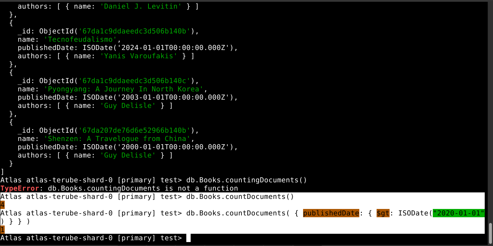

****

## **Debugging and Best Practices**

### **Debugging Queries**

- Use `.explain()` to analyze the performance of a query:

```mongodb
  MongoCourse> db.Books.find().explain("executionStats")
  {
    explainVersion: '1',
    queryPlanner: {


      namespace: 'MongoCourse.Books',
      parsedQuery: {},
      indexFilterSet: false,
      queryHash: '8F2383EE',
      planCacheShapeHash: '8F2383EE',
      planCacheKey: '7DF350EE',
      optimizationTimeMillis: 0,
      maxIndexedOrSolutionsReached: false,
      maxIndexedAndSolutionsReached: false,
      maxScansToExplodeReached: false,
      prunedSimilarIndexes: false,
      winningPlan: { isCached: false, stage: 'COLLSCAN', direction: 'forward' },
      rejectedPlans: []

    },
    executionStats: {

      executionSuccess: true,
      nReturned: 3,
      executionTimeMillis: 0,
      totalKeysExamined: 0,
      totalDocsExamined: 3,
      executionStages: {
        isCached: false,
        stage: 'COLLSCAN',
        nReturned: 3,
        executionTimeMillisEstimate: 0,
        works: 4,
        advanced: 3,
        needTime: 0,
        needYield: 0,
        saveState: 0,
        restoreState: 0,
        isEOF: 1,
        direction: 'forward',
        docsExamined: 3
      }

    },
    queryShapeHash: 'CC342773C26E7E652D64DECED760BE5F66658046AC863313B9690E40EA7A4BF9',
    command: { find: 'Books', filter: {}, '$db': 'MongoCourse' },
    serverInfo: {

      host: '***',
      port: *****,
      version: '8.0.5',
      gitVersion: '***'

    },
    serverParameters: {

      internalQueryFacetBufferSizeBytes: 104857600,
      internalQueryFacetMaxOutputDocSizeBytes: 104857600,
      internalLookupStageIntermediateDocumentMaxSizeBytes: 104857600,
      internalDocumentSourceGroupMaxMemoryBytes: 104857600,
      internalQueryMaxBlockingSortMemoryUsageBytes: 104857600,
      internalQueryProhibitBlockingMergeOnMongoS: 0,
      internalQueryMaxAddToSetBytes: 104857600,
      internalDocumentSourceSetWindowFieldsMaxMemoryBytes: 104857600,
      internalQueryFrameworkControl: 'trySbeRestricted',
      internalQueryPlannerIgnoreIndexWithCollationForRegex: 1

    },
    ok: 1
  }
```

- Check for typos in field names or query operators.

- Use `printjson()` to print documents in a readable format during debugging.

****

### **Best Practices**

- Use indexes to improve query performance.

- Avoid querying large datasets without filters.

- Use projections to retrieve only the necessary fields.

- Regularly monitor and optimize your queries using `.explain()`.

****

## References

[MongoDB Querying Guide:](https://www.mongodb.com/docs/manual/tutorial/query-documents/)

[MongoDB **`find()`** Method Documentation](https://www.mongodb.com/docs/manual/reference/method/db.collection.find/)

***

***

***

# MODULE 03-152: MongoDB (7)

## Querying a Specific Document in Collections

---

## **Index**

1. Querying a Specific Document

2. Handling Multiple Matches

3. Comparing MongoDB and SQL Queries

---

In many real-world scenarios, retrieving all documents is inefficient. Instead, we often need to query for a specific document based on a field value. MongoDB provides the `find()` method, which allows filtering documents by specific criteria.

In this guide, we will explore how to query a single document in MongoDB using `find()`, handle multiple matches, and compare it with SQL queries.

---

## **Querying a Specific Document**

To retrieve a specific document, we pass a query object to `find()`. This object specifies the condition the document must meet.

```mongodb
// Query a book by name

MongoCourse> db.Books.find({ name: "Tecnofeudalismo" })


[
  {
    _id: ObjectId('67d9cb025c76fae2cc6b140c'),
    name: 'Tecnofeudalismo',
    publishedDate: ISODate('2024-01-01T00:00:00.000Z'),
    authors: [ { name: 'Yanis Varoufakis' } ]
  }
]
```

This query returns only documents where the `name` field matches "Tecnofeudalismo".

---

## **Handling Multiple Matches**

The `find()` method returns **all** matching documents.   

If multiple documents have the same `name`, they will all be included in the output.

```mongodb
// Query multiple documents with the same name

MongoCourse> db.Books.find({ "authors.name" : "Guy Delisle"  })
[
  {
    _id: ObjectId('67d9cb025c76fae2cc6b140d'),
    name: 'Pyongyang: A Journey In North Korea',
    publishedDate: ISODate('2003-01-01T00:00:00.000Z'),
    authors: [ { name: 'Guy Delisle' } ]
  },
  {
    _id: ObjectId('67d9da355c76fae2cc6b1410'),
    name: 'Shenzen: A Travelogue from China',
    publishedDate: ISODate('2000-01-01T00:00:00.000Z'),
    authors: [ { name: 'Guy Delisle' } ]
  }
]
```

If multiple books exist with the same key or key.subkey (**use .dotNotation**) the result will contain all of them.   

This behavior is different from SQL, where primary keys ensure unique values.

To retrieve only the first matching document, use `findOne()`:

```mongodb
// Retrieve only the first matching document

MongoCourse> db.Books.findOne({ "authors.name" : "Guy Delisle"  })

{
  _id: ObjectId('67d9cb025c76fae2cc6b140d'),
  name: 'Pyongyang: A Journey In North Korea',
  publishedDate: ISODate('2003-01-01T00:00:00.000Z'),
  authors: [ { name: 'Guy Delisle' } ]
}
```

This ensures that only **one** document is returned, even if multiple matches exist.

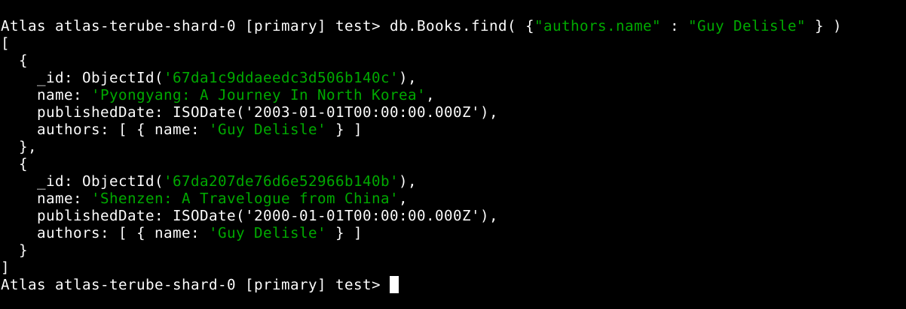

---

## **Comparing MongoDB and SQL Queries**

For those familiar with SQL, the equivalent of MongoDB’s `find()` method is the `SELECT` statement with a `WHERE` clause.

| Operation                        | MongoDB Query                                   | SQL Equivalent                                                |
| -------------------------------- | ----------------------------------------------- | ------------------------------------------------------------- |
| Find a document by name          | `db.books.find({ name: "OOP Programming" })`    | `SELECT * FROM books WHERE name = 'OOP Programming';`         |
| Find the first matching document | `db.books.findOne({ name: "OOP Programming" })` | `SELECT * FROM books WHERE name = 'OOP Programming' LIMIT 1;` |

****

## References

[MongoDB `**find()**`** Method Documentation:](https://www.mongodb.com/docs/manual/reference/method/db.collection.find/)

[MongoDB `**findOne()**` Method Documentation:](https://www.mongodb.com/docs/manual/reference/method/db.collection.findOne/)

***

***

***

# MODULE 03-153: MongoDB (8)

## Introduction to Projections

---

## **Index**

1. Understanding Projections in MongoDB

2. Using Projections with the `find()` Method

3. Including and Excluding Fields

4. MongoDB vs SQL: Projection Queries

---

By default, when querying a MongoDB collection using the `find()` method, all fields of a document are returned. However, in most cases, retrieving all attributes is unnecessary and inefficient, especially in large datasets.

**Projections** in MongoDB allow you to specify which fields should be included or excluded from the query results.

In this guide, we will explore how to use projections in MongoDB queries to retrieve only the necessary fields efficiently.

---

## **Understanding Projections in MongoDB**

A **projection** is a specification of the fields that should be included or excluded in the query results. This helps optimize performance by reducing the amount of data transferred from the database.

### **Why Use Projections?**

- Improves query performance by reducing data retrieval size.

- Helps prevent over-fetching unnecessary data.

- Optimizes network bandwidth and response time.

---

## **Using Projections with the** `**find()**` **Method**

The `find()` method in MongoDB accepts two parameters:

1. **Query object** - Specifies the selection criteria.

2. **Projection object** - Specifies the fields to include or exclude.

```mongodb
// Find documents with projection

MongoCourse> db.Books.find(
{ "name" : "El Cerebro Musical" },
{ "name" : 1, "authors" : 1, "_id" : 0 }
)


[
  {
    name: 'El Cerebro Musical',
    authors: [ { name: 'Daniel J. Levitin' } ]
  }
]
```

The projection `{ name: 1, authors: 1, _id: 0 }` specifies that only the `name` and `authors` fields should be returned while excluding `_id`.

---

## **Including and Excluding Fields**

MongoDB allows **two approaches** for projections:

### **1. Including Specific Fields**

Set the desired fields to `1` (except for `_id`, which is included by default unless excluded explicitly).

#### **Example:**

```mongodb
// Return only the name and authors fields

MongoCourse> db.Books.find( {}, { "name" : 1, "authors" : 1 } )


[
  {
    _id: ObjectId('67d9c1555c76fae2cc6b140b'),
    name: 'El Cerebro Musical',
    authors: [ { name: 'Daniel J. Levitin' } ]
  },
  {
    _id: ObjectId('67d9cb025c76fae2cc6b140c'),
    name: 'Tecnofeudalismo',
    authors: [ { name: 'Yanis Varoufakis' } ]
  },
  {
    _id: ObjectId('67d9cb025c76fae2cc6b140d'),
    name: 'Pyongyang: A Journey In North Korea',
    authors: [ { name: 'Guy Delisle' } ]
  },
  {
    _id: ObjectId('67d9da355c76fae2cc6b1410'),
    name: 'Shenzen: A Travelogue from China',
    authors: [ { name: 'Guy Delisle' } ]
  }
]
```

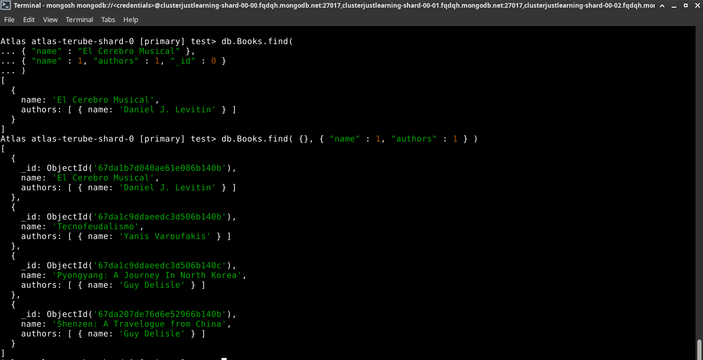

### **2. Excluding Specific Fields**

Set the fields to `0` to remove them from the results.

#### **Example:**

```mongodb
// Exclude the Authors field

MongoCourse> db.Books.find( {}, { "authors" : 0 } )


[
  {
    _id: ObjectId('67d9c1555c76fae2cc6b140b'),
    name: 'El Cerebro Musical',
    publishedDate: ISODate('2025-03-18T18:54:13.978Z')
  },
  {
    _id: ObjectId('67d9cb025c76fae2cc6b140c'),
    name: 'Tecnofeudalismo',
    publishedDate: ISODate('2024-01-01T00:00:00.000Z')
  },
  {
    _id: ObjectId('67d9cb025c76fae2cc6b140d'),
    name: 'Pyongyang: A Journey In North Korea',
    publishedDate: ISODate('2003-01-01T00:00:00.000Z')
  },
  {
    _id: ObjectId('67d9da355c76fae2cc6b1410'),
    name: 'Shenzen: A Travelogue from China',
    publishedDate: ISODate('2000-01-01T00:00:00.000Z')
  }
]
```

- You **cannot mix** inclusion (`1`) and exclusion (`0`) in the same query, **except for** `**_id**`.

- If no projection is specified, all fields are returned by default.


### 

- 

---

## **MongoDB vs SQL: Projection Queries**

| **Operation**          | **MongoDB Query**                            | **SQL Equivalent**                 |
| ---------------------- | -------------------------------------------- | ---------------------------------- |
| Select specific fields | `db.books.find({}, { name: 1, authors: 1 })` | `SELECT name, authors FROM books;` |
| Exclude a field        | `db.books.find({}, { publishedDate: 0 })`    | `SELECT name, authors FROM books;` |

---

## **References**

***

***

***

# MODULE 03-154: MongoDB (9)

## Querying for a Portion of a Nested Array Element using `$slice`

---

## **Index**

1. Understanding the `$slice` Operator

2. Using `$slice` in Queries

3. Examples of `$slice` Projections

4. MongoDB vs SQL: Handling Nested Arrays

****

Actual database:

```mongodb
test> db.Books.find()
[
  {
    _id: ObjectId('67da1b7d040ae61e086b140b'),
    name: 'El Cerebro Musical',
    publishedDate: ISODate('2019-06-13T00:00:00.000Z'),
    authors: [ { name: 'Daniel J. Levitin' } ]
  },
  {
    _id: ObjectId('67da1c9ddaeedc3d506b140b'),
    name: 'Tecnofeudalismo',
    publishedDate: ISODate('2024-01-01T00:00:00.000Z'),
    authors: [ { name: 'Yanis Varoufakis' } ]
  },
  {
    _id: ObjectId('67da1c9ddaeedc3d506b140c'),
    name: 'Pyongyang: A Journey In North Korea',
    publishedDate: ISODate('2003-01-01T00:00:00.000Z'),
    authors: [ { name: 'Guy Delisle' } ]
  },
  {
    _id: ObjectId('67da207de76d6e52966b140b'),
    name: 'Shenzen: A Travelogue from China',
    publishedDate: ISODate('2000-01-01T00:00:00.000Z'),
    authors: [ { name: 'Guy Delisle' } ]
  },
  {
    _id: ObjectId('67da257ce76d6e52966b140c'),
    name: '1984',
    publishedDate: ISODate('1949-06-08T00:00:00.000Z'),
    authors: [ { name: 'George Orwell' }, { name: 'Eric Arthur Blair' } ]
  }
]
```

---

When working with MongoDB, we often deal with **nested arrays** inside documents.   

By default, querying a document with an array field will return all elements of that array.   

**However, there are cases where we may only want to retrieve a portion of the array rather than the full dataset.**

MongoDB provides the `$slice` operator to limit the number of elements returned from an array field.   

This guide will explain how to use `$slice` to refine query results efficiently.

---

## **Understanding the** `$slice` **Operator**

The `$slice` operator allows retrieving a subset of an array field when querying documents. It is used within the **projection object** of the `find()` method.

- Limits the number of array elements returned.

- Can return elements from the beginning, end, or a specified range within the array.

- Helps reduce data transfer size when working with large datasets.

---

## **Using** `$slice` **in Queries**

The `$slice` operator is used within the projection part of the `find()` method.

```mongodb
// Retrieve only the first N elements of an array field

 db.books.find(
   { name: "1984" }, // Query condition
   { authors: { $slice: 1 } } // Projection using `$slice`
 )
```

### **Example Document:**

```mongodb
Atlas atlas-terube-shard-0 [primary] test> db.Books.find(
... { name : '1984'},
... { authors : { $slice: 1  } }
... )
[
  {
    _id: ObjectId('67da257ce76d6e52966b140c'),
    name: '1984',
    publishedDate: ISODate('1949-06-08T00:00:00.000Z'),
    authors: [ { name: 'George Orwell' } ]
  }
]
```

The above query will return only the **first author** from the `authors` array.

---

## **Examples of** `**$slice**` **Projections**

### **Retrieving the First Element**

```mongodb
// Return only the FIRST author value

 db.books.find(
   { name: "Blink" },
   { authors: { $slice: 1 } }
 )
```

### **Retrieving the Last Element**

```mongodb
// Return only the last author

 db.books.find(
   { name: "1984" },
   { authors: { $slice: -1 } }
 )


[
  {
    _id: ObjectId('67da257ce76d6e52966b140c'),
    name: '1984',
    publishedDate: ISODate('1949-06-08T00:00:00.000Z'),
    authors: [ { name: 'Eric Arthur Blair' } ]
  }
]
```

### **Retrieving Multiple Elements from the Start**

```mongodb
// Return the first two element

 db.books.find(
   { name: "1984" },
   { authors: { $slice: 2 } }
 )


[
  {
    _id: ObjectId('67da257ce76d6e52966b140c'),
    name: '1984',
    publishedDate: ISODate('1949-06-08T00:00:00.000Z'),
    authors: [ { name: 'George Orwell' }, { name: 'Eric Arthur Blair' } ]
  }
]
```

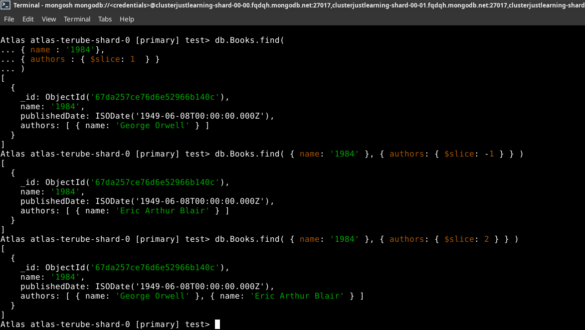

---

## **MongoDB vs SQL: Handling Nested Arrays**

In SQL-based databases, handling nested array structures typically requires **JOIN operations** or **subqueries**.   

However, MongoDB’s `$slice` operator provides a simpler, built-in solution for retrieving partial array data efficiently.

| **Operation**                         | **MongoDB Query**                                               | **SQL Equivalent**                                          |
| ------------------------------------- | --------------------------------------------------------------- | ----------------------------------------------------------- |
| Retrieve first N elements of an array | `db.books.find({ name: "Blink" }, { authors: { $slice: 1 } })`  | No direct equivalent (requires **JOINs** or **subqueries**) |
| Retrieve last element of an array     | `db.books.find({ name: "Blink" }, { authors: { $slice: -1 } })` | No direct equivalent                                        |

***

***

***

# MODULE 03-155: MongoDB (10)

## How to Delete Documents in MongoDB

---

## **Index**

1. Understanding Document Deletion in MongoDB

2. The deprecated, but useful, `.remove()` Method

3. Deleting a Specific Document - `.deleteOne( {...} )`

4. Deleting Multiple Documents - `.deleteMany( [array] )`

5. MongoDB vs SQL: Delete Queries

---

So far, we have explored various methods for inserting and querying documents in MongoDB.   

However, managing a database also involves removing unwanted or obsolete documents. In this guide, we will focus on how to **delete documents** efficiently using MongoDB's built-in methods.

---

## **Understanding Document Deletion in MongoDB**

MongoDB provides multiple ways to delete documents:

- `remove()` **(Deprecated)** – Previously used to delete documents (replaced by `deleteOne()` and `deleteMany()`).

- `deleteOne( {...} )` – Removes a single document matching a query.

- `deleteMany( [array] )` – Removes all documents that match a given query.

Using the appropriate method ensures that only the intended documents are removed while preserving database integrity.

---

## **Using the** `**remove()**` **Method**

> ⚠️ **Note:** The `remove()` method is deprecated and has been replaced by `deleteOne()` and `deleteMany()`. However, we include it here for historical reference.

```mongodb
// Remove all documents that match the query

db.books.remove({ name: "Machine Learning" })

// Remove only one document that matches the query
db.Books.remove({ name: "Data Science 101" }, 1)
```

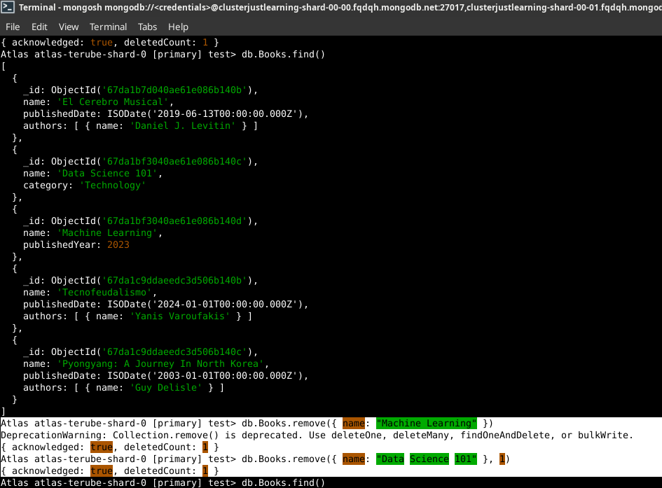

---

## **Deleting a Specific Document**

To delete a single document that matches a given filter, use `deleteOne()`.

### **Syntax:**

```mongodb
// Delete one document where name is "OOP Programming"

db.books.deleteOne({ name: "OOP Programming" })
```

### **Example Output:**

```mongodb
{ "acknowledged": true, "deletedCount": 1 }
```

This command removes only **one** matching document, even if multiple exist.

---

## **Deleting Multiple Documents**

To delete **all documents** that match a given query, use `deleteMany()`.

### **Syntax:**

```mongodb
// Delete all documents where name is "OOP Programming"

db.books.deleteMany({ name: "OOP Programming" })
```

### **Example Output:**

```mongodb
{ "acknowledged": true, "deletedCount": 3 }
```

This command removes **all** documents that have `name: "OOP Programming"`.

---

## **MongoDB vs SQL: Delete Queries**

| **Operation**             | **MongoDB Query**                                  | **SQL Equivalent**                                          |
| ------------------------- | -------------------------------------------------- | ----------------------------------------------------------- |
| Delete a single document  | `db.books.deleteOne({ name: "OOP Programming" })`  | `DELETE FROM books WHERE name = 'OOP Programming' LIMIT 1;` |
| Delete multiple documents | `db.books.deleteMany({ name: "OOP Programming" })` | `DELETE FROM books WHERE name = 'OOP Programming';`         |

***

***

***

# MODULE 03-156: MongoDB (11)

## Including Nested Fields in a find Query

---

## **Index**

1. Working with Nested Fields in MongoDB

2. Querying Specific Nested Fields

3. Using Projections to Limit Nested Data

4. MongoDB vs SQL: Nested Queries

****

Actual Database:

```mongodb
Atlas atlas-terube-shard-0 [primary] test> db.Books.insertOne(
... {
...     "name": "Blink",
...     "publishedDate": "2024-03-10T10:00:00Z",
...     "authors": [
...         { "name": "Malcolm Gladwell", "active": true },
...         { "name": "Ghost Writer", "active": true }
...     ]
... }
... )
{
  acknowledged: true,
  insertedId: ObjectId('67da278be76d6e52966b140d')
}
Atlas atlas-terube-shard-0 [primary] test> db.Books.find()
[
  {
    _id: ObjectId('67da1b7d040ae61e086b140b'),
    name: 'El Cerebro Musical',
    publishedDate: ISODate('2019-06-13T00:00:00.000Z'),
    authors: [ { name: 'Daniel J. Levitin' } ]
  },
  {
    _id: ObjectId('67da1c9ddaeedc3d506b140b'),
    name: 'Tecnofeudalismo',
    publishedDate: ISODate('2024-01-01T00:00:00.000Z'),
    authors: [ { name: 'Yanis Varoufakis' } ]
  },
  {
    _id: ObjectId('67da1c9ddaeedc3d506b140c'),
    name: 'Pyongyang: A Journey In North Korea',
    publishedDate: ISODate('2003-01-01T00:00:00.000Z'),
    authors: [ { name: 'Guy Delisle' } ]
  },
  {
    _id: ObjectId('67da207de76d6e52966b140b'),
    name: 'Shenzen: A Travelogue from China',
    publishedDate: ISODate('2000-01-01T00:00:00.000Z'),
    authors: [ { name: 'Guy Delisle' } ]
  },
  {
    _id: ObjectId('67da257ce76d6e52966b140c'),
    name: '1984',
    publishedDate: ISODate('1949-06-08T00:00:00.000Z'),
    authors: [ { name: 'George Orwell' }, { name: 'Eric Arthur Blair' } ]
  },
  {
    _id: ObjectId('67da278be76d6e52966b140d'),
    name: 'Blink',
    publishedDate: '2024-03-10T10:00:00Z',
    authors: [
      { name: 'Malcolm Gladwell', active: true },
      { name: 'Ghost Writer', active: true }
    ]
  }
]
```

---

MongoDB provides a flexible schema design that allows documents to have **nested fields** and **embedded arrays**.   

This structure is beneficial when working with complex data relationships.   

However, **retrieving specific data from these nested structures requires special querying techniques**.  

In this guide, we will explore how to query **specific fields inside nested objects** using projections in MongoDB.  

---

## **Working with Nested Fields in MongoDB**

In MongoDB, documents can contain **nested objects** or **arrays of objects**. This allows data to be stored in a hierarchical manner.

### **Example Document with Nested Fields:**

```mongodb
{
    "name": "Blink",
    "publishedDate": "2024-03-10T10:00:00Z",
    "authors": [
        { "name": "Malcolm Gladwell", "active": true },
        { "name": "Ghost Writer", "active": true }
    ]
}
```

In this example:

- `authors` is an **array** of objects.

- Each object inside `authors` contains `name` and `active` fields.

Retrieving specific nested fields requires **dot notation** (`"parent.child"`).

---

## **Querying Specific Nested Fields**

We can use the `find()` method to retrieve only specific **nested fields** from documents.

### **Syntax:**

```mongodb
// Find books where name is "Blink" and return only the authors' names  

Atlas atlas-terube-shard-0 [primary] test> db.Books.find(
... { name: "Blink" },
... { "authors.name": 1 }
... )


[
  {
    _id: ObjectId('67da278be76d6e52966b140d'),
    authors: [ { name: 'Malcolm Gladwell' }, { name: 'Ghost Writer' } ]
  }
]
```

Here, only the `name` field inside the `authors` array is returned, **excluding** the `active` field.

---

## **Using Projections to Limit Nested Data**

Projections allow us to control which **nested fields** are included or excluded in query results.

### **Example:** Excluding `_id` and Returning Only Specific Fields

```mongodb
// Return only the book name and authors' names, excluding _id  

Atlas atlas-terube-shard-0 [primary] test> db.Books.find(
...   { name: "Blink" },
...   {
...     _id: 0,
...     name: 1,
...     "authors.name": 1
...   }
... )


[
  {
    name: 'Blink',
    authors: [ { name: 'Malcolm Gladwell' }, { name: 'Ghost Writer' } ]
  }
]
```

- `_id: 0` explicitly **excludes** the `_id` field.

- `name: 1` includes the `name` field of the book.

- `"authors.name": 1` retrieves only the `name` field inside the `authors` array.

---

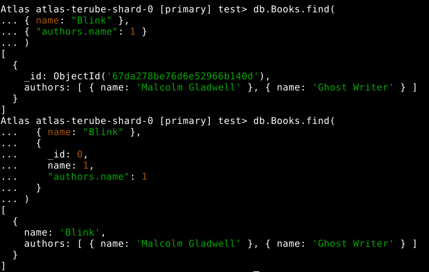

****

## **MongoDB vs SQL: Nested Queries**

| **Operation**                   | **MongoDB Query**                                         | **SQL Equivalent**                                     |
| ------------------------------- | --------------------------------------------------------- | ------------------------------------------------------ |
| Retrieve specific nested fields | `db.books.find({ name: "Blink" }, { "authors.name": 1 })` | `SELECT authors.name FROM books WHERE name = 'Blink';` |
| Exclude `_id` field             | `db.books.find({}, { _id: 0, "authors.name": 1 })`        | `SELECT authors.name FROM books;`                      |

***

***

***

# MODULE 03-157: MongoDB (12)

## Using the `findOne` Method in MongoDB

---

## **Index**

1. Understanding the `findOne` Method
2. Using `findOne` to Retrieve a Single Document
3. Comparing `find()` vs `findOne()`
4. MongoDB vs SQL: Single Record Query

---

When querying a MongoDB collection, sometimes you need to retrieve only a single document rather than multiple results. MongoDB provides the `findOne()` method, which is designed to return the first document that matches a given query.

This guide will explain how `findOne()` works, its differences compared to `find()`, and how it can be leveraged in applications where retrieving a single record is necessary.

---

## **Understanding the `findOne` Method**

MongoDB’s `findOne()` method is used to return the **first** document that matches a given query. If no matching document is found, it returns `null`.

### **Syntax:**

```mongodb
// Basic findOne query

 db.<collection>.findOne({ query })
```

The key difference between `findOne()` and `find()` is that `findOne()` **only returns a single document** instead of a cursor containing multiple documents.

---

## **Using `findOne` to Retrieve a Single Document**

If multiple documents match the query, all will be returned. However, using `findOne()`, only the first matching document will be retrieved:

```mongodb
Atlas atlas-terube-shard-0 [primary] test> db.Books.findOne(
... { name: "Blink" }
)


{
  _id: ObjectId('67da278be76d6e52966b140d'),
  name: 'Blink',
  publishedDate: '2024-03-10T10:00:00Z',
  authors: [
    { name: 'Malcolm Gladwell', active: true },
    { name: 'Ghost Writer', active: true }
  ]
}
```

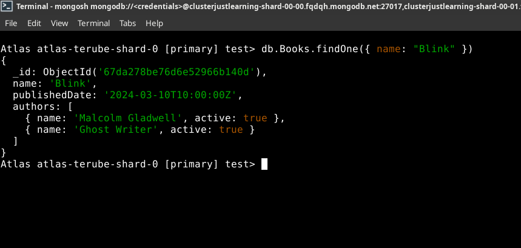

 **Benefits of `findOne()`:**

- Guarantees that only one document is returned.
- Eliminates the need to iterate over multiple documents.
- Useful in applications that require a single result (e.g., retrieving user profiles, fetching configuration settings).

---

## **Comparing `find()` vs `findOne()`**

| Feature            | `find()`                    | `findOne()`               |
| ------------------ | --------------------------- | ------------------------- |
| Returns            | Cursor (multiple documents) | Single document or `null` |
| Use Case           | Retrieving multiple records | Retrieving one record     |
| Requires Iteration | Yes                         | No                        |
| Default Output     | JSON array                  | JSON object               |

If multiple documents match the query, `findOne()` returns **only the first document** found, whereas `find()` returns a cursor that can contain multiple documents.

---

## **MongoDB vs SQL: Single Record Query**

| **Operation**        | **MongoDB Query**                     | **SQL Equivalent**                                  |
| -------------------- | ------------------------------------- | --------------------------------------------------- |
| Find a single record | `db.books.findOne({ name: "Blink" })` | `SELECT * FROM books WHERE name = 'Blink' LIMIT 1;` |

In SQL databases, retrieving a single record often involves using the `LIMIT 1` clause, while in MongoDB, `findOne()` handles this automatically.

---

## **References**

- [**MongoDB findOne() Documentation:**](https://www.mongodb.com/docs/manual/reference/method/db.collection.findOne)

***

***

***

# MODULE 03-158: MongoDB (13)

## Querying for a Portion of a String in a MongoDB Document

***

1. Understanding String Queries in MongoDB
2. Using Regular Expressions for Partial String Matching
3. Case-Insensitive Queries
4. Comparison with SQL LIKE Operator

---

## **Introduction**

In real-world applications, exact string matching is rarely sufficient.   

Instead, developers often need to query documents based on **partial string matches**, such as searching for keywords within a larger text field.   

MongoDB provides **regular expressions (RegEx)** as a powerful tool to perform such queries.

This guide will demonstrate how to use **MongoDB's find() method** with regular expressions to search for a portion of a string inside a document.

---

## **Understanding String Queries in MongoDB**

MongoDB's `find()` method typically retrieves documents where field values match the query exactly. However, when searching for substrings or patterns within a text field, an **exact match is not practical**.

Consider the actual Books collections as :

```mongodb
Atlas atlas-terube-shard-0 [primary] test> db.Books.find()


[
  {
    _id: ObjectId('67da1b7d040ae61e086b140b'),
    name: 'El Cerebro Musical',
    publishedDate: ISODate('2019-06-13T00:00:00.000Z'),
    authors: [ { name: 'Daniel J. Levitin' } ]
  },
  {
    _id: ObjectId('67da1c9ddaeedc3d506b140b'),
    name: 'Tecnofeudalismo',
    publishedDate: ISODate('2024-01-01T00:00:00.000Z'),
    authors: [ { name: 'Yanis Varoufakis' } ]
  },
  {
    _id: ObjectId('67da1c9ddaeedc3d506b140c'),
    name: 'Pyongyang: A Journey In North Korea',
    publishedDate: ISODate('2003-01-01T00:00:00.000Z'),
    authors: [ { name: 'Guy Delisle' } ]
  },
  {
    _id: ObjectId('67da207de76d6e52966b140b'),
    name: 'Shenzen: A Travelogue from China',
    publishedDate: ISODate('2000-01-01T00:00:00.000Z'),
    authors: [ { name: 'Guy Delisle' } ]
  },
  {
    _id: ObjectId('67da257ce76d6e52966b140c'),
    name: '1984',
    publishedDate: ISODate('1949-06-08T00:00:00.000Z'),
    authors: [ { name: 'George Orwell' }, { name: 'Eric Arthur Blair' } ]
  },
  {
    _id: ObjectId('67da278be76d6e52966b140d'),
    name: 'Blink',
    publishedDate: '2024-03-10T10:00:00Z',
    authors: [
      { name: 'Malcolm Gladwell', active: true },
      { name: 'Ghost Writer', active: true }
    ]
  },
  {
    _id: ObjectId('67da2962e76d6e52966b140e'),
    name: 'Deep Work: Rules for Focused Success in a Distracted World',
    publishedDate: ISODate('2025-03-19T02:18:10.599Z'),
    authors: [ { name: 'Cal Newport' } ]
  }
]
```

A **standard** query would require an exact match:

```mongodb
db.books.findOne(
... { name: "Deep Work: Rules for Focused Success in a Distracted World" }
)
```

This is **not flexible**. If a user searches for just **"Deep Work"**, this query would fail. To overcome this limitation, we use **regular expressions**.

---

## **Using Regular Expressions for Partial String Matching**

MongoDB supports **regular expressions (RegEx)** to search for substrings within a text field. The following query searches for the substring **"Deep Work"** anywhere within the `name` field:

```mongodb
// REGEX    /.* */i

Atlas atlas-terube-shard-0 [primary] test> db.Books.findOne(
... { name: /.*deep work.*/i }
)


{
  _id: ObjectId('67da2962e76d6e52966b140e'),
  name: 'Deep Work: Rules for Focused Success in a Distracted World',
  publishedDate: ISODate('2025-03-19T02:18:10.599Z'),
  authors: [ { name: 'Cal Newport' } ]
}
```

### **Explanation**

- `/.*deep work.*/` → Matches any occurrence of "deep work" in the string.
- `.*` → Wildcard characters to match anything before or after "deep work".
- `/i` → Case-insensitive flag (matches "Deep Work" and "deep work").

---

## **Case-Insensitive Queries**

By default, string queries in MongoDB are **case-sensitive**. Using the `/i` flag ensures that searches are case-insensitive.

### **Example:**

Without `/i`:

```mongodb
Atlas atlas-terube-shard-0 [primary] test> db.Books.findOne(
... { name: /deep work/ }
)


null
```

- This query **fails** if "Deep Work" is capitalized in the document.

With `/i`:

```mongodb
Atlas atlas-terube-shard-0 [primary] test> db.Books.findOne(
... { name: /deep work/i }
)


{
  _id: ObjectId('67da2962e76d6e52966b140e'),
  name: 'Deep Work: Rules for Focused Success in a Distracted World',
  publishedDate: ISODate('2025-03-19T02:18:10.599Z'),
  authors: [ { name: 'Cal Newport' } ]
}
```

- This query **succeeds**, regardless of capitalization.

---

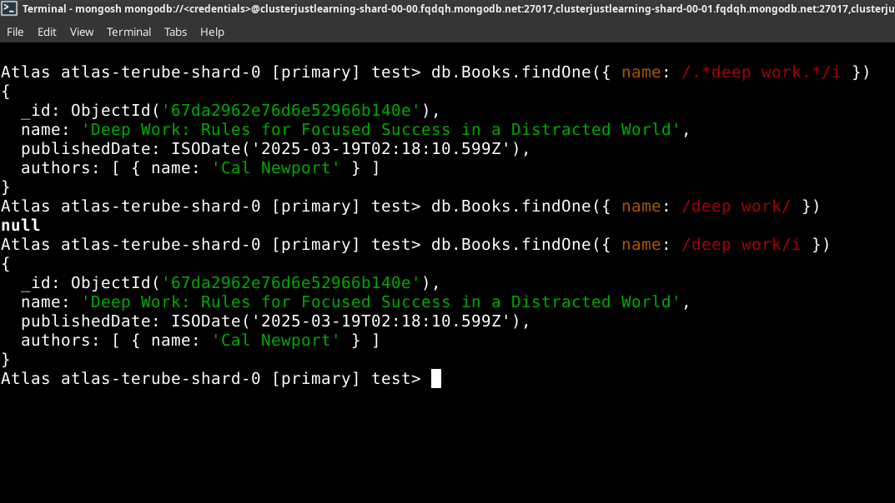

****

## **Comparison with SQL LIKE Operator**

The **equivalent SQL query** for partial string matching uses the `LIKE` operator:

| **Operation**    | **MongoDB Query**                          | **SQL Equivalent**                                          |
| ---------------- | ------------------------------------------ | ----------------------------------------------------------- |
| Exact Match      | `db.books.findOne({ name: "Deep Work" })`  | `SELECT * FROM books WHERE name = 'Deep Work';`             |
| Partial Match    | `db.books.findOne({ name: /deep work/i })` | `SELECT * FROM books WHERE name LIKE '%deep work%';`        |
| Case-Insensitive | `db.books.findOne({ name: /deep work/i })` | `SELECT * FROM books WHERE LOWER(name) LIKE '%deep work%';` |

Unlike SQL, MongoDB does **not** require explicit `%` wildcards for substring searches. Instead, regular expressions provide more flexibility.

---

## **References**

- [**MongoDB find() Documentation:**](https://www.mongodb.com/docs/manual/reference/method/db.collection.find/)
- [**MongoDB Regular Expressions:** ](https://www.mongodb.com/docs/manual/reference/operator/query/regex/)

***

***

***

# MODULE 03-159: MongoDB (14)

## How to Check if a Field Exists in a MongoDB Document

---

## **Index**

1. Understanding the Need for Field Existence Checks
2. Using the `$exists` Operator
3. Querying for Documents Where a Field Exists
4. Querying for Documents Where a Field Does Not Exist

---

In MongoDB, documents within the same collection do not have to follow a fixed schema, meaning that some documents may contain fields that others do not.   

As a result, it is often necessary to check whether a specific field exists in a document before processing it.

This guide explores how to use the `$exists` operator to determine whether a field is present in a MongoDB document.

---

## **Understanding the Need for Field Existence Checks**

Since MongoDB allows flexible document structures, some documents may have fields that others do not. Consider the following example:

- Some books in a `Books` collection may have a `reviews` field indicating the number of reviews, while others do not.
- We may need to filter documents based on whether they contain this field.

Using the `$exists` operator, we can efficiently retrieve only those documents that have (or do not have) a particular field.

---

## **Using the `$exists` Operator**

The `$exists` operator is a MongoDB query operator used to check whether a field exists in a document.

### **Syntax:**

```mongodb
{ field: { $exists: <boolean> } }
```

- Setting `$exists` to `true` will return documents where the specified field exists.
- Setting `$exists` to `false` will return documents where the specified field does not exist.

---

## **Querying for Documents Where a Field Exists**

To find all books that include a `reviews` field, use the following query:

```mongodb
Atlas atlas-terube-shard-0 [primary] test> db.Books.find(
... { reviews: { $exists: true } }
)

// (NO RESPONSE)
```

This query retrieves only the documents that include the `reviews` field.

---

## **Querying for Documents Where a Field Does Not Exist**

To find books that do **not** include a `reviews` field, use:

```mongodb
Atlas atlas-terube-shard-0 [primary] test> db.Books.find(
... { reviews: { $exists: false } }
)

// However, as 'reviews' field does not exist, it returns:
[
  {
    _id: ObjectId('67da1b7d040ae61e086b140b'),
    name: 'El Cerebro Musical',
    publishedDate: ISODate('2019-06-13T00:00:00.000Z'),
    authors: [ { name: 'Daniel J. Levitin' } ]
  },
  {
    _id: ObjectId('67da1c9ddaeedc3d506b140b'),
    name: 'Tecnofeudalismo',
    publishedDate: ISODate('2024-01-01T00:00:00.000Z'),
    authors: [ { name: 'Yanis Varoufakis' } ]
  },
  {
    _id: ObjectId('67da1c9ddaeedc3d506b140c'),
    name: 'Pyongyang: A Journey In North Korea',
    publishedDate: ISODate('2003-01-01T00:00:00.000Z'),
    authors: [ { name: 'Guy Delisle' } ]
  },
  {
    _id: ObjectId('67da207de76d6e52966b140b'),
    name: 'Shenzen: A Travelogue from China',
    publishedDate: ISODate('2000-01-01T00:00:00.000Z'),
    authors: [ { name: 'Guy Delisle' } ]
  },
  {
    _id: ObjectId('67da257ce76d6e52966b140c'),
    name: '1984',
    publishedDate: ISODate('1949-06-08T00:00:00.000Z'),
    authors: [ { name: 'George Orwell' }, { name: 'Eric Arthur Blair' } ]
  },
  {
    _id: ObjectId('67da278be76d6e52966b140d'),
    name: 'Blink',
    publishedDate: '2024-03-10T10:00:00Z',
    authors: [
      { name: 'Malcolm Gladwell', active: true },
      { name: 'Ghost Writer', active: true }
    ]
  },
  {
    _id: ObjectId('67da2962e76d6e52966b140e'),
    name: 'Deep Work: Rules for Focused Success in a Distracted World',
    publishedDate: ISODate('2025-03-19T02:18:10.599Z'),
    authors: [ { name: 'Cal Newport' } ]
  }
]
```

This query filters out all books that do contain the `reviews` field.

---

## **Practical Use Cases**

- **Data Integrity Checks:** Identify documents missing expected fields to maintain data consistency.
- **Selective Querying:** Retrieve only documents that include or exclude certain fields.
- **Schema Evolution:** Detect older documents missing newly added fields and update them accordingly.

---

## **MongoDB vs SQL**

| **Operation**                                 | **MongoDB Query**                                | **SQL Equivalent**                               |
| --------------------------------------------- | ------------------------------------------------ | ------------------------------------------------ |
| Find documents where `reviews` exists         | `db.books.find({ reviews: { $exists: true } })`  | `SELECT * FROM books WHERE reviews IS NOT NULL;` |
| Find documents where `reviews` does not exist | `db.books.find({ reviews: { $exists: false } })` | `SELECT * FROM books WHERE reviews IS NULL;`     |

---

## **References**

- **MongoDB `$exists` Documentation:** [https://www.mongodb.com/docs/manual/reference/operator/query/exists/](https://www.mongodb.com/docs/manual/reference/operator/query/exists/)

***

***

***
