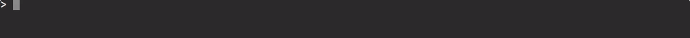

# MODULE 03 - 147:  MongoDB (2)

## Guide to Creating a MongoDB Database Along with Admin Database Users

Now that you have Mongo installed on your system we're ready to start setting up the rest of our database.  

 In order to work through what I'm going to be showing you, you're going to have to have the Mongo demon running and then also have the Mongo shell.

****

Just as a reminder of the way you do that, is in the terminal by typing

```
mongod
```

 and that is what's going to start up the demon. Then open up another tab and type 

```
mongo
```

 and you'll have everything up and running just like I have right here and you should have a terminal prompt just like this. 


Now, this is not the regular terminal, this is Mongo's shell. Now if you want to see all of the databases that you currently have on your system you can type in 

```
show dbs
```

 and sort for databases and then it will bring you all of the databases that you currently have. 



Unless you have been working with Mongo you probably have fewer items than these a few of these are ones of other projects that I have.  The way that you can create a new database is to use the `use` word, so I'm going to say 

```
use mongoCourse
```

Of course, you can call yours anything that you would like.  Now if I hit return it will  say switched to 

```
db mongoCourse
```

 Now a little interesting tidbit right here if I type 

```
show dbs
```

 It is not going to show that and the reason for that is because just creating `mongoCourse` doesn't actually add the database to the list. It's not until we start 
adding records or adding documents into the database that it gets 
recognized.

So if you type `show dbs` right afterward then you're going to still have some items missing.   

Now the next thing is we have access to this cool little object called `db`.

When I type `db` right here you can see it says `mongoCourse` because I typed `use mongoCourse` and so now we have this `db object` and that is going to be referencing it and that's going to allow us to create all of the different things we're going to be doing throughout this entire course you're going to be typing `db` a lot because what that's doing is it's referencing the current database that we're in.

Now,  the very first thing that we're going to do is we need to create a user for our database and there is a pattern that you're going to see quite a bit through this course and in any kind of mongo development.  

We're  going to switch back and forth between a text editor and the shell.   

The main reason for this is because inside of mongo most of the commands 
you're going to be writing are going to have multiple lines to them they're going to look very similar to Javascript.

If you're familiar with writing javascript objects then everything you're going to
 be writing in mongo is going to feel very familiar.   

Now I have another text editor open I have Sublime Text you don't have to use it you can use any text editor that's out there.

We're not going to be running the code directly in the file, we're simply going to use it to make it a little bit easier to type.   

Now the first thing we're going to do is create that user.

So I'm going to say `db.create user` and then inside of this function we're going to pass a number of arguments and we're going to pass them in as an object.   

Inside of your parenthesis place curly brackets inside of that and then we're going to pass a number of key-value pairs.

The first is going to be the username. So here I'm just going to say Jordan and then you need to pass  in a password. The key there is pwd and then pass in any kind of 
password you want.

Obviously, if this is a production application come up with a much more complex password than just password and then you can also add custom data. So I can pass in an object and this could be anything that you want.

So this could make up all of these names. A very common one that I'll usually use is something like the start date. Then I can pass a new date just like in Javascript and what this is going to do is it's going to create a start date record inside of this user object and it's going to have a date related to it.

But you could put anything else you want in there you could put that type of employee that they are you can put anything you want. Now with our custom data in place, we need to add some roles.

Roles expect an array of items and these items have to be very specific so they're going
 to be an object format so more curly braces and they are going to expect a role as the key and then a set of strings.

The first one's going to be `clusteradmin` and this is something specific to mongo I'm not just making up these words so if you are going through and you're referencing this we're going to say that this is a `clusteradmin` and I got this one straight from the mongo docs.

Then we want to reference the database and it's actually going to be the `admin` database even though we're working inside of the mongo database we need to let mongo know that this user has the ability to function as an admin.

So I'm going to just duplicate this line and the next one's going to be `readAnyDatabase` also an admin and then the last item is going to be `readWrite` which is just kind of the default set of values that you can pass for the role that they have.

Now,  with all of that in place now we can just copy this and then paste it inside of the shell. When I hit run, it will give you back this object, so now we have a user called Jordan with all of the different attributes that we've passed in.

Now I'm going to create another user just so you can see how to view all the users and also how to delete users and things like that.   

So here I'm going to create a user called John to pass that in. And now we have two users in the system.  

Now if you want to see all of the users in a particular database then you can run 

```
db.getUsers()
```

If I run this you can see it brings back both the users, it brings back myself, and then it brings back John. Now to delete a user than the command there is 

```
db.dropUser('jon')
```

and then pass in the username for who you're wanting to remove. When I hit return it comes back as true. Then if I type get users again

```
db.getUsers()
```

 you can see we now only have the one user.

In review what we've done is we've created a database using the `use` command. Then we've seen how you can view all the databases on your system. We saw how you can create users for a specific database and then we saw how we can see all the users that belong and can administer a database and then we saw how we can remove them. 

```js
db.createUser({
  user: 'jordan',
  pwd: 'password',
  customData: { startDate: new Date() },
  roles: [
    { role: 'clusterAdmin', db: 'admin' },
    { role: 'readAnyDatabase', db: 'admin' },
    'readWrite'
  ]
})

db.getUsers()
db.dropUser('jon')
```
