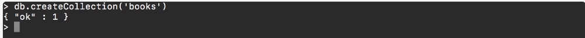
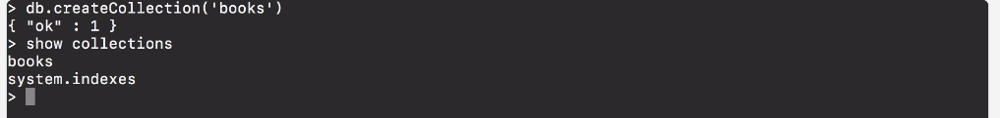

# MODULE 03-148: MongoDB (3)  - Collections

****

## Video Lesson Speech

Now that we have our database created and we have a user now we can start creating collections.

****

Now if you are familiar with the SQL kind of syntax then you're probably used to hearing terms such as **databases** like we have in Mongo and so then you have the idea of **tables** and that tables have columns.   

We don't have that same exact kind of naming inside of Mongo, we do have databases but then inside of databases we have what is called **collections**, collections are the closest kind of analogy to a table.   

Collections can store many documents and those documents are the actual items that you're going to be putting into the database.    

Before we can start saving the documents we need to create collections to store them in. So we're going to throughout this entire course be building out a database to manage books.    

With that in mind, we're going to once again reference our database object and then we're going to create a collection called books. Now the command for this is 

```
db.createCollection('books')
```

and then put in the name of the collection itself. Now if I run this it's going to return `"ok" : 1`.  This syntax that gets returned is very important in understanding how Mongo works. 



It's also very helpful for understanding why the Javascript community and the Front End community as a whole have absolutely fallen in love with Mongo and it's because the Mongo syntax whether it's how you write it or the values that get returned is very familiar, it's very much like you are going to get in any kind of Javascript development environment.  

Like you see right here if you are returning this you're not getting just like an HTML or HTTP and you're working with APIs, you'd get a status code of 200.    

If you're working with the Redis database you would be getting the words `ok` or you might get an integer `1`.   

Here in Mongo, you're actually getting an object and a key-value Json type object back where the key is `ok` and then the value is `1`.    

If you were doing this say in an API kind of environment and you just created a collection then you would be able to get this object back and you'd be able to treat it just like pure JSON.   

So it's a pretty cool thing that Mongo gives us and so we're going to be able to have that kind of Javascript mindset this entire time.   

So now that we have that I can type `show collections` and now you can see that we have our books there where before we didn't have anything.   

What this means is we've added a collection and we also have this `system.indexes`. Now we don't have to worry about that.   

That's simply a collection that's going to store any indexes that we're using inside of the database and indexes are ways of being able to speed up queries.   

But we're not going to have to work with them directly. 



For right now just know that is a way that you can create a collection and then how you can see all of the collections inside of a Mongo database. 

****

## Code

```js
db.createCollection('books')    // { "ok" : 1 }

show collections
```
