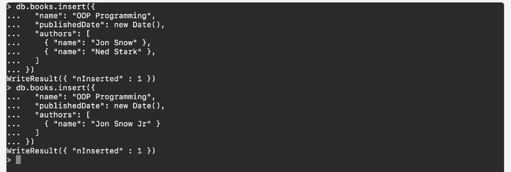
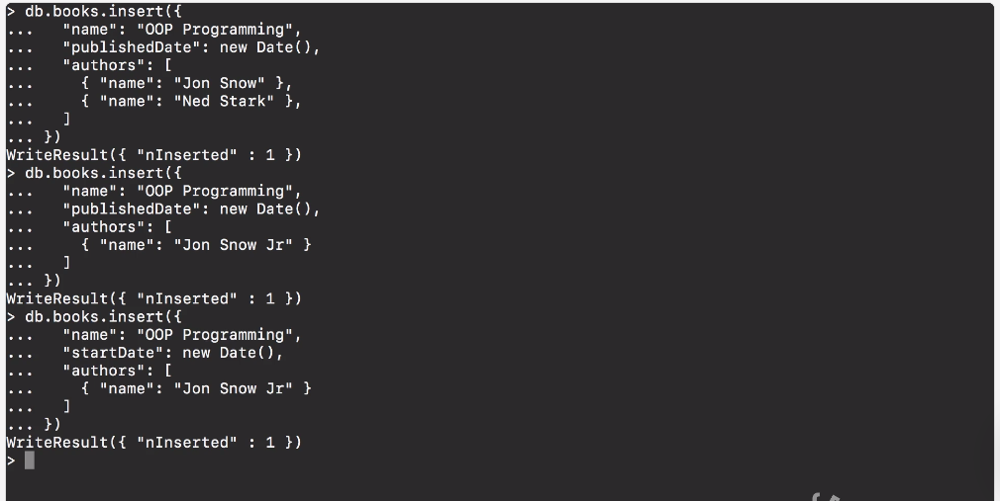

# MODULE 03-148: MongoDB (4) - Inserting Documents

---

## Video Lesson Speech

Now that we have our collection built out we can start adding documents into our database.   

I'm going to open up sublime text and let's start writing out the script that is going to insert a book into our book collection.

****

I'm going to start off with 'db' this is something you're going to keep on seeing throughout the rest of this course and as long as you work with Mongo you're always going to be working with this `db` object because this references the database that you're going to be working with. Now after the database is going to be the name of your collection.   

So in the case where I created a collection called **books**, it's going to be `db.books` and then we're going to have this function called **insert**. 

```
db.books.insertOne
```

Now I'm going to put this inside parentheses and then it expects to receive an object.

```
db.books.insertOne()
```

When you hear say someone say oh it expects an object.   

What that means is we need to pass it in with curly braces. Just like in Javascript we're going to pass in a set of key-value pairs.   

The first one is going to be the name of our book.  

 So I'm going to say `name` and let's just say `OOP Programming` and then we'll pass in a `published date` and just say `new date`. 

```
db.books.insertOne({
  "name": "OOP Programming",
  "publishedDate": new Date()
})
```

Then we can pass in a collection inside of our document, so inside of this, we are not limited to just given a traditional key-value pair like `name` and then OOP Programming.  

 We can also pass in a collection, so I can say that there are multiple `authors` here and this is going to be an array of data.   

So any time that you're going to pass in a collection pass it in as an array. So that's one thing that I really like about Mongo is it's as close to just pure programming code as you'll typically get in a database.   

This is very similar to just writing pure Javascript and that's one reason why I personally enjoy working with that. Now inside of authors we're going to pass another set of objects and so each author is going to be an object themselves here we're going to have a name for an author and we'll say *John Snow* wrote the one part of this and add a comma afterward.  

 Now let's add another one and say *Ned Stark* wrote the other one and this is all that we need right here. So if I copy this and come into the terminal then we can run it and it will give us our `WriteResult({ "nInserted" : 1 })`.   

What this means is notice that this is a Javascript object right here and that it got returned back to us. Now if I come back here and I get rid of one of these authors and now will say *John Snow Jr*.  

 I can copy this again paste it in the terminal and it got written as well, so this is now in the database. So I wanted to add two items in so that you could see one and that you can put in as many items as you want



But notice how the system didn't care whatsoever about a couple of things.   

It didn't care that we sent in a duplicate name but also it didn't require the same number of authors.   

Now just to throw it off even a little bit more let's imagine right here with `publishedDate` if I change this to `startDate` copy this again and paste it in everything worked exactly like normal. 



Now, this goes to one of the most critical parts of understanding how Mongo works compared with a traditional SQL database and that is is that there is no schema whatsoever.   

So what that means is that all of the Mongo code that you write Mongo doesn't care about things like column names or what the names of your keys are, you can write and have each one of your documents be as unique as it needs to be. 

Now there comes a level of responsibility when you're doing that and that because imagine a scenario where you're building some type of social network and you're using Mongo to do it.   

If you are irresponsible and you put all kinds of different names in different key-value pairs and you put a completely different structure when you run a database query you're not going to be able to do anything with the data because it's going to come back and it's not going to have the same type of naming structure.   

So you're going to have to build many workarounds and it's not going to be very scalable. So with the flexibility that Mongo gives you, it's important to understand what your structure looks like.   

You don't have a schema as you do in SQL.  With SQL you don't have to worry about when you run a database query having elements named under different columns. And so here you might have that issue.  

 So say that for the first set of your application you called `name`, then you decided you know what I want to change this to `title` and if I come here and run it.   

Everything worked. And if I run a database query I'm going to get four books back but there's going to be some differences and that is for the first three I'm going to have a `name` attribute that I can query and in the last one though it's going to be `title`.   

Now Mongo itself doesn't care. It does not care about your data and care about the structure it's so flexible it simply allows you to store these object kind of documents and then you're in charge of managing first the creation but then also the ability to query them.   

So this is a very important component and that's the reason why I'm spending some time discussing it and that is because if this is implemented poorly then you're going to run into a number of bugs and you're going to have to build many different scripts to clean up your data, and that's an ever fun situation.   

So just make sure that you're cognizant of that and so that you'll be able to make sure and you'll be confident that when you query something you'll know the various attributes that are in there but the flexibility that Mongo provides in not requiring a schema is really one of the key elements that have made it such a popular database. So that is how you can add an insert into a collection in Mongo. 

****

## Code

```js
db.books.insertOne({
  "name": "OOP Programming",
  "publishedDate": new Date(),
  "authors": [
    {"name": "Jon Snow"},
    {"name": "Ned Stark"}
  ]
})
```
