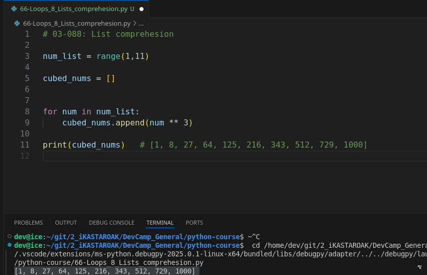
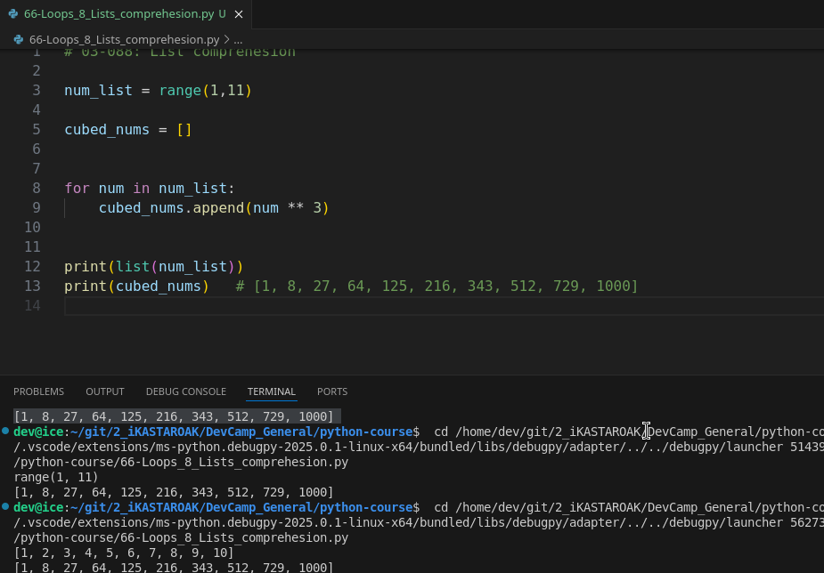
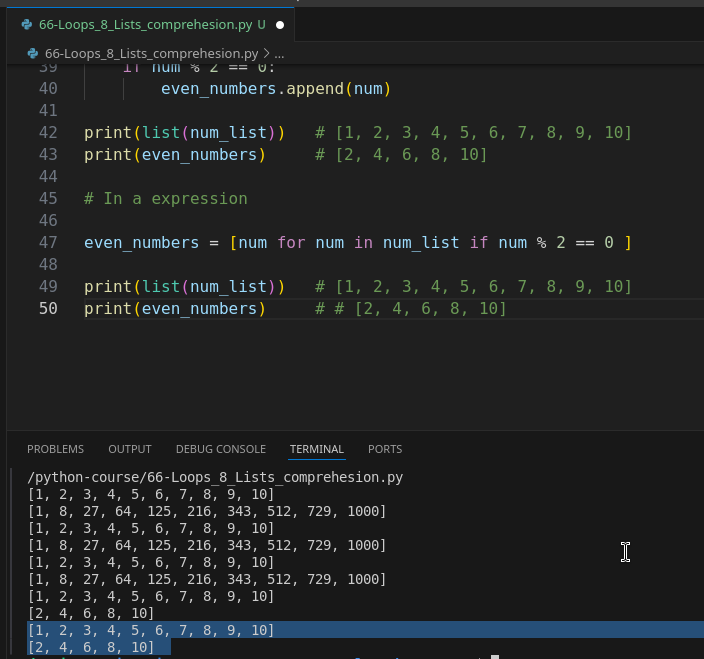

# Module 03 - 088: Python - Combining Lists with a `for...in`

List comprehensions are a powerful feature in Python that allow us to create lists in a more readable and concise way. This guide will walk through traditional loops and then demonstrate how list comprehensions can achieve the same results more efficiently.

---

## 📌 Traditional Loop Method

Let's start with a basic example where we want to cube each number in a range:

```python
num_list = range(1, 11)  # Numbers 1 through 10
cubed_nums = []

for num in num_list:
    cubed_nums.append(num ** 3)

print(list(num_list))   # [1, 2, 3, ..., 10]
print(cubed_nums)       # [1, 8, 27, ..., 1000]
```

This works, but it requires multiple lines of code.

---

## ✅ Using List Comprehension

List comprehensions allow us to achieve the same result in a single line:

```python
cubed_nums = [num ** 3 for num in num_list]
print(cubed_nums)  # [1, 8, 27, ..., 1000]
```

🎯 **Advantages:**

- More concise and readable.
- Often more performant than loops.

🔗 **Reference:** [Python Official Docs - List Comprehensions](https://docs.python.org/3/tutorial/datastructures.html#list-comprehensions)

---

## 📝 Naming the Iterator

As previously seen, you can name the iterator variable however you like:

```python
cubed_nums = [x ** 3 for x in num_list]
print(cubed_nums)  # Same result as before
```

This flexibility makes list comprehensions adaptable to different coding styles.

---

## Using lamda function

```python
cubed_nums = list( map(lambda num: num ** 2, list(num_list)) )
print(cubed_nums)  # [1, 8, 27, 64, 125, 216, 343, 512, 729, 1000]
```

****

## 🎯 Adding Conditions

We can filter elements in list comprehensions using conditionals. For example, selecting only even numbers:

```python
even_numbers = [num for num in num_list if num % 2 == 0]
print(even_numbers)  # [2, 4, 6, 8, 10]
```

This replaces the following traditional loop:

```python
even_numbers = []
for num in num_list:
    if num % 2 == 0:
        even_numbers.append(num)
```

****

## Video lesson Speech

Very nice work on going through this section on Python loops so far.   

In this guide, I have to give you warning that this is going to be one of the most complex topics and most advanced concepts that we have spoken about throughout this entire course.

****

If what we walkthrough is not clear the first time that you go through this material I highly recommend that you go through it again and that you also research other guides related to this concept.

Because when I was originally learning this myself this was one of the more complex topics that I ran into when I was teaching Python to myself a number of years ago.   

So, this is something that I want to give you that is a warning and also as an encouragement too because if what we go through does not make sense to you do not worry you are definitely not alone. And I promise if you go through these examples enough sooner or later they will start to make sense.

The topic, we're going to discuss is a list comprehension.   

And so what that essentially means is we can set up a number of for-in loops to   function on a single line and we can actually generate lists from those lines of code.

Now, when I was planning out this guide, I went back and I referenced some of my notes back from when I was learning Python myself.   

And one of the things that I remembered is that one of the best ways of understanding the way that a list comprehension works are by setting up the alternative because what a list comprehension is is essentially a set of for-in loops and conditionals that can all be placed inside of a single line of code.

Now, the nice thing about that is that you can write these code out with multiple lines and then you can cross-reference and see what a list comprehension is actually doing. Now I know just hearing those words makes no sense at all, so let's dive right into the code itself.

So, I'm going to start off by creating a num_list here. For example, range, and then I want this to be the numbers one through 10.   

So, for this range, I'm going to say 1 to 11.  

 And my goal for this is I want to create a set of cubed numbers which means I want to multiply each one of the items in this range and I want to cube them.   

So I want to add an exponent of 3 so that it will return back a list where each one of 
the elements has been cubed so I'm gonna set up a variable here called cubed_nums and this is going to start off just as an empty list.  

Now I'm going to give you the traditional way of writing this so we're going to first go through the traditional method then I'm going to show you the list comprehension so that you can have a very clear mapping between what it looks like.   

If you were to do this the traditional manner versus what you would do if you were to put this on a single line of code and use a list comprehension.

So, for this, I'm gonna say for num in num_list inside of this I want to say cubed_nums.append which we walked through in the last guide and here just say num Asterix Asterix or star star 3.

```python
for num in num_list:
 cube_nums.append(num ** 3)
```

And so what this is going to do is it is going to cube each one of those values and let's see if this works. So I can say print cubed_nums and let's see if I hit run. You can see this, in fact, does cube each one of those elements.



If you do not trust me you can run this with just the regular num_list to compare both of them.   

So here you can see that we have a range of 1 to 11. And let's cast this as a list just so make it so you can easily see what it's saying. So here we have the numbers 1 through 
10 and down below we have the cube number. So we have 1, 8, 27, all the way through a thousand.



So all of this is working properly.

How exactly can we use a list comprehension to accomplish the exact same behavior?   

Well, I'm going to comment this out and now I'm going to show you how you can do this with a list comprehension.   

The first thing I'm going to do is to call it cubed_nums right here and I'm going to say equals.   

And so whenever you're doing a list comprehension you're going to want to store it typically in some kind of value and then you give square brackets.

```python
cubed_nums = [ ]
```

So, what we're doing is instead of simply appending to cubed_nums what we're doing is we're dynamically generating this list.  

 And so the very first value is going to be what we the action we are doing.   

So, remember, when we created this exponent where we said I want you to cube the value of number.   

And so this is going to be num star star 3 and that is going to be the first item that we pass to this list comprehension.

```python
cubed_nums = [num ** 3]
```

So, the first item is the action that we want to take or it's the value that we want to place inside of this list.   

So, I'm going to say `num ** 3` because that's the action we want to take and then say for num in `num_list`.   

And so now let's see if we get the exact same behavior, hit clear run it again.


And as you can see we get the identical behavior for our cubed_nums.   

And also watch if I delete this empty cubed_nums creation on line two you can see that it's still working properly.


So, we are able to save a decent amount of code. And all we're doing is we're running the identical kind of system that we had and that took up three lines of code before.   

Now that may not seem like a big deal.   

However, I will tell you that you are going to come across code that looks like this [num ** 3 for num in num_list] in a number of code libraries and that is one of the top reasons why I wanted you to see this because there may not be a time where you really want to implement this and I will tell you from my own experience it is rare that I use list comprehensions in this way mainly because I don't think they are the most readable.

I really prefer the syntax of what we had.

```python
for num in num_list:
 cubed_nums.append(num ** 3)
```

However, if you do not understand the way [num ** 3 for num in num_list] works if you come across some other project that you need to work on this is going to be very confusing so it's important to have an understanding about this when you're learning about for in loops.

So, in review, what we have here is a set of three different components essentially.  

 So, we have first, the actual value that we're wanting to do `num ** 3`.   

So, this is the behavior we're wanting to implement in this case it is cubing whatever the number is.   

This first num maps in exactly the same way that we had num here and num here in the for loop this num could be anything.

So if I say `x ** 3` and I change this you're going to get the exact same behavior. So if I run this again you can see everything is working the same way.


So, that is very important to understand is that this is your iterator variable.   

This could be anything that you want it to be. I'll change this back to num just because they think that that makes the most sense. And then I'll change this one back as well. So these items have to be mapped together because they are whatever the value is for the list that you're working through.

So, here that is the first component is wherever expression you're wanting to run the next one is your typical for in expression.   

Here, we have for num in num_list. This is literally identical to copy and paste for the start of the for-in loop so that is what you have here for num in num_list.

And then, the third component is the wrapper.   

So, your parens or your square brackets that go around this entire expression.   

This is what tells Python that you don't just want to do a for-in loop for the cubed 
items you also want to dynamically generate a list and so that is what you're doing when you're wrapping this in brackets.  

 So, hopefully, that's starting to make a little bit of sense to you now. And this is our base case so this is our basic example where we simply have one expression 
that we're wanting to run and have that generate a list.

Now, we're going to walk through a slightly more advanced example.   

So, in addition to having this kind of behavior, we also can add a condition.  

If we want to also make our lists dynamic where it is selecting items that we want to pull out of say, our number list and you want to dynamically generate a different list from it then we can do that as well.   

I will keep this in the show notes but I'm gonna delete it here just so we're not confused about the values that we have.

And what I'm going to build is a list that will capture even numbers.  

 So, we have our one through 10 list right up here through our range.  

Imagine a scenario where you only want to get the even numbers.   

If you're building something say where you want to show table rows on a web
 view or a mobile application and you want to stripe them differently or you want to add some different values in the even columns than being able to capture those even numbers is very helpful.

So, I'm going to do exactly what we did for our base case.   

I'm going to start off with creating a for-in loop the way that we've already seen how we can do it and then I'm going to show you how you can do it with a list comprehension.  

 So, the first thing I'm gonna do is say even numbers equals an empty list. And then from there, all say for num in num_list.  

 So so far this is all pretty standard and here I'm going to add a 
condition.

You say if num is and we're to use the modulus operator(%) here.   

So if you remember back to when we talked about the operators remember that the modulus operator will tell us if there is a remainder or not and it will return whatever that value is.   

So I'm gonna say if num modulus 2 is equal to zero. Which is a mathematical way of saying, is it even?

```python
if num % 2 == 0
```

If that is the case then I want to take my even numbers and then append whatever that number is. So if this is all working I'm gonna get rid of cubed_nums because we're not working with that anymore.   

And now let's see if we have properly selected our even numbers on hit return here and you can see that this works perfectly.


Right at the top, we have our regular num list 1 through 10 and then down below we have our even numbers 2, 4, 6, 8, and 10.   

So so far everything is working properly. Now let's see how we can use list 
comprehension in order to implement the same type of behavior.

So, I'm going to say even numbers equals and remember we're going to start off with our square brackets because we want to wrap all of this and we want to generate a list from it.  

 And I'm going to say num and then for num in num_list. And this is where it gets a little bit tricky if you've never seen it before. and so now we're going to add our condition on the same line. So you say if num % 2 is equal to zero.   

So, let's see if this works. If I run you can see it's still working properly.



But now let's dive into each one of these elements to see exactly how we were able to take four lines of code and condense it down into a single line.  

 Well, we can separate out each of our elements once again except the only difference is whenever you're using a conditional we have one other one, remember we had three elements before that we could slide in.  

 And now we have for the first element is the element that's going to get returned.

So, we don't have to call append. And the reason is that we're not starting with an empty list as we did before.   

Instead, we are generating this on the fly. So what python does is it's pretty smart and it assumes that whatever value we're returning is a value you want to add to this list so we want to add num as a new element to even numbers.

Now, we only want to do that if the `num % 2 == 0` which means we only want to do it if it is even.  

 So going through the elements this is a value we want to return.   

Then we have our traditional for-in loop.   

So once again this is exactly what we had right up here on line 5 and then the other element. So the third element is our condition.

So, we're going to say if num % 2 == 0 which is exactly what we have on line 6 then we simply want to return this num. And then the fourth element once again our square brackets that wrap the entire expression or I should say the three expressions all up and then it is going from that point to dynamically generate that list for us.

Once again, whenever you're using list comprehension if this is looking very weird and the syntax does not make sense.   

Do not worry this is one of the most advanced topics that we've discussed so far in this 
course.   

I highly recommend that you go through this video a few times play with the code here, change it. Go through a few different examples so that what we're doing really starts to sink in.

****

## Code

```python
# 03-088: List comprehesion

num_list = range(1,11)

cubed_nums = []


# A regular for...in expression

for num in num_list:
    cubed_nums.append(num ** 3)

print(list(num_list))
print(cubed_num)   # [1, 8, 27, 64, 125, 216, 343, 512, 729, 1000]


# A for...in declaration in a var

cubed_nums = [num ** 3 for num in num_list]

print(list(num_list))
print(cubed_nums)       # Gives the same result


# As we've seen before, the iterator can be named as wanted

cubed_nums = [x ** 3 for x in num_list]

print(list(num_list))
print(cubed_nums)       # Gives the same result


# Adding conditionals

even_numbers = []

for num in num_list:
    if num % 2 == 0:
        even_numbers.append(num)

print(list(num_list))   # [1, 2, 3, 4, 5, 6, 7, 8, 9, 10]
print(even_numbers)     # [2, 4, 6, 8, 10]

# In a expression

even_numbers = [num for num in num_list if num % 2 == 0 ]

print(list(num_list))   # [1, 2, 3, 4, 5, 6, 7, 8, 9, 10]
print(even_numbers)     # # [2, 4, 6, 8, 10]
```
