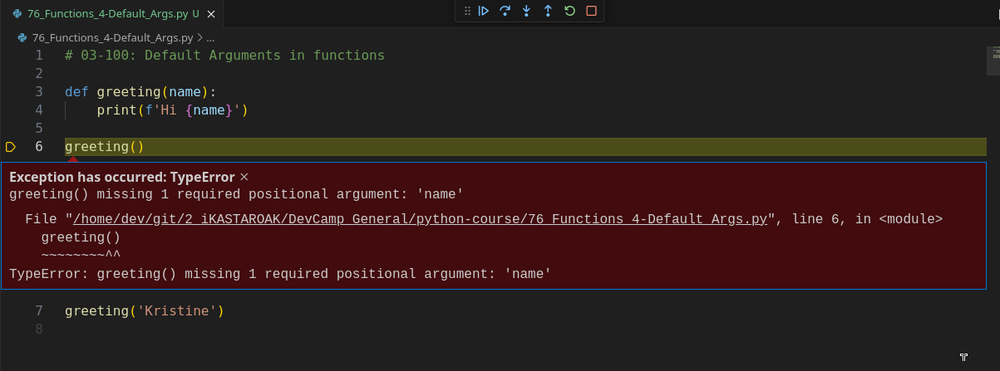
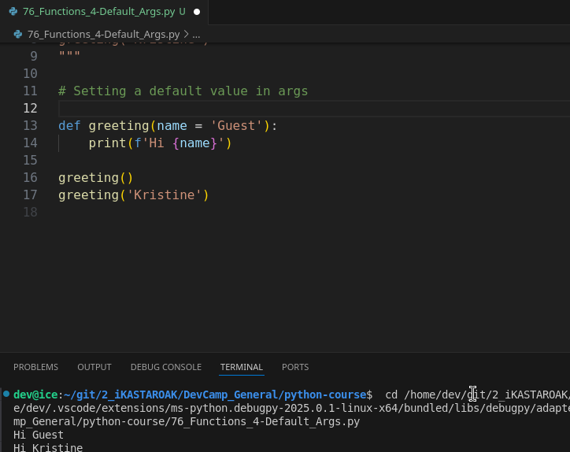
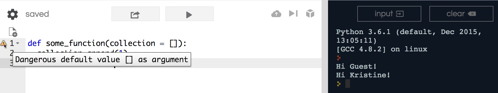
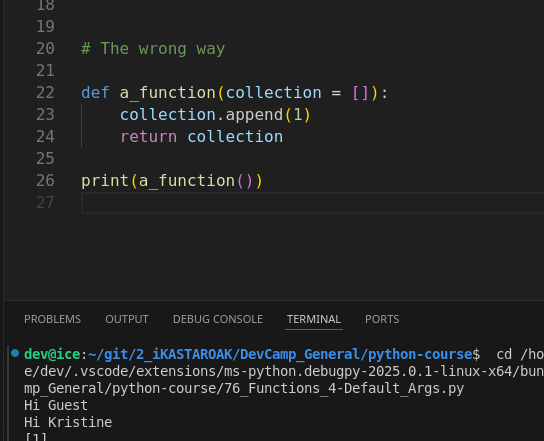
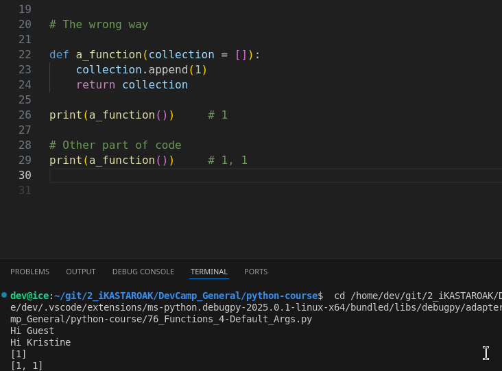

## MODULE 03 - 100: Python - Default Arguments in Functions

Throughout this section, we have worked with function arguments in Python, always using **required positional arguments**. But what happens if a function is called without providing all the necessary values?

In this guide, we will explore **default arguments**—a powerful feature that allows us to assign default values to function parameters, making functions more flexible. However, we will also examine a **common mistake** that can lead to unexpected behavior and bugs when using mutable default arguments such as lists. 🚨

🔗 **Reference:** [Python Function Definitions](https://docs.python.org/3/tutorial/controlflow.html#defining-functions)

---

## 🔹 Understanding Default Arguments

When defining a function, we can assign **default values** to parameters. If a value is not provided when calling the function, Python will use the **default argument** instead.

### ✅ Example: Greeting Function

```
def greeting(name="Guest"):
    print(f"Hi {name}!")
```

Calling the function:

```
greeting()  # Output: Hi Guest!
greeting("Kristine")  # Output: Hi Kristine!
```

📌 **What Happens?**

- If no argument is passed, the function defaults to **"Guest"**.
- If an argument is provided, it **overrides** the default.

🔹 **Key Concept:** Default arguments make functions more **flexible and user-friendly**, avoiding errors when values are missing.

🔗 **Reference:** [Python Function Arguments](https://docs.python.org/3/tutorial/controlflow.html#default-argument-values)

---

## 🚨 The Wrong Way: Using Mutable Defaults

One of the most common mistakes when using default arguments is assigning a **mutable object** (like a list) as a default value.

### ❌ Dangerous Example: Using a List as a Default Argument

```
def some_function(collection=[]):
    collection.append(1)
    return collection
```

📌 **What Happens?**

- Calling `some_function()` the first time returns `[1]`.
- Calling `some_function()` again **unexpectedly returns `[1, 1]`**.

### 🔥 Why Does This Happen?

Python **only evaluates default arguments once**, when the function is **first defined**, not every time it is called. Because lists are **mutable**, every subsequent function call **modifies the same list** stored in memory instead of creating a new one.

### 🔍 Memory Behavior

To visualize this, we can print the **memory ID** of the list:

```
def some_function(collection=[]):
    print(id(collection))
    collection.append(1)
    return collection

some_function()  # Prints a memory ID
some_function()  # Same memory ID, meaning the list persists!
```

🔹 **Key Concept:** Lists, dictionaries, and other **mutable objects** should **never** be used as default arguments because they persist **across function calls**.

🔗 **Reference:** [Python Data Model - Mutability](https://docs.python.org/3/reference/datamodel.html#objects-values-and-types)

---

## ✅ The Correct Way: Using `None` as a Default Argument

To avoid unintended side effects, use **`None`** as a default value and create a new list inside the function.

### 🛠 Corrected Example

```
def some_function(collection=None):
    if collection is None:
        collection = []
    collection.append(1)
    return collection
```

### 🔍 Why This Works

- Each function call **creates a new list** instead of modifying a shared one.
- Prevents accidental modifications to persistent memory.

---

## 📌 Summary

- **Default arguments** allow functions to be called **without requiring all parameters**.
- Avoid **mutable defaults** like lists, as they persist across function calls.
- Instead, use `None` as a default value and initialize the list inside the function.
- This ensures that **each function call starts with a fresh, independent object**.

****

## Video Lesson Speech

Throughout this section on Python functions, each time we have referenced function arguments they have been the same type of arguments.  

****

They are just like we have right here in our example for greeting where we have a function called name and if we were to try to call this function without some kind of value.   

So, if we were to just try to call it just like this we would run into an error:



The error is that we have a one missing required positional argument, that is name.   

Now, this is helpful and there are many times where this is exactly what you want to have.  

 But imagine that you have a greeting function and you need it to work on your Web site regardless if someone is signed in or if they are a guest.   

Well if they're a guest then you're not going to know their name.   

And so what you can do is have what is called a default argument and the syntax for that is inside of the definition line you say name equals and then you pass in whatever the default argument is.

So, in this case, we're just going to say, guest. And so now if I run
 this code you can see that it prints out Hi guest whenever no arguments
 are provided.



But whenever we do pass in a string as we have right here then that overrides the default argument.   

And so that is a very nice and clean way of being able to have your system be dynamic enough so that you can call the function and you can pass it arguments or you can leave those arguments blank and this is the proper way of implementing default 
arguments.

## The wrong way

Now, I'm going to show you the wrong way to do this and this can lead to some very confusing Python bugs and so I want to show it to you.   

This is **also a common interview question if you are looking for a Python programming job**.   

So, I wanted to include this so I'm going to create a function here.  

And the goal of this function does not matter at all because I just want to show you exactly what this common issue is.   

So, I'm just going to call it some function and I'm going to pass in some type of collection. So this is just the function name.   

It could be named anything it could be named X.   

But we're just going to say collection because I want you to realize that this is going to expect a list.   

And so I'm gonna say def some_function collection with a default argument.

```python
def some_function(collection = [])
```

Notice this is the exact same syntax we used when we passed in our name default argument and this time I'm gonna say this is going to be a collection an inside of this. I want to make some kind of list based behavior so I'm going to call a collection dot append 1.

```python
def some_function(collection=[]):
 collection.append(1)
```

Now, this is very basic, and part of the reason why is because what 
I'm going to show you goes into some advanced topics and it deals even 
with memory usage and different elements like that. And so I think the 
more straightforward the example the easier it's going to be to 
understand why this could be a problem.

So all that this is going to do is it is going to go to our collection here and it's going to append the number one. So so far that's pretty straightforward. So I'm just going to say return collection so this is just going to return the final collection.  

Now depending on what text editor you're using have you're using Repl. You 
can see we already have a warning here and the warning says dangerous 
default value as argument.



The reason for this goes to the topic of **mutability versus immutability** and if you're curious about why I discussed that topic so much earlier on in the course it's because you are constantly going to see this issue arise as you're building out Python programs.   

**You do not want to make a mutable data type such as a list a default argument** and I'm going to show you why right here if we come down and if I call our some_function just like this and it's returning a value.   

So, in order to see this, we need to print it out, then if I call this just like I have it here. It seems like it works. You can see that we have a list of one.



Now if I were to call this somewhere in another part of the program imagine that this is even in a different file a completely different part of the application you would most likely expect that the collection here would return the value of a list with 1 just like we got returned right here.



That would be the logical behavior at least in my mind and in most people's minds.

If I call this we have a different issue.   

So notice here this goes to the entire issue of mutability our collection is staying in memory.   

So, that means that even if you're calling some function from some other 
part of the program it is going to go back and it's going to see the very first time where the collection was created and it's going to go reference that original collection.  

 So, even though your other part of the program thought it was starting off with a clean slate.   

It was just calling some function and performing some type of behavior. You actually
 have a connection between the two collections.  

So, the collection on line 6 is connected to line 9 just like you can see here that we're printing out.   

Two different collections that's what it looks like but it's actually referencing the same spot in memory.


If that's not clear to you, let's walk through a couple of other ways  of looking at this.  

 So, I'm going to come back into our function here and I'm going to add a print statement so I'm going to print out what is called the ID.

Now, this is the place in memory on your computer that this particular collection is so I'm going to say give me the ID for the collection.


And so now if I run this again you're going to see that when we print it out some function the first time that it printed out this long number it ends in 776.  

When we printed out the sum function somewhere else in the program it is still pointing to that 776 address in your computer's memory. And that is the reason why we have a list that did not start off with the clean slate but it actually added onto it.

**And so that is the reason why it is considered a very bad practice to ever set a default argument as a list.**

****

## Code

```python
# 03-100: Default Arguments in functions

""" 
def greeting(name):
    print(f'Hi {name}')

greeting()      # Error! Missing args
greeting('Kristine')
"""

# Setting a default value in args

def greeting(name = 'Guest'):
    print(f'Hi {name}')

greeting()
greeting('Kristine')


# The wrong way, Nope!


def a_function(collection = []):
    collection.append(1)
    print(id(collection))
    return collection

print(a_function())     # 1

# Other part of code
print(a_function())     # 1, 1
## Both are using the same memory spot
```

****

## CodingExercise

```python
# CodingExercise
"""
Create a function called counter that accepts an argument called initial_count and returns that argument incremented by 1. initial_count must have a default value of 0.
"""


def counter(initial_count = 0, last_count = 5):
    print(initial_count)
    for step in range(initial_count, last_count):
        def printer_func():
            return step +1
        print(printer_func())

counter(0, 5)


def counter(initial_count = 0):

       return initial_count +1

print(counter())
```
