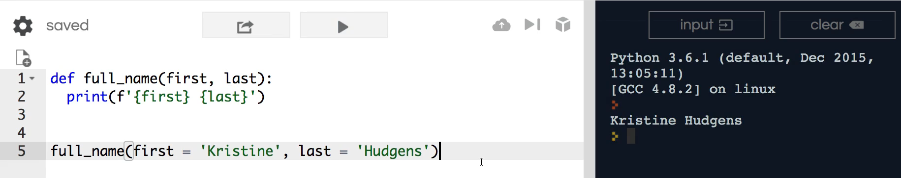
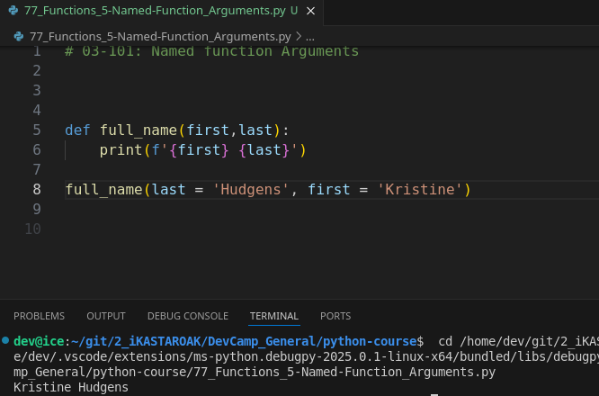

## MODULE 03 - 101: Python - Named Function Arguments

So far, we have worked with **positional arguments** when passing values to functions. This means that the order in which values are passed determines how they are assigned to function parameters.

While positional arguments are useful for simple functions, they can become problematic in larger programs with multiple parameters. **Named arguments (also called keyword arguments)** solve this issue by allowing us to specify which parameter a value belongs to, making code **more explicit and less error-prone**. 🚀

🔗 **Reference:** [Python Keyword Arguments](https://docs.python.org/3/tutorial/controlflow.html#keyword-arguments)

---

## 🔹 Positional Arguments vs. Named Arguments

### ✅ Example: Using Positional Arguments

```
def full_name(first, last):
    print(f"{first} {last}")

full_name("Kristine", "Hudgens")
```

📌 **What Happens?**

- "Kristine" is assigned to `first` because it is **the first argument**.
- "Hudgens" is assigned to `last` because it is **the second argument**.

The function works **because the order is correct**, but this can become confusing in complex functions with multiple arguments.

---

## 🔹 Why Use Named Arguments?

Named arguments make function calls **more explicit** by specifying which parameter each value belongs to.

### ✅ Example: Using Named Arguments

```
full_name(first="Kristine", last="Hudgens")
```

📌 **What Changes?**

- The mapping is **explicit**, meaning the order no longer matters.
- Code becomes **more readable and less prone to errors**.

### 🔄 Named Arguments Allow Reordering

With named arguments, we can **switch the order of values** while maintaining correct mapping:

```
full_name(last="Hudgens", first="Kristine")
```

This still produces the correct output because the function **assigns values based on names, not order**. ✅

---

## 🔹 Python vs. Other Languages

Some programming languages **require** changes in the function definition to use named arguments, such as Ruby, where you must explicitly declare named parameters.

In Python, however, **all functions can accept both positional and named arguments**, offering more flexibility.

🔹 **Best Practice:** If a function has **more than two parameters**, using named arguments helps prevent errors related to incorrect ordering.

🔗 **Reference:** [Python Function Parameters](https://docs.python.org/3/reference/compound_stmts.html#function-definitions)

---

## 📌 Summary

- **Positional arguments** rely on order, which can lead to errors in complex functions.
- **Named arguments** explicitly assign values to parameters, making function calls **clearer and more flexible**.
- Named arguments allow **reordering values** without affecting functionality.
- Python allows a mix of **positional and named arguments**, unlike some other languages.

****

## Video lesson Speech

So far in our discussion of Python functions each time we have passed in argument values to our functions we have used what are called positional arguments and what that means is that the mapping between the value and how that value is used in the function is completely determined by the position and the order that we passed the values in.

****

What this means is that the Kristine string right here


is going to be passed to this first argument. Then it's going to be used throughout the entire function because we passed it in as the first element.   

And so Hudgens is going to be passed into the last value and please remember there is nothing special about the words first and last I could say F and L if I wanted to and then use F an L in the print statement.   

I'm not going to because I don't think that that's very explicit but just so you know you don't have to pass in first or second and those kinds of names.   

These are completely determined by what you think explains the value the best in the function.

But everything that we've done has relied on that position and that is fine for very small functions.   

However, when it comes to working with larger programs and more advanced functionality having positional arguments can lead to some confusion imagine that you are building out a function and it didn't have simply two arguments it had another one and a fourth one and you get the idea just keeps on going on and on.

If you were to call a function like that and pass in values like we're doing with full_name('Kristine', 'Hudgens') where we're calling them in and the position determines the mapping then it can lead to a number of bugs because you may think that you're calling and passing in values in the right order but you might skip one and then all of a sudden your entire program is thrown off.   

And so that is something that you definitely want to avoid. And in python named arguments give you the ability to be much more explicit with this mapping.

And so what I can do here is instead of simply passing a string in I 
can pass in whatever the name is. And so, in this case, if I want this 
to go and be mapped to the first name then I can have the first name 
variable just like this. And then if I want to do it the same way here 
for last then what I'm going to do is the program is going to be able to
 look inside of this function call and it's going to see that we have 
set up named arguments and is going to first look for a function 
argument named first and then it's going to pipe this value into it and 
then it's going to come to last and it's going to do the same thing.

So if we run this code you can see that it works perfectly:



just like before and so this is helpful because now we're being much more explicit with how we're passing our values in.

Now we can even improve this more because if we have named arguments 
as we have right here we no longer care about the position these are no 
longer positional arguments. So what that means is I could call the last
 name variable to pass it in as the first argument. And this is all 
still going to work perfectly. So if I run this again you can see that 
the order has not changed the behavior because named arguments 
explicitly declared the mapping then they allow you to pass in whatever 
your values are in whatever order you prefer.



One thing I love about the python syntax compared with a few other languages such as Ruby or javascript is with python.   

You can use name arguments in an optional manner which means that usually in a language such as Ruby if you want to work with named arguments you have to come 
up to the function definition and then perform some code changes so you need to do something like this where you place a colon at the end of each name and what that's going to do is tell the ruby interpreter that you want these arguments to be named arguments and that means that anyone that calls this function needs to use named arguments.

```python
def full_name(first:, last):
 print(f'{first} {last}')
```

But as you can see Python is much more flexible in that manner where 
all functions can use either named or pure positional arguments and it's
 completely up to you. My rule of thumb is that if there are more than 2
 arguments I will use named arguments simply because it prevents any 
issues with me placing the values in the wrong order or calling the 
wrong name or anything related to that. And so I think that is a good 
rule of thumb and I highly recommend for you to explore it on your own 
side and see how you can use named arguments in your own functions.

****

## Code

```python
def full_name(first, last):
 print(f'{first} {last}')


full_name('Kristine', 'Hudgens')
full_name(first = 'Kristine', last = 'Hudgens')
full_name(last = 'Hudgens', first = 'Kristine')
```

****

## CodingExercise

```python
# CodingExercise
"""
Behind the scenes of the code test is a function called sequence that accepts 5 arguments: first, second, third, fourth, and fifth. Unfortunately, they are not in sequential order. Using named arguments, call the sequence function and pass in the 5 arguments, setting their values to 1, 2, 3, 4, 5 respectively.
"""
def named_arguments_practice(sequence):
    sequence(first = 1, second = 2, third = 3, fourth = 4, fifth = 5)

```
