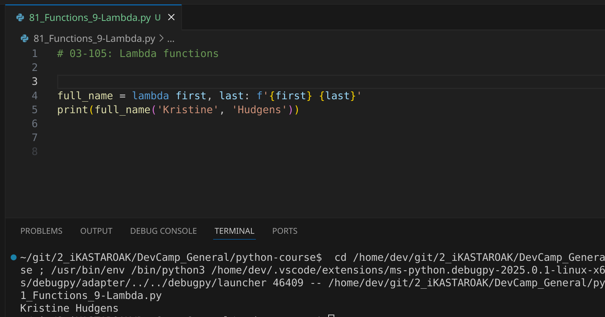
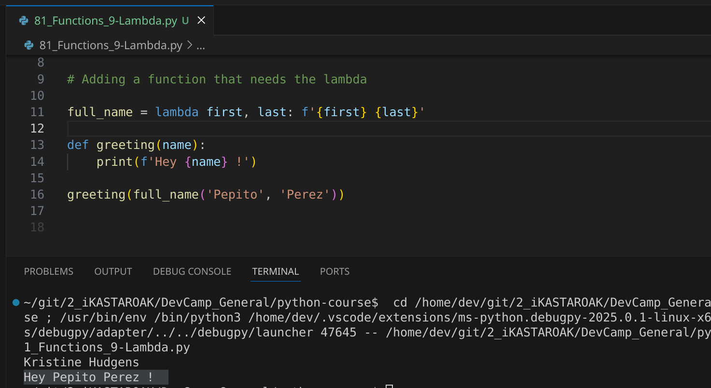

# MODULE 03 - 105: Python - Lambda Functions

In previous guides, we have worked extensively with functions in Python, learning how to define, pass, and manipulate them. Now, we introduce **lambda functions**, a powerful feature that allows us to create small, anonymous functions quickly and efficiently.

Most modern programming languages support lambda-like constructs, making them a familiar tool if you're coming from languages like Ruby or JavaScript. If this is your first encounter with them, don’t worry! We will break down how they work and where they are most useful. 🚀

🔗 **Reference:** [Python Lambda Functions](https://docs.python.org/3/tutorial/controlflow.html#lambda-expressions)

---

## 🔹 What Is a Lambda Function?

A **lambda function** is a small, anonymous function defined using the `lambda` keyword. Unlike regular functions created with `def`, lambda functions **do not have a name** and are usually written in a single line.

### ✅ Syntax:

```
lambda arguments: expression
```

- **`arguments`** → The input parameters.
- **`expression`** → The single operation performed and returned.

🔹 **Key Concept:** Lambda functions are **always** used where a quick, temporary function is needed.

---

## 🔹 Basic Example: Formatting a Full Name

```
full_name = lambda first, last: f"{first} {last}"
print(full_name("Kristine", "Hudgens"))
```

📌 **What Happens?**

- `full_name` stores a **lambda function** that takes two arguments: `first` and `last`.
- It returns a formatted string combining them.
- The function behaves just like a normal function but **without needing a `def` statement**.

🔗 **Reference:** [Python String Formatting](https://docs.python.org/3/library/stdtypes.html#printf-style-string-formatting)

---

## 🔹 Passing a Lambda Function to Another Function

One of the most common use cases of lambda functions is **passing them as arguments to other functions**.

### ✅ Example: Using a Lambda in a Greeting Function

```
def greeting(name):
    print(f"Hi there {name}!")

greeting(full_name("Tiffany", "Hudgens"))
```

📌 **What Happens?**

- `full_name` generates the formatted full name.
- The result is passed directly into `greeting()`, which prints the message.

🔹 **Key Concept:** Lambdas can be used **inline** where a small function is needed temporarily.

---

## 🔹 Where Are Lambda Functions Useful?

✅ **Short, simple operations**

- When you need a function for a quick calculation or formatting.

✅ **Passing functions to higher-order functions**

- Functions like `map()`, `filter()`, and `sorted()` often use lambdas.

✅ **Reducing code clutter**

- No need to define a full function for simple tasks.

### ✅ Example: Using `lambda` with `sorted()`

```
names = ["John", "Alice", "Bob"]
names_sorted = sorted(names, key=lambda name: len(name))
print(names_sorted)  # ['Bob', 'John', 'Alice']
```

📌 **What Happens?**

- The `lambda` function sorts names based on their **length**, not alphabetical order.

🔗 **Reference:** [Python `sorted()` Function](https://docs.python.org/3/library/functions.html#sorted)

---

## 📌 Summary

- **Lambda functions** are anonymous, single-expression functions.
- They are useful for **quick calculations, inline operations, and function arguments**.
- Lambdas **cannot contain multiple statements**—they are meant to be concise.
- They work great with **functions like `map()`, `filter()`, and `sorted()`**.

---

## Video lesson Speech:

Nice work going through that section on function arguments.   

Hopefully, that gives you a good idea on the type of inputs that you can pass to 
functions and how you can work with the data that is provided to them.

****

Now we're going to change subject's slightly we're still going to be working with functions but I'm going to show you a different kind of function and it is called a `lambda`.

Most modern and general purpose programming languages have a lambda type  of construct.   

So, if you're coming from Ruby or something like that then this should be a little bit of a review for you and you'll simply have to learn the syntax.

If you've never heard of a lambda, essentially what it is, is **a tool that allows you to wrap up a function**. Usually, a smaller function and then easily pass it to other functions.   

Now, functions inside of python are what are called first-class citizens which means that you can treat a function like any type of object.

And so when we're working with Lambda's what we can do is wrap up some behavior, usually pretty small behavior and then pass it to other functions.   

So, they are very mobile easy to use if you want one way of thinking about them you can take the perspective that a lambda is a very similar almost to a variable where you can pass in instead of some basic kind of values such as a string or a dictionary or something like that.

A lambda actually allows you to wrap up a process and so what we're going to do is we're going to keep the same type of example and case study we've been using so far with our greeting and our full name function and I'm going to show you how you can leverage lambdas to make our full name function very easy to pass around in a program.

The basic syntax for this is going to be full name and that is what we're going to do a lambda returns of value so you're pretty much always going to be using a lambda where you're returning something.  

 So, we're going to return a full name value and we're going to store it inside of 
this full name variable.  

So, we're going to say full name equals and in order to create a lambda, you just say Lambda. So spell it out l a m b d a, followed by the list of arguments so we're simply going to pass in a first name and a last name and then pass a colon.   

And so this is going to be our set of function arguments that we're going to pass to Lambda and then whatever comes after the colon is going to be the value that is returned.   

So here I'm going to format a string where we say first and then we say last and that is it.

```python
full_name = lambda first, last: f'{first} {last}'
```

So, we're creating a very basic function that takes in a first and last name variable returns a formatted string and then what we can do is treat it like a normal function, so I can call full name and then pass in string values so I can pass in and Kristine and Hudgens just like we've done in the past when we add a full name function.   

And we'll also print this because a lambda is only going to return the value I don't want to print that value out. So we're going to simply print this and you can see this is the exact same behavior as when we had a function.    

But now let's stretch it out a little bit and let's create a greeting function.   

So I'm gonna say def greeting and it expects a name and inside the function body I'm simply going to print out a formatted string so I'll say F and then with the quotes say Hi there pass in the name. And that is all that we need to do.

Now, I can call our greeting function but now I'm going to pass in our Lambda so I'm going to pass in full_name followed by the values for it.  

 So if I pass in Tiffiny and then Hudgens what this is going to do is just so you can understand the mapping.   

It is first going to go to the Lambda and it's going to pass in these two values and then the Lambda's going to run its process which in this case is simply formatting a string and then from there it is going to be stored in this full_name variable and from that point we can simply pass it like any other type of variables so we can pass this Lambda directly into our greeting function and it is going to receive this name pass it into the function body and print it out.

So everything here works properly this should say.   

Hi there Tiffany Hudgens so if I run this you can see that that is working properly.



So in review a Lambda gives you the ability to quickly and easily wrap functionality, store it in a variable and then pass that entire process to other functions and other parts of your program.

****

## Code

```python
# 03-105: Lambda functions


full_name = lambda first, last: f'{first} {last}'

print(full_name('Kristine', 'Hudgens'))


# Adding a function that needs the lambda

full_name = lambda first, last: f'{first} {last}'

def greeting(name):
    print(f'Hey {name} !')

greeting(full_name('Pepito', 'Perez'))


# Coding Exercise
"""
In the code below, create a variable called "greeting" and assign it a lambda function that accepts a name as an argument, and return the string "Hi, name".

Example: If you pass in the name "Jordan", it should return "Hi, Jordan".
"""

def lambda_practice():
    # Write your code here
    greeting = lambda name: f'Hi, {name}'

    return greeting
```
