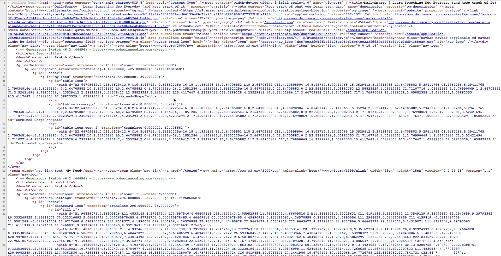
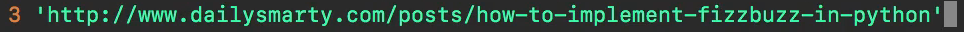
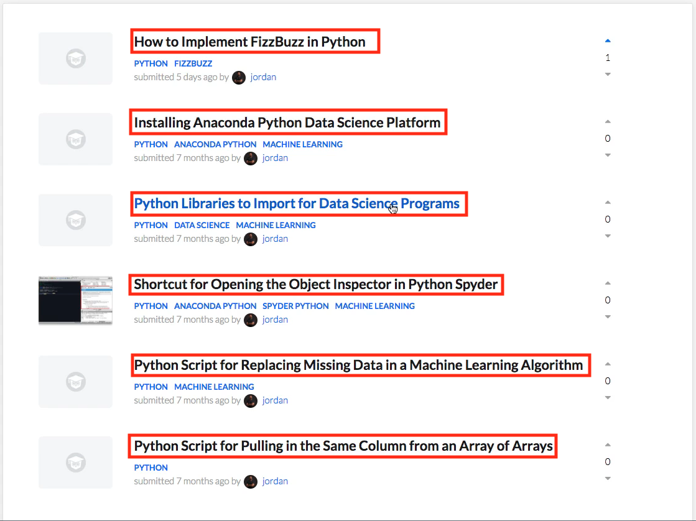
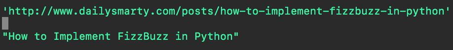
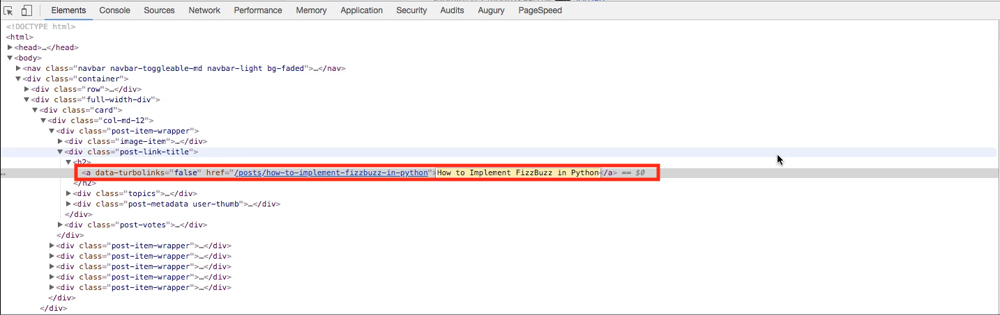
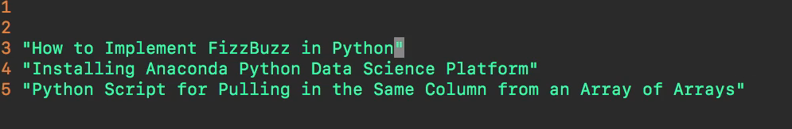
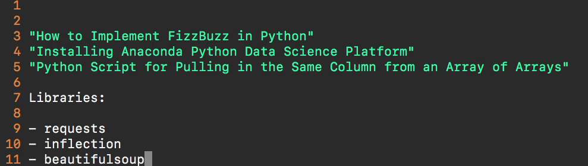

## Module 03 - 116: Python - Exercise

## Web Scraper

****

# Video Lesson Speech

## Note

### DailySmarty is currently not accessible.

### Web scraping has recently become less common as a general practice, and many websites have set up security measures to prevent scraping of their data. It is not something we will use elsewhere in the course, but it is good to know about as it allows pulling information from a website when it doesn't have an accessible API.

### Watching the video will suffice for this lesson as it is difficult to reference a site for scraping. Please reference the documentation to learn more about web scraping and the BeautifulSoup package: [BeautifulSoup Documentation](https://www.crummy.com/software/BeautifulSoup/bs4/doc/index.html)

Part of the reason why I have structured this particular project in the way that I have is because it will help you on the entire course capstone project. There are going to be a few fundamental concepts that you're going to learn while you go through this project and when you watch me go through the solution. These concepts will help you on the much larger and more challenging course capstone project. I want to give you some of the knowledge that you're going to need in order to do that.

Technically, you have learned everything that you need to know in order to build out this project and also the entire course capstone project. However, it also helps to be familiar with some of the libraries that can make your life a little bit easier and make your code more straightforward to implement.

So, what we're going to do is build out a **web scraper**. If you've never heard of what a web scraper is, it is a program that goes out to a website and extracts components from that site so that you can use them in your own program.

We've already walked through how to communicate with an outside API. We saw how we could leverage the **requests library** to communicate with the DailySmarty API, like we did in this section. However, there are going to be many other applications, especially if you're getting into the **machine learning space**, that don't have APIs. In those cases, you need to build out a web scraper to bypass the entire concept of an API and essentially build your own version of that. That's what we're going to be building out in this project.

What I want you to do is go to this pure web page. Do not leverage the API. We will be able to see in your code if you do that, and that would be **cheating**, so please do not do that. Instead, go to this URL: [http://www.dailysmarty.com/topics/python](http://www.dailysmarty.com/topics/python). These are the Python-related posts on DailySmarty.

What I want you to do is build a program that comes to this URL and then **scrapes the code** from it. As you can see, we have all of these titles here, and they are in link form. Your program should scrape these links.

Now, technically, just like every other website, this is just **HTML code**. If I were to right-click here and view the page source, this is what the website actually looks like to the browser.



If you leverage the **requests library**, you're going to be able to call the URL directly and then get access to all of this content. If this looks very confusing, do not worry. It is something that you're going to learn how to implement, and I'm also going to help you and give you a few hints on how you can parse pure HTML code. It's going to be with a few more packages and libraries.

But before we get into those, let me show you the full set of requirements that I want you to do. You're going to come to this URL: [http://www.dailysmarty.com/topics/python](http://www.dailysmarty.com/topics/python).  

 The program is going to parse through all of the data on there. I want you to select all of the links that go to posts. If I were to right-click on this and click "Copy Link Address," let me open up a text editor, say `vim project.py`, and paste in what that URL looks like. You are going to get access to this.



Now, what I want you to do is to only pull out the links that are related to posts.   

There are going to be links all over this page.   

There are links that go to the feed, topics, users, posts, new posts, URLs—they are going to be all over the place. So, I want you to filter out the ones that you do not want and only grab the ones that go directly to a post.



As you go through and get all of the URLs, you're going to notice some patterns, and that's going to help you decide which links you want and which links you do not want.

The next thing that I want you to do is take the link in your text editor and convert that link into a page title that will look something like this.



I don't want you to go through and figure out how to grab the page title element itself because if you click on the element here and look at the code, I don't want you to simply come here and grab the link text.



That would kind of defeat the purpose of what I'm wanting you to do.

Instead, what I want you to do is grab the **URL only** and then build a function that converts the title text (which is in the URL) into something that looks like this. For example, if I were to grab this URL here that says "how-to-implement-fizz-buzz-in-python," I would want the output to look something like this, even with capitalization and those types of components.

```python
"How to Implement FizzBuzz in Python"
```

The final output for this project should look something like this.  

 If I have a list of all of these items here, it should look something like 
this, where I come down here and I have one title, two titles, all the 
way down to whatever the last one is.



Now, these are going to be slightly different depending on when you're taking this course because new posts are being added to daily smarty on a daily basis so don't worry about the titles lining up perfectly.

I simply want you to be able to take a set of URLs and then convert them the way that I've done right here. So far I know that this may seem like a lot if you've never built out this type of behavior before so I'm going to give you a few hints. So first I will recommend that you use the requests library I'll put in the libraries to use so I would recommend the request library. Another one that I would recommend is the inflection library and I recommend that you go and research what that represents. And then lastly is the beautifulsoup library. This is going to be a critical one for any type of parsing and web scraping that you're going to do whenever it comes to building out these types of applications. 



Now if you're using this with Python 3 then you can use the traditional pip install request if you haven't installed it already. And then you're also going to do the same thing for the inflection library. But now for beautifulsoup, you can't simply call pip install beautifulsoup. You have to use the latest version so you're going to call beautifulsoup and then 4 that will install the version that you're going to need for this program. 

```python
pip install requests
pip install inflection
pip install beautifulsoup4
```

So with those 3 libraries, you're going to be able to build out this entire system. And obviously I'm not going to tell you how to do that yet. These are the hints that you are going to do, I recommend you go and you research each one of these libraries see what features they offer and how you can combine all of those to build out the type of functionality that I've walked through.

If you have any questions whatsoever about this project feel free to reach out to your instructor ask any questions they'll help you to implement the solution. So good luck with the project and I will see you in the next guide where I walk through my own personal solution.

## Resources

- [Link to DailySmarty Python Topic](http://www.dailysmarty.com/topics/python)

****

## Exercise Attempts

```python
import requests
from bs4 import BeautifulSoup
import datetime

def web_scrapper_titulares_rt(url = 'actualidad.rt.com'):

    print(f'URL por defecto: {url}')

    user_url = input('Pulsa ENTER para continuar, o introduce la nueva URL - https://')

    if user_url == '':
        final_url = 'https://' + url

    else:
        if user_url.startswith('http'):
            final_url = user_url
        else:
            final_url = f'https://{user_url}'


    url_content = requests.get(final_url)

    site_parsed = BeautifulSoup(url_content.text, 'html.parser' )

    headlines = site_parsed.find_all('a', class_='Link-root Link-isFullCard')

    print('Noticias en fecha: ', datetime.datetime.now())

    for headline in headlines:
        titular = headline.get_text(strip=True)
        link = headline.get('href')
        print(f'\nTitular : {titular} \nLink al articulo: {final_url}{link}')

web_scrapper_titulares_rt()
```
