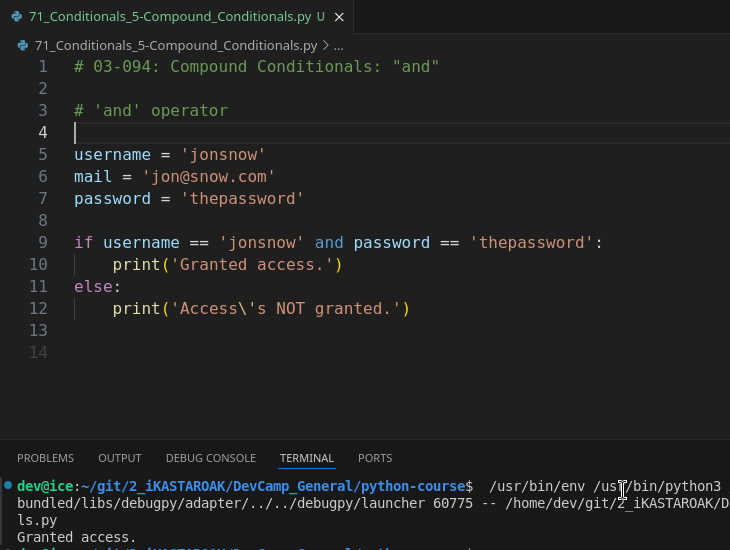
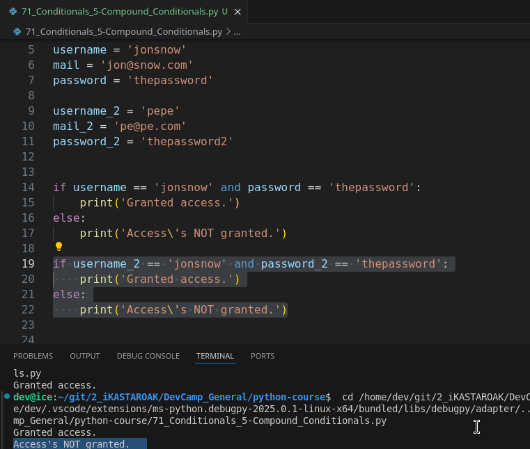
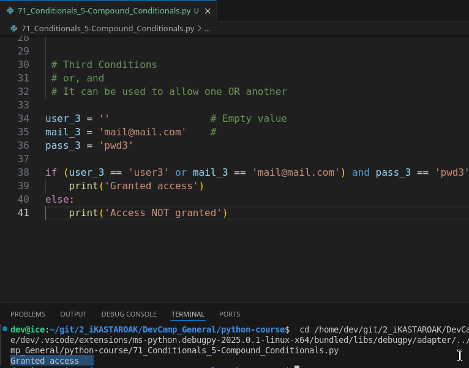
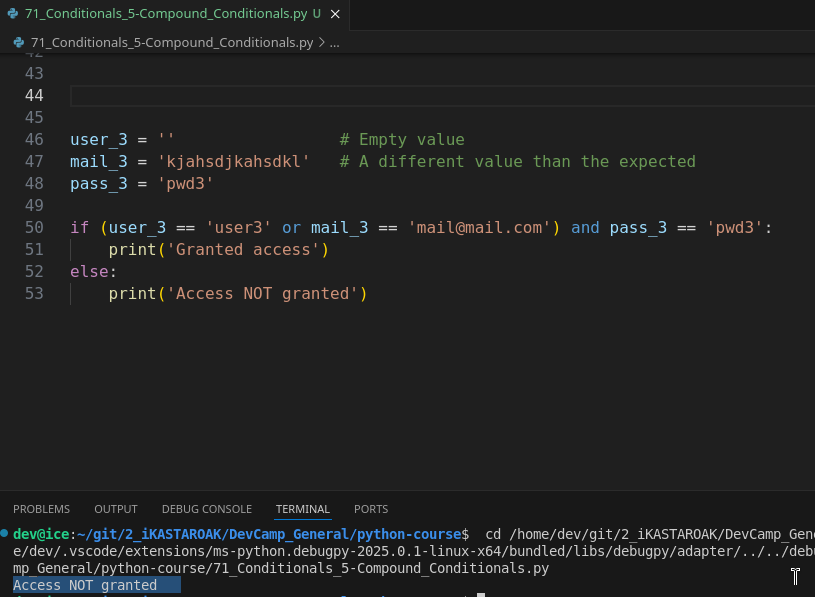
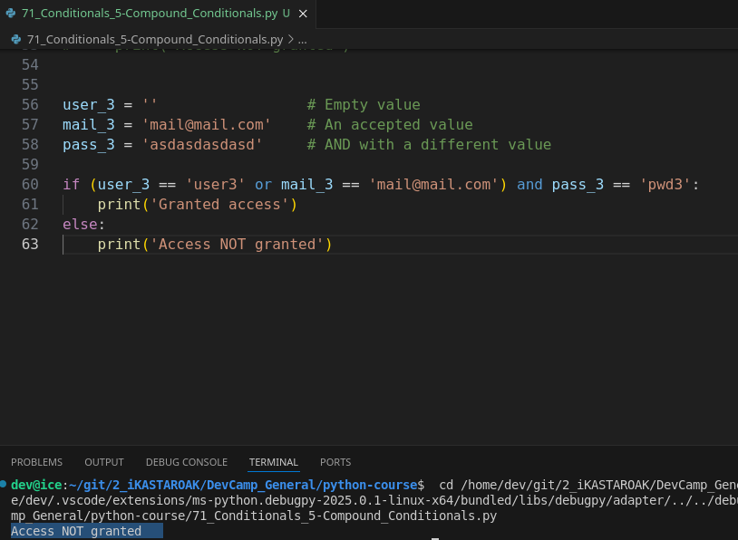
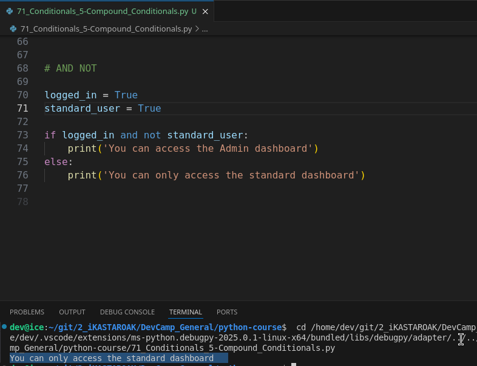
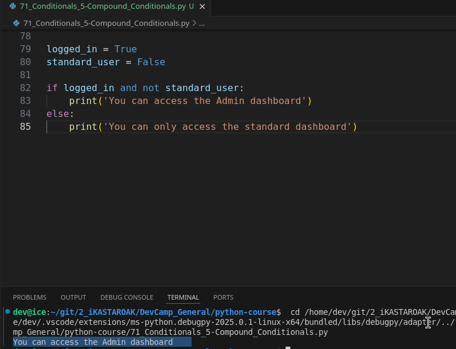

# MODULE 03 - 094: Python - Compound Conditionals


In this guide, we will expand our understanding of conditionals by exploring **compound conditionals**, which allow us to combine multiple conditions in a Python program.

🔗 **Reference:** [Python Conditional Statements](https://docs.python.org/3/tutorial/controlflow.html#if-statements)

---

## 📌 The `and` Operator

The `and` operator ensures that **both conditions must be true** for the entire expression to evaluate as `True`.

🔗 **Reference:** [Boolean Operations - `and`](https://docs.python.org/3/library/stdtypes.html#boolean-operations-and-or-not)

### ✅ Example Use Case

- A system that requires both a **correct username** and a **correct password** to grant access.
- If **both** values match, access is **granted**.
- If **either** value is incorrect, access is **denied**.

🔹 **Key Concept:**

- `True and True` → ✅ `True`
- `True and False` → ❌ `False`

---

## 📌 The `or` Operator

The `or` operator allows **at least one condition to be true** for the expression to evaluate as `True`.

🔗 **Reference:** [Boolean Operations - `or`](https://docs.python.org/3/library/stdtypes.html#boolean-operations-and-or-not)

### ✅ Example Use Case

- A login system that accepts **either a username or an email** to log in.
- As long as **one** of them is correct **and** the password is valid, access is granted.

🔹 **Key Concept:**

- `True or False` → ✅ `True`
- `False or False` → ❌ `False`

---

## 📌 Combining `and` and `or`

We can combine `and` and `or` in a single condition, using **parentheses** to ensure correct execution order.

🔗 **Reference:** [Operator Precedence](https://docs.python.org/3/reference/expressions.html#operator-precedence)

### ✅ Example Use Case

- A system that allows users to log in with **either** a username or an email **but always requires a correct password**.

🔹 **Best Practice:**

- Use parentheses to **group conditions** and clarify execution order.
- `((condition1 or condition2) and condition3)` ensures that `condition1` or `condition2` is checked first, followed by `condition3`.

---

## 📌 The `not` Operator

The `not` operator **reverses** the boolean value of an expression.

🔗 **Reference:** [Boolean Operations - `not`](https://docs.python.org/3/library/stdtypes.html#boolean-operations-and-or-not)

### ✅ Example Use Case

- A system that grants access to an **admin dashboard** only if the user is logged in **and** is **not** a standard user.

🔹 **Key Concept:**

- `not True` → ❌ `False`
- `not False` → ✅ `True`

---

## 📌 Summary

- **`and`** → Both conditions must be **true**.
- **`or`** → At least one condition must be **true**.
- **Combination of `and` and `or`** → Parentheses help define logic clearly.
- **`not`** → Reverses a boolean expression.


****

## Video lesson Speech

In this guide, we will expand our understanding of conditionals by exploring **compound conditionals**, which allow us to combine multiple conditions in a Python program.

---

## 📌 The `and` Operator

The `and` operator ensures that **both conditions must be true** for the entire expression to evaluate as `True`.

### ✅ Example Use Case

- A system that requires both a **correct username** and a **correct password** to grant access.
- If **both** values match, access is **granted**.
- If **either** value is incorrect, access is **denied**.

🔹 **Key Concept:**

- `True and True` → ✅ `True`
- `True and False` → ❌ `False`

---

## 📌 The `or` Operator

The `or` operator allows **at least one condition to be true** for the expression to evaluate as `True`.

### ✅ Example Use Case

- A login system that accepts **either a username or an email** to log in.
- As long as **one** of them is correct **and** the password is valid, access is granted.

🔹 **Key Concept:**

- `True or False` → ✅ `True`
- `False or False` → ❌ `False`

---

## 📌 Combining `and` and `or`

We can combine `and` and `or` in a single condition, using **parentheses** to ensure correct execution order.

### ✅ Example Use Case

- A system that allows users to log in with **either** a username or an email **but always requires a correct password**.

🔹 **Best Practice:**

- Use parentheses to **group conditions** and clarify execution order.
- `((condition1 or condition2) and condition3)` ensures that `condition1` or `condition2` is checked first, followed by `condition3`.

---

## 📌 The `not` Operator

The `not` operator **reverses** the boolean value of an expression.

### ✅ Example Use Case

- A system that grants access to an **admin dashboard** only if the user is logged in **and** is **not** a standard user.

🔹 **Key Concept:**

- `not True` → ❌ `False`
- `not False` → ✅ `True`

---

## 📌 Summary

- **`and`** → Both conditions must be **true**.
- **`or`** → At least one condition must be **true**.
- **Combination of `and` and `or`** → Parentheses help define logic clearly.
- **`not`** → Reverses a boolean expression.

****In this guide, we're going to extend our knowledge on conditionals and we're going to see how we can actually add compound conditionals which means multiple conditions inside of a python program.

****

To start off I have a few different variables and string values here. I have a username and email and a password.

```python
username = 'jonsnow'
email = 'jon@snow.com'
password = 'thenorth'
```

Now, whenever you're logging into a system you need to have the correct username and the correct password in order to access the system and so far everything that we've looked at has had a single condition.   

## A second condition

So what happens when we need to have 2 items being true?   

So say we need to have a username and password that both match.  

 Well in order to do that we can build what is called the `and operator` into our system.

So, I can say if the username is equal to jonsnow, and once again in a
 real program, this would be pulled from a database.  

 But this is the flow and the logic that you would need in order to make this work.   

I'm gonna say if username is equal to jonsnow.   

This is how we're joining these conditions and whenever we're using the and condition what it's going to do is it's going to say that everything on the left-hand side of the hand and the right-hand side has to be true in order for the code block to be executed.

So, I'm gonna say if username is equal to John Snow and the password is equal to thenorth then we can print out access permitted.

```python
if username == 'jonsnow' and password == 'thenorth':
 print('Access permit')
```

And then adding our else condition we'll just say print and say you shall not pass.   

Now let's run this and see if it's working. And as you can see right there access was permitted.



Now, if the username got changed and now we changed it to something that does not match and run it you can see it says "You shall not pass!"
 So this is working properly.



Now, if this looks a little odd to you.   

I want to show that it's really just a standard condition we're just connecting them and if you don't like this and syntax what you can actually do is nest the conditions inside of each other and it's going to work exactly the same way.

Now, I would not recommend this for what we're building here.   

I think it makes sense to keep these on the same level but just so you can see 
that it's possible instead of and I'm going to just add a colon and move  the password line down to the next line and say if password and then nest our accessed permitted inside of here.   

Now, we're saying if the username is jonsnow come into this code block. Once you're inside, check to see if the password is equal to thenorth. If that matches then you 
can say access permitted and I'll change this back to the correct answer and if I run this you can see that it is still working properly so everything is good here.


Now, **I wouldn't recommend doing it this way but I do like showing new alternate versions whenever they're there**. 

One, because **you may have a preference and you may like this other way better but also because if you're working with legacy python code you're going to run into all 
kinds of different code styles and so I want you to be able to have familiarity with all of them**.

Now, this is what we do when we want to set an and condition.   

What happens if we don't want both of the items to be required?   

So, say for some weird reason we only care about one of the items and we only say 
that one of them needs to be true in order for this to work.  

Well, in order to do that I can swap out the and operator for the or operator and so now if I run this it's still going to say access permitted.


But watch what happens if I change this, so up top if I say jonsnow. Now both of them are true and it's still working.


So regardless of the username being true or not, it is still going to work properly.  

 If I change the password to something else that does not match. This is also still going to work because we have removed the requirement for the left-hand side and the right-hand side to both be true.   

The way the or operator works is it looks at the full expression it first checks to see on the left-hand side.   

If it's true it actually just skips everything to the right because all that has to occur for the or operation to be considered true is for one side to match up and for one to be true.

And so this is a little bit more of a flexible conditional compared with using and.   

The best rule of thumb whenever you're working with compound conditionals is thinking if you want to add a higher level of difficulty or a high-level of restriction then you're going to want to use the and operator because you are chaining on multiple conditions that have to be true in order to work.   

If you want to add more flexibility than the or operator allows you to say I don't care if all the conditions are met. I only care if at least one of them is and if it is then I want you to come down and have access in the code block.

Now, the example that we have right here is not the most logical I've never seen a system that only cared if you had the username or the password correct in order to let you in.  

### Third condition

 So, I'm going to show how we can actually have a third condition and so we can chain on a third condition right here and now this is going to be more of a real-world scenario.   

If you've ever used a system that said type in your username or your email address and you've seen that that works.   

A few examples would be GitHub and a few different systems that are a little bit more 
flexible where you don't have to have a username or an email address you could actually type either in and they would work.  

Well, what you can do to make that possible is you can change this back to an and operator because you always are going to want the password to be accurate.   

And now what we can do here on the left-hand side is actually wrap this in parentheses and say username equals jonsnow.   

And then inside of this, I'll say or email is equal to [jon@snow.com](mailto:jon@snow.com).  

 And now what this is going to do is it is going to split it up and if you remember when we talked about the order of operations that applies here as well.

So, what Python is going to do is it's gonna come.   

It's good to see inside of this conditional and see there are parentheses so it is going 
to look and it's going to treat this as a single expression and then it's going to look inside the parentheses and it's going to say OK there's an or operator here.   

So, all I care about is if there is a username all I care about is if this is true or if the email address matches as long as one or the other of these is accurate.   

So, as long as one or the other these past the condition then it's going to treat this 
entire object here as being true and then it's going to move on and check for the password.

So I'm going to set our password to being accurate here so this matches and our username.   

I'm just going to set to an empty string.   

Imagine a scenario where you've built out a login feature and you want to allow both an email address and a username and you want to give the users the ability to type one or the other in order to access the system.   

So, now, if I come up and I run this code you can see access is still permitted even though I made the username blank.



Because what happens is it comes in it sees the username doesn't match but says that's still okay because we have a or operator here and then it goes and it looks to see okay what does the email address do if it matches. Then it says okay this entire expression here is true.

Now, if I come down here and say [jon@snow.net](mailto:jon@snow.net) instead of .com this is no longer going to match and so it should say you shall not pass. So if I hit run that executes properly.



So, this entire expression here got returned as false and so everything is working properly. Now if I switch this back so it's .com so we know this is true but then our password is false and I run this.   

It also is going to say you shall not pass because we are back in the situation where everything on the left-hand side.   

So, this full expression hs to return True and Everything on the right-hand side has 
to return true as well.



So in summary that is how to use the and the or operator.

We have one more example we're going to look at because there are times where you want to see if something is not true and I'm not talking about pure inequality I want to make sure that we have a scenario like this where we can combine two different expressions two different conditions and make sure that one is true and the other is false.

I'm going to use a different example for this and so I'm gonna say logged in equals true.  

Imagine a scenario where you have the ability in your application to see if the users logged in or not.  

 So we can say that this logged-in user is true so they've successfully gotten into the
 system they're logged in that we now want to see if they're a standard 
user or if they're an admin user.

So, for here, we can set a standard user that is going to be true.   

And now let's create a new conditional.   

So I'm going to say if logged in and not so this is the syntax whenever you want to see if one side is true and the other is false then you can say and not standard_user.  

 Then we can print this out you can access the admin dashboard and else we 
can print out you can only access the standard dashboard. So now if I 
run this you can see it says you can only access the standard dashboard.



And so what is going on here? Well let's look at the top of the very beginning we have a logged-in user that is set to true a standard user.   

So, this is telling us a permission level that the user may have. And so we're saying if they're logged in. So this part has to be true. And then here is where we're getting into a little bit more complex territory.   

We're saying this part has to be true. But this part over here because we said and not this part actually has to be false.

And I know this might be a little bit challenging to understand if you've never used nested and complex conditionals before but try to imagine and try to simplify it as much as possible.  

 Remember what I told you in the introduction when we talked about conditionals? What the, if statement looks for, is it can only look at one item. And so it's 
actually looking at this entire expression here. And then we are 
separating it out.

So we're saying OK there's a left-hand side here and there's a 
right-hand side. And these all need to evaluate to true and the part 
that gets a little bit confusing is we're saying that this entire 
expression needs to evaluate to true but inside of this we have multiple
 expressions. So we have this side that needs to be true but because I 
said and not this kind of flips the entire logical process on its head. 
Because now what we're saying is the right-hand side has to be false.

Just like when we were using just and by itself that meant that the 
left-hand side and the right-hand side needed to be true in order for 
the entire expression to be considered true. When we say and not what 
that means is the left-hand side needs to be true the right-hand side 
needs to be false in order for the entire expression to be true. Once 
again I know that's a little bit convoluted.

However, it is a very common convention you're going to see whenever 
you want to verify that one side of the element comes out is true and 
the other does not. So imagine that an admin user logs in they are not a
 standard user. So this is false. And if we run this code it says that 
you can access the admin dashboard because in this case, everything is 
working.



This side is true. And then on the right-hand side, this is false and
 because of that, the entire expression returns true and it will execute
 everything in the code block right here. Now that is confusing, do not 
worry that it takes many students a while to understand that, and even 
when it comes to more advanced students this is still something that can
 trip up developers that have been doing this for years.

You should definitely feel it's totally natural to struggle with the 
concept if you've never seen it before. And I recommend going through 
this video again going through the show notes and then also creating a 
few examples yourself to make sure that you really understand the 
processes that are happening.

****

## Code

```python
# 03-094: Compound Conditionals: "and" / "or"

# 'and' operator

username = 'jonsnow'
mail = 'jon@snow.com'
password = 'thepassword'


if username == 'jonsnow' and password == 'thepassword':
    print('Granted access.')
else:
    print('Access\'s NOT granted.')


# 

username_2 = 'pepe'
mail_2 = 'pe@pe.com'
password_2 = 'thepassword2'

if username_2 == 'jonsnow' and password_2 == 'thepassword':
    print('Granted access.')
else:
    print('Access\'s NOT granted.')


 # Third Conditions
 # or, and
 # It can be used to allow one OR another

user_3 = ''                 # Empty value
mail_3 = 'mail@mail.com'    # 
pass_3 = 'pwd3'

if (user_3 == 'user3' or mail_3 == 'mail@mail.com') and pass_3 == 'pwd3':
    print('Granted access')
else:
    print('Access NOT granted')


user_3 = ''                 # Empty value
mail_3 = 'kjahsdjkahsdkl'   # A different value than the expected
pass_3 = 'pwd3'

if (user_3 == 'user3' or mail_3 == 'mail@mail.com') and pass_3 == 'pwd3':
    print('Granted access')
else:
    print('Access NOT granted')


user_3 = ''                 # Empty value
mail_3 = 'mail@mail.com'    # An accepted value
pass_3 = 'asdasdasdasd'     # AND with a different value

if (user_3 == 'user3' or mail_3 == 'mail@mail.com') and pass_3 == 'pwd3':
    print('Granted access')
else:
    print('Access NOT granted')


# AND NOT

logged_in = True
standard_user = True

if logged_in and not standard_user:
    print('You can access the Admin dashboard')
else:
    print('You can only access the standard dashboard')


logged_in = True
standard_user = False

if logged_in and not standard_user:
    print('You can access the Admin dashboard')
else:
    print('You can only access the standard dashboard')
```

****

## Coding Exercise

```python
"""
Fill in the below conditional with a compound condition that will print "Success!" if "number" is anything between 1 and 100 (inclusive).

def compound_conditional(number):
    if #YourCompoundConditionalHere:
        print("Success!")
    else:
        print("Failure...")
"""

# 1
def compound_conditional(number):
    if number > 0 and number <= 100:
        print("Success!")
    else:
        print("Failure...")

compound_conditional(50)


# 2
def compound_conditional(number):
    if number > 0 and number <= 100:
        print("Success!")
    else:
        print("Failure...")

compound_conditional(float(1/6))


# 3
number = 3
def compound_conditional(number):
    if number > 0 and number <= 100:
        print("Success!")
    else:
        print("Failure...")

compound_conditional(number)
```
