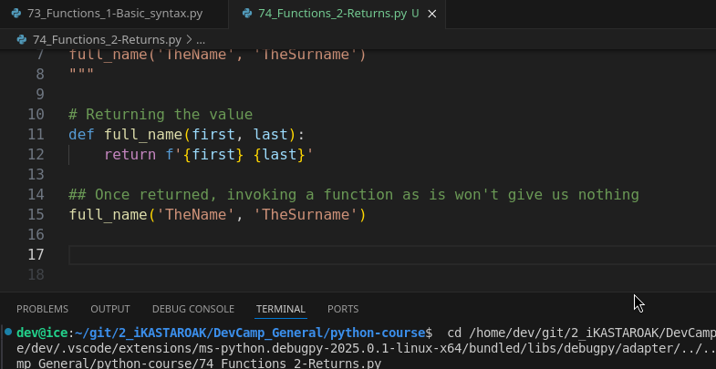
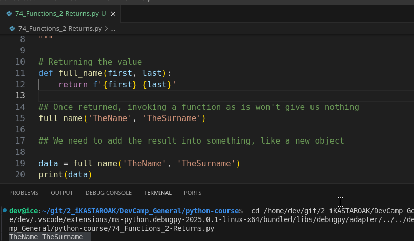
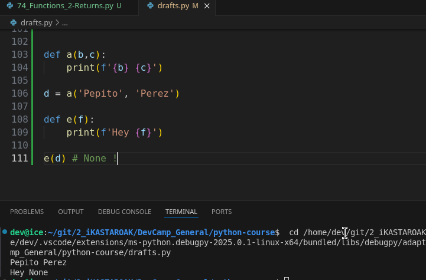

## MODULE 03 - 098: Python - Functions, Return Statement

Now that we've covered the basics of defining functions in Python, it's time to explore one of the most **important distinctions** in function behavior: the difference between **printing a value** and **returning a value**.

Understanding this concept is essential because it directly impacts how you pass and manipulate data in a program. Many future concepts will build upon this foundation, so let's ensure it's crystal clear. 🚀

🔗 **Reference:** [Python Functions - Return Statements](https://docs.python.org/3/reference/simple_stmts.html#the-return-statement)

---

## 🔹 Print vs. Return: What's the Difference?

Many beginners rely on `print()` to display output, but in real-world applications, **returning values** is crucial.

### ✅ Example: A Simple Full Name Function

Here’s a function that prints a full name:

```
def full_name(first, last):
    print(f"{first} {last}")
```

Calling it:

```
full_name("Kristine", "Hudgens")
```

📌 **What Happens?** The name is displayed in the terminal. However, this function **does not store** or return the full name—it's only visible in the console.

### 🔹 Using `return` Instead

If we modify the function to **return** the name instead of printing it:

```
def full_name(first, last):
    return f"{first} {last}"
```

Now, calling `full_name()` won’t display anything by itself:

```
full_name("Kristine", "Hudgens")  # No output
```

But if we store the result in a variable, we can use it elsewhere:

```
name = full_name("Kristine", "Hudgens")
print(name)  # ✅ Kristine Hudgens
```

🔹 **Key Concept:** `return` allows us to **store** and **reuse** function outputs in different parts of the program.

---

## 🔹 Using Returned Values in Another Function

Returning values makes functions more versatile. We can use the output of one function **as input** for another.

### ✅ Example: A Greeting Function

```
def greeting(name):
    print(f"Hi {name}!")
```

Now, let’s integrate it with our `full_name()` function:

```
name = full_name("Kristine", "Hudgens")
greeting(name)
```

📌 **What Happens?**

- `full_name()` **returns** the formatted name.

- That value is **stored in `name`**.

- `greeting(name)` prints:
  
  **"Hi Kristine Hudgens!"** ✅

🔗 **Reference:** [Python String Formatting](https://docs.python.org/3/library/stdtypes.html#printf-style-string-formatting)

---

## 🔹 Common Mistakes: Returning vs. Printing

A frequent beginner mistake is using `print()` instead of `return`. Let’s compare the two approaches:

### ❌ Incorrect: Using `print()` Instead of `return`

```
def full_name(first, last):
    print(f"{first} {last}")

name = full_name("Kristine", "Hudgens")
greeting(name)
```

📌 **What Happens?**

- `print()` inside `full_name()` **displays the name** but **does not return** anything.

- When `greeting(name)` is called, `name` contains `None`, leading to:
  
  **"Hi None!"** ❌

### ✅ Correct: Using `return`

```
def full_name(first, last):
    return f"{first} {last}"

name = full_name("Kristine", "Hudgens")
greeting(name)  # ✅ Correct Output
```

🔹 **Key Takeaway:** Functions should return values when the result **needs to be stored, reused, or passed to another function**.

---

## 📌 Summary

- `print()` **displays output** in the terminal but does not store values.
- `return` **passes values** for future use.
- Functions that return values **can be used inside other functions**.
- Avoid using `print()` inside functions **when returning values is needed**.

****

## Video lesson Speech:

Now,  that we've walked through the basic syntax for creating functions in python in this guide we're going to examine the difference between printing something out from a function and returning something from a function and this is going to be a critical topic if you are not familiar with this type of behavior.

****

Because this is going to speak directly into 
the types of programs that you are going to build out in the future and 
if you do not understand this topic you are going to find many other 
concepts very confusing later on. So I highly recommend to pay attention
 to this guide go through a number of the examples and then if it does 
not make sense then go through them again until it starts to become a 
little bit more clear and I think the examples that I put together for 
this should help to give you some good clarification on the topic and 
also how it will apply to other tasks in the future.

In looking at the code you can see that I've recreated the full name function here

```python
def full_name(first, last):
 print(f'{first} {last}')
full_name('Kristine', 'Hudgens')
```

that simply takes in two arguments which is a first name and a last 
name and then it formats them. Now the key that I want to focus on here 
is that for the majority of this course we have discussed using the 
print function so that we could see these values and when it comes to 
learning introductory topics in Python this is helpful.

However, we are about to graduate into learning how we can actually 
pass values around in Python programs and the reason why this is so 
critical is because all the print function allows you to do is to print 
items in the console and as helpful as that is in a real-world program. 
The only time that you're ever really going to do this is when you are 
performing debugging and you want to see what the output of a function 
is in a real-world program.

You're actually going to return values which means that when you call
 this full name function here you don't care about it printing this out 
to the console in a program such as a django or a flask API application.
 Then all that would do is I would print something out to the logs which
 is helpful for debugging. Not so helpful if the entire goal is to pass 
something to say a front-end react application or some type of mobile 
app and so that is something that is very key to understand which is to 
decide what it means to have functions return values.

If you have heard me speak before about programming in general then 
you might have heard me say that you can understand any programming 
concept as long as you can understand the input and the output of a 
process. And when we talk about functions it's nice because there is a 
very clearly defined input and output and it's part of the reason why I 
absolutely love working with them and I think you will too.

So for this function, our inputs are our arguments here. So first and
 last these are our inputs now our output right now is technically 
nothing. So technically the print statement is only printing to this 
console if we want to work with another part of the program and pass our
 full name value to it which is a very common process we are going to 
run into. Then we have to get into what is called the return statement.

So I am going to change this out. I'm going to get rid of the 
parentheses and so now we have actually changed the behavior even though
 it may not seem like a big difference. We have changed the behavior of 
this function. We've actually made it useful now.

So what this means is that whenever we call full_name we are no 
longer just going to be printing out elements to the console and in 
fact, in its current state we won't be printing out to the console at 
all. This is simply going to return a value. And we can test this out by
 running it and as you can see nothing gets printed out but everything 
worked.



and so let's see how this can really be used. So instead of simply 
calling this function, we're going to call it but we are going to set it
 inside and store the value that gets returned. So this is going to say I
 want to return this formatted string. We're going to return and store 
it in this Kristine variable and so now what I can do is I can create 
another method so I can say def greeting and it expects a full formatted
 name so I can say greeting name and surname as the argument. And now I 
can perform a print statement in a real-life application such as a web 
or mobile application.

```python
def greeting(name):
 print(f')
```

Then you're going to be performing some tasks such as showing it on 
the Web site or something like that. So imagine that instead of print 
right here this is a function that actually renders it onto a Web page. 
But for right now we do want to actually see this in our terminal so I'm
 going to keep it here and now I can add another formatted string and 
say something like hi and then name and then we can end this string. And
 so now if I come here and I print this out I can call our greeting 
function and then pass in our Kristine variable. And so it's tested this
 out to see if it works, and there you can see it has our formatted 
first and last name and that has been placed directly inside of our 
greeting function.



And so if that is not clear at all, let's take one last walk through of it:  

 We created a full name function here. It takes a first and a last name as its inputs, as its arguments, it then returns a value it does not print something out to the console it returns a value which is the formatted string which combines the first and last name.   

From there we called our function and because our function returns a value we were 
able to store that inside of this Kristine variable and then we're able to use it just like a regular string.  

And so hopefully it makes sense that essentially what we've done is if you get rid of this entire full name function call here and simply pass in these values we've pretty much done what we have right here.   

So, if I were to run this you can see that it's identical because essentially what we're doing is when we return this full formatted string we're returning this Kristine Hudgens and we are storing it in this variable and then we can call that from anywhere else in the program.

Now, one of the biggest things I wanted to emphasize was the difference between the return and the print statement and so lets call print here instead of calling return and see what happens.   

Well, first we're going to get something kind of weird happening where it prints out
 the name which's that's expected but then it says Hi None!



The reason why it says hi none is because when we simply print a value out in a function it returns nothing.  

 And so this full name function now it prints something out but it returns None.  

 So Kristine is storing None. And then when we call it from our greeting function 
that's a reason why it says Hi None!

And so that is not very effective.

**That's the reason why the return is so important to understand because when it comes to building out entire processes and storing them in functions typically you want to return a value so that you can call that from either another function or just some different part of the program**.


So in review that is the key difference between the return and the print statements.

****

## Code

```python
# 03-098: Functions Return

"""
def full_name(first, last):
    print(f'{first} {last}')

full_name('TheName', 'TheSurname')
"""

# Returning the value
def full_name(first, last):
    return f'{first} {last}'

## Once returned, invoking a function as is won't give us nothing
full_name('TheName', 'TheSurname')

## We need to add the result into something, like a new object

data = full_name('TheName', 'TheSurname')


def greeting(data):
    print(f'Hey {data}!')

greeting(data)


## Take care of what you do with the objects, otherwise your nested functions won't work

def a(b,c):
    print(f'{b} {c}')

d = a('Pepito', 'Perez')

def e(f):
    print(f'Hey {f}')

e(d) # None !
```
