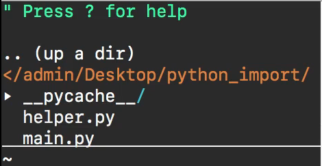
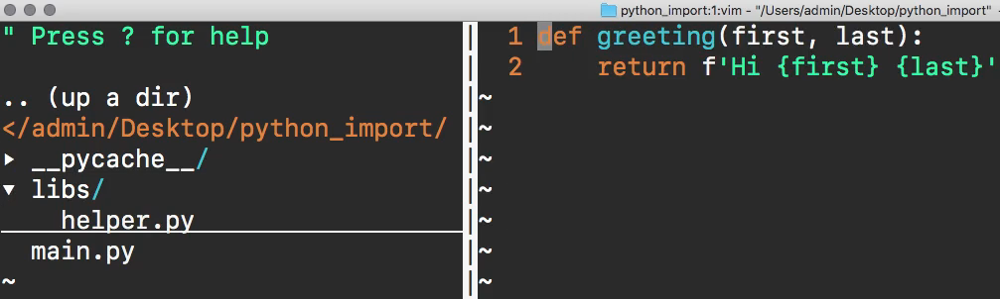
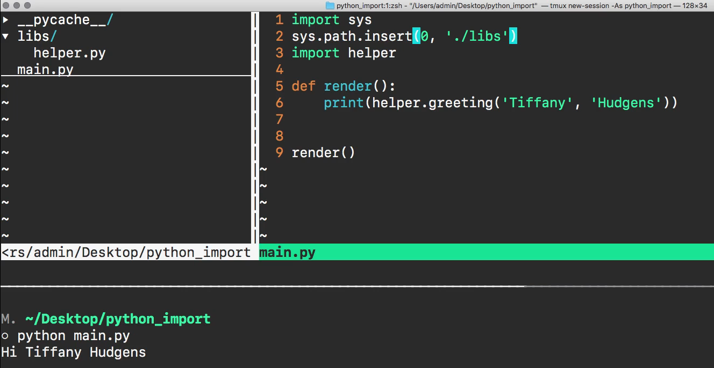

# MODULE 03 - 110: Python - Import Custom Modules Into Another File


## Video lesson Speech

In the last guide, we walked through how we could create our own custom 
module in python and then import it directly into the repl. And there 
are going to be many times where you want to build out modules on your 
own system and then call them from the repl.

****

Imagine if you're a data scientist and you 
have a number of common preprocessing scripts that you want to run on 
data and you simply want to keep those on your system and you want to be
 able to call them whenever you're working on programs in the repl.

That is a very common convention and a helpful tool. However, there 
is also another use case for importing and that is when you're building 
out your own programs and you want to call one of your modules from 
another file. And so that's what we're going to walk through in this 
guide. We're going to see how we can create a custom module just like we
 have right here with our helper.py file and our greeter function.


Then we are going to create another file and then import it directly 
in, later on in the guide we're going to expand our knowledge, and we're
 also going to see how we can call our helper functions from outside of 
the current directory. And so we're going to cover all of that in this 
guide. Let's first go with the base case and so what we're going to do 
is create a new file here.

It's going to be called main.py y I'm going to save this file and if I
 come and refresh the tree here on the left-hand side you can see we 
have a main.py file.



Now, in order to import this, it's actually the exact same syntax 
that we used for the repl so I can say import helper. So what Python is 
going to do by default is it's going to look inside of the current 
directory and it's going to look for a helper.py file and then it's 
going to import that module and the functions inside of it. So I'm going
 to import the helper and then I'm going to create a function called 
render and it's not gonna take any arguments and from there I'm simply 
going to print out helper.greeting and then pass in the string, so I'll 
say 'Tiffany', 'Hudgens' and that's all I need to do.

```python
*helper.py*

def render():
 print(helper.greeting('Tiffany', 'Hudgens'))

*main.py*

def greeting(first, last):
 return f'Hi {first} {last}'
```

I'm also going to call this render function so that it runs 
automatically whenever the main file is called. And now if I open up the
 terminal right inside this directory and that is a very key if you're 
running this script make sure that you are inside of whatever directory.
 Both of these files and MCSA python and then main. Why. And if I run 
this you can see that it works perfectly.


It went, it grabbed the helper module it brought it into the main 
file, and then it had access to the greeting function. So far everything
 is looking really good. Now, that is what happens whenever you want to 
import a helper module or any kind of module directly within the same 
directory.

However, many times you're going to want to keep all of your scripts 
in different directories and so when you want to do that you have to add
 a few more steps and so I'm going to recreate that by creating a 
directory here called lib's and then I'm going to move our helper module
 into the Libs directory. So everything's going to be identical except 
now if I come down and hit refresh you can see that I have a lib's 
directory and that is where the helper.py file is located.



Now if I go into main and I don't make any changes and try to run 
this you're going to see that we run into an error. So if I run this you
 can see it gives the error that inside of the main.py file on line 1 
for import helper the module was not found.


The reason for that goes directly to the default behavior of how 
python import's modules. Whenever you're using this kind of syntax `import helper` python is going to look at the default set paths so it's going to look 
inside of the current directory and then it's also going to look and see
 any third-party packages that you've imported because those by default 
get added to the python import path.

Now in order to have our own custom set of modules accessible we're 
going to have to work with the system so we're going to add a couple 
more lines here. We're going to first import the system library. Now, 
this is directly available to us inside of the Python language, and then
 from here, we're going to add a new path. So we simply need to take our
 libs directory and add it to the path that Python looks for whenever 
it's looking for modules that it can import.

So here I can say sys.path.insert and then pass in first the place 
where in the path I want this accessible. So what insert is going to do 
is it's going to take the full list of paths that Python looks at, and 
it's going to say at the very first spot I want you to insert this new 
path. This is only going to be set for this current file, it's not going
 to affect any other programs that you have on your system and then the 
second argument is the path itself.

Now if this file is located exactly where we have it you can't simply call lib's instead we have to explicitly say `'./libs'` and what that's going to do is it's going to tell python that I want 
you to look inside of the working directory where we're at and then look
 for a directory called lib's and then it's going to insert that path. 
So I'm gonna save this file. And now we're going to try to rerun this 
code and if I run this now you can see that it is working properly.



So congratulations if you went through that you now know how to 
create a custom python module call it from either the current directory 
that your other files are in or even a directory somewhere else on your 
system entirely.

****

## Code

```python
libs/helper.py file

def greeting(first, last):
 return f'Hi {first} {last}!'

# main.py file

import sys
sys.path.insert(0, './libs')
import helper

def render():
 print(helper.greeting('Kristine', 'Hudgens'))
render()
```
