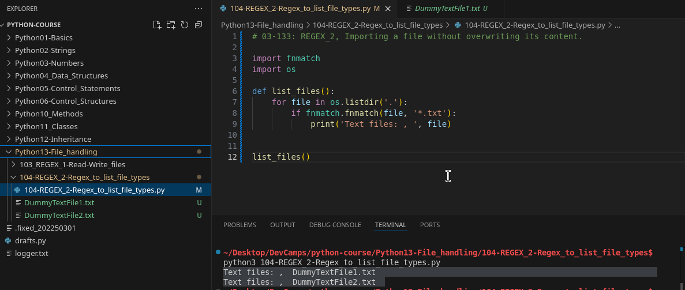
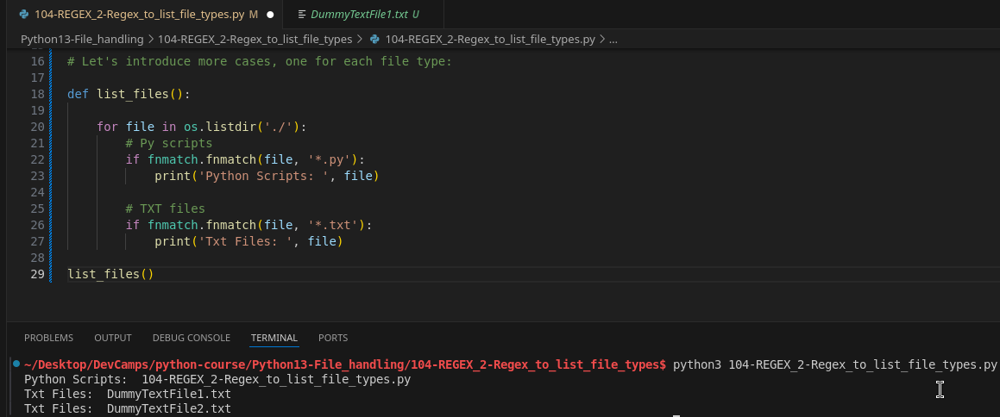
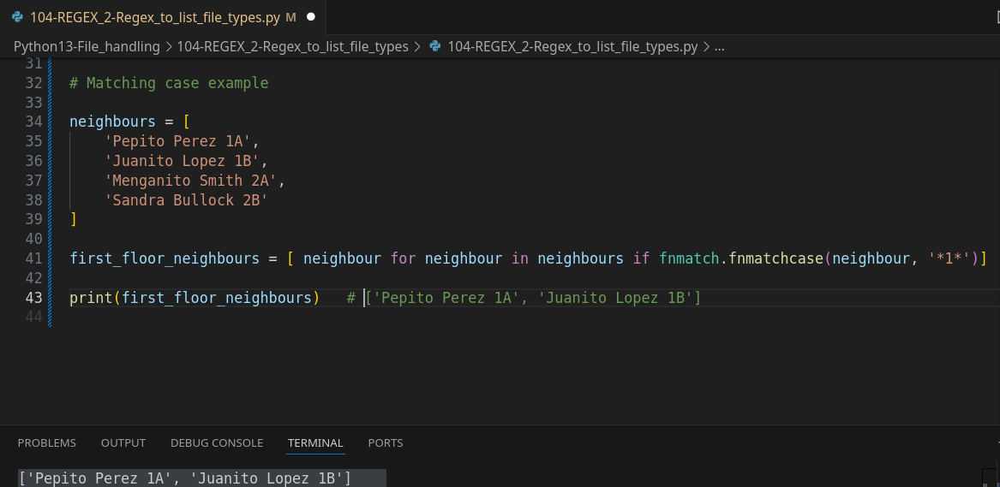

# MODULE 03 - 133: Python: REGEX 2 - Listing File Types

Regular expressions (**REGEX**) allow us to **search, filter, and group files** based on patterns.

In this guide, we will:
✅ Learn how to **use `fnmatch` to filter file types**.  
✅ Explore **real-world applications of REGEX for file handling**.  
✅ Implement a **pattern-matching system** to organize files dynamically.

🔗 **Reference:** [Python `fnmatch` Module](https://docs.python.org/3/library/fnmatch.html)

---

## 🔹 Listing Files by Type

To list specific file types, we use the **`fnmatch` module**, which allows pattern matching.

### ✅ Example: Listing `.txt` Files

```python
import fnmatch
import os

def list_files():
    for file in os.listdir('.'):
        if fnmatch.fnmatch(file, '*.txt'):
            print('Text files:', file)

list_files()
```

📌 **How It Works:**

- `os.listdir('.')` lists all files in the current directory.
- `fnmatch.fnmatch(file, '*.txt')` filters files that end in `.txt`.
- **Only matching files** are printed.

🔗 **Reference:** [Python `os.listdir()`](https://docs.python.org/3/library/os.html#os.listdir)

---

## 🔹 Filtering Multiple File Types

We can **extend our function** to filter files of different types dynamically.

### ✅ Example: Listing `.py`, `.txt`, `.rb`, and `.yml` Files

```python
def list_files():
    for file in os.listdir('.'):
        if fnmatch.fnmatch(file, '*.py'):
            print('Python Scripts:', file)
        if fnmatch.fnmatch(file, '*.txt'):
            print('Text Files:', file)
        if fnmatch.fnmatch(file, '*.rb'):
            print('Ruby Files:', file)
        if fnmatch.fnmatch(file, '*.yml'):
            print('YAML Config Files:', file)

list_files()
```

📌 **What Happens?**

- The function iterates through **all files** in the directory.
- **Multiple conditions** check for different extensions.
- Each matching file is categorized and displayed.

🔗 **Reference:** [Python `fnmatch` Patterns](https://docs.python.org/3/library/fnmatch.html#module-fnmatch)

---

## 🔹 Using `fnmatchcase()` for Advanced Filtering

`fnmatchcase()` performs **case-sensitive pattern matching**, which is useful when filtering structured data.

### ✅ Example: Extracting Specific Data from a List

```python
from fnmatch import fnmatchcase

players = [
    'Jose Altuve 2B',
    'Carlos Correa SS',
    'Alex Bregman 3B',
    'Scooter Gennett 2B'
]

second_base_players = [player for player in players if fnmatchcase(player, '* 2B')]

print(second_base_players)  # ['Jose Altuve 2B', 'Scooter Gennett 2B']
```

📌 **How It Works:**

- The `fnmatchcase(player, '* 2B')` pattern filters players with **"2B"** at the end.
- The list comprehension dynamically **creates a filtered list**.
- **No need for manual string manipulation or loops**.

🔗 **Reference:** [Python List Comprehensions](https://docs.python.org/3/tutorial/datastructures.html#list-comprehensions)

---

## 🔹 When to Use `fnmatch` vs. `regex`

| Feature          | `fnmatch`                  | Regular Expressions (Regex)                |
| ---------------- | -------------------------- | ------------------------------------------ |
| File Filtering   | ✅ Simple wildcard matching | ✅ Complex filtering with character classes |
| Case Sensitivity | ❌ Ignores case             | ✅ Can enforce case sensitivity             |
| Data Extraction  | ❌ Limited                  | ✅ Supports capturing groups                |
| Performance      | ✅ Faster for simple checks | ❌ Slower for complex patterns              |

📌 **Key Takeaway:** Use `fnmatch` for **simple filename filtering**, but for **complex text parsing**, consider using the `re` module.

🔗 **Reference:** [Python `re` Module](https://docs.python.org/3/library/re.html)

---

## 📌 Summary

- **`fnmatch.fnmatch()`** filters files based on extensions.
- **`fnmatchcase()`** allows case-sensitive pattern matching.
- **Dynamic filtering** enables automation in file handling.
- **For advanced text matching**, use **regular expressions (`re`)**.

****

## Video lesson Speech

In this lesson, we're going to walk through how we can utilize regular expressions in order to grab and group files.

***

Now, if you've never heard of what a regular 
expression is, that's perfectly fine. We actually have an entire section
 dedicated to them later on in this course, but for right now, just know
 that regular expressions give you the ability to match patterns, so in 
other words, and the first example that I'll give you a little preview 
of is we're going to create a bunch of files, and they're going to be of
 all different file types.

We're going to have text files, Ruby files, Python files, all kinds 
of things like that. And what we're going to do is we're going to group 
them by their file type, and so in a real-world example, you could grab 
files from the file system that are certain file type, and then perform a
 certain process on them. Hopefully, that will make a little bit more 
sense as we're building it out.

Let's first create the file, so if you are using a Unix type of 
terminal, so if you're on Mac or Linux, then you can do this with the 
exact same commands that I'm going with right here. If you're on PC, you
 can just create the files yourself, so I'm going to create some files. 
I'm going to say `something.txt`, `something2.txt`, we'll say `config.yml`, and then we'll say `scripts.rb`.

Now, none of this actually matters, we're not going to put any code 
in these, I'm just creating these files. Now let's actually create the 
file that we're going to add our Python code to, so I'm just going to 
call this vim, or I'm not going to call the file vim. I'm using "vim" to
 create this, so I'm just going to say `file_matcher.py`, and inside of here, the very first thing I'm going to do is I'm going to import a library, I'm going to import the `fnmatch library`.

Now, this is built into Python so you don't have to install any 
outside dependencies or anything like that, and then I'm also going to 
import the OS library so that we can have access to the operating 
system.

Now, let's create a function, and this function is going to be called
 list_files. You can call it anything you want, and then inside of it, 
I'm simply going to perform a loop. I'm going to say, for file in 
os.listdir. Now, this is just short for list directory, and we want to 
pass in what directory they were trying to access.

Now, if you are doing exactly what we're doing here where you're 
trying to access the same directory that you're in, then just provide a 
dot. If you're trying to access some other file system or some other 
directory, then you're going to have to provide the path to that, but 
for right now, we are trying to access the files directly here that are 
in the same file as what we're in right now.

If you open up the file system, you can see we have this 
file_matcher.py file, and then all those other files that we created, so
 I'm simply going to be looping over each one of those files, and then 
I'm going to perform this kind of match, so this is where the regular 
expression comes in.

I'm going to say, "If fnmatch.fnmatch," so this is just some 
duplication that's necessary. The only reason why is because we are 
calling this module fnmatch, so this is the actual name of the library 
like we imported, but the main function inside of here is also called 
fnmatch, so we're just calling this function, and we're passing it two 
arguments.

The first argument is going to be the name of whatever we're looping 
through. Right now, we're looping through file names, so the way that 
this works is it's going to look at this. The system is going to look at
 it, and it's going to say, "Okay, we have config.yml," and it's going 
to treat it like a giant string. It's just going to say, "All the way 
from that C to the L at the very end, it's going to have all of those 
characters."

Then, it's going to go down, and it's actually going to look at the 
file we're in. It's going to look at this file_matcher.py file, then the
 Pipfile, the scripts, and then these other text files, so it's going to
 loop through each one of those. It's going to be passed in 
individually, that's what that file represents.

Then we're going to pass in, this is where the regular expression 
comes in. We're going to pass in a string, and we're going to say in the
 string "*.txt" and then close it off, so this is just going to be a 
string argument. This is the second one that we're passing in, and then 
for right now, let's just print it out, so I'm going to say print, and 
then I'm going to say that this was a set of text files, and then pass 
in a second argument to that print function, and it will just be file.

```python
import fnmatch
import os

def list_files():
    for file in os.listdir('.'):
        if fnmatch.fnmatch(file, '*.txt'):
            print('Text files: , ', file)
```

Let's hit save, and now, let's just make sure that everything that we
 have here is working, so call list_files and switch over here, so we'll
 call Python file_matcher, and there you go, it prints out text files, 
something2, and then something so, so far, so good, everything here is 
working.



Now, while we're in this loop though, we can perform any other 
conditionals that we want, so here, I can, instead of saying, "I want to
 find text files," I also say I want to find, say, the Ruby files, so 
this could be my Ruby file, and let's keep it going.

Let's say that we also want to find those YML files, YML files are 
very helpful whenever we're performing or building in any configuration 
options, so I can say these are my YML files, and just for good measure,
 let's also add in our Python files, so this will actually find the file
 that we're working on right now.

```python
# Let's introduce more cases, one for each file type:

def list_files():

    for file in os.listdir('.'):
        # Py scripts
        if fnmatch.fnmatch(file, '*.py'):
            print('Python Scripts: ', file)

        # TXT files
        if fnmatch.fnmatch(file, '*.txt'):
            print('Txt Files: ', file)

list_files()
```

If I run this, this should print out all of the files from the file 
system that you can see right here, except for the Pipfile, so it should
 find any of the Python files, the YML files, the Ruby files, and these 
text files. If everything that we're doing is working, that should all 
be shown.

Now, I'm going to run this, and there you go, everything is showing 
up properly. You can see it's grabbing all the Python files, which, it's
 only finding one. Then, it's finding that Ruby file, then the text 
files, and then the YML file.



What we did here is, just in review, we pulled in this fnmatch 
library. This is giving us the ability to pass in a regular expression 
so that this pattern right here is just saying, "If the text that we're 
going over, if anything in there includes a .txt, then I want you to say
 that this condition is true. If not, just skip over it and keep on 
going."

What this asterisk represents is this says that it doesn't matter, we
 do not care what kind of content or what text or string content is 
there before the .txt. All we care about is that the string ends in .txt
 here, and .rb here, and YML, and .py here. That is how you can use 
fnmatch and regular expressions whenever you're working with files.

Now, that is not the only way you can use this library though, I'm 
going to comment out the actual function call, and at the very top here,
 I'm going to say from fnmatch, I want you to import fnmatchcase because
 everything that we just implemented can actually be extended, and you 
can use this for any other part of Python that you need, and this is 
going to be something that is incredibly handy whenever you're using 
machine learning or anything like that, so let's come down here, and 
we'll actually give ourselves a little bit of room, and I'm going to 
create a list right here.

I'm going to say players, and this is just going to be a list of 
baseball players, so I'll say Jose Altuve, and then I'll give his 
position, and then after that, Carlos Correa and his position. Alex 
Bregman and his position, and then I'm going to add another second 
baseman here, so I'll say Scooter Gennett from the Cincinnati Reds, and 
his position is also second base.

```python
players = [
 "Jose Altuve 2B",
 "Carlos Correa SS",
 "Alex Bregman 3B",
 "Scooter Gennett 2B"
]
```

What I'm going to be building out right here is I want to go through 
this players array, and I want to filter it down so that if we find the 
second base term here at the very end of the string, then I want to be 
able to filter those out and only grab those elements, so fnmatch 
actually allows us to do that, and this becomes incredibly handy. I'm 
giving you an example right now of going through baseball statistics.

If you are working for a sports organization and you're pulling in 
all of this content, maybe the raw content from a CSV file or from a 
website, then you can filter out the elements that you want, even if 
you're not working with structured data.

But imagine that you're building out, say, a real estate website or a
 real estate machine learning system and you want to grab all of the 
strings, all the lines that end in something like this where it ends in,
 you know it could be "123 Any St," so you want to grab all the streets 
and you want to ignore it when it says boulevard or avenue. This is 
something that would allow you to do that.

Now, let's build this out, so I'm going to say `second_base_players`,
 and here, I'm going to build a list dynamically. Now, we've talked 
about this before, but let me just show you how we can do that, so I can
 say "player for player in players."

Now, I know that sounds a little bit repetitive, but what we're doing
 is we're looping through this players list, and we're grabbing the 
player item, so both of these are going to be the same, and we're going 
to say each time, so the very first time, this is going to be Jose 
Altuve, then Correa, then Bregman, and then Gennett. We're looping 
through that list, and we're ... because we are placing this bracket at 
the very beginning, that means we're going to be creating a whole 
another list as we're looping through.

Now, I'm going to add a condition, so I'm going to say "in players 
if," and this is where we're going to call fnmatchcase, and then from 
here, what we can do is ... this is just a regular function. We're going
 to pass in player like we passed in those names, those file names 
earlier, and then from there, the second argument will be, and it's 
going to continue on down the second line.

Just for readability, I'll move it down for right now, and then move 
it back up, and I'll say asterisk 2B. Now, we added a dot earlier 
because we actually were looking for file names, and this is the entire 
process, so make sure you have starting brackets at the beginning, and 
then closing brackets at the end.

Then, we are calling fnmatchcase, we're passing in a string each time
 a player, and then we're looping through, and we're trying to find the 
ones that end in a space, and then second base or 2B.

```python
second_base_players = [player for player in players if fnmatchcase(player, "* 2B")]
```

If this works, this is going to trigger for the first item in the 
list, and then the last item, and then it's going to store that in a 
completely new list, so let's print this out and see if this is working,
 so I'll say players that play second base, and then the second argument
 here will be the second base players variable, hit save. Now, if we run
 this again, you can see that worked perfectly, we have players that 
play second base, Jose Altuve and Scooter Gennett.



In review, what we've done here is we've leveraged the fnmatch 
library in Python, and we've seen how we can pass in patterns of data. 
Now, I know this section is focused on the file name, so this is a very 
common tool that you'll use whenever you're working with the file system
 in Python.

We're able to combine the operating system library with the fnmatch 
library so that we could search through it and we could filter down a 
list of file names, but that is only one way of doing it. If you ever 
need to perform a task such as filtering down a list, then you can also 
use the same library, so I hope that you found that a helpful 
introduction to being able to integrate and work with regular 
expressions along with the Python file system.

## Code

```python
# 03-133: REGEX_2, Importing a file without overwriting its content.

import fnmatch
import os

def list_files():
    for file in os.listdir('.'):
        if fnmatch.fnmatch(file, '*.txt'):
            print('Text files: , ', file)


list_files()


# Let's introduce more cases, one for each file type:

def list_files():

    for file in os.listdir('./'):
        # Py scripts
        if fnmatch.fnmatch(file, '*.py'):
            print('Python Scripts: ', file)

        # TXT files
        if fnmatch.fnmatch(file, '*.txt'):
            print('Txt Files: ', file)

list_files()


# Matching case example

## While it's not mandatory in this example to "from fnmatch import fnmatchcase",
## it's a good practice to import only the needed methods.

neighbours = [
    'Pepito Perez 1A',
    'Juanito Lopez 1B',
    'Menganito Smith 2A',
    'Sandra Bullock 2B'
]

first_floor_neighbours = [ neighbour for neighbour in neighbours if fnmatch.fnmatchcase(neighbour, '*1*')]

print(first_floor_neighbours)   # ['Pepito Perez 1A', 'Juanito Lopez 1B']
```
