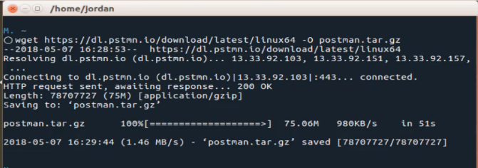
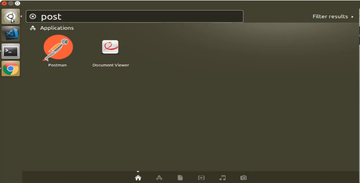

# Module 03 - 135: Python -  Postman (1)

# Postman setup using Debian Testing (as from March, 2025)


**Postman** is a powerful tool used for **API testing and development**. It allows developers to interact with APIs without writing a single line of code, making it a crucial part of modern web development workflows.

In this guide, we will:
✅ Install **Postman** on a Linux system.  
✅ Configure Postman for **API testing**.  
✅ Set up **shortcut commands** for easy access.

[Install and update Postman | Postman Docs](https://learning.postman.com/docs/getting-started/installation/installation-and-updates/)

---

## 🔹 Installing Postman on Linux

Postman is not included by default in most Linux distributions, so we need to download and set it up manually.

### ✅ Step 1: Download the Latest Version

```bash
$ wget https://dl.pstmn.io/download/latest/linux_64 -O ./postman.tar.gz
```

📌 **What This Does:**

- Downloads the latest **Postman package** (`.tar.gz`) for **64-bit Linux**.

### ✅ Step 2: Extract the Package

```bash
$ tar -xzf postman.tar.gz

$ rm -rf postman.tar.gz
```

---

## 🔹 Creating a System-Wide Shortcut

To run Postman **from any terminal session**, we create a symbolic link.

### ✅ Step 3: Create a Symlink

```bash
$ sudo ln -s ~/.local/share/Postman/Postman /usr/bin/postman
```

****

### ✅ Step 4: Add Postman to Application Launcher

To access Postman from the **desktop environment**, create a `.desktop` file:

```bash
$ cd ~/.local/share/Postman/
$ touch ~/.local/share/applications/postman.desktop

$ WHOAMI=$(whoami)

$ DESKTOP="[Desktop Entry]\n\
Name=Postman\n\
Comment=API Development Environment\n\
Exec=/home/$WHOAMI/.local/share/Postman/Postman\n\
Icon=/home/$WHOAMI/.local/share/Postman/app/resources/app/assets/icon.png\n\
Terminal=false\n\
Type=Application\n\
Categories=Development;Utility;"

$ echo -e "$DESKTOP" > ~/.local/share/applications/postman.desktop
$ chmod +x ~/.local/share/applications/postman.desktop
```

---

## 🔹 Launching Postman

### ✅ Step 6: Run Postman

⚠️ **DO NOT RUN POSTMAN AS ROOT**

After completing the installation, you can launch Postman cli:

```bash
$ postman &
```

Alternatively, search for **Postman** in your **Applications Menu**.

If everything is set up correctly, Postman will start without issues. 🚀

---

## 🔹 Postman Setup and API Requests

Once Postman is installed:

- **Sign up for a free account** to sync workspaces.
- **Start making API requests** using GET, POST, PUT, DELETE.
- **Use collections and environments** to streamline API testing.

🔗 **Reference:** [Postman Documentation](https://learning.postman.com/docs/getting-started/introduction/)

---

## 📌 Summary

- **Postman** is an essential API testing tool.
- Installation involves **downloading, extracting, and linking Postman**.
- A **desktop entry** allows launching Postman from the GUI.
- Postman helps developers **test and interact with APIs efficiently**.


## Video lesson Speech

Welcome to this section of the course where we're going to see how we can install and configure the Postman application in order to communicate with outside APIs.

****

Now if all of these concepts are new to you do not worry all this is really going to focus on is configuring your environment. If you're going through this and you're not following along on Linux, you can also do the exact same thing on Mac or Windows.   

The commands that we're going to walk through today are specifically targeted to working with a Linux virtual box type of environment.

So, right here I have a link to **BlueMatador** *(link below)* that has this very helpful guide on how to install Postman on your 
Linux machine. Now if you've never heard of Postman, what it is is a 
very helpful application that allows you to communicate with outside 
APIs. So an API is a service kind of like a website or server that you 
can communicate with, but instead of getting a web page back, you get 
data back.

This is a very helpful way that you can build out applications, and 
pass data back and forth then no matter what type of course that you're 
going through you can use Postman since it's not specific to a 
programming language or a framework or anything like that.

When I'm building out a flask API application, or a react 
application, or a Rails application I can use Postman for all of them 
because all it does is it all only cares about is the data request and 
so that's why it's really helpful and it's a tool I use pretty much on a
 daily basis because I do a lot of API development.

So with all that means that I will include a link to this **BlueMatador** post in your show notes and that is going to give you the set of commands you need in order to install this.


So the very first thing that I'm going to do is copy this first line.
 So we're going to end up copying each one of these will copy them one 
at a time so we can make sure that they all succeed, And I'm going to 
paste this in.

`wget https://dl.pstmn.io/download/latest/linux64 -O postman.tar.gz`

And remember in order to paste in Linux it's `control + shift + N + V`.
 So I'm going to run this and it's going to go out and it's going to get
 that Postman application and I'm going to let the video fast forward 
while that is occurring.



Okay looks like that installed properly. So now we are going to unpack it, so that's what we do when we run this `sudo tar -xzf postman.tar.gz -C /opt` command, it'll give us the raw data here and it's compressed so now we need to actually pack it with the command.

So let's switch back paste that in, and it's going to ask us for our 
password and then it's going to go and unpack that and install it on the
 system.

Now we want to remove that compressed version because we only care about the software itself so that's what this `rm postman.tar.gz` command does, so we're going to remove that.

And lastly, we are going to create a symlink right here. It's not 
really that important we understand everything that's going on here. 
This is just the steps that you can run in order to get this installed 
on your system. So I'm going to run `sudo ln -s /opt/Postman/Postman /usr/bin/postman` and it appears that that worked.

And now we have you scroll down a few more other commands and what 
these are going to allow you to do this allows you to call the Postman 
application directly from the system. So whenever you call the search 
trait here then you can call Postman, which is something that I find 
quite helpful. (you can read the description in the article for more 
details)

```bash
cat > ~/.local/share/applications/postman.desktop <<EOL
[Desktop Entry]
Encoding=UTF-8
Name=Postman
Exec=postman
Icon=/opt/Postman/resources/app/assets/icon.png
Terminal=false
Type=Application
Categories=Development;
EOL
```

So I'm going to copy all of this at one time. And now let's paste 
this and hit enter, and it appears that all worked so I'm going to quit 
out of the terminal and then get back in, and let's come up here and see
 if we have access to Postman in our applications and there it is.



So if you click on that and if no errors pop up that means that 
everything should have installed properly. So it is loading right here 
inside of the virtual box window and so depending on what version that 
you have you may get a few different dialog boxes, I've noticed that 
Postman is updated quite regularly so even within the past few months 
I've noticed different dialog boxes come up.


I definitely recommend that you sign up it's completely free to use, 
so I'm going to first fill all of these fields in. Sign up and then 
that's going to go through the process of signing up and give you an 
account. And I believe that when you do that means that you can share 
your different workspaces across your computers.


Now we have the ability to start building some requests. So now that 
we have this I'm going to take a break here in the video and in the next
 one, I'm going to show you how to make some sample requests in Postman 
with a real API.

****

## Resources

- [Postman Installation Scripts](https://blog.bluematador.com/posts/postman-how-to-install-on-ubuntu-1604/?utm_source=hootsuite&utm_medium=twitter&utm_campaign=)
