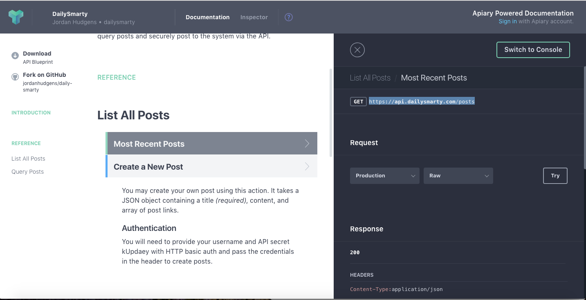
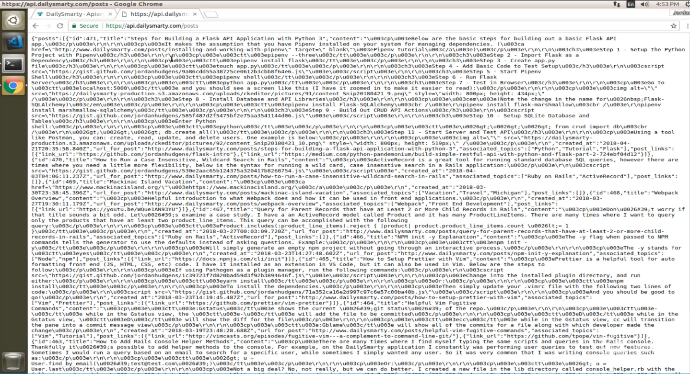
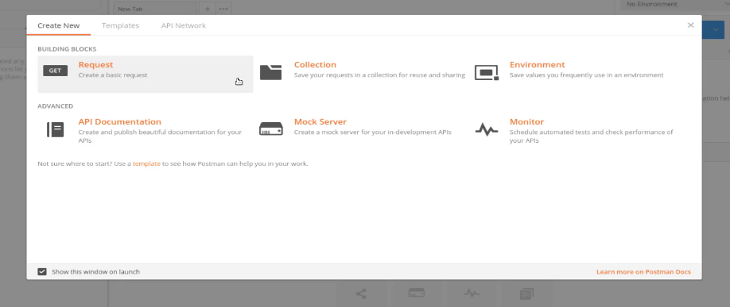
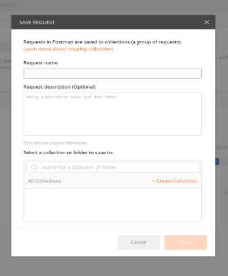
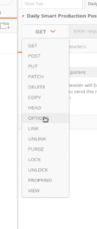
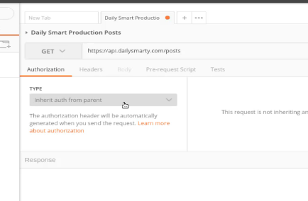
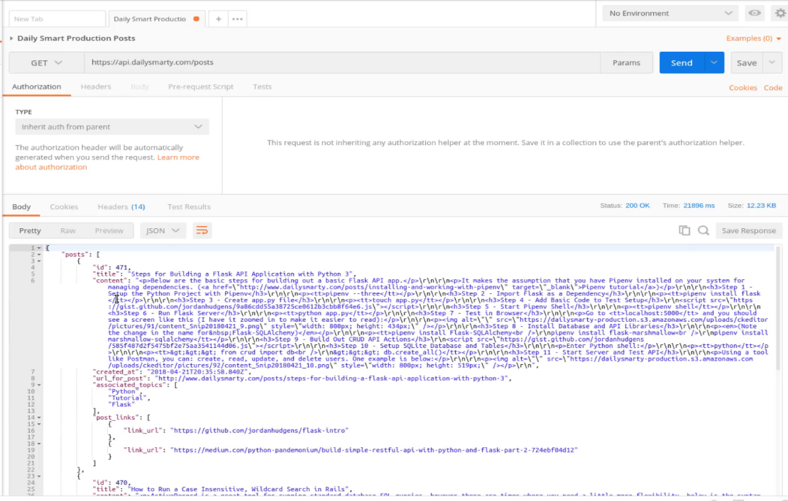
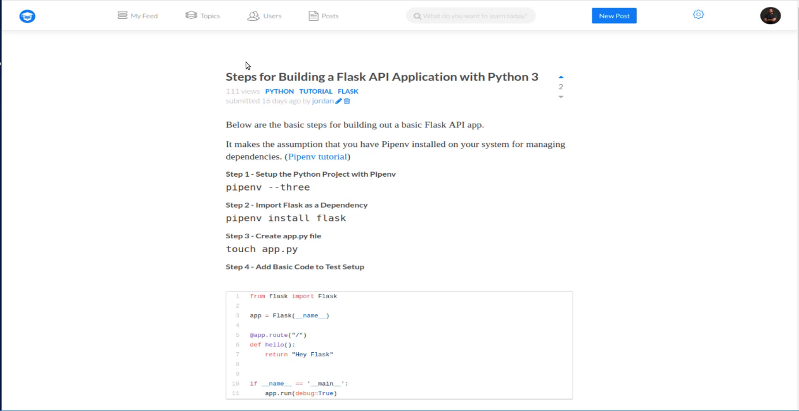
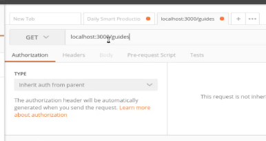

## Module 03 - 136: Python - Postman (2)

## GET - POST - PUSH - DELETE / AUTHENTIFICATION

****

⚠️ **Notice that, as long as DailySmart resource is not longer available, official Postman fake API will be used (Postman-Echo).**

****

## 📌 Using Postman for External and Local API Requests

Postman is a powerful tool for testing and interacting with APIs. In this guide, we'll explore how to:

✅ Send **GET**, **POST**, **PUT**, and **DELETE** requests using Postman Echo.  
✅ Handle **query parameters**, **headers**, and **authentication**.  
✅ Test **local APIs** running on a development server.

🔗 **Reference:**  [Postman documentation overview | Postman Docs](https://learning.postman.com/docs/introduction/overview/)

---

## 🔹 Understanding APIs and Endpoints

An **API (Application Programming Interface)** allows applications to communicate using **endpoints**, which are specific URLs that return structured data.

For example, **Postman Echo** provides a **GET** endpoint:

```plaintext
https://postman-echo.com/get
```

This endpoint returns **JSON data** with details about the request you sent.

📌 **API requests often require parameters, headers, or authentication.****

---

## 🔹 Sending a Basic GET Request in Postman

### ✅ Step 1: Open Postman and Create a New Request

1. Click **+ New Tab**.

2. Select **GET** from the dropdown.

3. Enter the URL:
   
   ```plaintext
   https://postman-echo.com/get
   ```

4. Click **Send**.

📌 **Postman formats JSON responses for better readability.**

🔗 **Reference:** [Send API requests and get response data in Postman | Postman Docs](https://learning.postman.com/docs/sending-requests/requests/#making-requests)

---

## 🔹 Filtering Data with Query Parameters

Postman Echo allows you to test **query parameters** by appending them to the URL. For example:

```plaintext
https://postman-echo.com/get?foo1=bar1&foo2=bar2
```

### ✅ Step 2: Adding Query Parameters

1. Click the **Params** tab.

2. Add key-value pairs:
   
   - **Key:** `foo1`
   
   - **Value:** `bar1`
   
   - **Key:** `foo2`
   
   - **Value:** `bar2`

3. Click **Send**.

📌 **This returns a JSON response with the query parameters you sent.**

****

## 🔹 Sending a POST Request with a Body

Postman Echo also supports **POST requests** with a request body.

### ✅ Step 3: Sending a POST Request

1. Change the request method to **POST**.

2. Enter the URL: `https://postman-echo.com/post`

3. Go to the **Body** tab.

4. Select **raw** and choose **JSON** from the dropdown.

5. Enter a JSON body:
   
   ```json
   {
       "name": "John Doe",
       "email": "john.doe@example.com"
   }
   ```

6. Click **Send**

📌 **Local APIs may return JSON or HTML responses.**

🔗 **References:** 

* [Create Postman collection from Flask application using flask2postman - GeeksforGeeks](https://www.geeksforgeeks.org/create-postman-collection-from-flask-application-using-flask2postman/)

* [Creating APIs with Flask and testing in Postman - DEV Community](https://dev.to/terieyenike/creating-apis-with-flask-and-testing-in-postman-2ojn)

****

## 🔹 Sending a PUT Request to Update Data

A **PUT request** is used to update existing resources. Postman Echo provides an endpoint to simulate this.

### ✅ Step 4: Sending a PUT Request

1. Change the request method to **PUT**.

2. Enter the URL: `https://postman-echo.com/put`

3. Go to the **Body** tab.

4. Select **raw** and choose **JSON** from the dropdown.

5. Enter a JSON body:
   
   ```json
   {
       "id": 1,
       "name": "Jane Doe",
       "email": "jane.doe@example.com"
   }
   ```

6. Click **Send**.

📌 **This returns a JSON response with the updated data you sent.**

****

## 🔹 Sending a DELETE Request to Remove Data

A **DELETE request** is used to delete resources. Postman Echo provides an endpoint to simulate this.

### ✅ Step 5: Sending a DELETE Request

1. Change the request method to **DELETE**.

2. Enter the URL: `https://postman-echo.com/delete`

3. (Optional) Go to the **Body** tab if you want to send data with the DELETE request.

4. Select **raw** and choose **JSON** from the dropdown.

5. Enter a JSON body (optional):
   
   ```json
   {
       "id": 1
   }
   ```

6. Click **Send**.

📌 **This returns a JSON response confirming the deletion or the data you sent.**

****

## 🔹 Handling API Authentication

Many APIs require **authentication tokens** (e.g., API keys, OAuth tokens).

### ✅ Step 6: Adding Authentication

1. Click **Authorization**.

2. Select the authentication method (e.g., **Basic Auth**).

3. Enter your credentials:
   
   - **Username:** `postman`
   - **Password:** `password`

4. Enter the URL:  `   https://postman-echo.com/basic-auth `

5. Click **Send**

🔗 **Reference:** [Postman Authentication](https://learning.postman.com/docs/sending-requests/authorization/)

---

## 🔹 Testing a Local API (Flask, Django, Rails, etc.)

If you're developing an API locally, you can test it using **localhost**.

### ✅ Step 7: Sending a Request to a Local API

1. Ensure your local API server is running (e.g., Flask, Django, Rails).

2. Enter the local API URL:
   
   ```plaintext
   http://localhost:3000/guides
   ```

3. Click **Send**.

📌 **Local APIs may return JSON or HTML responses.**

🔗 **Reference:** [Flask API Setup](https://flask.palletsprojects.com/en/2.0.x/quickstart/)

---

## 📌 Summary

- **Postman simplifies API testing** with structured JSON responses.
- **GET requests retrieve data**, optionally using **query parameters**.
- **APIs often require authentication** (API keys, OAuth, etc.).
- **Local APIs can be tested** using `localhost` and Postman.

---

## Video lesson Speech

In the last guide we installed and configured Postman to work on our 
Linux system and in this guide we're going to extend that knowledge and 
we're going to see how we can actually work with Postman.

****

And once again if you're going through this 
for a front end course or a backend course then you are going to be 
using Postman in some very specific ways, and so what I want to do in 
this section is to have a little bit more of a high-level view of how to
 work with this tool because you're going to use it for your own 
specific use case later on and if you're going through a devcamp guide, 
then we're going to show you how to use it for your specific 
application.

So right now my goal is to simply give you the ability to become 
familiar with how to work with Postman but also to show you exactly why 
you would want to use a tool like this because that I think will help 
you understand why this is something that can make your entire 
development process more efficient.

So right here I have the documentation for the **DailySmartie** API. Now, this is an API that I built so that's the reason why I'm 
wanting to show it because I have complete control over it and if I was 
using some other tool like the Google Maps API or Instagram or Facebook,
 they are constantly changing and so that makes it harder to keep up. So
 what you're seeing right here on the screen should be exactly what you 
see when you go to this URL.

I'll include a link to this in the show notes below. So what this is,
 if you've never worked with an API before, API stands for application 
programming interface and so that is a big acronym that really just 
means that it's a way that we can communicate with an application and we
 can do it without implementing something like a scraper or anything 
like this.

It gives us a set of commands that we can use and we can actually 
have our application communicate with another server in another 
application. So if you scroll down a little bit click on most recent 
posts what an API gives you is a set of endpoints.



So an endpoint is just a URL. So right here, this URL is `https://api.dailysmarty.com/posts` so this is just a URL, just like if you were going to go to it in your 
browser. Now the difference here is that this is going to return JSON 
data, so it's going to return something that an outside application can 
actually use.

So if you're building a React, or a Vue, or an Angular app, then you 
can communicate with this and get the data back in a way that you can 
parse it and then render it on the screen. So if I copy this and paste 
it into the browser then you're going to see that we get data right 
here.



So even though we are not using any kind of outside application or 
any kind of framework you can go to this endpoint. It's really just a 
URL But as you can see even though this is a pretty small, basic API 
this is still pretty confusing to look at and this is pretty much as 
simple as it gets.

So we're not passing in a username and password and we're not passing
 in any parameters anything like that. This is as basic as an API 
request gets and as you can see it is still pretty difficult to work 
with. So that is where tools like Postman come in and that's what we're 
going to walk through in this guide is how we can take all of this and 
then we can use Postman in order to streamline how we can communicate 
with this type of API.

Let's go and let's pull in Postman, and load it up. So when we open 
this it's going to give us the ability to set up this type of request. 
Okay so right here in the load screen and like I mentioned before this 
may look a little bit different for you but the basic flow is going to 
be the same no matter what version you have and we want to set up a 
basic request so if I click on request right here it allows us to give 
it a name.





So I'm just going to say `Daily Smart Production Posts` 
and then it also gives you the ability to create a collection. Now, this
 is something that's pretty helpful because imagine that you're working 
with 10 different applications. A collection allows you to create a 
grouping of those applications so it makes it much easier to look up. So
 I'm going to do that so I'm just going to say that this should be for 
the Daily Smarty API.

Then we can save this. So now that we have this saved we have our 
dashboard where we can communicate with the API. Now if you've never 
worked with APIs at all then one thing that is very helpful to know is 
that there are multiple what are called HTTP verbs. So if you click on 
this dialog box here this is going to give you access to each one of 
those verbs.



Now the most popular ones are here at the top. Like GET, POST, PUT, 
PATCH, and DELETE. Now if we go back and look at that documentation you 
can see that right it even tells us the verb. So we have a GET request 
and without going into full detail because this isn't an API course, 
this is a learning how to use an API tool without going into too much 
detail, what a GET means is it means that you want to get data back.

So any time that you're running a query like this where we're going 
to this post endpoint then what we're saying is we want to get data back
 just like we have in this example. So in order to run this in Postman I
 can just paste this full link.



We do not have any kind of authorization, this is important to know 
because whenever you start to work with applications that require a 
username and password which is very common for some larger APIs, like 
Twitter, Facebook, or anything like that. Then you would click on it and
 then you would pick whatever type of authentication that you need to 
use.

So Basic Auth is pretty common, and Digest Auth, and OAuth. Those are
 also common options as well. Whatever API that you're working with will
 provide documentation and will tell you which one to pick out. But 
right now we don't have any authorization or authentication that we need
 to implement so I can just paste this in.

I have the GET request right here not pasting in any parameters or 
anything like that, and now if I click send this is going to communicate
 with that outside API and then whenever it gets data back then it's 
going to return it and we're going to be able to see it right here on 
the screen.



And there we go. So right here you can see this is coming in from a 
live application. So this is as I'm recording this. This is the set of 
content that's currently on Daily Smarty so you can see the last one 
that I did was actually, of course, I'm working on which is a flask one 
says 'Steps for building a flask API application with Python 3', It has 
all the HTML content from when it was created, the topics and then the 
links associated with that.

So if we were to come here and go to `dailysmarty.com` 
you'll be able to see exactly that post. I'm no longer in the API right 
now, I'm just looking at the regular app, and in this case, it's a Rails
 application, and you can see that post is here.



It says steps for building a flask API with Python 3 and it has all 
of the data, and if you scroll all the way down to the bottom it has 
some resource links and those are also included.

Now if you look back at what this API document there are not really 
documentation this API response looks like. Imagine that you wanted to 
work with a very large and convoluted type of API and many of them are. 
Whenever you're working with the large API you're typically going to get
 multiple levels of nesting and the JSON data can be very difficult to 
parse and that's a reason why you don't want to just use it in the 
browser.

But notice in Postman how much easier this is to read. I can look and
 see that I'm going to work with this post type of structure and it's an
 array of items. Then inside of there, I can see that each one of the 
items has an ID title content each and just going down all the way down 
to post links, and then I can see that post links has an array.

So what this gives me the ability to do is to know what type of data 
that I'm going to be working with so that whatever application I'm 
building allows me to just visualize it all because that's a much much 
easier than trying to do it manually.

I remember when I originally started working with API and this was 
years ago. This was really the only way that you could read the data and
 another very popular way is using a tool called `curl`, And you've seen curl a few times as we've set up the development environment.

So you would run a curl command in the terminal and you'd paste in an
 endpoint, and then you'd get data that pretty much look like our JSON 
and those are very difficult to parse and then every time that you 
wanted to make a change then you'd have to go through creating the 
command from scratch and it really just wasn't a fun way of working with
 APIs

But with Postman, I can make any kind of adjustments on the fly here 
that I need to. So for example, if I go back to the documentation and 
you can see on the bottom here, you can actually search for posts and 
right there if I click on search for posts and then pull that up. Now 
you can see that this is a slightly different endpoint.

`https://api.dailysmarty.com/search?q=rails`

So instead of it being slash posts, it's slash search and so I'm 
going to copy that. Come back to Postman and put in that exact query 
here and now if I run this once again with a get request and I'm not 
passing in anything else because I can hit this endpoint directly.

Now if I hit send, it's going to go out, and there you go. You can 
see we have a search that returns to the key of rails so each one of the
 rails post is going to be returned from the API so that is something 
that is much easier to do than either going to the URL or having to do 
it in the terminal.

Now the last thing I'm going to leave you with is one last tool that 
is also something that you're going to be doing quite a bit. You may 
have noticed that we've been working with a live API this entire time 
but if you're building out an API for somebody else so say that you're 
building out a flask API then you want to be able to test that but you 
don't want to have to push it up and deploy it every time that you test 
it out.

You may want to just test it with your server as it's running on your
 local machine. So before the video started, I started a very basic type
 of Rails application and it has an endpoint so it has the ability to 
communicate. So what I can come here and do is in Postman I'm going to 
create another request here and I'm just going to type a localhost. This
 will give me 3000. And then I have an endpoint called guides.



Now unless you have this on your local machine then you're not going 
to be able to type this exact command. I'm just doing this to show you 
that it is something that's possible so if you have a server that is 
running say a flask or rails API, it is going to be running on localhost
 out on some port and then it's going to have an endpoint.

I just want to show you that you can run this exact same command and 
it'll pick up your local server. So I say localhost:3000/guides and I 
hit send. Then it's going out and it is grabbing these data points, so 
each one of these is a post.

So you can communicate with it here. Now, this isn't returning JSON, 
as you can see this returns HTML because this particular API isn't set 
up to communicate and send JSON back. But what you can do is you can 
perform this so I can say localhost 3000 and communicate with any 
endpoint that you're working with on your local machine.

Because I know if you're going through this guide there's a very good
 chance you're going through it in order to learn how to build out your 
own API for others. And so one of the big things you're going to need to
 do our a very common thing is to be able to work with your local 
machine. So now you know how to work with outside services along with 
ones on your local system and now you're ready to start building out 
your own API as.

## Resources

- [DailySmarty API Documentation](https://dailysmarty.docs.apiary.io/#)
