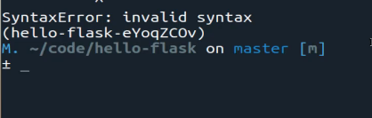
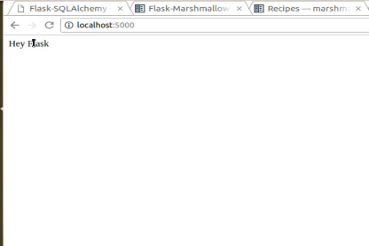

# Module 03 - 138: Python - Flask (2)

## 🎯 Installing Dependencies for Flask Database and API Features

In this guide, we'll set up Flask to work with databases and APIs using three essential libraries:

✅ `Flask-SQLAlchemy` - An **ORM (Object Relational Mapper)** for database interactions.  
✅ `Flask-Marshmallow` - A **data serialization tool** for handling JSON responses.  
✅ `Marshmallow-SQLAlchemy` - A **connector** between Flask-SQLAlchemy and Flask-Marshmallow.

🔗 **References:**

- [Flask-SQLAlchemy — Flask-SQLAlchemy Documentation (3.1.x)](https://flask-sqlalchemy.palletsprojects.com/en/stable/)
- [Flask-Marshmallow: Flask + marshmallow for beautiful APIs &#8212; Flask-Marshmallow 1.3.0 documentation](https://flask-marshmallow.readthedocs.io/en/latest/)
- [marshmallow-sqlalchemy 1.4.1 documentation](https://marshmallow-sqlalchemy.readthedocs.io/en/latest/)

---

## 🔹 Installing Required Libraries

### ✅ Step 1: Ensure Your Virtual Environment is Active

```bash
pipenv shell
```

### ✅ Step 2: Install Dependencies

```bash
pipenv install Flask-SQLAlchemy
pipenv install flask-marshmallow
pipenv install marshmallow-sqlalchemy
```

📌 **What This Does:**

- Installs Flask-SQLAlchemy (Database ORM).
- Installs Flask-Marshmallow (API Serialization).
- Installs Marshmallow-SQLAlchemy (Connector for both).

---

## 🔹 Verifying the Installation

### ✅ Step 3: Import Libraries in `app.py`

```python
from flask import Flask
from flask_sqlalchemy import SQLAlchemy
from flask_marshmallow import Marshmallow
import os

app = Flask(__name__)

@app.route('/')
def hello():
    return "Hey Flask!"

if __name__ == '__main__':
    app.run(debug=True)
```

📌 **Why This is Important?**

- Ensures all libraries are installed and **imported correctly**.
- Allows Flask to **detect any missing dependencies**.

---

## 🔹 Running Flask and Checking for Errors

### ✅ Step 4: Start the Flask App

```bash
python app.py
```

📌 **Expected Output:**

- If **no errors** occur, Flask runs at `http://localhost:5000/`.
- If **an import error** appears, double-check the installation of dependencies.

### ✅ Step 5: Open `http://localhost:5000/`

- You should see **"Hey Flask!"** confirming that Flask is working correctly.

---

## 📌 Summary

- **`Flask-SQLAlchemy`** helps interact with a database using Python objects.
- **`Flask-Marshmallow`** simplifies JSON serialization for APIs.
- **`Marshmallow-SQLAlchemy`** bridges SQLAlchemy models and JSON responses.
- **Testing imports early** helps avoid debugging issues later.

****

## Video lesson Speech

In this lesson, we're going to walk through 
some of the dependencies that we need to add into our application to 
make sure that it is working and it gives us some access points such as 
that allows us to build our application to have a database and to render
 a JSON API data and different elements like that.

And also as a side note, I am pushing each one of the code elements 
from the lessons up as a separate commit. And so in the show notes, you 
have access to this repository so that you can reference along with all 
the transcriptions of the guides. Just in case you ever have a typo or 
anything like that you can always reference this guide and hopefully, 
that can help you out.

There are going to be 3 libraries that we're going to install in this guide. The very first is called `Flask SQL Alchemy`. Now SQL alchemy is it's what's called an `ORM` which stands for Object Relational Mapper and I know that sounds like a
 big confusing acronym and it is. But just to give you a very high-level
 understanding of what an ORM is and this is not something specific to 
Flask to Python or anything.

ORMs are used across the board in pretty much every popular language 
and framework and what an ORM does is it gives you the ability to 
communicate with the database and to do it without having to write pure 
SQL code so something such as being able to run a basic query in the 
database.

You could write SQL code from scratch, however many times it's not 
necessary, many times simply being able to have some helpful methods to 
run those queries can make your life as a developer much easier and it 
can also make your code easier to read and to maintain. And so that's 
what SQL alchemy allows you to do. Flask SQL alchemy is simply a wrapper
 around SQL alchemy so it allows you to integrate the ORM in the flask 
application.

So we're going to install that the next one is called `Flask-Marshmallow`.
 So what marshmallow allows us to do is it allows us to render JSON API 
and to have some very helpful tools for being able to wrap the code, so 
if you have ever worked with API data you know that in order to render 
JSON data or anything like that it can be a little bit confusing and how
 you structure it, but what marshmallow allows you to do is to with a 
few helpful libraries and modules.

You can simply call those and it's going to make rendering that JSON 
API data much easier so you can see in the documentation some of the 
tools that allow you to do so you can build out your own models and then
 create what are called schemas, which allows you to structure that data
 and then when you want to create an API endpoint then it allows you to 
much more efficiently create what that code is going to look like.

So this is very helpful whenever it comes to building out basic types
 of API. And then the last one is one that connects the two that we just
 talked about.

So we talked about SQL alchemy and then flask marshmallow. Well this is a `Marshmallow-SQLAlchemy` which I know may sound a little bit confusing but what it allows you to
 do is to connect to both of those tools so you can use them in 
conjunction with each other which has some very helpful types of method 
calls they are able to use.

I definitely recommend for you to look through the documentation to 
see some additional examples but we're later on we're going to work with
 all three of these and we're gonna see how they can work in conjunction
 with each other.

Now to install these. Let's switch to the terminal and I am going to 
make sure first that you're in the correct directory and then we can run
 our commands as `pipenv install Flask-SQLAlchemy` and it's 
very important that it is spelled the right way and also that is case 
sensitive so make sure that written like I have it.

All those letters are capitalized and so you can just hit enter and 
it'll go and install that. I'll add it to the pip file. Add it to the 
pip file lock and then we'll have it as a dependency inside of our 
application so depending on how fast or slow your internet is that may 
take a few seconds to a few minutes so fast forward this.

Looks like that installed properly. So now we can go and install the next one which is `flask-marshmallow.` So let's say `pipenv install flask-marshmallow` and it please note once again this is case sensitive so this is going 
to be different than the last one. This is going to perform the same 
task. It's going to install all the dependencies and add it into our 
project.

Okay, that installed much faster. So now let's install the last one which is marshmallow sqlAlchemy. Type in `pipenv install marshmallow-sqlalchemy`. So that looks like it all worked. So now if I were to open up `pipfile` now you can see that not only do we have flask but we also have these other dependencies right here.

```bash
/python-course$ cat Pipfile


[[source]]
url = "https://pypi.org/simple"
verify_ssl = true
name = "pypi"

[packages]
flask = "*"
flask-sqlalchemy = "*"
flask-marshmallow = "*"

[dev-packages]

[requires]
python_version = "3.13"
```

Now I do want to point something out that is a little bit odd and 
that is how the system determines to have all of this have been in 
lowercase instead of the way we typed it in that's simply the way that 
it stores it inside the pip file. It does have a reference point to it 
and that should still work but just in case you think that's weird I do 
as well.

You're going to also notice that when we add this into the file in 
our import statements, we're going to use a different syntax for that 
importing and so that's why it is important to have a good understanding
 that all of those elements are case sensitive and to not worry about it
 when they are different here.

So now before we're done with this guide let's test this out to make 
sure it's working. We're not going to go out and build these 
integrations in yet but the way that we can make sure that we don't have
 any errors or any issues is we can add our import statements so open up
 your `app.py`file, and now I can import our files.

**app.py**

```python
from flask import Flask
from flask_sqlalchemy import SQLAlchemy
from flask_marshmallow import Marshmallow
import os
app = Flask(__name__)
@app.route('/')
def hello():
 return "Hey Flask"
if __name__ == '__main__':
 app.run(debug=True)
```

That's all we need to do. So let's save this and let's attempt to run it. Let's say `python app.py` And there we go, we do have an error and this is the reason why I wanted to test this out.



So let's open it up again. See where that error is so I have from 
flask import that from flask here. So I have to have a spelling mistake 
in one of these spots. and right here actually on the last line. This is
 just a little encoding issue here, I need to call Import not from.

**app.py**

```python
from flask import Flask
from flask_sqlalchemy import SQLAlchemy
from flask_marshmallow import Marshmallow
import os
app = Flask(__name__)
@app.route('/')
def hello():
 return "Hey Flask"
if __name__ == '__main__':
 app.run(debug=True)
```

So that was just a little error where I wasn't paying attention so. 
Remember when we only want a single module we say from and then import 
what when we want the entire library like in this case where I want the 
entire OS library, then you just say import.

So let me save this let's run it again. And now it's working. So we 
didn't get any errors and this is a reason why I like to make very small
 code additions to the project and then tested along the way even if 
we're not testing the implementation.

I like to just test to make sure that I don't have any typos like 
that because imagine a scenario where we had gone out and this is 
something I used to do quite a bit and it was a problem and it caused a 
lot of errors and projects I worked on, is I would make too many changes
 all at one time and then I'd have an issue like that where I would say 
from instead of import.

Then I would think when the product didn't work, I would have 20 
different places in the application to go try and find that bug. But 
right here as you can see because we only made 3 different code change 
as I was able to know instantly where the problem was.

So that's nothing really related to Flask, it simply is a process 
that's helped me through the years. So if I'm going to come here and go 
to localhost:5000 just to make sure that everything is still working and
 there we go.



So it says hey flask. So our project is working. We're not actually 
putting those modules to use yet but we know that they are imported into
 the project properly and that everything is working.

****

## Resources

- [Code at this stage](https://github.com/bottega-code-school/hello-flask/tree/0f210cc30c2a46bd4ed3a2cd2f8ff43b6e42a7a6)

- [Flask SQLAlchemy Documentation](http://flask-sqlalchemy.pocoo.org/2.3/)

- [Flask-Marshmallow Documentation](http://flask-marshmallow.readthedocs.io/en/latest/)

- [Marshmallow-SQLAlchemy Documentation](https://marshmallow-sqlalchemy.readthedocs.io/en/latest/)[Command Line Interface &#8212; Flask Documentation (3.2.x)](https://flask.palletsprojects.com/en/latest/cli/)
