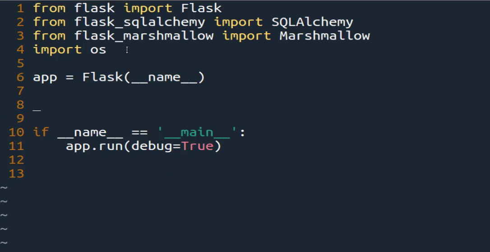
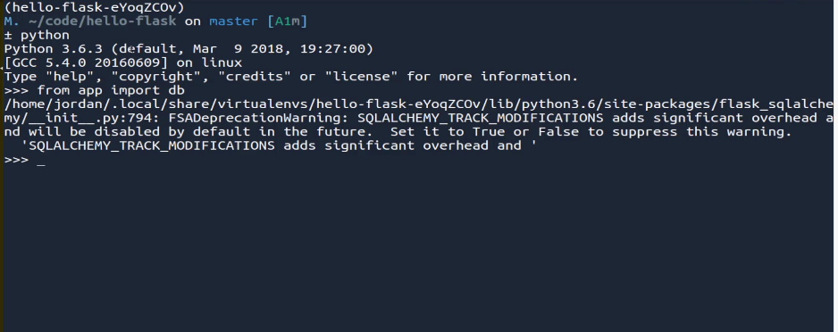
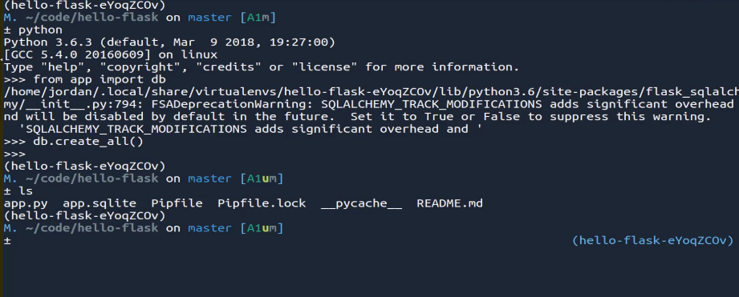
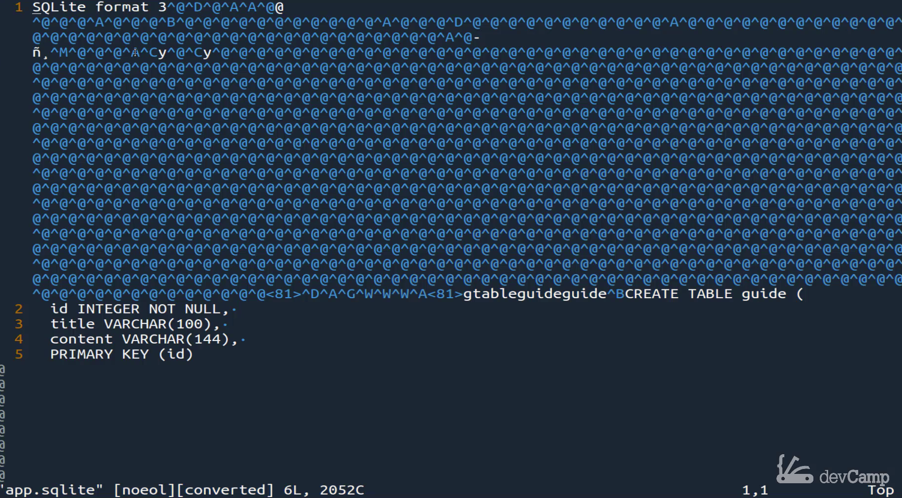
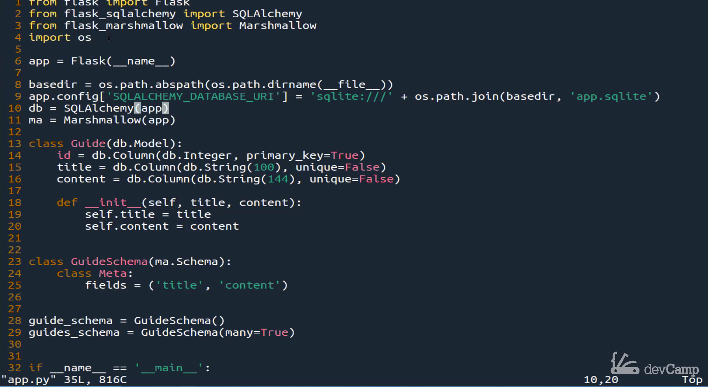

# MODULE 03 - 139: Python - Flask (3)

## Creating a SQLite Database in Flask with SQLAlchemy

---

In the last guide, we installed a number of dependencies that will allow our application to work with a database, as well as giving us the ability to output API data that comes in from that database.

---

### 🔹 Important Note (as of November 2022):

To instantiate your SQL database (SQLite or other SQL formats), use Flask's **application context provider** in a Python REPL:

```python
>>> from app import db
>>> from app import app
>>> with app.app_context():
...    db.create_all()
```

This ensures that Flask properly sets up the database when you are building and deploying projects.

---

In this guide, we will **programmatically create a database table** using **SQLite** and **SQLAlchemy** in Flask. Instead of using external database systems like MySQL or PostgreSQL, SQLite provides a lightweight, embedded database that stores data in a simple file (`.sqlite`).

### Steps:

1. **Configure SQLite in Flask**
2. **Define a database schema using SQLAlchemy**
3. **Create a table in SQLite**

If you're new to database schemas and ORM (Object-Relational Mapping), don't worry—we will break it down step by step. 🚀

---

## 📌 Step 1: Configuring SQLite in Flask

Flask requires a **base directory** for saving the SQLite database file. We use Python’s **os module** to determine this location dynamically:

```python
import os
basedir = os.path.abspath(os.path.dirname(__file__))
```

Now, we configure Flask to use SQLite:

```python
app.config['SQLALCHEMY_DATABASE_URI'] = 'sqlite:///' + os.path.join(basedir, 'app.sqlite')
```

🔹 **Explanation:**

- `sqlite:///` → Defines the database type (SQLite)
- `os.path.join(basedir, 'app.sqlite')` → Creates the path to store `app.sqlite`

---

## 📌 Step 2: Initializing SQLAlchemy and Marshmallow

To interact with the database, initialize **SQLAlchemy** and **Marshmallow**:

```python
from flask_sqlalchemy import SQLAlchemy
from flask_marshmallow import Marshmallow

db = SQLAlchemy(app)
ma = Marshmallow(app)
```

🔹 **SQLAlchemy** → Provides ORM functionality
🔹 **Marshmallow** → Helps serialize data for APIs

---

## 📌 Step 3: Creating a Database Schema

We define a **Guide** class that represents a table in SQLite.

```python
class Guide(db.Model):
    id = db.Column(db.Integer, primary_key=True)
    title = db.Column(db.String(100), unique=False)
    content = db.Column(db.String(144), unique=False)

    def __init__(self, title, content):
        self.title = title
        self.content = content
```

🔹 **Table Fields:**

- `id` → Auto-incrementing primary key
- `title` → Stores guide titles (max 100 characters)
- `content` → Stores content (max 144 characters)

### ✅ Why Use a Primary Key?

A **primary key** ensures that each row is **unique** and auto-increments.

Example:

| id  | title       | content         |
| --- | ----------- | --------------- |
| 1   | Flask Intro | Getting started |
| 2   | API Design  | Best practices  |

---

## 📌 Step 4: Creating a Schema with Marshmallow

To structure API responses, we create a **GuideSchema** class:

```python
class GuideSchema(ma.Schema):
    class Meta: 
        fields = ('title', 'content')
```

Now, instantiate two versions:

```python
guide_schema = GuideSchema()  # Single Guide
guides_schema = GuideSchema(many=True)  # Multiple Guides
```

🔹 **Why?**

- `guide_schema` → Formats a **single** guide
- `guides_schema` → Formats **multiple** guides

---

## 📌 Step 5: Creating the Database File

Now, let’s create the actual **SQLite database file** using Flask’s REPL:

```python
>>> from app import db
>>> from app import app
>>> with app.app_context():
...    db.create_all()
```

### 🎯 Expected Output:

Running the above commands will generate **app.sqlite** in your project folder.

📌 **Verify by listing files:**

```sh
ls
# Output: app.py app.sqlite
```

---

## 📌 Summary

* ✅ **Configured Flask to use SQLite**   

* ✅ **Defined a database model using SQLAlchemy** 

* ✅ **Created a database table (`app.sqlite`)** 

* ✅ **Set up Marshmallow to structure API responses**

---

## 🔗 Resources

- [Code at this stage](https://github.com/bottega-code-school/hello-flask/tree/72b076886d996f4a5236bed1f69a1746fdfbb02f)

- [Flask SQLAlchemy Documentation](http://flask-sqlalchemy.pocoo.org/2.3/)

- [Flask-Marshmallow Documentation](http://flask-marshmallow.readthedocs.io/en/latest/)

- [Marshmallow-SQLAlchemy Documentation](https://marshmallow-sqlalchemy.readthedocs.io/en/latest/)[Command Line Interface — Flask Documentation (3.2.x)

****

## Video lesson Speech

In the last guide, we installed a number of dependencies that will allow
 our application to work with a database, as well as being able to give 
us the ability to output API data that comes in from that database.

****

#### NOTE: As of November 2022, you will need to use Flask's application context provider to instantiate your SQL database as you see toward the end of the lesson (either SQLite like in this lesson or other SQL formats  when you are building and deploying projects). The most direct way to do this is to use the "with" keyword in a Python REPL in conjunction with the context provider (be sure to indent last line and press enter more than once if needed to get code to execute):

```
>>> from app import db
>>> from app import app
>>> with app.app_context():
...    db.create_all()
```

Now in this guide, what we're going to do, and just be prepared, this one is going to be a little longer and it's also going to be a little bit complicated if you've never done it before. What my recommendation would be to follow along and see what gets built out. Don't worry about understanding everything that we're going to talk about. 

Simply look at this as a high-level type of understanding, and try to have that for building out what we're going to do here. What we're going to do is we're going to programmatically create a database table, and we're going to use a pretty basic database.

We are not going to use `mySQL` or anything like `Oracle`. `SQL`, or `Postgres`. We're going to use what is called `SQLite`. SQLite is a very light-weight database. It's what's called an `embedded database`, and that means that we're going to be able to not have to worry about setting up an entire development environment for a database like we would have to do with my SQL or Postgres.

Instead, we're going to be able to simply create a file that will function exactly like how a database would. That's what we do in this guide and we're going to create what is called a `schema`. That means we are going to define the table that we want to work with, and then we are going to allow that code to generate the table for us. 

Now the first thing I'm going to do is, we don't need this `basic app route` or anything like that here anymore. We're going to be building now our own `API endpoint`, so let's just remove that just so it doesn't get in the way. 



The next thing we're going to do is we're going to integrate with the file system. So we need to be able to save our database to our project. In order to do that, if you remember back on `line 4`, we imported the `OS library` which stands for operating system. So now we can work with it.

I'm going to start off by creating a variable here called `basedir`. This is going to stand for the `base directory` of our application because if we don't know what the base directory is then flask isn't going to know where to save our SQLite table to. I'm going to start off with this, and I'm going to call `OS`, our operating system library, and then say:

```py
basedir = os.path.abspath
```

`abspath` stands for `absolute path` and then that is a function. So we're going to pass in an argument and that is going to be:

```py
basedir = os.path.abspath(os.path.dirname(__file__))
```

This is going to at a high-level, if that looks really weird and you've never seen this before, all we're doing is we're telling `flask` in our server or in our `Linux environment` where the application is located so that it knows where to place our SQLite database. From here I can say:

```py
basedir = os.path.abspath(os.path.dirname(__file__))
app.config[]
```

Then I'm going to use this dictionary syntax. Now, this is technically not a dictionary. It is a configuration variable, but you can think of it as performing a look up and then setting a value in our application. So I'm gonna say:

```py
basedir = os.path.abspath(os.path.dirname(__file__))
app.config['SQLALCHEMY_DATABASE_URI']
```

Make sure that you spell it, and this is all in caps. Make sure this is spelled correctly, I had one time where I did this, and I had the weirdest bug come up. It was because one of the letters here was in lowercase, and that was very hard to see because it was the L in `SQL Alchemy` and that just made for a very frustrating while and figuring that out. 

So this is all in upper case `SQLALCHEMY_DATABASE_URI`. Now, this is a specific name. This is something inside of our system, and it has to be set exactly like this or else the SQLite database is not going to know where to go or what the values are. 

Now that you have that, we're going to pass in a string here. So I'm going to say:

```py
basedir = os.path.abspath(os.path.dirname(__file__))
app.config['SQLALCHEMY_DATABASE_URI'] = 'sqlite:///' + os.path.join(basedir, 'app.sqlite')
```

What we're doing here is we're saying that we want to create a database. We need to pass in the base directory that we want it to go, and then we want it to be named `app.sqlite`. Now that we have that, we can create a database object. So I'm going to say:

```py
basedir = os.path.abspath(os.path.dirname(__file__))
app.config['SQLALCHEMY_DATABASE_URI'] = 'sqlite:///' + os.path.join(basedir, 'app.sqlite')
db = SQLAlchemy(app)
```

Now now we're going to work with `marshmallow`. So I'm going to say: 

```py
basedir = os.path.abspath(os.path.dirname(__file__))
app.config['SQLALCHEMY_DATABASE_URI'] = 'sqlite:///' + os.path.join(basedir, 'app.sqlite')
db = SQLAlchemy(app)
ma = Marshmallow(app)
```

I know that may look a little weird if you've never seen it before. Just know that what we're doing is we're making it possible to create a `SQLite database`, and now we've instantiated a database object and a marshmallow object. Now what we can do is we can create the schema for our table, so I'm going to say::

```py
basedir = os.path.abspath(os.path.dirname(__file__))
app.config['SQLALCHEMY_DATABASE_URI'] = 'sqlite:///' + os.path.join(basedir, 'app.sqlite')
db = SQLAlchemy(app)
ma = Marshmallow(app)

class Guide
```

I know we haven't really talked about the type of application we're going to build out, mainly because you can build anything that you want in this particular project. What we're working through are just the basic fundamentals of how flask works, and so we're not going to be able to use this in a production application. We'll do that in a future project. For right now what I think a good example would be to create a little learning management system.  

We're going to have an `API` that has guides, and the guide is going to have two columns. It's going to have a title and it's going to have content. So right here I'm going to say `class Guide`, this is going to inherit from (db.Model). You may notice this `db` call right here is calling this object, the `SQL Alchemy` object that we created on `line 10`. 

So we're saying that `Guide`, and this whole class, is going to inherit from that model. Now we're going to add three database columns, so this is where we're saying this is how we want our database to look like. I'm going to create an `ID column` and reference that database object again. So I'm going to say:

```py
basedir = os.path.abspath(os.path.dirname(__file__))
app.config['SQLALCHEMY_DATABASE_URI'] = 'sqlite:///' + os.path.join(basedir, 'app.sqlite')
db = SQLAlchemy(app)
ma = Marshmallow(app)

class Guide(db.Model):
    id = db.Column(db.Integer, primary_key=True)
```

What this means is this is going to be a built-in column. We're never going to reference this except for database look-up, so we're never going to have to set this. It's going to be set automatically. This is a syntax that's SQL Alchemy uses where you use the database object that we created. You say that we want to add a new column to that object. It has a data type of integer and it's a `primary key`. 

Now if you're not familiar with the way databases work, or you don't have a lot of experience with it, what a primary key does is it allows you to have some nice built-in functionality. 

The two key items that are primary key does for you is a primary key will make sure it's always unique. So every guide is going to have a unique ID associated with it. The other thing is that this ID will automatically increment, so every time that our API creates a new record in the database it is going to increment. 

So the first guide that gets created is automatically going to have an ID of `1.` The next one is going to have an ID of `2`, and so on and so forth. That's our first one. Now let's create a title, and I'm going to say:

```py
class Guide(db.Model):
    id = db.Column(db.Integer, primary_key=True)
    title = db.Column(db.String(100), unique=False)
```

Then inside of the `db`, I want this to be an integer. I want this to be of the string data type, and for this let's say that we want titles to be 100 characters long. For this specific use case, it's not that important, but we'll just say we're limiting it at `100`, and then we want this to be `unique=False`. Also, it looks like I have another little encoding issue here. 

You shouldn't run into that if you are on vs code or sublime text. It is just something with how my system set up with VIM. So I have this title and now I'm going to have one more column here. It's going to be called `content`. For this one, let's imagine we're Twitter, and we want this to be `144` characters. 

It's going to be a string with that many characters, and we do not want this to be unique either. That is our basic schema. 

```py
class Guide(db.Model):
    id = db.Column(db.Integer, primary_key=True)
    title = db.Column(db.String(100), unique=False)
    content = db.Column(db.String(144), unique=False)
```

Now in order to, whenever a guide is called, We need to be able to have a constructor. So we're going to use the `Dunder`(2 underscores before and after) and `init` method. I' going to say:

```py
class Guide(db.Model):
    id = db.Column(db.Integer, primary_key=True)
    title = db.Column(db.String(100), unique=False)
    content = db.Column(db.String(144), unique=False)

    def __init__(self, title, content):
```

Then here we're just going to set the value. So here we say:

```py
class Guide(db.Model):
    def __init__(self, title, content):
        self.title = title
        self.content = content   
```

Notice that we didn't have to do the same thing for the ID because that happens automatically. That's all we need to do for our guide. Now let's go and let's create the schema class itself, so I'm going to say:

Then here we're just going to set the value. So here we say:

```py
class Guide(db.Model):
    def __init__(self, title, content):
        self.title = title
        self.content = content   

class GuideSchema()
```

Then let's pass in marshmallow. If you remember that marshmallow library, that's what allows us to create the schema with SQL Alchemy. So I can say: `ma.Schema`, and inside of here we're going to nest another class, and it's going to be called: `class Meta`. What we do here is we're going to use a tuple to expose the fields that we want access to. In this case, it will be: 

```py
class Guide(db.Model):
    def __init__(self, title, content):
        self.title = title
        self.content = content   

class GuideSchema(ma.Schema):
    class Meta: 
        fields = ('title', 'content')
```

That looks really weird. Do not worry. What we're working through right here is just some base set up things that are specific to SQL Alchemy. If it looks weird that's perfectly fine. I remember the first time that I started working with it. It was a very different type of syntax. 

Part of the reason why I wanted to create this kind of `hello world` example of a project before we get into more production ones, is so that you are able to go through and practice with this a few times. 

The more times you do it you're going to start setting these kinds of things up very quickly, but for right now, I do realize that it's probably confusing and that's perfectly fine. Don't feel bad if some of this looks very foreign to you, because it definitely did for me. 

Now that we have that, what we need to do now is instantiate the `GuideSchema`. I'm going to create two variables here. One is going to be when we're working with a single guide, and another is going to be when we're working with multiples. So I'm going to start off by saying:

```py
class GuideSchema(ma.Schema):
    class Meta: 
        fields = ('title', 'content')

guide_schema = GuideSchema()
guides_schema = GuideSchema(many=True)
```

That is everything that we need, I believe, in order to get this working. So let's save this, and I'm going to start up a `REPL`. Make sure that you have `Pipenv` running because this is going to be something specific to the project. Now I'm going to say: `from app import db`. So that `db`, that is the variable that's the object we've created. That's a SQL Alchemy object.

So you're going to hit run, and it might give you a little warning. That's fine, as long as it doesn't give you an error then you are fine. 



Now, I'm going to say: `db.create_all()`. That's a function, so call it with a `parens` at the end. Hit `enter`, and as long as you don't get any error there, you should be fine. Now let's close it off. The REPL session that is, with `control + d`.  Now if you type `ls`, now you can see that we have a new file here called `app.sqlite`. 



What we've done, and if you look at this file, it's not really a thing that you can look at. You can see just as all these weird types of characters you're not really meant for looking at this file. You can see a few things you can see that we have an `ID` you have a `title` and you have `content` right there. 



That's kind of cool, and it even has all of our values, such as a title having a 100 characters, and a content having 144. That means that all of our commands worked. Let's review it really quickly because I do realize this may be very foreign to you. Now that you've seen the end result, and you've seen what gets created, maybe the first part of what we did might be a little bit more clear. 

Let's just take that line-by-line. First thing that we did is, we created this `base directory`. That's just us going to the operating system, and asking the computer where is the application located. This is the application's base directory. From there we called our app object, and remember that is our `flask object`. 

We said: I want you to configure the SQL Alchemy Database URI. So that is going to add whatever value we set it to. It's going to add that to our application, and then SQLAlchemy is going to look up that. Very similar to how dictionaries work. 

So it's going to look for the specific key, and it's going to see if it's set, then it's going to go and look for that value. What we did is we said we want to create an SQLite location here, and we want to pass in the path of our base directory, and then we want to create an embedded database of `app.sqlite`. 



From there, we instantiated a new database object with SQL Alchemy, and remember what SQL Alchemy is, it gives us a programmatic way of interacting with the database. It created, right here, an object for us, and that object allowed us to perform tasks such as creating this guide table. Then creating the guide schema, and everything that we did from `lines 13 through 29`. That is what we're doing there. 

Then the `ma`, this marshmallow, allows us to have schema. This adds structure to the database. Next, we created a class where we passed in, so our guide inherits from `db.model`, and then we created those three columns, their data types, and some of the values associated with them. We created a constructor here, where we set the title and the content. 

Then we created the schema. This is really just some boilerplate code that allows us to see what values we have access to. So we have access to the title and to the content, and then from there we just instantiated it. We created a single guide schema and then a multiple guides schema. That is the only difference between those two. 

Great job if you went through that. Do not worry if it's not exactly clear on every step of it. I definitely recommend that you go through it a few times, and read some of the documentation until it really becomes clear. Good job if you did, because we have created our first database table, and now with this in place, we're finally ready to build out our API. 

****

## Source Code

- [Code at this stage](https://github.com/bottega-code-school/hello-flask/tree/72b076886d996f4a5236bed1f69a1746fdfbb02f)
