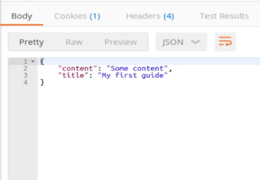
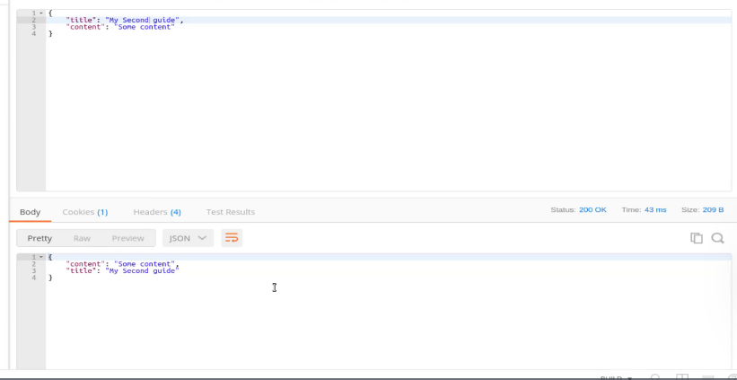
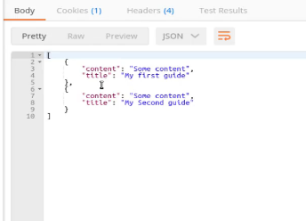

# MODULE 03 - 141: Python - Flask (5)

## Building an API Endpoint in Flask for Returning All Records with a GET Request

*****

## Remember:

We are using VSCode instead of Repl, and ultimately, we are breaking down the original "hello-flask" project into the Python 14 - API section. Therefore, it’s essential to complete each app.py according to the corresponding Python-Course NumFolder.

This GET a single data guide will use: ' app_112.py' .

To replace Repl with VSCode, you can run the following commands in the terminal:    

```bash
(pipenv) $: python
>>> from app_112 import db, app

>>> with app.app_context():
    db.create_all()
```

Alternatively, you can create a runner script, such as `run.py`:

```
# runner

from app_112 import db, app

with app.app_context():
    db.create_all()
```

Then, you can load it by pressing **F5** to start debugging in VSCode.

So, the setup steps will be:

1. Run `run.py`.
2. Run `app.py`.
3. Perform actions in the Postman app.

## ALSO, QUERY() method HAS BEEN DEPRECATED FROM NEWER SQLAlchemy Versions, so, there is a Code Update:

```python
##################
# from app_109
# Setting up var environment and class'es
basedir = os.path.abspath(os.path.dirname(__file__))
app.config['SQLALCHEMY_DATABASE_URI'] = 'sqlite:///' + os.path.join(basedir, 'app.sqlite')
db = SQLAlchemy(app)
ma = Marshmallow(app)

class Guide(db.Model):

    id = db.Column(db.Integer, primary_key=True)
    title = db.Column(db.String(100), unique=False)
    content = db.Column(db.String(144), unique=False)

    def __init__(self, title, content):
        self.title = title
        self.content = content


class GuideSchema(ma.Schema):
    class Meta:
        fields = ('id', 'title', 'content')


guide_schema = GuideSchema()
guides_schema = GuideSchema(many=True)


#######################
# from app_110
## NEW POST endpoint
@app.route('/guide', methods=["POST"])
def add_guide():

    db.create_all()

    title = request.json['title']
    content = request.json['content']

    new_guide = Guide(title=title, content=content)

    db.session.add(new_guide)
    db.session.commit()

    return guide_schema.jsonify(new_guide)


##################
# from app_111
# NEW GET endpoint
@app.route("/guides", methods=["GET"])
def get_guides():

    db.create_all()

    all_guides = Guide.query.all()
    result = guides_schema.dump(all_guides)

    return jsonify(result)
```

---

## Video lesson Speech

In the last guide, we walk through how we could create our very first 
endpoint that allowed us to create guides programmatically. So now with 
that in place, I think the most natural endpoint to create next would be
 to have a world that we can hit to see all of the guides in the system.

****

So it's come down here and add another comment just so it's very clear when you're looking through the source code which was each one of these endpoints does. 

**app.py**

```py
# Endpoint to query all guides
```

And as you may expect now since we've done this a few times we're going to use a route decorator. 

**app.py**

```python
# Endpoint to query all guides
@app.route("/guides", methods=["GET"])
def get_guides():
    all_guides = Guide.query.all()
    result = guides_schema.dump(all_guides)
    return jsonify(result)
```

Now notice here how I'm using what we had on line 29. I'm not using the single guide schema, I'm using the multiple, the one where we said that many are true. This gives us the ability to work either with single guides or multiple guides. 

OK let's save this and run our server. If we don't have any spelling mistakes or typos then this should work. So let's say `python app.py` Now if we open up Postman, we are no longer going to be using a POST request. Remember, we're going to use a get request and we're not going to guide, We're going to go to guides. 

So now if I type send then this should work and we should get back that guide that we created in the last lesson. And that works. 



Now that's kind of boring. Let's go back out and a new guide, just to make sure that this is working. One hint that this is working is notice the one change we had is it now is returning a list of guides, as we can see from the square brackets here. 

But let's not just trust that so I'm going say POST and go to a `localhost:5000/guide` inside of the body. Let's say my second guide and we can leave the content they're the same. So now if I hit send on this. That looks like it worked. 



It has some content and then 'my second guide' notice that it doesn't always keep the order there, but that's fine. And so now if I say `localhost:5000/guide` and make it a GET request and hit send, Now you can see that our query is working so we know that we save two guides to the database and now those are getting returned.



Just like this. So nice job. If you went through that we now have two endpoints completed for our guides API.

## Source Code

- [Code at this stage](https://github.com/bottega-code-school/hello-flask/tree/d08a5bfa1aa9465ad2221a96189d0d6b66ce088b)
