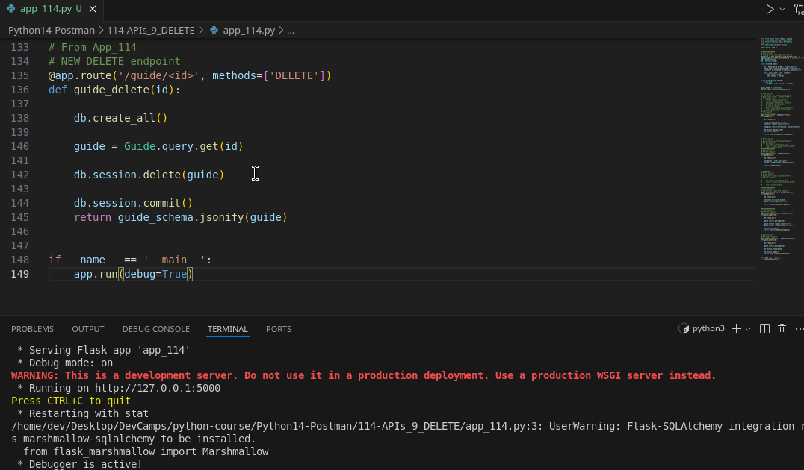
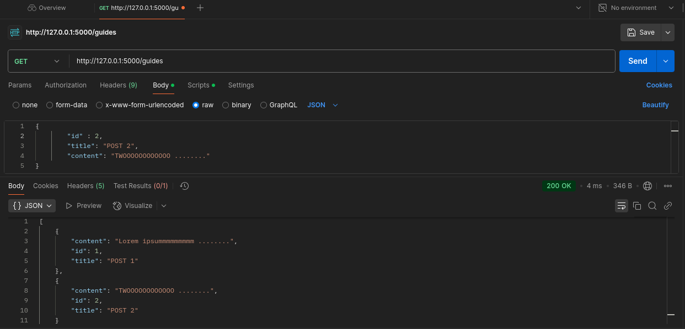
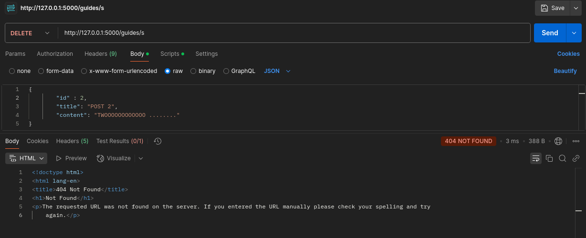
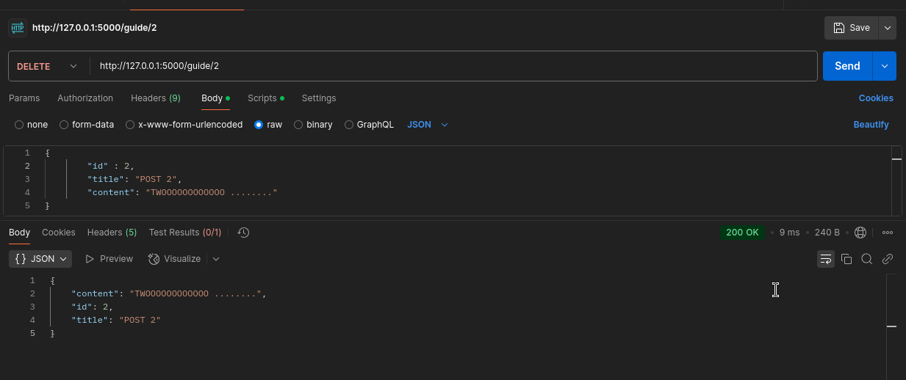
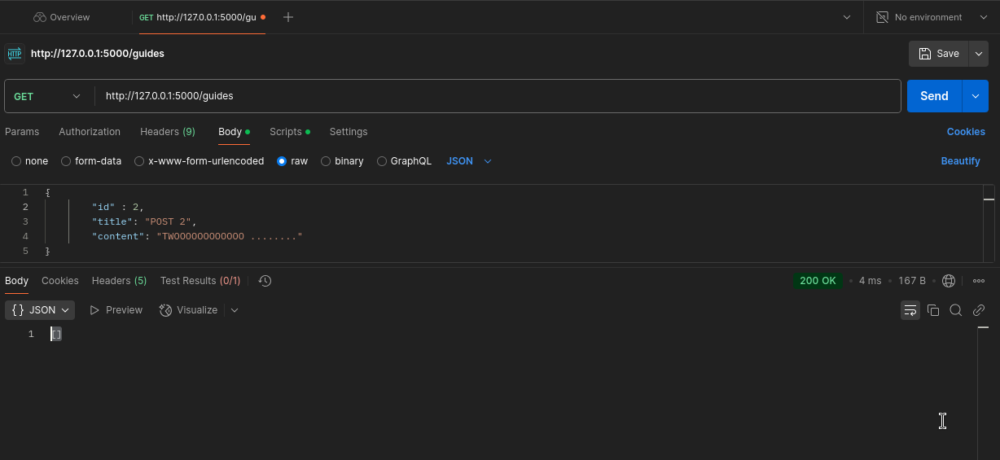

# MODULE 03 - 144: Python - Flask (8)

## How to Build a DELETE API Endpoint in Flask along with Project Summary

---

ALSO, QUERY() method HAS BEEN DEPRECATED FROM NEWER SQLAlchemy Versions, so, there is a Code Update:

To replace Repl with VSCode, you can run the following commands in the terminal:    

```bash
(pipenv) $: python
>>> from app_113 import db, app

>>> with app.app_context():
    db.create_all()
```

Alternatively, you can create a runner script, such as `run.py`:

```
# runner

from app_113 import db, app

with app.app_context():
    db.create_all()
```

Then, you can load it by pressing **F5** to start debugging in VSCode.

So, the setup steps will be:

1. Run `run.py`.
2. Run `app.py`.
3. Perform actions in the Postman app.

### ALSO, QUERY() method HAS BEEN DEPRECATED FROM NEWER SQLAlchemy Versions, so, there is a Code Update:

```python
##################
# from app_109
# Setting up var environment and class'es
basedir = os.path.abspath(os.path.dirname(__file__))
app.config['SQLALCHEMY_DATABASE_URI'] = 'sqlite:///' + os.path.join(basedir, 'app.sqlite')
db = SQLAlchemy(app)
ma = Marshmallow(app)

class Guide(db.Model):

    id = db.Column(db.Integer, primary_key=True)
    title = db.Column(db.String(100), unique=False)
    content = db.Column(db.String(144), unique=False)

    def __init__(self, title, content):
        self.title = title
        self.content = content


class GuideSchema(ma.Schema):
    class Meta:
        fields = ('id', 'title', 'content')


guide_schema = GuideSchema()
guides_schema = GuideSchema(many=True)


#######################
# from app_110
## NEW POST endpoint
@app.route('/guide', methods=["POST"])
def add_guide():

    db.create_all()

    title = request.json['title']
    content = request.json['content']

    new_guide = Guide(title=title, content=content)

    db.session.add(new_guide)
    db.session.commit()

    return guide_schema.jsonify(new_guide)


##################
# from app_111
# NEW GET endpoint
@app.route("/guides", methods=["GET"])
def get_guides():

    db.create_all()

    all_guides = Guide.query.all()
    result = guides_schema.dump(all_guides)

    return jsonify(result)


##################
# from app_112
# NEW GET/<id> single data endpoint
@app.route('/guide/<id>', methods=['GET'])
def get_guide(id):

    db.create_all()

    session = Session(db.engine)
    guide = session.get(Guide, id)

    return guide_schema.jsonify(guide)


##################
# from app_113
## NEW PUT endpoint
@app.route('/guide/<id>', methods=['PUT'])
def guide_update(id):

    db.create_all()

    guide = Guide.query.get(id)

    guide.title = request.json['title']
    guide.content = request.json['content']

    db.session.commit()
    return guide_schema.jsonify(guide)
```

---

****

## Video lesson Speech

Nice job if you've made it all the way through this section in this 
project. This is going to be our last guide where we build out the end 
point for deleting records with our API.

****

I'm going to give us one more line, and then I'm going to say `# Endpoint for deleting a record`. Right here, or I should say that just to make sure this is very clear, `deleting a record`. Just to make it clear you can only delete one at a time. As you may have guessed, we're going to start off with a decorator. So I'm going to say:

```py
##################
# From App_114
# NEW DELETE endpoint
@app.route('/guide/<id>', methods=['DELETE'])
```

The difference is our method is going to be `DELETE`. With that decorator in place, now we can create a function that is going to take in a specific guide, and then it's going to remove it from the database. So I can say:

```py
##################
# Fro App_114
# NEW DELETE endpoint
@app.route('/guide/<id>', methods=['DELETE'])
def guide_delete(id):
```

Take in an ID as an argument, and then we're going to first perform the query.

```py
##################
# From App_114
# NEW DELETE endpoint
@app.route('/guide/<id>', methods=['DELETE'])
def guide_delete(id):

    db.create_all()

    guide = Guide.query.get(id)
```

From there we're going to start up a session. Make sure you execute it with a parens, and then from there we are simply going to return `guide_schema.jsonify(guide)`.

```py
##################
# From App_114
# NEW DELETE endpoint
@app.route('/guide/<id>', methods=['DELETE'])
def guide_delete(id):

    db.create_all()

    guide = Guide.query.get(id)

    db.session.delete(guide)

    db.session.commit()
    return guide_schema.jsonify(guide)
```

Let's save this and let's run it. So `python app.py`. Run that. Everything looks good so far. 



Now, just so you can see right, if we perform our `get query` on guides and run that, everything here is working. Now what I want to do is I want to remove the second guide here. 



The way we would do that is inside of our verb's here, I would come and I would say that I want to delete a record. Then right here with guides, I'm going to say `guides/2` because that's the id of the record that we want to remove. Now if I click send, then it says `not found` which actually makes sense because, right here, we passed this in wrong. 



I had another point I was going to make in a second, but let's just fix the endpoint that's supposed to be a single `guide/2`. Let's run it one more time, and there we go. This is a little bit interesting, and this is going to be something that is up to you. 

In future projects, we're going to talk about it, but whenever you want to remove something, so you want to delete a record, then sometimes you may want to return the entire object like we're doing here. 



What I typically do is I will not return the object. I may just return the ID and then a message, such as that `guide was successfully deleted`. Let's actually do that. I want to, so far I've kind of been following the basic documentation for a lot of this, but let's take a little bit more of a deep dive into this to see what's happening. That may also make a few of the other concepts more clear. 

Let's open up this last one. So `return`, you may think that I have to return this `guide_schema`, and you can do that, but if you wanted to return something else. Whatever you wanted to say, `return` and then you just wanted to return some kind of object or anything like that. What if you just want to return a string? So here if you say:

```py
# Endpoint for deleting a record
@app.route("/guide/<id>", methods=["DELETE"])
def guide_delete(id):
    guide = Guide.query.get(id)
    db.session.delete(guide)
    db.session.commit()

    return "Guide was successfully deleted"
```

Let's see if this works. Let's say that `python app.py`. Everything there looks like it's working. Let's add a new guide really quick, so I'm going to go with `post` and then just post to guide. Go into the body and let's say `Another post`, this can just have `some content`, and let's send that. Look like it worked. Let's add one more just so we have a little bit more data to work with. We can say `Yet another post`. 

Now we run a `get request` for all of the guides. Send. Now you can see we have the three records. We can see that that initial item was deleted, and that did work properly. Usually, you do want to return some type of `JSON` data for your request, but I didn't want you to think that it was magic behind it. 

I'm going to run that delete again. So let's come to delete and let's delete say the guy with the id of `3`.  So I'm going to say `guide/3`. Let's delete that one. Hit send, and look at that. 



We didn't get `JSON` back, and so we wouldn't really want to do that in real life. What I did want to show you is this isn't magic. All we're doing here is we're working with just regular Python code. When I say return some of that code, like calling the `schema` and calling `JSONIFY` in those things, it may seem like you need to memorize every little element that you're going to work on. In reality, this is just python code. 

So here when I say return the string, that's what gets returned. I'd definitely recommend for you to play around with quite a bit this code, especially if some of it's confusing to you. Play around with it, see what happens when you change elements. 

See what happens if you wanted to say: add `conditionals`. What if you wanted to make it so a guide would get deleted, but maybe it would archive that and you could go and create some new columns up here. You could create other columns inside of the schema. Create a new schema, add new records, and then go and change the values on a delete. All kinds of things like that. 

This is a really good base case for building out an API with Python. It gives you all of the key `CRUD` functionality that you're going to need. It gives you a database schema. It gives you the ability to create new records, to query all of them, to query a single one, to update, and then to delete. 

I don't want you to think that this is just the end-all. This is actually just the beginning, but it's a solid beginning. This is much more than just a `hello world`, what we did in the first guide, but now you have a fully functional API. You have the ability to call it to work with modern tools such as Postman, and work with JSON data, and all of the various and all the popular HTTP verbs. 

This is going to help you as you go through your development career. This is going to be able to give a really firm foundation to you as you build out APIs. Nice work as you went through that, and I look forward to working with you on new projects in the future.  

## Source Code

- [Code at this stage](https://github.com/bottega-code-school/hello-flask/tree/5f86922a5c9f3972c7474ffa5be50758cd3909f2)
