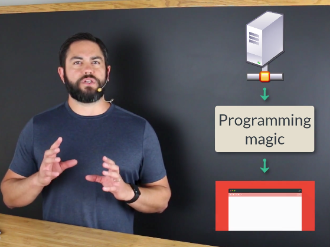

# MODULE 04 - 001: JavaScript, Literacy

## Reasons for Learning JavaScript

****

## Video lesson Speech

So you've heard of this language called JavaScript, and you want to know
 why it's important to learn. That's what we're going to talk about in 
this guide, and I'm specifically going to walk through four key reasons 
why it's important for you to learn JavaScript.

****

I think these reasons are important no matter whether you want to become a professional developer, or you are simply wanting to learn a little bit more about the languages itself. The very first reason to learn JavaScript is that JavaScript is the only programming language that can actually be understood by a web browser. 

Starting at the time of this filming over 22 years ago some developers decided that they needed a programming language that a browser could understand. If you look at any of the other programming languages out there, and there are literally hundreds upon hundreds of them, such as **Java**, **Ruby**, **Python**, **C**, any kind of language like those, those all need to be on a server. 

They need to be on the server, and if you're building a website, that server has to build up all these processes and wrap that code up in a way that the browser can actually interpret.

JavaScript is a little bit different. It was created to be the one language that a browser would actually be able to understand. What this means is you can write JavaScript code, simply open it up in the browser, and that browser can parse through the code interpret it and then run the program. 

This first reason actually leads to reason number 2, and that is that some of the world's most powerful applications are built-in JavaScript. If you're wanting to become a developer then this is a great language to learn, and really there's no way to get around working with JavaScript in some form or another if you plan on being a developer. 

You don't have to go far to find an application that was built using JavaScript. Popular applications such as Gmail, Twitter, and Facebook use JavaScript extensively. In fact, Google, which owns Gmail, and then Facebook have actually come up with their own JavaScript framework. 

They took the JavaScript language and they built their own systems, their own layers on top of it, that make it possible for developers to build their own applications using JavaScript. 

Moving on to reason number 3. If you happen to want to be building out mobile applications, then JavaScript is also a great language for you to learn. In the very early days of smartphone app development. You needed to learn all kinds of very challenging languages. 

If you wanted to build out a smartphone app for iPhone, you needed to learn the **Objective C** language. If you wanted to build something for Android, you had to build in the **Java** programming language. 

Well, through the years JavaScript developers took their own libraries and they built out these frameworks that allow you to build your application using nothing but JavaScript that ties in directly to your smartphone API. 

That means you can build an application that can use the camera, that can check for location, that can use the accelerometer. All of the things that previously you needed to learn a completely different language for, JavaScript makes that possible.

My fourth and final reason is that JavaScript is one of the most powerful tools you can have in your arsenal to automate your day-to-day workflow. This is something that comes in really handy, even if you don't want to be a developer. 

You may not want to build the next Twitter or a mobile application. You may simply want to understand how JavaScript works. You may work in an office, and you have a number of busywork tasks. Well, JavaScript actually allows you to automate many of those. 

Because JavaScript code can be run directly in the browser, you can perform tasks such as: if you imagine that you have a large web page that you go to, and you need to go and click a button a hundred times. Say you want to update and follow a bunch of people on Instagram or on Linkedin. 

You can actually build a very simple JavaScript script that will run through and it will automate it. So instead of you having to go and manually click on follow and go with every single button, you can just write one script, and then in a split second, it can go and do all that work for you. 

It's great for working with automation. I hope that this has been a helpful overview for understanding why JavaScript is such a great language, and how you can personally use it in your day-to-day work. 
