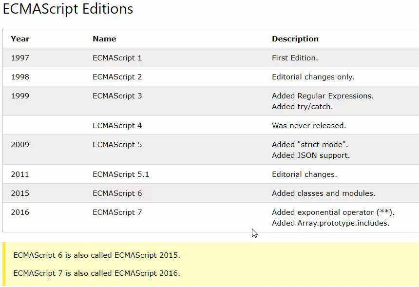
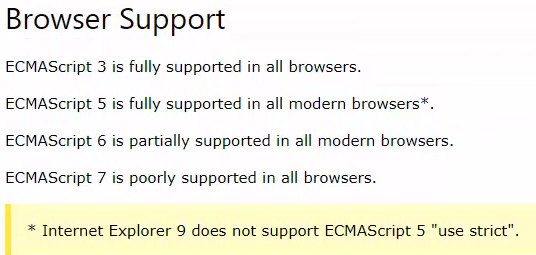

# MODULE 04 - 002: JavaScript, ECMA versions

## Analyzing the Various Versions of JavaScript

****

Video lesson Speech  

This guide walks through the various versions of the JavaScript 
programming language, including topics such as how to lookup browser 
support.

****

Before learning javascript, I think it is very helpful to understand the various versions that exist out there. Now we've already talked a little bit about the history of it. So I'm not going to go into that in great detail, but right here if you come to the W3 school's page you can see all of the various versions, all the way starting back in 1997 all the way up through our most recent time.

So we have ECMAScript 1 all the way through 7. 

The reason why I wanted to show this page is that it shows some key differences. For example, if you look at the latest version, it has added items such as exponential operators, and one powerful thing was added in 2015. In ECMAScript 6 it added the concept of classes and modules which essentially allowed javascript to function like an object-oriented type language. 

Now, this is all very nice and very helpful. It's also important to understand that not every single version is able to be interpreted by every browser. 

You have 3, which is supported by all browsers. 

5 which is supported in all modern browsers. 

That means essentially all the browsers except for some of the older versions of Internet Explorer. 

6 is partially supported. I haven't run into too many issues where things such as modules and classes weren't able to be interpreted by the browser.

 7 like it said is poorly supported by Chrome, Internet Explorer, Firefox, Opera, all of these have different ways of being able to parse through some of the items available in ECMAScript 7. It's also very important to understand those items. We're going to cover it throughout this course. Different functionalities across all of them and I'll make a note if I'm going to introduce something that may not be able to be interpreted across the board. 

Some of these items such as the things available in 6 and 7 are primarily included for the modern javascript framework such as angular or react. In those cases, you don't really have to worry about it because the frameworks themselves will do things, such as preprocess which means that it'll take the code and it will convert it so that it will work in modern browsers. And so that's something that is very nice and helpful to know. 

On this page, there are some browser implementations you don't have to worry about. But it's nice to see a history of everything related to javascript. One of the most important things is just this browser support section. (See above Browser Support image)

This is going to be something, that as you get into the more advanced types of builds and projects in javascript. That's where it's going to become more important to understand. But for right now, I essentially wanted to give you more of a practical view on the history that we talked about on a higher level. I wanted to show you the actual version numbers going all the way back to about two decades ago up to modern times.

## Resources

- [Version reference guide](https://www.w3schools.com/js/js_versions.asp)
